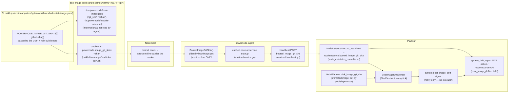

# Boot-Image Identity & Drift Visibility — System Extension Reference

> Status: active (increment 1 of campaign 019f505f "Smooth Boot-Image Upgrades")

**Scope note:** this document covers **increment 1 only** — the disk image now
carries a verifiable identity, the agent reports it, and the platform surfaces
drift. There is **no remediation yet**: `system.boot_image_drift` is a
notify-only signal, and nothing reprovisions, reboots, or rewrites a drifted
node. In-place upgrade, A/B boot slots, and drift-driven auto-rollout are
future increments of the same campaign and are **not** described here.

## Architecture (one-paragraph summary)

The disk-image build scripts (amd64/arm64 UEFI **and** rpi4) bake their build's
`git_sha` into the kernel cmdline as `powernode.image_git_sha=<sha>`. The
on-node `powernode-agent` reads that sha **only from `/proc/cmdline`** once at
service startup, caches it, and reports it every heartbeat as
`booted_image_git_sha`. The platform persists it on `System::NodeInstance` and
compares it against the `git_sha` of the disk
image currently **promoted** for that instance's `NodePlatform`
(`NodePlatform.disk_image_git_sha`, set by the disk-image publish/promote
pipeline — see [`DISK_IMAGE_CI.md`](./DISK_IMAGE_CI.md)). A mismatch on a
running instance emits a `system.boot_image_drift` fleet signal, surfaced to
operators via the `system_drift_report` MCP action and the NodeInstance API —
but, in increment 1, nothing acts on it.

## End-to-End Data Flow



## Component Detail

### 1. Identity baking (build time)

All three fleet disk-image build scripts append the marker to the kernel
cmdline, gated on the `POWERNODE_IMAGE_GIT_SHA` env var being set (local/dev
builds without it simply omit the marker — never a false sha):

- `extensions/system/initramfs/images/disk-image-amd64-uefi/build-disk-image-amd64-uefi.sh` — appends to the UKI `CMDLINE`
- `extensions/system/initramfs/images/disk-image-arm64-uefi/build-disk-image-arm64-uefi.sh` — appends to the UKI `CMDLINE`
- `extensions/system/initramfs/images/disk-image-rpi4/build-disk-image-rpi4.sh` — appends to the Pi's `cmdline.txt` (which becomes `/proc/cmdline` on boot)

```bash
# UEFI (UKI) images:
if [[ -n "${POWERNODE_IMAGE_GIT_SHA:-}" ]]; then
    CMDLINE="${CMDLINE} powernode.image_git_sha=${POWERNODE_IMAGE_GIT_SHA}"
fi
```

The same env var is **also** written into the initramfs by the dracut module
install hook — but this file is now **informational only**: an operator can
`cat` it, but the agent does **not** read it (see §2):

- `extensions/system/initramfs/modules.d/90powernode/module-setup.sh`

```bash
printf '{"git_sha":"%s"}\n' "${POWERNODE_IMAGE_GIT_SHA:-}" \
    >"${initdir}/etc/powernode/boot-image.json"
```

**CI wiring:** `extensions/system/.gitea/workflows/build-disk-image.yaml`
exports `POWERNODE_IMAGE_GIT_SHA=${{ github.sha }}` into all three build steps
— the amd64 and arm64 **UEFI** builds (`build-amd64-uefi` /
`disk-image-arm64-uefi`) and the **rpi4** build (`Build disk-image-rpi4`).
`github.sha` is used rather than a build-container `git rev-parse` because the
in-container checkout has no `.git` directory.

### 2. Agent reporting (boot time)

`extensions/system/agent/internal/identity/bootimage.go` — `BootedImageGitSHA()`
reads the sha from **`/proc/cmdline` only** (`powernode.image_git_sha=`), because
the cmdline reflects the kernel that actually booted and survives `switch_root`.
It returns `""` when the cmdline lacks the marker (netboot, or an image built
before campaign 019f505f) — the caller treats empty as "unknown," never as
drift evidence.

**Why cmdline-only (no JSON fallback):** the agent deliberately does **not**
fall back to `/etc/powernode/boot-image.json`. That file ships in **every**
initramfs the `kernel-initrd` build produces — including any served over
netboot (`image_base`), where the baked sha has no binding to the platform's
promotion flow. A programmatic fallback to it would manufacture **false drift**
on netboot nodes, so the agent reads only the cmdline, which is the sole
source with a trustworthy tie to a specific built image. This also means the
netboot exclusion (see [Known Limitation](#known-limitation-netboot-ipxe-nodes))
is now **enforced by the agent**, not merely by an unset build-env var.

`extensions/system/agent/internal/runtime/service.go` reads this **once at
service startup** and caches it on the service struct (stable for the life of
the boot — no need to re-read every tick).

`extensions/system/agent/internal/runtime/heartbeat.go` — `HeartbeatPayload`
carries it as `booted_image_git_sha` (`omitempty`) and posts it on every
`/api/v1/system/node_api/status/heartbeat` call.

### 3. Platform storage

- Migration: `extensions/system/server/db/migrate/20260711100000_add_booted_image_git_sha_to_system_node_instances.rb`
  adds a nullable `booted_image_git_sha:string` column to `system_node_instances`.
- `extensions/system/server/app/controllers/api/v1/system/node_api/status_controller.rb`
  passes `params[:booted_image_git_sha]` through to:
- `System::NodeInstance#record_heartbeat!`
  (`extensions/system/server/app/models/system/node_instance.rb`) — only
  overwrites the column when the incoming value is present, so an agent that
  temporarily omits the field (e.g. mid-upgrade) doesn't blank out the last
  known value.

The same model exposes two read helpers used throughout this subsystem:

```ruby
# git_sha of the image promoted for this instance's platform
def promoted_image_git_sha
  node&.node_platform&.disk_image_git_sha
end

# true only when BOTH shas are known and they differ
def boot_image_drifted?
  booted = booted_image_git_sha
  promoted = promoted_image_git_sha
  booted.present? && promoted.present? && booted != promoted
end
```

### 4. Promoted-image exposure

`extensions/system/server/app/services/system/node_api/runtime_config_builder.rb`
merges a runtime-independent `boot_image: { git_sha, oci_ref, sha256 }` block
(sourced from `NodePlatform.disk_image_*`, set by the promote pipeline — see
[`DISK_IMAGE_CI.md`](./DISK_IMAGE_CI.md#promoting-a-publication)) into every
`GET /api/v1/system/node_api/runtime/:runtime/config` response, so an agent
can compare its own booted sha against what's currently promoted without a
separate fetch. The block is omitted entirely when the platform has no
promoted image yet.

### 5. Drift detection

`extensions/system/server/app/services/system/fleet/sensors/boot_image_drift_sensor.rb`
— `BootImageDriftSensor`, registered in `FleetAutonomyService::SENSORS`
(`extensions/system/server/app/services/system/fleet/fleet_autonomy_service.rb`)
and run on the 60-second Fleet Autonomy tick. Scoped to **running** instances
with a non-blank `booted_image_git_sha`; for each, compares against
`promoted_image_git_sha` and emits `system.boot_image_drift`
(severity `medium`, deduped per `(instance_id, promoted_sha)` fingerprint) on
a mismatch.

`extensions/system/server/app/services/system/fleet/decision_engine.rb` binds
the signal to **no skill**:

```ruby
"system.boot_image_drift" => {
  skill: nil,
  action_category: "system.observation"
}
```

`action_category: "system.observation"` is seeded `auto_approve`, so the
signal is recorded and broadcast (not dropped as `decision: :skipped`) but no
executor runs — purely observational. A future increment (per the sensor's
own comments, "increment 4") is expected to rebind this to a drift-driven
rollout executor.

**Operator-facing surfaces:**

- MCP action `system_drift_report` (`system_fleet_tool.rb`, method
  `drift_report`) returns `boot_image_drift`, `booted_image_git_sha`, and
  `promoted_image_git_sha` for a given `instance_id`, alongside its existing
  module-digest drift fields.
- `System::NodeInstanceSerializer` exposes `booted_image_git_sha`,
  `promoted_image_git_sha`, and `boot_image_drifted` on every serialized
  `NodeInstance` (callers that serialize collections must eager-load
  `node → node_template → node_platform` to keep this N+1-free).

## Known Limitation: Netboot (iPXE) Nodes

**Netboot is the only path excluded.** All three flashed/installed image
families — amd64 UEFI, arm64 UEFI, and rpi4 — bake the sha into their cmdline
and therefore report `booted_image_git_sha` via `/proc/cmdline` normally.

Netboot nodes do **not** report a `booted_image_git_sha` in increment 1.
Netboot serves its kernel + initramfs via `NetbootService`
(`extensions/system/server/app/services/system/netboot_service.rb`) from an
operator/URL-configurable `image_base` — the iPXE script controller
(`extensions/system/server/app/controllers/api/v1/system/netboot_controller.rb`)
even allows overriding it per request (`?image_base=...`). The iPXE cmdline
template (`extensions/system/initramfs/images/ipxe/template.ipxe.erb`) carries
no `powernode.image_git_sha` marker, and there is no reliable binding between a
served netboot artifact and a specific `git_sha` — baking one in without that
binding would produce **false drift** signals rather than real ones.

Consequently `BootedImageGitSHA()` returns `""` on these nodes,
`boot_image_drifted?` stays `false` for them (absence of evidence, not evidence
of freshness), and `BootImageDriftSensor` never signals on them (it filters out
blank `booted_image_git_sha`). This exclusion is **enforced by the agent**
reading the cmdline only (§2) — not by a build-env var that could be set
inadvertently: even though the served initramfs still contains an
`/etc/powernode/boot-image.json`, the agent ignores it, so a netboot node can
never manufacture a spurious sha. Netboot nodes self-upgrade by re-fetching
from `image_base` on next PXE boot and are explicitly **out of scope** for the
drift-driven-upgrade path this campaign is building toward.

## Source Files

**Build:**
- `extensions/system/initramfs/images/disk-image-amd64-uefi/build-disk-image-amd64-uefi.sh`
- `extensions/system/initramfs/images/disk-image-arm64-uefi/build-disk-image-arm64-uefi.sh`
- `extensions/system/initramfs/images/disk-image-rpi4/build-disk-image-rpi4.sh`
- `extensions/system/initramfs/modules.d/90powernode/module-setup.sh` (writes the informational `boot-image.json`; not read by the agent)
- `extensions/system/initramfs/images/ipxe/template.ipxe.erb` (netboot cmdline — deliberately carries no sha marker)
- `extensions/system/.gitea/workflows/build-disk-image.yaml`

**Agent (Go):**
- `extensions/system/agent/internal/identity/bootimage.go`
- `extensions/system/agent/internal/runtime/service.go`
- `extensions/system/agent/internal/runtime/heartbeat.go`

**Platform (Rails):**
- `extensions/system/server/db/migrate/20260711100000_add_booted_image_git_sha_to_system_node_instances.rb`
- `extensions/system/server/app/models/system/node_instance.rb`
- `extensions/system/server/app/controllers/api/v1/system/node_api/status_controller.rb`
- `extensions/system/server/app/services/system/node_api/runtime_config_builder.rb`
- `extensions/system/server/app/services/system/fleet/sensors/boot_image_drift_sensor.rb`
- `extensions/system/server/app/services/system/fleet/decision_engine.rb`
- `extensions/system/server/app/services/system/fleet/fleet_autonomy_service.rb`
- `extensions/system/server/app/services/ai/tools/system_fleet_tool.rb` (`system_drift_report`)
- `extensions/system/server/app/serializers/system/node_instance_serializer.rb`
- `extensions/system/server/app/services/system/netboot_service.rb` (netboot limitation)

## Related Docs

- [`DISK_IMAGE_CI.md`](./DISK_IMAGE_CI.md) — the build → publish → promote
  pipeline that produces `NodePlatform.disk_image_git_sha`
- [`DISK_IMAGE_MANAGER_AGENT.md`](./DISK_IMAGE_MANAGER_AGENT.md) — the
  autonomy surface that promotes/rolls back the images this doc compares
  against
- [`FLEET_SENSORS.md`](./FLEET_SENSORS.md) — sensor architecture, the
  Decision Engine, and intervention-policy reference `BootImageDriftSensor`
  participates in

_Last verified: 2026-07-11_
