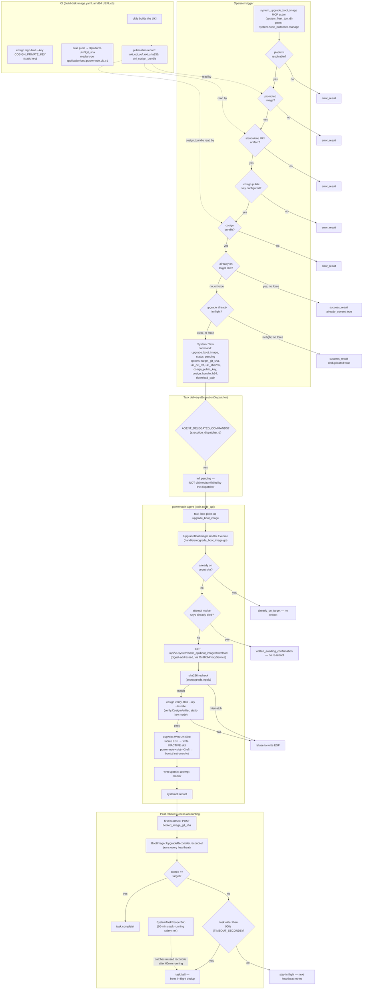

# In-Place Boot-Image Upgrade — System Extension Reference

> Status: active (increment 2 of campaign 019f505f "Smooth Boot-Image Upgrades")

**Scope note:** this document covers **increment 2 only** — an operator-triggered,
agent-executed, cosign-verified in-place UKI swap on a single node. It builds on
[`BOOT_IMAGE_IDENTITY.md`](./BOOT_IMAGE_IDENTITY.md) (increment 1: the
`booted_image_git_sha` identity + drift-visibility plumbing this upgrade path
both consumes and satisfies). It does **not** cover A/B boot slots or
drift-driven auto-rollout — those are future increments of the same campaign
(see [Known Limitations](#known-limitations)).

## Architecture (one-paragraph summary)

An operator (or agent acting on the operator's behalf) calls the
`system_upgrade_boot_image` MCP action on a `NodeInstance`. The action fails
closed through a chain of guards — no resolvable platform, no promoted image,
no standalone UKI artifact, no cosign public key, no cosign signature bundle —
and, only once all pass, creates a `System::Task` (`command:
"upgrade_boot_image"`) carrying everything the node needs to verify and
install the image itself: the target `git_sha`, the UKI's OCI ref + sha256,
the platform's cosign public key, and the base64 cosign bundle. That command
is one of a small set the server-side `ExecutionDispatcher` never claims or
runs — it is left `pending` for the `powernode-agent` to poll over
`node_api`. The agent downloads the UKI by digest, cosign-verifies it against
the inline public key, atomically replaces the ESP's removable-boot binary,
and reboots — reusing the existing `/persist`-backed certificate, no
re-enrollment. Because the reboot tears the node down mid-flight, the agent's
own `/complete` report is unreliable; the task is instead completed
authoritatively by `BootImage::UpgradeReconciler`, which runs on every
heartbeat and compares the freshly-booted node's `booted_image_git_sha`
(increment 1's identity signal) against the task's target.

## End-to-End Data Flow



## Component Detail

### 1. Operator trigger — `system_upgrade_boot_image` MCP action

`extensions/system/server/app/services/ai/tools/system_fleet_tool.rb`,
method `upgrade_boot_image` (permission `system.node_instances.manage`,
registered in the tool schema at `TOOLS["system_upgrade_boot_image"]`).
Guards run **in this order**, each returning `error_result` and stopping
before any task is created:

1. **No resolvable platform** — `instance.node&.node_platform` is `nil`.
2. **No promoted image** — `platform.disk_image_git_sha` or
   `disk_image_oci_ref` is blank (nothing has been promoted for this
   platform yet — see [`DISK_IMAGE_CI.md`](./DISK_IMAGE_CI.md)).
3. **No standalone UKI artifact** — the promoted publication's `uki_oci_ref`
   (or `uki_sha256`) is blank. This happens when the promoted image predates
   the in-place-upgrade CI changes (increment 2): only the amd64 UEFI build
   currently pushes a standalone UKI (see [§3](#3-uki-artifact--ci-publish)).
4. **No cosign public key** — `platform_cosign_public_key` (below) returns
   `nil`. The comment in the source is explicit about why this fails closed:
   *"a malicious UKI is full node compromise."*
5. **No cosign bundle** — the promoted `DiskImagePublication`
   (`platform.disk_image_publications.find_by(git_sha: target_sha)`) has a
   blank `uki_cosign_bundle`.

Only after all five pass does it check the two non-error short-circuits:

- **No-op if current**: unless `force` is set, if
  `instance.booted_image_git_sha == target_sha`, returns
  `success_result(upgraded: false, already_current: true, ...)` without
  creating a task.
- **In-flight dedup**: unless `force` is set, if a `pending`/`scheduled`/
  `running` `upgrade_boot_image` task already exists for this instance,
  returns `success_result(upgraded: false, deduplicated: true, task_id:
  existing.id, ...)`. `force: true` bypasses **both** of the above — the
  documented use case is re-issuing to a node whose prior upgrade never
  came back (see [§5](#5-success-accounting--the-post-reboot-heartbeat)).

```ruby
def platform_cosign_public_key
  inline = ENV["POWERNODE_COSIGN_PUBLIC_KEY"].presence
  return inline if inline

  path = ENV["POWERNODE_COSIGN_PUBLIC_KEY_FILE"].presence
  return nil if path.blank?

  File.exist?(path) ? File.read(path) : nil
end
```

The public key is sourced **platform-side only** — never from the artifact
or the webhook payload that registered it. This is what makes the node's
verification meaningful: an attacker who compromises the OCI registry or the
webhook still cannot forge a UKI the node will accept, because the node
checks against a key the platform, not the artifact, supplied.

On success, the task is created with everything the agent needs inline (see
[§2](#2-task-delivery--agent-delegated-dispatch)):

```ruby
task = ::System::Task.create!(
  account: @account, operable: instance,
  command: "upgrade_boot_image", status: "pending",
  initiated_by: @user,
  options: {
    "target_git_sha"    => target_sha,
    "uki_oci_ref"        => publication.uki_oci_ref,
    "uki_sha256"         => publication.uki_sha256,
    "cosign_public_key"  => cosign_pubkey,
    "cosign_bundle_b64"  => cosign_bundle,
    "download_path"      => "/api/v1/system/node_api/boot_image/download",
    ...
  }
)
```

### 2. Task delivery — agent-delegated dispatch

`extensions/system/server/app/services/system/execution_dispatcher.rb`
defines `AGENT_DELEGATED_COMMANDS`, which includes `upgrade_boot_image`
alongside `a2a_call` and the `storage.*` node-side commands:

```ruby
AGENT_DELEGATED_COMMANDS = %w[
  upgrade_boot_image
  a2a_call
  storage.mount storage.unmount storage.exports.apply storage.smb_user.apply
  storage.gateway.provision storage.gateway.deprovision storage.chown
].freeze
```

**Why this matters:** `System::Task` has an `after_commit :enqueue_execution`
callback that fires a worker job **immediately** on creation, which calls
`ExecutionDispatcher.run`. For any command with a `COMMAND_REGISTRY` entry
the dispatcher claims it via `may_start?`/`start!` and runs the mapped
runtime service inline. `upgrade_boot_image` has **no** `COMMAND_REGISTRY`
entry — its "runtime" is the on-node agent, not a server-side service class.
Without the `AGENT_DELEGATED_COMMANDS` check, the dispatcher would treat it
as `"Unsupported command: upgrade_boot_image"`, force it through `start!`,
and `fail!` it — all within milliseconds of creation, long before the agent's
next poll ever sees it. The guard makes the dispatcher a no-op for these
commands instead: it logs `dispatch_delegated_to_agent` and returns
`Outcome.new(claimed: false, ...)`, leaving the task `pending` for the
`powernode-agent`'s own task-poll loop (`GET
/api/v1/system/node_api/status/operations`) to pick up.

### 3. UKI artifact — CI publish

`extensions/system/.gitea/workflows/build-disk-image.yaml`, in the **amd64
UEFI** job's "Push amd64 image to OCI registry" step, after the full
disk-image push:

```bash
uki="initramfs/build/amd64/disk-image-amd64-uefi/powernode-amd64-uefi.uki"
if [ -f "$uki" ]; then
  uki_sha="$(sha256sum "$uki" | awk '{print $1}')"
  uki_ref="$ORAS_REGISTRY/powernode/disk-images/$platform-uki:${{ github.sha }}"
  cosign sign-blob --yes --key env://COSIGN_PRIVATE_KEY --bundle "$uki.cosign-bundle" "$uki"
  oras push "$uki_ref" --artifact-type "application/vnd.powernode.uki.v1" \
    "$uki:application/vnd.powernode.uki.v1" \
    "$uki.cosign-bundle:application/vnd.dev.cosign.bundle.v1+json"
fi
```

This pushes the UKI as a **standalone** artifact — a parallel
`$platform-uki:$git_sha` OCI ref alongside the full disk image — because the
in-place upgrade only needs the bootable EFI binary, not the whole disk. The
manifest-building step base64-encodes the cosign bundle and folds it (plus
`uki_oci_ref`/`uki_sha256`) into the publication payload sent to the
platform's disk-image webhook, which is how `NodePlatform.disk_image_uki_*`
and `DiskImagePublication#uki_cosign_bundle` get populated (see
`disk_image_publication_processor.rb` and
`executors/disk_image/promote_publication.rb` for the promote step that
copies the promoted publication's UKI fields onto `NodePlatform`).

Serving it back to the node:
`extensions/system/server/app/controllers/api/v1/system/node_api/boot_image_controller.rb`,
`GET /api/v1/system/node_api/boot_image/download`. It resolves
`current_node.node_platform`, 404s if there's no promoted UKI, and proxies
the blob **by digest** through `System::OciBlobProxyService` — content-
addressed (`/v2/<repo>/blobs/<uki_sha256>`), so the registry cannot return
different bytes for the same digest, and the first fetch per digest caches
to disk for the rest of the fleet.

### 4. Agent — pull, verify, write, reboot

`extensions/system/agent/internal/runtime/tasks/handlers/upgrade_boot_image.go`
— `UpgradeBootImageHandler.Execute` is the task-loop entry point. It is
idempotent against the loop's own crash-recovery re-dispatch:

- If `identity.BootedImageGitSHA()` (the increment-1 identity read) already
  equals the task's target, it clears the `/persist` attempt marker and
  returns `already_on_target` **without rebooting again**.
- Else, if the `/persist/var/lib/powernode/boot-image-upgrade.attempted`
  marker already names this target, it returns
  `written_awaiting_confirmation` and — critically — does **not** rewrite the
  ESP or reboot again. This is the reboot-loop bound: a node that wrote the
  new UKI and rebooted but came back on the old image (or with no cmdline sha
  marker) will not be forced through the same write+reboot cycle repeatedly.
- Otherwise it calls `bootupgrade.Apply`, and on success writes the attempt
  marker and runs `systemctl reboot`.

`extensions/system/agent/internal/bootupgrade/bootupgrade.go` —
`Apply(ctx, Deps, Options)` runs three steps, all individually re-runnable:

1. **Download.** Skipped if a prior attempt already staged a file matching
   `uki_sha256` (crash-recovery reuse). Otherwise `GET`s
   `download_path` from the platform, streams to a `.part` file, and
   atomically renames it into the stage dir
   (`/persist/cache/boot-image/<sha256>.uki`).
2. **Verify — never skipped.** First a **sha256 recheck** of the downloaded
   bytes against `uki_sha256` (removes the download); then a **static-key
   cosign verify**: the inline `cosign_public_key` and base64-decoded
   `cosign_bundle_b64` are written to the stage dir, and
   `verify.CosignVerifier{KeyPath: <pubkey path>}.VerifyBlob` shells out to
   `cosign verify-blob --key <pubkey> --bundle <bundle> <uki>`. **Any**
   failure — signature mismatch or a missing `cosign` binary — removes the
   staged UKI and returns an error; the ESP write step is never reached.
   Static-key mode (not keyless/Fulcio) because Gitea CI isn't on Sigstore's
   trusted-issuer list, so the platform signs with a private key
   (`COSIGN_PRIVATE_KEY`) and ships only the public half to nodes.
3. **Write the INACTIVE A/B slot** — `espwrite.WriteUKISlot`, only reached
   after verification passes AND after two preconditions hold: the node booted
   via systemd-boot, and the *rollback target* (the active slot) has a blessed
   UKI on the ESP. If either fails, the upgrade is REFUSED — see
   [Refusal cases](#refusal-cases).

`extensions/system/agent/internal/espwrite/espwrite.go` — `WriteUKISlot` locates
the ESP (FAT label `BOOT` first, then the EFI System Partition GPT type GUID as
fallback), mounts it read-write if not already mounted, and writes the UKI into
`/EFI/Linux/` as the inactive slot:

- Clears that slot's whole file family first (counterless + any stale counter
  variants), so a re-attempt cannot collide with a leftover file.
- Copies the new UKI to `<entry>.new`, then `os.Rename`s it over `<entry>` —
  the atomic step.
- `<entry>` carries the systemd-boot boot counter, e.g. `powernode-b+3.efi`.
- Then `bootctl set-oneshot` arms it for exactly one attempt.

It **never** touches `/EFI/BOOT/<removable>` (systemd-boot itself) or the other
slot — the other slot is the rollback target.

> **Removed 2026-07-25:** the earlier single-slot writer (`WriteUKI` /
> `installUKI` / `RemovableBootName`) replaced `/EFI/BOOT/<removable>` — the
> firmware's own bootloader — with the payload, keeping only a `<name>.bak`.
> Its documentation claimed that "never bricks the node". It did: on VM 9002 a
> broken-but-validly-signed UKI written this way produced an unrecoverable
> panic-reboot loop (48 boots, 24 kernel panics, zero automatic recovery),
> because systemd-boot — and with it the boot counter, the one-shot and the
> default-entry fallback — had itself been overwritten. **There is no `.bak`
> any more.** A node with no A/B layout now refuses the upgrade instead.

Because the reboot reuses the `/persist`-backed PKI (the same certificate
and enrolled identity), the node comes back as the **same** `NodeInstance` —
no re-enrollment flow, no new bootstrap token.

**cosign availability on the node:** `cosign` itself must be present at
`/usr/bin/cosign` for `verify.CosignVerifier` to shell out to. It is staged
into the base-os rootfs by
`extensions/system/modules/base-os-ubuntu-noble/Makefile`'s `stage-cosign`
target (run as part of `stage-agent`), which fetches a **pinned**
`COSIGN_VERSION` release and hash-verifies it before installing — the
Makefile fails the build on a checksum mismatch, so a node can never ship an
unverified verifier binary:

```makefile
COSIGN_VERSION      ?= 3.0.6
COSIGN_SHA256_amd64 ?= c956e5dfcac53d52bcf058360d579472f0c1d2d9b69f55209e256fe7783f4c74
COSIGN_SHA256_arm64 ?= bedac92e8c3729864e13d4a17048007cfafa79d5deca993a43a90ffe018ef2b8
```

An older node image built before this Makefile change has no `/usr/bin/cosign`
and will fail closed at the verify step (see
[Deployment Prerequisites](#deployment-prerequisites-operator)).

### 5. Success accounting — the post-reboot heartbeat

The upgrade reboots the node mid-task, so the agent's own `/complete` POST
races the shutdown and cannot be trusted as the success signal.
`extensions/system/server/app/controllers/api/v1/system/node_api/status_controller.rb#complete_task`
special-cases `upgrade_boot_image` explicitly:

```ruby
if operation.command == "upgrade_boot_image"
  operation.add_event("agent_reported", ...) if operation.respond_to?(:add_event)
  return render_success(task: serialize_task(operation), completed: false,
                        deferred_to: "post_reboot_heartbeat")
end
```

It acknowledges the report (as an event, for auditability) but leaves the
task's status untouched — completion happens later, and elsewhere.

The authority is
`extensions/system/server/app/services/system/boot_image/upgrade_reconciler.rb`
— `BootImage::UpgradeReconciler.reconcile!`, invoked from
`StatusController#heartbeat` on **every** heartbeat (cheap no-op when the
instance has no in-flight `upgrade_boot_image` task):

- Loads `IN_FLIGHT` (`pending`/`scheduled`/`running`) `upgrade_boot_image`
  tasks for the instance.
- For each, if `instance.booted_image_git_sha == task.options["target_git_sha"]`
  (the increment-1 identity signal, freshly reported by this very
  heartbeat), forces the task through `start!` if needed and `complete!`s it.
- If instead the task is older than `TIMEOUT_SECONDS` (default 900s, override
  via `BOOT_IMAGE_UPGRADE_TIMEOUT_SECONDS`) and still not on target, it
  `fail!`s the task with a message naming the currently-reported
  `booted_image_git_sha` (or `"unknown"` if the node hasn't reported since).
  Failing it is what **frees the in-flight dedup** in
  [§1](#1-operator-trigger--system_upgrade_boot_image-mcp-action), so an
  operator can re-issue (with or without `force`) once the timeout fires.

**Two independent nets bound a stuck upgrade:**

1. The `/persist` attempt marker (§4) stops the agent from rewriting the ESP
   and rebooting again once it has already tried once for a given target —
   bounding reboot loops on the node side.
2. `SystemTaskReaperJob`
   (`extensions/system/worker/app/jobs/system_task_reaper_job.rb`) is the
   hourly platform-side safety net for **any** stuck `System::Task` — it
   fails tasks that have sat `running` for over 60 minutes
   (`STUCK_RUNNING_THRESHOLD`, overridable via
   `SYSTEM_REAPER_STUCK_RUNNING_MIN`). In practice the reconciler's own
   900-second timeout usually fires first for boot-image upgrades, but the
   reaper is the backstop if a heartbeat is never received at all (e.g. the
   node is truly bricked) or the reconciler's own logic is ever bypassed.

## Security: The Trust Chain

**Invariant: no unverified UKI reaches the ESP. Fail-closed at every stage.**

| Stage | Mechanism | What it prevents |
|---|---|---|
| CI → platform | HMAC-signed webhook (`POWERNODE_DISK_IMAGE_WEBHOOK_SECRET`) registers the publication, including the base64 cosign bundle | An unauthenticated actor registering a fake publication |
| Platform → agent | The cosign **public** key is sourced from `POWERNODE_COSIGN_PUBLIC_KEY[_FILE]` on the platform — never read from the artifact, the webhook payload, or anything CI-supplied | A compromised registry or webhook shipping its own "trusted" key alongside a malicious UKI |
| Registry → agent | Content-addressed pull (`OciBlobProxyService`, digest in the URL path) | The registry returning different bytes for a given digest |
| Agent-side | sha256 recheck of the downloaded bytes against the platform-supplied `uki_sha256` | A corrupted or substituted download |
| Agent-side | Static-key `cosign verify-blob` against the platform-sourced public key, over the **exact bytes about to be written** | A UKI that wasn't produced (or was tampered with) by the CI holding `COSIGN_PRIVATE_KEY` |
| MCP action | Refuses to dispatch the task at all if the public key or bundle is missing (§1, guards 4–5) | Ever asking a node to write an image it has no way to verify |

Signing is **static-key**, not keyless/Fulcio-based: Gitea-hosted CI is not
on Sigstore's public-good trusted-issuer list and has no ambient OIDC token,
so the platform signs with `COSIGN_PRIVATE_KEY` (a CI secret) and only ever
distributes the **public** half to nodes — via the MCP-triggered task
payload, not baked into the image or exposed over an unauthenticated
channel. This mirrors the same static-key pattern used for module OCI
artifacts (`module_oci_ingest_service`) and the powernode-agent binary
itself (see the `.cosign-bundle` verify steps earlier in the same CI
workflow).

## Deployment Prerequisites (Operator)

Before `system_upgrade_boot_image` can succeed on any instance:

1. **Set `POWERNODE_COSIGN_PUBLIC_KEY`** (or `POWERNODE_COSIGN_PUBLIC_KEY_FILE`)
   on the platform — the PEM public half of the CI's `COSIGN_PRIVATE_KEY`.
   Without it, the MCP action fails closed at guard 4 (§1) for **every**
   instance on the account, regardless of image freshness.
2. **Rebuild and promote a node image** built after the in-place-upgrade CI
   changes landed. Two things must ship in that image for the upgrade path
   to work on a node running it:
   - `/usr/bin/cosign`, staged by the base-os `stage-cosign` Makefile
     target — older images predate this and have no cosign binary, so the
     agent's verify step fails closed (§4).
   - The promoted publication's standalone UKI fields (`uki_oci_ref`,
     `uki_sha256`, `uki_cosign_bundle`) — only populated when the amd64 UEFI
     CI job's UKI push step ran (§3). Promoting an older publication without
     these leaves guard 3 (§1) failing for every instance on that platform.

Both are platform-side/CI-side prerequisites, not per-instance — once
satisfied for a `NodePlatform`, every instance on it becomes eligible.

## Refusal cases

The upgrade fails closed rather than proceeding when it cannot guarantee a way
back. Each refusal names its own remedy:

| Condition | Meaning | Remedy |
|---|---|---|
| No `LoaderInfo` EFI variable | Node did not boot via systemd-boot; no A/B layout | Migrate the ESP in place — `docs/runbooks/ops-hub-boot-image-reprovision.md`. Do **not** reprovision a node whose `/persist` must survive |
| EFI variable store unreadable | efivarfs not mounted/visible in this namespace; boot method undeterminable | Mount efivarfs and retry — the node itself is likely fine |
| Rollback target has no blessed UKI | `/persist` slot state has diverged from the ESP; a failed upgrade would have nothing to fall back to | Reconcile slot state against `/EFI/Linux/` before upgrading |
| `bootctl` not found | Cannot arm the one-shot; it ships via the base-os module, not the minimal initramfs runtime | Upgrade from a node running the composed base-os |

## Known Limitations

- **A/B auto-rollback is live** (increment 3, proven on hardware 2026-07-25).
  A failed UKI consumes its one-shot, panics, and systemd-boot falls back to the
  blessed default slot unattended — measured ~20s end to end. The previous
  single-slot `.bak` scheme, and the manual brick-recovery it required, are gone.
  Two caveats remain:
  - **Bless is identity-gated, not health-gated.** A slot that boots but is
    functionally dead is still blessed and promoted, because the check compares
    the booted `git_sha` to the target and does not require app health. INV-4
    ("good is EARNED") is therefore not yet implemented.
  - **The promoted default lives in NVRAM.** `bootctl set-default` writes
    `LoaderEntryDefault`; `loader.conf` still names slot A. If the firmware
    varstore is lost or recreated, a node promoted to slot B silently reverts to
    slot A's older image.
- **arm64 UKI CI publish is deferred.** Only the amd64 UEFI build job
  currently pushes a standalone UKI artifact (§3); the arm64 UEFI and rpi4
  jobs still publish full disk images but no parallel UKI ref. In-place
  upgrade is therefore **amd64-only** until that gap is closed — an arm64
  platform will always fail guard 3 (§1) (publication `uki_oci_ref` blank).
- **The CLI `upgrade-boot-image` subcommand is a manual/debug path.**
  `agent/cmd/powernode-agent/commands.go`'s `upgradeBootImageCmd` drives the
  same `bootupgrade.Apply` by hand (explicit flags for target sha, UKI
  sha256, cosign key/bundle files, download path) and reboots only with
  `--reboot`. It exists for operators debugging a stuck node directly, not
  as a normal dispatch path — it bypasses the MCP action's guards entirely,
  so whoever runs it is trusted to supply correct, verified inputs.

## Source Files

**Platform (Rails):**
- `extensions/system/server/app/services/ai/tools/system_fleet_tool.rb` (`upgrade_boot_image`, `platform_cosign_public_key`)
- `extensions/system/server/app/services/system/execution_dispatcher.rb` (`AGENT_DELEGATED_COMMANDS`)
- `extensions/system/server/app/controllers/api/v1/system/node_api/boot_image_controller.rb`
- `extensions/system/server/app/controllers/api/v1/system/node_api/status_controller.rb` (`heartbeat`, `complete_task`)
- `extensions/system/server/app/services/system/boot_image/upgrade_reconciler.rb`
- `extensions/system/server/app/services/system/oci_blob_proxy_service.rb`
- `extensions/system/server/app/services/system/disk_image_publication_processor.rb`
- `extensions/system/server/app/services/system/executors/disk_image/promote_publication.rb`
- `extensions/system/server/app/models/system/task.rb` (`upgrade_boot_image` in `COMMANDS`)
- `extensions/system/server/app/models/system/disk_image_publication.rb` (`uki_oci_ref`, `uki_sha256` — the single source of truth for the pins)
- `extensions/system/server/db/migrate/20260711110000_add_uki_artifact_to_disk_images.rb`
- `extensions/system/server/db/migrate/20260804140000_drop_uki_mirror_columns_from_node_platforms.rb` (dropped the write-only NodePlatform mirror)
- `extensions/system/server/db/migrate/20260711120000_add_uki_cosign_bundle_to_publications.rb`

**Worker:**
- `extensions/system/worker/app/jobs/system_task_reaper_job.rb`

**CI:**
- `extensions/system/.gitea/workflows/build-disk-image.yaml` (amd64 UEFI job's standalone-UKI push step)

**Build (image staging):**
- `extensions/system/modules/base-os-ubuntu-noble/Makefile` (`stage-cosign`)

**Agent (Go):**
- `extensions/system/agent/internal/runtime/tasks/handlers/upgrade_boot_image.go`
- `extensions/system/agent/internal/bootupgrade/bootupgrade.go`
- `extensions/system/agent/internal/espwrite/espwrite.go`
- `extensions/system/agent/internal/verify/cosign.go`
- `extensions/system/agent/internal/identity/bootimage.go` (increment 1; read here for the post-reboot self-check)
- `extensions/system/agent/cmd/powernode-agent/commands.go` (`upgradeBootImageCmd` — manual/debug)

## Related Docs

- [`BOOT_IMAGE_IDENTITY.md`](./BOOT_IMAGE_IDENTITY.md) — increment 1: how
  `booted_image_git_sha` is baked, reported, and compared; this document's
  success accounting (§5) and the agent's no-reboot-if-already-current check
  (§4) both depend on it.
- [`DISK_IMAGE_CI.md`](./DISK_IMAGE_CI.md) — the build → publish → promote
  pipeline that produces `NodePlatform.disk_image_git_sha` and (as of this
  increment) the publication's `uki_oci_ref`/`uki_sha256`.
- [`DISK_IMAGE_MANAGER_AGENT.md`](./DISK_IMAGE_MANAGER_AGENT.md) — the
  autonomy surface that promotes/rolls back the images this upgrade path
  targets.
- [`FLEET_SENSORS.md`](./FLEET_SENSORS.md) — sensor architecture; a future
  increment is expected to bind `system.boot_image_drift` to an executor
  that calls this same upgrade path automatically.

_Last verified: 2026-07-11_
