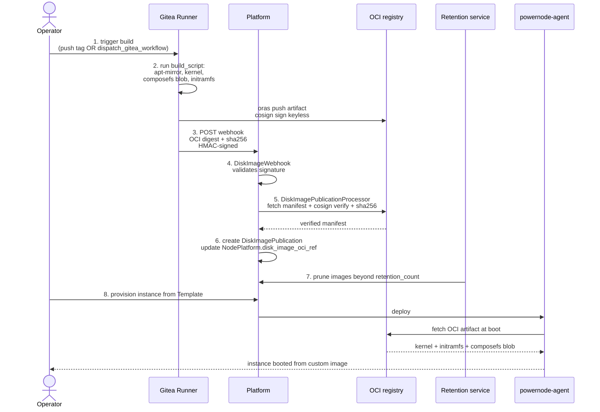
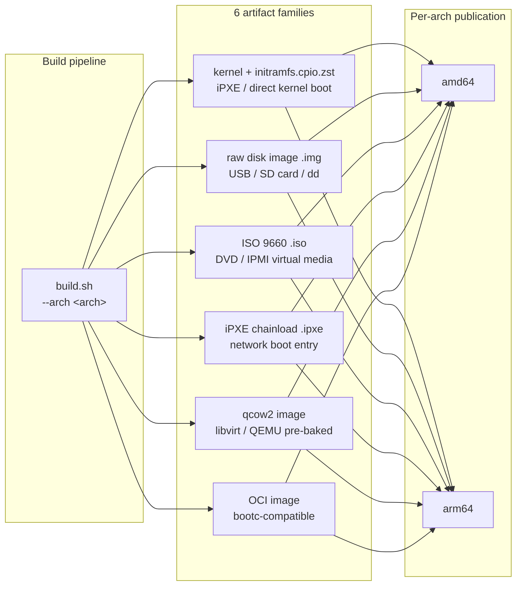

# Disk Image CI/CD — Operator Guide

> Status: active

End-to-end disk image build pipeline: NodePlatform → Gitea Actions → OCI ingest → publication. Uses the platform's GitOps + CI worker infrastructure with Cosign signing for supply-chain integrity.

## Architecture (one-paragraph summary)

A `System::NodePlatform` carries a `build_script` that produces a disk image (kernel + initramfs + composefs blob). The build runs on a self-hosted Gitea Actions runner (provisioned via `provision_ci_worker`) triggered by a webhook. After build, the runner pushes the artifact as an OCI blob (Cosign-signed via the platform's keyless identity), POSTs the webhook back to platform, which ingests via `DiskImagePublicationProcessor`. Ingest verifies the **Cosign signature + SHA-256** over the pulled artifact (the CI pipeline produces composefs blobs, but the server does **not** perform a server-side composefs/fs-verity verification — see `DiskImageOciIngestService`). The resulting `DiskImagePublication` row links the OCI digest to the platform record + retention policy.

## End-to-End Flow



### Six artifact families × two architectures

The initramfs builder publishes six artifact families per architecture, each
suited to a different deployment context. The Disk Image Manager agent tracks
publications per `(NodePlatform, artifact_family, architecture)` triple.



### Building UEFI images (UKI) — the claim-by-ID fleet boot disk

The `disk-image-amd64-uefi` and `disk-image-arm64-uefi` variants produce the
generic, flashable **claim-by-ID** boot disk (one image for the whole fleet; a
per-device `identity.cfg` is dropped onto the BOOT partition). Both use one
consistent model — a **UKI (Unified Kernel Image)**: `ukify` fuses the kernel +
initramfs + cmdline into a single EFI binary at the ESP's removable-media
fallback path (`/EFI/BOOT/BOOTX64.EFI` on amd64, `/EFI/BOOT/BOOTAA64.EFI` on
arm64). UEFI firmware boots it with zero config — no GRUB, no loader entries.
Layout is a 2-partition GPT: ESP (FAT32, label `BOOT`) + persist (ext4, label
`persist`), assembled loop-free (mtools + `mkfs.ext4 -E offset` + sgdisk).

**Build-environment requirement.** `build.sh`'s `kernel-initrd` variant needs a
real distro kernel (`/boot/vmlinuz-*` + `/lib/modules/*`) and `dracut` to build
the generic (`hostonly=no`) initramfs; `ukify` + the systemd-boot stub
(`linuxx64.efi.stub` / `linuxaa64.efi.stub`) then fuse the UKI. The CI runner is
a container with neither, so each job installs them and builds in an
**architecture-matched** environment:

| Image | Build environment | Why |
|-------|-------------------|-----|
| `build-amd64-uefi` job | **native** on the amd64 runner (`apt install linux-image-generic dracut-core`) | runner is amd64 → dracut runs without emulation |
| `disk-image-arm64-uefi` (in the `build` job) | **QEMU-emulated arm64 container** (`docker run --platform linux/arm64`; binfmt via setup-qemu) | no native arm64 runner, and dracut must run as arm64 to copy/resolve arm64 binaries |

If dracut/kernel aren't present, `build.sh` emits a tiny placeholder kernel and
the UKI assembler fails loud (`missing/empty .../kernel`) — never a silently
non-bootable image.

**Native arm64 runner (recommended reliability upgrade).** The arm64 build
emulates apt + dracut, which is slow (~30–60 min) and inherently less reliable
than native. Registering a native arm64 Gitea runner and pointing the arm64
UEFI build at it (dropping the `docker run --platform` wrapper, building like
amd64) is the highest-reliability path.

## Setup: Initial CI Worker + Webhook

### Step 1: Bootstrap the CI worker for an account

```javascript
platform.bootstrap_disk_image_ci({
  owner: "<account>",                              // Gitea owner (account name)
  repo: "disk-images",                             // Gitea repo containing the build workflow
  label: "ubuntu-2404-amd64-builder",              // operator-chosen identifier; webhook + worker rows key off this
  platform_api_base: "https://platform.example.org", // optional; defaults to POWERNODE_PUBLIC_URL
  create_platform_read_token: true                 // mints a read-scoped JWT for the runner to call back
})
// → {
//     ok: true,
//     webhook_url: "https://platform.example.org/api/v1/system/webhooks/disk_image/built/<webhook_id>",
//     webhook_secret: "<one-time-displayed-secret>",   // HMAC key for the runner
//     ci_worker_token: "<token>",                       // runner registration token
//     gitea_secrets_set: ["POWERNODE_WEBHOOK_SECRET", "POWERNODE_WEBHOOK_URL", ...]
//   }
```

This action is **idempotent on `label`** (re-running rotates secrets + token without creating duplicates) and is a **one-shot setup**, not a build trigger. It creates:

- A `System::DiskImageWebhook` row (per-pipeline; the URL above embeds its UUID)
- A `Worker` row with role `ci_worker` (NOT a `System::Task`, and NOT a NodeInstance — the operator installs and registers a Gitea Actions runner against the returned token themselves)
- Gitea repo Actions secrets (webhook secret + URL + optional read token + OCI registry creds if configured)

Triggering an actual build is a separate action (`dispatch_gitea_workflow` — see "Triggering a build" below). `bootstrap_disk_image_ci` does not have `account_id`, `force`, or `ref`/`arches` parameters; those framings in earlier doc revisions were aspirational.

### Step 2: Provision the build webhook

When `bootstrap_disk_image_ci` provisions the webhook for you, you do not need this action — it returned the URL + secret already. To provision a webhook standalone (e.g., to attach a second build pipeline to the same account):

```javascript
platform.provision_disk_image_webhook({
  label: "ubuntu-2404-arm64-builder"   // operator-chosen identifier
  // platform_api_base optional; defaults to POWERNODE_PUBLIC_URL
})
// → {
//     webhook_id: "<uuid>",
//     webhook_url: "https://platform.example.org/api/v1/system/webhooks/disk_image/built/<webhook_id>",
//     webhook_secret: "<one-time-displayed-secret>"
//   }
```

Webhooks are **per-pipeline** (the URL embeds the webhook UUID), not per-NodePlatform. The action does **not** accept `node_platform_id`, `webhook_url`, or `shared_secret` — the URL is built server-side from `POWERNODE_PUBLIC_URL` + the issued webhook id; the secret is mint-once and returned.

Operator configures the webhook URL + secret in the build repo's CI workflow YAML so the runner can call back after a successful build.

## Operator Workflow

### Triggering a build

```javascript
// Direct dispatch (params: owner, repo, workflow_file, ref, inputs)
platform.dispatch_gitea_workflow({
  owner: "<account>",                       // Gitea owner
  repo: "disk-images",                      // repo name
  workflow_file: "build-disk-image.yaml",   // the param is `workflow_file`, not `workflow`
  ref: "master",                            // branch/tag ref (required)
  inputs: { platform_slug: "ubuntu-2404-base" }
})

// Or via git push to the configured branch
```

### Monitoring a build

```javascript
// List recent runs
platform.list_gitea_workflow_runs({
  owner: "<account>",
  repo: "disk-images",
  workflow_file: "build-disk-image.yaml"    // optional filter
})

// Get a run + its jobs, then tail a specific job's logs by job_id
platform.get_gitea_workflow_run({ owner: "<account>", repo: "disk-images", run_id: "<run-id>" })
platform.get_gitea_job_logs({ owner: "<account>", repo: "disk-images", job_id: "<job-id>" })
```

### Inspecting publications

```bash
# Via REST
curl /api/v1/system/disk_image_publications -H "Authorization: Bearer $JWT"

# Per-platform recent publications
curl "/api/v1/system/node_platforms/<id>/disk_image_publications" \
  -H "Authorization: Bearer $JWT"
```

Each publication serializes as (per `System::DiskImagePublicationSerializer`):
- `id` — publication UUID
- `platform_id` — owning NodePlatform (serialized as `platform_id`, sourced from the `node_platform_id` column)
- `status` — one of `queued, awaiting_upload, verifying, published, failed, retired, purged`
- `active` — boolean; whether this publication is the platform's current default
- `arch` — `amd64` / `arm64`
- `firmware_ref` — UEFI/firmware artifact ref (nil for non-UEFI families)
- `git_sha` / `git_sha_short` — source commit
- `oci_ref` — fully-qualified registry path (e.g. `registry.example.com/account/disk-images@sha256:...`)
- `sha256` / `sha256_short` — artifact content digest
- `size_bytes` — artifact size
- `attempt_count` — number of ingest attempts (a publication may re-verify after a transient failure)
- `attestation_predicate` / `attestation_present` / `cosign_bundle_present` — Cosign attestation surface for inline display
- `file_object_id` / `prior_file_object_id` — current + previous artifact object (the prior link drives rollback-chain visualization)
- `webhook_id` / `webhook_label` / `triggered_by_worker_id` — provenance of the ingest
- `verified_at` — UTC timestamp when cosign + sha256 verification passed
- `published_at` — UTC timestamp when the publication transitioned to `published`
- `retired_at` — UTC timestamp when a newer publication superseded this one (nil while current)
- `purged_at` — UTC timestamp when the artifact was hard-deleted past the grace window
- `error_message` — populated when `status = failed` (e.g. cosign verify failure detail)

Fields **not** in the serialized row: `built_at` (use `published_at`), `cosign_identity` (verification result is in `error_message` on failure; the identity used is recorded elsewhere), `sbom_url`, `version`, `signed_at`, `composefs_digest` (there is **no** server-side composefs verification; the current pipeline verifies the cosign signature + SHA256 over the pulled artifact). SBOM ingest from the OCI registry is **not yet wired** — `System::Sbom::CycloneDxParser` exists but is only used by the *modules* SBOM webhook, not by disk-image publication; no SBOM package data is populated on a `DiskImagePublication` today. Doc revisions before 2026-05-19 listed several of these fields aspirationally.

### Promoting a publication

The latest publication is auto-promoted to `current` for its NodePlatform when ingest succeeds. Promotion (and rollback) is a **pointer column-flip** on the NodePlatform: `disk_image_oci_ref` / `disk_image_git_sha` / `disk_image_file_object_id` are repointed at the target publication and the previously-`published` publication is transitioned to `retired`. To set a specific publication as the default (promote or roll back), pass its id:

```javascript
platform.system_set_default_disk_image_publication({
  node_platform_id: "<id>",
  publication_id: "<publication-id>"   // must currently be in status "published"
})
```

To roll back, pass an earlier publication's id (it must still be `published`; a `retired` row's artifact is restored during the agent-driven rollback path — see [`DISK_IMAGE_MANAGER_AGENT.md`](./DISK_IMAGE_MANAGER_AGENT.md#rollback--revert-workflow)). The next NodeInstance provisioned from a Template using this Platform will fetch the newly-pointed image. There is no separate `system_revert_disk_image` wrapper — `system_set_default_disk_image_publication` is the single set-default action.

## Retention Policy

`NodePlatform.disk_image_retention_count` (default: 3) controls how many publications are kept per platform. The `DiskImageRetentionService` (runs via Sidekiq cron) prunes older publications past the count, removing both the DB row + the OCI blob from the registry.

To change retention:

```bash
# Via API
curl -X PATCH /api/v1/system/node_platforms/<id> \
  -H "Authorization: Bearer $JWT" \
  -d '{"disk_image_retention_count": 5}'
```

## Secret Rotation

Three secret types in this pipeline:

1. **Cosign keyless identity** — Gitea Actions OIDC; rotates per-run automatically. No operator action.
2. **OCI registry credentials** — used by Gitea runner to push artifacts. Stored as Gitea Actions secret. Rotate via:
   ```javascript
   platform.set_gitea_action_secret({
     owner: "<account>",
     repo: "<repo>",
     name: "OCI_REGISTRY_TOKEN",
     value: "<new-token>"
   })
   ```
3. **Webhook signing secret** — HMAC-shared between platform + build script. Rotate via `provision_disk_image_webhook` (issues a new pair; operator updates the runner's env).

## Troubleshooting

### Build succeeds but publication doesn't appear

The webhook didn't reach the platform (firewall? wrong URL?) or HMAC signature mismatch. Check:

```bash
# List webhook deliveries (filter to recent or by webhook id):
curl "/api/v1/system/disk_image_webhooks?recent=true" -H "Authorization: Bearer $JWT"

# Or via MCP:
# platform.system_list_disk_image_webhooks({ recent: true })
```

If signature mismatched, rotate the webhook secret.

### Cosign verification fails

`DiskImagePublicationProcessor` rejects ingests where Cosign verify fails. Likely causes:
- Build runner used a different Cosign identity than the platform's `cosign_identity_regexp` config on `NodePlatform`
- OCI artifact was tampered post-signing

Inspect:
```bash
curl /api/v1/system/disk_image_publications/<id> -H "Authorization: Bearer $JWT"
# Look for status="failed" + error_message containing the cosign failure detail.
# The publication's status enum is queued/awaiting_upload/verifying/published/failed/retired/purged
# (there is no separate cosign_verify_failed sub-status).
#
# The NodePlatform row also carries the last attempt:
#   disk_image_publication_status — overall publication state on the platform
#   disk_image_publication_error — last failure detail surfaced to operators
```

### Runner stuck in pending

Gitea Actions runner provisioned but not online. Check:

CI worker provisioning is synchronous in the MCP tool (no `System::Task` row is created), so a "pending" task wouldn't appear in `system_list_tasks`. Instead check the `Worker` row directly via the operator API:

```bash
curl "/api/v1/workers?role=ci_worker" -H "Authorization: Bearer $JWT"
```

If the worker exists but the Gitea Actions runner side hasn't registered, the operator's manual runner install is the missing step (the platform issues the token; the operator must install + register the runner against it). Reprovisioning the bootstrap (rotates secrets + issues a fresh worker token) — `force` is not a parameter; just re-run with the same `label`:

```javascript
platform.bootstrap_disk_image_ci({
  owner: "<account>",
  repo: "disk-images",
  label: "ubuntu-2404-amd64-builder"
})
// Idempotent on label — rotates secrets + token, returns fresh values.
```

## Source Files

**Models:**
- `extensions/system/server/app/models/system/disk_image_webhook.rb`
- `extensions/system/server/app/models/system/disk_image_publication.rb`

**Services:**
- `extensions/system/server/app/services/system/disk_image_publication_processor.rb` — webhook → ingest
- `extensions/system/server/app/services/system/disk_image_oci_ingest_service.rb` — OCI manifest fetch + Cosign verify
- `extensions/system/server/app/services/system/disk_image_direct_upload_ingest_service.rb` — fallback for non-CI uploads
- `extensions/system/server/app/services/system/disk_image_retention_service.rb` — prune past retention count

**Controllers:**
- `extensions/system/server/app/controllers/api/v1/system/disk_image_publications_controller.rb`
- `extensions/system/server/app/controllers/api/v1/system/disk_image_webhooks_controller.rb`
- `extensions/system/server/app/controllers/api/v1/system/webhooks/disk_image_built_controller.rb` — receives Gitea webhook
- `extensions/system/server/app/controllers/api/v1/system/worker_api/disk_image_publications_controller.rb` — runner-facing

**MCP tools:**
- `server/app/services/ai/tools/disk_image_operator_tool.rb` — `bootstrap_disk_image_ci`, `provision_disk_image_webhook`, `provision_ci_worker`
- `server/app/services/ai/tools/gitea_actions_tool.rb` — secrets, workflow dispatch, run monitoring

## Related Docs

- [`../initramfs/README.md`](../initramfs/README.md) — multi-arch boot artifact build details
- [`ARCHITECTURE.md`](./ARCHITECTURE.md) — disk image pipeline subsystem
- [`DISK_IMAGE_MANAGER_AGENT.md`](./DISK_IMAGE_MANAGER_AGENT.md) — the autonomy surface that promotes/rolls back these publications

_Last verified: 2026-06-03_
