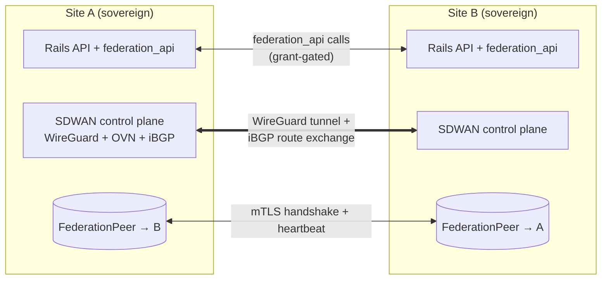
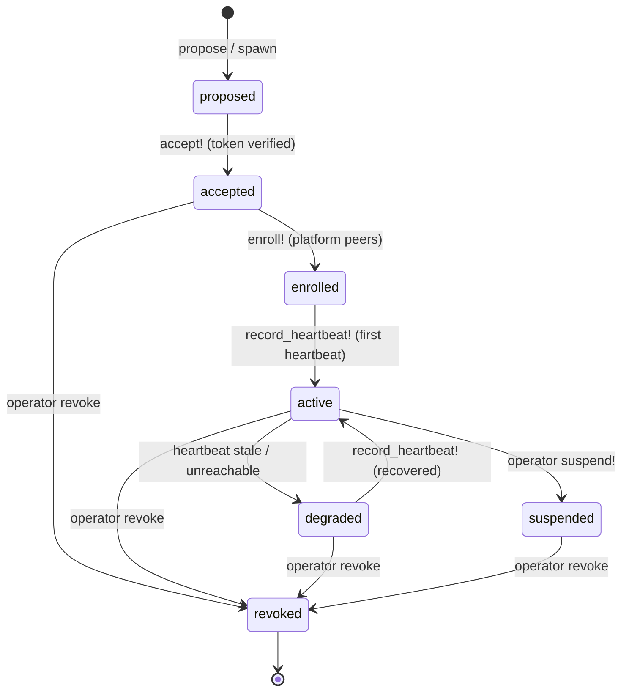
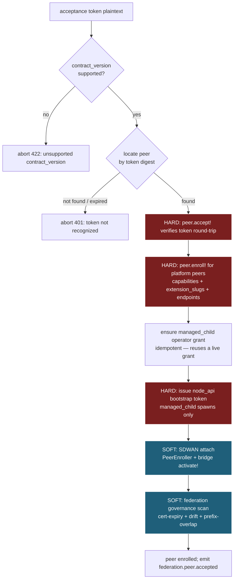
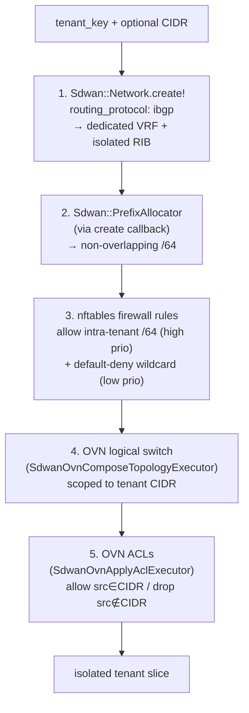
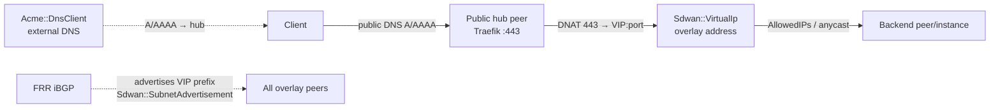
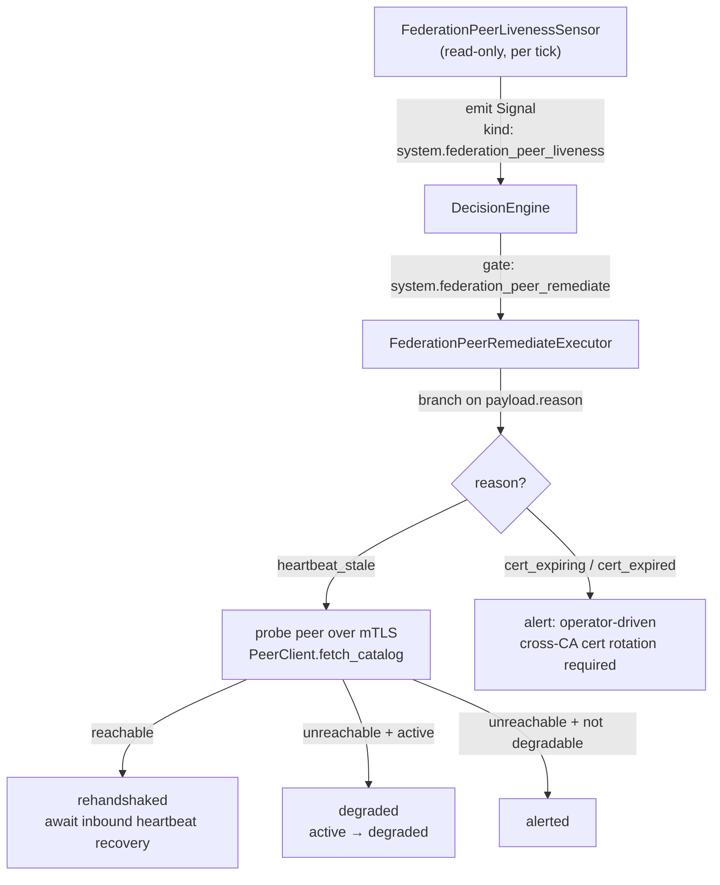

# Federation & Multi-Site Guide

> Status: active

How Powernode federates independent platforms across sites, accounts, and
organizations — and how it delivers **tenant isolation** and **service
discovery** entirely over the SDWAN overlay rather than k8s-native seams.

This is the architecture + concepts reference for Phase 3 (Federation &
Multi-Site). For the step-by-step procedures see:

- [`runbooks/federation-setup.md`](./runbooks/federation-setup.md) — propose → accept → activate, the happy path
- [`runbooks/federation-troubleshooting.md`](./runbooks/federation-troubleshooting.md) — failure-mode diagnosis
- [`tutorials/11-federation.md`](./tutorials/11-federation.md) — guided multi-site walkthrough
- [`federation/SPAWN_MODES.md`](./federation/SPAWN_MODES.md) — `managed_child` / `autonomous_peer` / `cluster_member`
- [`federation/NETWORK_TRUST.md`](./federation/NETWORK_TRUST.md) — network-scoped trust + pessimistic grants
- [`federation/SOCIAL_CONTRACT.md`](./federation/SOCIAL_CONTRACT.md) — the operator commitment framework

---

## 1. Multi-site architecture

A Powernode **site** is one self-contained platform: its own Rails API,
worker, database, SDWAN control plane, and operator account. Federation
links sites into a mesh of sovereign peers. No site is subordinate by
default — each runs independently and continues to operate if a peer
goes dark.

Two sites federate by establishing a **`System::FederationPeer`** row on
each side, pointing at the other. Once both rows reach `status: "active"`,
the sites can:

- offer and consume **services** through the federation API surface
  (`/api/v1/system/federation_api/...`), gated by per-peer grants;
- exchange **SDWAN routes** so workloads on one site can reach workloads
  on another over the encrypted overlay;
- ship **per-peer audit records** (WORM) and negotiate **contract
  versions** so neither side silently drifts out of protocol compatibility.



### Peer kinds and spawn roles

A `FederationPeer` carries a `peer_kind` and (for spawned peers) a
`spawn_role` + `spawn_mode`:

| Field | Values | Meaning |
|---|---|---|
| `peer_kind` | `platform`, `node` | `platform` = a full peer site; `node` = an enrolled NodeInstance. Federation liveness + acceptance flows apply to **platform** peers. |
| `spawn_role` | `parent`, `child`, `symmetric` | Whether this site spawned the peer, was spawned by it, or peered out-of-band. |
| `spawn_mode` | `managed_child`, `autonomous_peer`, `cluster_member` | The social/operational relationship (see [`SPAWN_MODES.md`](./federation/SPAWN_MODES.md)). |

Two paths produce a peer:

1. **Out-of-band peering** — both sites already exist; an operator on one
   side proposes, hands a token to the other operator, who accepts. Result:
   `spawn_role: "symmetric"`.
2. **Spawning** — a parent site provisions a brand-new child as a
   NodeInstance and stamps the acceptance token into the child's boot
   payload so the child comes online already federated. Result:
   `spawn_role: "parent"` on the parent, `"child"` on the child.

### The peer state machine



The authoritative transition table is `System::FederationPeer::TRANSITIONS`
(`app/models/system/federation_peer.rb`). The acceptance orchestration (§2)
drives `proposed → accepted → enrolled`; the heartbeat loop drives
`enrolled → active` and the liveness loop (§5) drives `active → degraded`
and recovery.

---

## 2. Peering — propose, accept, and acceptance orchestration

### Propose

The proposing operator creates a `FederationPeer` row pointing at the
remote site. This is a **local-only** record — it does not contact the
remote yet:

```
platform.system_sdwan_propose_federation_peer
  remote_instance_url: "https://site-b.example.com"
  peer_kind: "platform"
  spawn_role: "symmetric"
```

The peer is `status: "proposed"`. The proposing side then mints a
**single-use acceptance token** (urlsafe-base64, 32 bytes of entropy; only
its SHA-256 digest is persisted) and hands the plaintext to the accepting
operator out of band.

### Accept — the acceptance orchestration

Accepting runs the **full accept chain** synchronously. Phase 3 extracted
this chain into `System::Federation::FederationAcceptanceService` so the
exact same orchestration is reachable from three callers without
duplication:

1. **`FederationApi::AcceptController#create`** — the HTTP handshake
   endpoint the remote site (or a spawned child) POSTs to.
2. **`federation_acceptance` skill** (`FederationAcceptanceExecutor`) —
   an approval-gated skill so an operator (via the System Concierge) or the
   SDWAN Manager autonomy loop can complete an accept after a peer has been
   proposed.
3. Any future internal re-accept / re-enroll flow.

The chain has **hard** steps (a failure aborts the whole accept) and
**soft** steps (a failure is collected as a warning; the accept still
succeeds with the peer enrolled, and an operator can re-run the soft step
later):



Step detail:

- **Contract-version negotiation** — the service honors
  `SUPPORTED_CONTRACT_VERSIONS` (currently `[1]`). A caller claiming an
  unsupported version is rejected before any state changes. This prevents
  silent protocol drift (Social Contract commitment #12).
- **Token verification + `accept!`** — the plaintext hashes to the stored
  digest; on a match the peer transitions `proposed → accepted` and the
  digest is cleared (single-use). `contract_version_agreed` is recorded.
- **`enroll!` + mTLS trust exchange** — platform peers transition
  `accepted → enrolled`, storing the negotiated capabilities, the peer's
  extension slugs, and its endpoints. Cert issuance happens **here**, in one
  of two modes dispatched by what the caller advertised:
  - **hierarchical** — the caller (typically a `managed_child`) sends a CSR;
    the parent signs it off its **own** CA and returns the cert in the accept
    response. The child seals it as its `outbound_certificate`. Because the
    cert chains to the parent's CA (already trusted by Traefik's client-auth),
    the child→parent mTLS direction needs no proxy trust changes.
  - **symmetric** — the caller sends its CA bundle; `establish_symmetric_trust!`
    exchanges trust anchors and each side self-issues its outbound cert.

  > **Caveat — peers enrolled without trust material fall back to plaintext.**
  > If a peer enrolls advertising **neither** a CSR nor a CA bundle, no
  > `outbound_certificate` is issued, and `Federation::PeerClient` (via
  > `NetHttpAdapter`) **silently downgrades outbound `federation_api` calls to
  > plaintext** — a remote peer enforcing client-cert verification then
  > rejects the call. Single-account SDWAN peering (where the overlay carries
  > the traffic) works regardless; what is **not** robust today is
  > authenticated cross-account `federation_api` for a peer that skipped the
  > trust exchange. Always complete the CSR (hierarchical) or CA-bundle
  > (symmetric) exchange at accept time. See [§6](#6-security) and
  > troubleshooting.
- **Managed-child operator grant** — fires only when the peer represents a
  parent's view of a `managed_child` spawn. Idempotent: reuses a live grant
  if one exists. The grant is operator-scope (`read/write/admin`), 365-day
  TTL, with empty pessimistic-scope allowlists (permissive within the
  bounded parent ↔ child relationship).
- **node_api bootstrap-token issuance** — for `managed_child` spawns the
  service issues a single-use, instance-scoped bootstrap token the child's
  agent presents at `/node_api/enroll` to receive its mTLS cert. Returned in
  the accept response under `node_enrollment`.
- **SDWAN attach (soft)** — seats the child's bound NodeInstance into the
  federation overlay network and flips its `FederationNetworkBridge` to
  `active` (so the auth chain accepts subsequent calls over that network).
  Cleanly **skipped** for out-of-band peers with no overlay binding — that's
  not an error, the overlay simply isn't part of this peering.
- **Governance scan (soft)** — runs the federation governance scanner
  scoped to this peer (cert-expiry / capability-drift / prefix-overlap).
  Findings are advisory; critical/high findings are appended to the
  response `warnings`.

On success the service emits a `federation.peer.accepted` FleetEvent and
returns the peer id, status, agreed contract version, the `node_enrollment`
block (if any), the `sdwan_attach` result, the `governance` result, and any
`warnings`.

### Enrollment + activation

Once both sides are `accepted`/`enrolled`, the `enrolled → active` advance
fires on the **first inbound heartbeat** a peer receives (`record_heartbeat!`,
via `FederationApi::HeartbeatController`). From then on `last_heartbeat_at`
tracks liveness.

Two heartbeat mechanisms exist, and only one is wired today:

- **Platform → platform (wired).** `FederationHeartbeatJob` (60s cron,
  `:federation_heartbeat` queue in `worker/config/sidekiq.yml`) runs
  `HeartbeatSweepService.run!`, which walks **active** platform peers whose
  `last_heartbeat_at` is stale (>5min) and transitions them `active →
  degraded` so the dashboard flags the silence. Note this sweep is a
  **degradation** sweep — it does not itself advance `enrolled → active`.
- **Agent → platform (NOT wired).** A spawned `managed_child` whose liveness
  would come from its **on-node Go agent** has **no federation heartbeat
  sender**: `agent/internal/federation/handler.go` completes the one-shot
  accept handshake but never starts a heartbeat loop. So such a child stays
  `enrolled` and never auto-advances to `active`. Until that loop ships,
  advance it by driving an inbound heartbeat manually (or rely on the
  out-of-band platform↔platform path above for symmetric peers).

The §5 autonomy loop watches `last_heartbeat_at` for the liveness signals it
acts on.

---

## 3. SDWAN topology — hub-and-spoke vs full-mesh

Federation routes ride the SDWAN overlay. Two topology shapes are
supported, composed by the **`sdwan_federation_compose`** skill
(`SdwanFederationComposeExecutor`, bound to **System Topology Designer**),
which threads three SDWAN composition primitives in dependency order, per
peer, with inline data flow:

```
Sdwan::Network.create!(topology_strategy:)              (once)
  → N × Sdwan::PeerEnroller.call                        (one per member)
    → Sdwan::TopologyCompiler.compile_for_network       (per-peer WireGuard view)
      → Sdwan::Bgp::RoutePolicyCompiler.compile_for_peer (per-peer FRR route-policy)
```

| Topology | Shape | Endpoint requirement | Mirrors |
|---|---|---|---|
| `hub_and_spoke` | Peers tagged `role: "hub"` are publicly reachable; spokes funnel through the hub(s). | **Every hub must advertise an endpoint** (`endpoint_host_v6`/`v4` + port) — the executor fails fast otherwise. At least one hub is required or the overlay is unreachable. | `Sdwan::TopologyStrategies::HubAndSpoke` |
| `full_mesh` | Every peer connects directly to every other peer (no relay). | Peers with an endpoint are dialable; the rest are reached outbound. No hub/spoke distinction. | `Sdwan::TopologyStrategies::FullMesh` |

Both shapes accept a `routing_protocol` of `static` or `ibgp`. With `ibgp`,
`RoutePolicyCompiler` folds any applicable `Sdwan::RoutePolicy` rows into
FRR route-maps / prefix-lists for per-peer route distribution; with
`static` the per-peer route-policy envelope is empty (one entry per peer is
still emitted so the plan surface can confirm "no policies applied" rather
than guessing).

The executor supports `dry_run: true` — it renders the projected fan-out
(peer count, hub count, the planned step list) from the supplied peer set
without persisting any `Sdwan::Network`/`Sdwan::Peer` rows, so a plan-review
surface can show the topology before it's built. Rollback is reverse-order:
detach peers in reverse enrollment order, then delete the network
(network destroy also cascades to surviving peers via `dependent: :destroy`;
the explicit per-peer pass preserves audit granularity).

### Choosing a topology

```
Do peers share a low-RTT overlay and need any-to-any reachability?
  Yes → full_mesh

Are some peers behind NAT / not publicly reachable, with one or more
public hub sites to relay through?
  Yes → hub_and_spoke (tag the public sites role: "hub")

(Default for cross-site federation with one reachable gateway per site:
hub_and_spoke — each site's public hub is the relay; spokes stay private.)
```

---

## 4. SDWAN-native tenant isolation and service discovery

Powernode delivers isolation and discovery **over the SDWAN overlay** —
not via k8s NetworkPolicy, CoreDNS, or VLANs. The overlay is the substrate:
WireGuard tunnels, per-network VRFs, iBGP RIBs, OVN logical switches +
ACLs, nftables firewall rules, VIPs, and BGP route advertisement. The one
seam with no SDWAN substitute is **public-internet DNS** (external
A/AAAA/CNAME for publicly-resolvable names), which uses the existing
`Acme::DnsClient`.

### 4a. Tenant isolation — `multi_tenant_isolation`

The **`multi_tenant_isolation`** skill
(`MultiTenantIsolationExecutor`, bound to **System Topology Designer**,
`requires_approval: true`, `blast_radius: high`) stands up a fully-isolated
network slice for one tenant inside the account, composed entirely from
existing SDWAN production services. It threads IDs inline in plain Ruby and
rolls back in reverse dependency order.



Why each layer:

1. **Dedicated VRF-isolated network** — `routing_protocol: "ibgp"` gives the
   tenant its own RIB; each network's distinct `network_handle` yields a
   dedicated VRF master device (`sdwan-<handle>`), so no two tenants ever
   share a kernel forwarding table.
2. **Non-overlapping /64** — `Sdwan::PrefixAllocator` (invoked transitively
   in the network create callback) carves a /64 from the account's /48,
   rejection-sampled against sibling tenant networks. This CIDR is the
   tenant's blast-radius boundary and seeds the firewall + ACL selectors.
3. **nftables firewall rules (inter-host)** — two rules: an explicit
   `accept` for the tenant's own /64 at high priority, then a default
   `drop` wildcard at low priority. Compiles to `table inet powernode_sdwan`
   on every peer in the network.
4. **OVN logical switch (intra-host L2 domain)** — one switch named for the
   tenant, scoped to the tenant CIDR. Heavyweight-profile.
5. **OVN ACLs (intra-host)** — allow intra-tenant (source in the tenant
   CIDR) at high priority, drop everything sourced outside the tenant CIDR
   at lower priority. nftables (inter-host) and OVN ACLs (intra-host) cover
   the two non-overlapping enforcement scopes.

Every persisted artifact carries `account_id == account.id`; nothing is
shared across tenants except the account-level `Sdwan::OvnDeployment` (one
per account by DB unique index — reused, never duplicated). When the
account has no OVN deployment yet, the skill requires `nb_db_endpoint` +
`sb_db_endpoint` to create one.

The skill supports `dry_run: true` (renders the planned actions without
persisting). Rollback tears down in reverse order — OVN ACLs → OVN switch
(and the deployment only if this run created it) → firewall rules →
network — delegating to the sibling OVN executors' own rollbacks so reuse
semantics are honored (it never destroys a pre-existing account deployment
or reused ACLs). Errors are collected, not raised, so a half-torn-down
tenant still surfaces every resource it couldn't reclaim.

> **No k8s NetworkPolicy, no VLAN.** Tenant boundaries are VRF + iBGP RIB +
> nftables + OVN ACLs on the overlay. A tenant cannot reach another
> tenant's prefix because the routing table doesn't contain it and the
> firewall/ACL default-deny blocks anything that leaks.

### 4b. Service discovery — VIP + BGP advertisement + Traefik + external-DNS

A federated service is reached by a **stable overlay VIP** advertised over
BGP, optionally fronted by Traefik, with public names resolved via
external DNS. The primitives:

| Primitive | Model / service | Role |
|---|---|---|
| **Virtual IP** | `Sdwan::VirtualIp` | A stable overlay address fronting a backend instance/peer. Static mode = single active holder (agent binds it on loopback; the topology compiler emits `AllowedIPs` on every other peer pointing the VIP's CIDR at the holder's /128). Anycast mode = all holders bind it simultaneously and FRR advertises from each; closest-path routing picks the destination. |
| **BGP advertisement** | `Sdwan::SubnetAdvertisement` (source `virtual_ip`) | The VIP machinery emits one advertisement row per active VIP; FRR advertises the prefix into the iBGP fabric so every peer (and federated peer, subject to route policy) learns the route. |
| **Traefik route** | hub port mapping + reverse-proxy compose | A DNAT rule on a public hub peer forwards `443`/`80` to the VIP + backend port; the reverse-proxy config folds in the route + TLS cert. |
| **external DNS** | `Acme::DnsClient` | The only non-SDWAN seam: public A/AAAA/CNAME records so a publicly-resolvable hostname points at the public hub. Used for ACME DNS-01 challenges and public service names. |

The **`expose_service_publicly`** skill (`ExposeServicePubliclyExecutor`)
chains the first four for a single service: VIP → hub DNAT port mapping →
ACME certificate → reverse-proxy regen. (Full operator walkthrough in
[`runbooks/expose-service.md`](./runbooks/expose-service.md) and
[`tutorials/13-expose-service-tls.md`](./tutorials/13-expose-service-tls.md).)



For **federation-scoped** discovery, the same VIP prefix is learned by a
federated peer when route policy permits it across the federation bridge —
so Site B can reach a Site-A service by its overlay VIP without any public
exposure at all. Public exposure (Traefik + external DNS) is only needed
when the consumer is on the public internet rather than another federated
site.

---

## 5. Liveness autonomy loop

Federation peers are kept healthy by a sense → decide → remediate loop
that runs in the fleet autonomy pipeline. It is **read-side sensing** plus
**real remediation** — the sensor never mutates state; the executor takes
the action.



### The sensor

`System::Fleet::Sensors::FederationPeerLivenessSensor` watches
**platform-kind** peers for two liveness-failure classes and emits a single
signal kind (`system.federation_peer_liveness`) that the DecisionEngine
routes to one remediation executor:

- **Stale heartbeat** — an `enrolled`/`active` peer whose
  `last_heartbeat_at` is older than `HEARTBEAT_STALE_AFTER` (5 minutes).
  Sourced from the same `System::FederationPeer.heartbeat_stale` scope the
  heartbeat sweep uses, so the sensor and the sweep agree on "stale."
  Severity: `:high` for an `active` peer (it was carrying live traffic),
  `:medium` for an `enrolled` peer (never fully came up).
- **Cert expiring / expired** — a peer whose bound federation node
  certificate is past (or within 30 days of) `not_after`. Sourced from
  `Sdwan::FederationGovernance.scan`, reusing its tuned thresholds rather
  than re-deriving them. Severity: `:high` for expired, `:medium` for
  expiring.

Stale-heartbeat signals are fingerprinted by a staleness-window bucket so a
peer that flaps in and out re-emits at most once per window (the engine's
TTL dedup then collapses repeats further). The sensor wraps the governance
scan defensively — a scan failure logs a warning and returns no cert
signals rather than taking the whole sensor (and the rest of the tick)
down.

### The remediation executor

`FederationPeerRemediateExecutor` (the **`federation_peer_remediate`**
skill, bound to **SDWAN Manager**, `requires_approval: false`,
`blast_radius: medium`, `invocation_mode: one_shot`) branches on the
payload `reason` and takes the matching **real** action:

- **`heartbeat_stale`** — probe the peer's federation_api over mTLS
  (`Federation::PeerClient#fetch_catalog`, a safe side-effect-free read that
  exercises the full mTLS path). The probe *is* the re-handshake:
  - **reachable** → `rehandshaked`. A reachable peer's inbound heartbeats
    record it back to `active` on their own; the executor reloads and
    reports whatever status that produced. It never forges a heartbeat it
    didn't receive.
  - **unreachable + `active`** → `degraded`. Transitions `active → degraded`
    via `mark_degraded!` (mirrors the heartbeat sweep, but driven by a
    positive unreachability signal rather than a timer).
  - **unreachable + not degradable** (e.g. `enrolled`-never-came-up, or
    already degraded) → `alerted`. Repeated unreachability past the dedup
    TTL re-queues, escalating toward operator suspension.
- **`cert_expiring` / `cert_expired`** — `alerted`. Federation node-cert
  rotation is **operator-driven** in v1 because rotating a federation trust
  cert requires a cross-CA handshake with the remote operator. The executor
  surfaces the rotation need (high severity for expired, medium for
  expiring) and **does not** silently rotate a trust cert.

Every branch emits a FleetEvent (the durable + live alert) and returns a
structured result. The executor is synchronous and idempotent: re-running
on an already-degraded peer is a no-op degrade, and re-running the probe is
side-effect-free on the local side. A `dry_run: true` mode reports the
action that would be taken without probing, degrading, or alerting.

---

## 6. Security

Federation security composes existing platform primitives — no
federation-specific copies.

### Trust chain

- **mTLS** — federation_api calls are mutually authenticated **when the peer
  completed the trust exchange at accept** (hierarchical CSR-signing or
  symmetric CA-bundle exchange — see [§2](#accept--the-acceptance-orchestration)).
  The calling peer presents its `outbound_certificate`; the proxy → backend
  hop is itself mTLS against the platform's internal CA. **A peer that
  enrolled without trust material has no client cert and `PeerClient`
  downgrades its outbound calls to plaintext** — so authenticated
  cross-account `federation_api` is only robust once trust is exchanged.
  Single-account SDWAN peering (traffic over the encrypted overlay) is
  unaffected by this.
- **Network-scoped trust (Locked Decision #12)** — SDWAN is a first-class
  participant. A federation_api request is denied unless the calling
  NodeInstance (`X-Calling-Instance`), the SDWAN network it arrived over
  (`X-Sdwan-Network`, validated against an **active**
  `FederationNetworkBridge`), and the source IP (`X-Forwarded-For`) all
  match the populated allowlists on the `FederationGrant`. Full detail in
  [`federation/NETWORK_TRUST.md`](./federation/NETWORK_TRUST.md).
- **Pessimistic grants** — `FederationGrant` carries three allowlists
  (`node_instance_ids`, `sdwan_network_ids`, `source_cidrs`). An empty
  allowlist means "no restriction on this axis" (back-compat); a populated
  allowlist must match. All three are AND-combined.

### Approval gating

Sensitive federation actions are approval-gated so autonomy never silently
establishes or tears down trust:

| Action | Skill | Approval |
|---|---|---|
| Complete an accept handshake | `federation_acceptance` | **required** (`requires_approval: true`) |
| Stand up a tenant isolation slice | `multi_tenant_isolation` | **required** (`requires_approval: true`) |
| Compose a federation topology | `sdwan_federation_compose` | governed by the SDWAN Manager / Topology Designer policy |
| Remediate peer liveness | `federation_peer_remediate` | **not** required — but cert rotation only *alerts*; it never auto-rotates |
| Propose / accept / revoke a peer (SDWAN Manager policy) | — | `require_approval` with a 4-hour timeout |

When an action sits unapproved past its timeout it auto-rejects; the
operator must re-initiate and approve within the window. See
[`SDWAN_MANAGER_AGENT.md`](./SDWAN_MANAGER_AGENT.md) for tuning a policy and
the pause/resume runbook.

### Contract + audit

- **Contract-version negotiation** prevents protocol drift — a peer
  claiming an unsupported `contract_version` is rejected before any state
  change (Social Contract commitment #12).
- **Per-peer WORM audit** ships every cross-account action through a
  write-once, tamper-evident log (monotonic sequence; row updates rejected
  at the DB level).
- **Governance scanning** (`Sdwan::FederationGovernance`) continuously
  surfaces cert-expiry, capability-drift, prefix-overlap, and
  unrestricted-scope findings to the operator dashboard.

### Blast-radius containment

Tenant isolation (§4a) is itself a security control: a compromised workload
in one tenant slice cannot reach another tenant's prefix because the VRF's
RIB doesn't contain the route and the nftables/OVN default-deny blocks any
leak. Combined with pessimistic grants, a federated peer's reach is bounded
on three independent axes (instance, network, source IP) plus the tenant
VRF boundary.

---

## See also

- [`runbooks/federation-setup.md`](./runbooks/federation-setup.md) — propose → accept → activate
- [`runbooks/federation-troubleshooting.md`](./runbooks/federation-troubleshooting.md) — failure diagnosis
- [`tutorials/11-federation.md`](./tutorials/11-federation.md) — guided walkthrough
- [`federation/SPAWN_MODES.md`](./federation/SPAWN_MODES.md) — spawn-mode reference
- [`federation/NETWORK_TRUST.md`](./federation/NETWORK_TRUST.md) — network-scoped trust + pessimistic grants
- [`federation/SOCIAL_CONTRACT.md`](./federation/SOCIAL_CONTRACT.md) — operator commitment framework
- [`SDWAN_MANAGER_AGENT.md`](./SDWAN_MANAGER_AGENT.md) — the agent that gates federation actions
- [`SKILL_EXECUTORS.md`](./SKILL_EXECUTORS.md) — full skill-executor reference
- [`ARCHITECTURE.md`](./ARCHITECTURE.md) — system extension architecture (Subsystems §5 = SDWAN)
- [`FLEET_SENSORS.md`](./FLEET_SENSORS.md) — sensor + intervention-policy reference

_Last verified: 2026-06-03_
