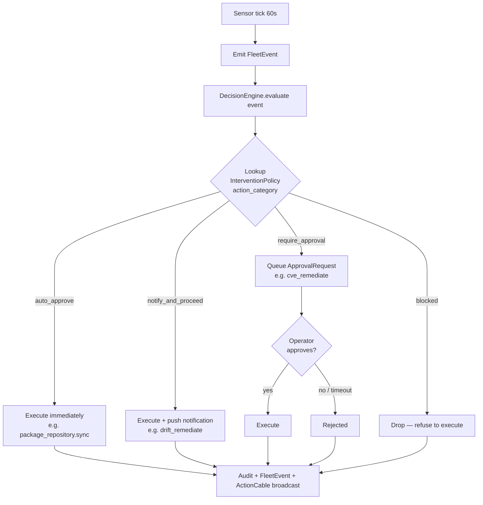

# Fleet Sensors — System Extension Reference

> Status: active

The `fleet/sensors/` directory at `extensions/system/server/app/services/system/fleet/sensors/` holds **41 files**: one `BaseSensor` abstract class and **40 sensors registered** for the live tick loop via `FleetAutonomyService::SENSORS`. (A further 2 CVE sensors live under `cve_ops/sensors/` and are owned by the CVE Responder agent — see [its section](#cve-responder-agent-5-policies) — not part of this directory's count.) Each sensor inspects a slice of fleet state on a recurring tick, emits typed `FleetEvent` signals when thresholds trip, and feeds the autonomy `DecisionEngine` which gates remediation actions per intervention policy.

The 40 registered sensors, in `SENSORS` order: `StuckTaskBacklogSensor`, `AbandonedInstanceSensor`, `InstanceStatusSensor`, `InstanceUnrecoverableSensor`, `OrphanPoolGuestSensor`, `InstanceStateDriftSensor`, `ModuleDriftSensor`, `TemplateClosureDriftSensor`, `BootImageDriftSensor`, `BootImageStalenessSensor`, `CertificateExpirySensor`, `CertExpirySensor`, `ModulePromotionSensor`, `ModulePromotionBacklogSensor`, `CapabilityGapSensor`, `GovernanceGapSensor`, `ConfigDriftSensor`, `SloViolationSensor`, `HoneypotAccessSensor`, `TradingPressureSensor`, `SdwanDriftSensor`, `SdwanReachabilitySensor`, `SdwanBgpSessionHealthSensor`, `SdwanVipReachabilitySensor`, `GitopsDriftSensor`, `ProjectSloSensor`, `FederationPeerLivenessSensor`, `PackageDriftSensor`, `SdwanCredentialExpirySensor`, `StorageAssignmentDriftSensor`, `DiskImagePublicationFailureStreakSensor`, `SdwanServiceHealthSensor`, `SdwanOvnDeploymentHealthSensor`, `SdwanApplyHealthSensor`, `SdwanUserDeviceConfigStalenessSensor`, `ModuleVerifyFailedSensor`, `BootLkgArmSensor`, `ReplicaLagSensor`, `SnapshotPolicySensor`, `TerminatedGuestPresentSensor`. (`PackageDriftSensor`, `SdwanCredentialExpirySensor`, and `StorageAssignmentDriftSensor` were dead code until audit F3-07 registered them — they previously appeared here as "running via separate invocation paths", which was never true. `TemplateClosureDriftSensor` (campaign 019f6084 §2.4.3), `CapabilityGapSensor` (IMP-4019664a524b), `DiskImagePublicationFailureStreakSensor` (disk-image-CI restoration DK3), `SdwanServiceHealthSensor` (IMP-c7d663f24a0b), `SdwanOvnDeploymentHealthSensor` (IMP-57e9a90598ee), `SdwanApplyHealthSensor` (IMP-da1b772c2596), `SdwanUserDeviceConfigStalenessSensor` (IMP-7034199a5a19), `BootLkgArmSensor` (IMP-a8f9fa74284d), `ReplicaLagSensor` (IMP-5b38cd356010), `GovernanceGapSensor` (HIER-P3), `SnapshotPolicySensor` (IMP-c22215ae9546) and `TerminatedGuestPresentSensor` (IMP-ff6d46f2c3e1) were registered later still — all are now in `SENSORS`, so no sensor in this directory currently runs outside it.)

Every sensor above except two reads **infrastructure** — is the node up, is the tunnel up, is the cert fresh. `SdwanServiceHealthSensor` was the first to read a **workload**: whether the thing at the end of a published service's overlay path is actually serving. That distinction is the platform-wide gap recorded in `docs/operations/autonomous-infrastructure-readiness-2026-08-12.md`, and that sensor closes it for `Sdwan::Service` only. `ReplicaLagSensor` is the second: it reads the platform database's own replication catalog for the postgres cluster_member lane. Deployed app code and containers remain unsensed.

## Architecture (one-paragraph summary)

The Fleet Autonomy reconciler runs every 60s (configurable via `autonomy_config.interval_seconds` on the Fleet Autonomy agent; with the 2026-05-10 7-agent split, CVE / SDWAN / Disk Image / Runtime Manager agents each carry their own `interval_seconds` for their respective scopes). Each tick:

1. The 38 sensors in `FleetAutonomyService::SENSORS` run in series (cheap; per-sensor work is bounded by the data it inspects).
2. Each sensor emits zero or more `FleetEvent` signals with `kind`, `severity`, `payload`, `correlation_id`
3. The DecisionEngine maps signals → action categories → intervention policy lookup
4. Policy = `auto_approve` → executor runs immediately
5. Policy = `notify_and_proceed` → executor runs + operator notified
6. Policy = `require_approval` → ApprovalRequest queued; executor blocked until operator clicks Approve

```mermaid
flowchart LR
    subgraph Sensors["38 fleet sensors (registered for the Fleet Autonomy tick)"]
        S0[stuck_task_backlog]
        S1[instance_status]
        S2[module_drift]
        S2b[boot_image_drift]
        S2c[template_closure_drift]
        S3[module_promotion]
        S3b[capability_gap]
        S4[certificate_expiry]
        S4b[cert_expiry / ACME]
        S5[config_drift]
        S6[instance_state_drift]
        S7[sdwan_reachability]
        S8[sdwan_drift]
        S9[sdwan_bgp_session_health]
        S10[sdwan_vip_reachability]
        S11[sdwan_credential_expiry]
        S12[honeypot_access]
        S13[slo_violation]
        S14[project_slo]
        S15[gitops_drift]
        S16[trading_pressure]
        S17[federation_peer_liveness]
        S18[package_drift]
        S19[storage_assignment_drift]
        S20[disk_image_publication_failure_streak]
        S21[sdwan_service_health]
        S22[sdwan_ovn_deployment_health]
        S23[sdwan_apply_health]
        S24[sdwan_user_device_config_staleness]
        S25[module_verify_failed]
        S26[boot_lkg_arm]
        S27[module_promotion_backlog]
        S28[replica_lag]
        S29[snapshot_policy]
        S30[orphan_pool_guest]
    end
    subgraph Signals["Sensor signal kinds (FleetEvent also carries non-sensor kinds, e.g. sdwan.credential_issued)"]
        Sig[system.* — every sensor kind is system.-prefixed<br/>system.instance_silent / system.module_drift / system.cert_expiring<br/>system.sdwan_peer_drift / system.slo_violation / system.project_drift]
    end
    subgraph Executors["Skill executors (representative — see SKILL_EXECUTOR_CATALOG.md for all 54)"]
        E1[drift_remediate]
        E2[cve_response / cve_remediation_orchestration]
        E3[rolling_module_upgrade]
        E4[sdwan_peer_remediate]
        E5[sdwan_vip_failover]
        E6[sdwan_bgp_session_remediate]
        E7[attribute_failure]
        E8[package_module_refresh]
        E9[architecture_create / update / delete / propose]
    end
    Sensors --> Signals
    Signals --> DE[DecisionEngine]
    DE --> FA[FleetAutonomyService<br/>gate_action!]
    FA --> Executors
```



Every sensor in this directory is now registered in `FleetAutonomyService::SENSORS` — the asterisked "not yet registered" convention this diagram used to carry no longer applies to any node (see the F3-07 / campaign 019f6084 / IMP-4019664a524b / DK3 note above). `capability_gap`, `disk_image_publication_failure_streak`, `sdwan_service_health`, and `sdwan_ovn_deployment_health` are advisory/observational (no auto-remediation executor); `template_closure_apply` is Fleet Autonomy's remediation for `template_closure_drift`.

## Sensor Reference

> **Signal-kind correction — IMP-e839dd0ffc05 (2026-08-31).** Twelve blocks below
> named signal kinds that **no sensor has ever emitted**, and the diagram above
> advertised ten namespaces that do not exist. **Every kind a fleet sensor emits is
> `system.`-prefixed**; `DecisionEngine::SIGNAL_BINDINGS` keys on those names, so an
> intervention policy bound to any name in the left column below **never fires and
> reports no error** — check yours against this table. The fabricated names are
> listed rather than deleted so an operator who wrote one down can find it.
>
> | Named in this doc before 2026-08-31 | Actually emitted |
> |---|---|
> | `instance.silent` | `system.instance_silent` |
> | `module.drift_detected` | `system.module_drift` |
> | `cert.expiring` | `system.cert_expiring` (node certs) / `system.acme_cert_expiring` (platform ACME certs) |
> | `config.drift_detected` | `system.config_drift` |
> | `sdwan.peer_drift`, `sdwan.peer_drift_detected` | `system.sdwan_peer_drift` |
> | `sdwan.bgp_unhealthy` | `system.sdwan_bgp_session_unhealthy`, `system.sdwan_bgp_session_stale` |
> | `sdwan.vip_holder_silent` | `system.sdwan_vip_unreachable` |
> | `honeypot.access`, `honeypot.access_attempted` | `system.honeypot_access` |
> | `slo.violated` | `system.slo_violation` |
> | `system.instance_state_drift` | `system.instance_state_drifted` (note the `-ed`) |
> | `gitops.drift_detected` | `system.gitops.drift_detected` (the one kind with two dots) |
> | `project.slo_violation`, `project.drift`, `project.cost_breach` | `system.project_slo_violation`, `system.project_drift`, `system.project_cost_breach` |
>
> **Recovery signals are NOT IMPLEMENTED.** The blocks below advertised
> detected/resolved PAIRS the platform does not build. No sensor emits a recovery
> counterpart — recovery is the fingerprint's **absence on a later tick**, which the
> `sdwan_reachability_sensor` block already stated. Withdrawn as NOT IMPLEMENTED:
> `instance.recovered`, `module.drift_resolved`, `cert.expired`, `cert.rotated`,
> `config.drift_resolved`, `sdwan.peer_drift_resolved`, `sdwan.bgp_recovered`,
> `sdwan.vip_holder_recovered`, `honeypot.access_blocked`, `slo.recovered`,
> `gitops.drift_resolved`. Do not wait for one; poll for the signal's absence.
>
> Pinned by `spec/docs/fleet_sensors_signal_kinds_spec.rb`, which asserts file-wide
> that the kinds named here EQUAL the kinds the sensors in
> `server/app/services/system/fleet/sensors/` can emit. The two CVE sensors under
> `cve_ops/sensors/` are out of that set and out of this reference, by the same
> scoping as the sensor count above.

### `stuck_task_backlog_sensor` — System task backlog staleness

**Source:** `stuck_task_backlog_sensor.rb`
**Watches:** `System::Task` rows older than the default 72-hour threshold, grouped by status (`pending`/`scheduled`/`running`), detecting stalled janitor work.
**Threshold:** Any non-terminal task older than 72 hours (configurable via `SYSTEM_TASK_BACKLOG_STUCK_SECONDS` env var or per-account) → `system.task_backlog_stuck` signal. Severity escalates from `:medium` to `:high` at 7 days, then to `:critical` at 14 days or 20+ stuck tasks.
**Signals:** `system.task_backlog_stuck` (severity `:medium` | `:high` | `:critical`)
**Recommended remediation:** None automated, deliberately. The sensor detects a broken janitor (scope issue, crashed worker, revoked permission, disabled cron) via **outcome** not self-report — a reaper that cannot see its subjects reports zero work, indistinguishable from genuine completion. Re-serving work never fixes the mechanism. Surfaces via the `system.observation` gate (Fleet Autonomy `auto_approve`, no operator notification). Listed in `RemediationValidator::NON_REMEDIATING_ACTION_CATEGORIES`.

### `abandoned_instance_sensor` — Instances silent past the abandonment window

**Source:** `abandoned_instance_sensor.rb` (IMP-10c9b9634d4e)
**Watches:** non-pool `cloud` instances in `starting` / `running` / `stopped` / `error`, with no operator hold, whose last sign of life — `COALESCE(last_heartbeat_at, created_at)`, never `updated_at` — is older than the window. A pool member is its pool's reaper's; a physical machine is not a provider guest; `pending` / `provisioning` have owners of their own and `stopping` / `rebooting` are transitions.
**Threshold:** Configurable per **account** via `system_update_sensor_config` (`abandoned_instance`), with the class constants as fallbacks — `abandon_after_seconds` default **604800** (7 days), `max_per_tick` default **10** (reaps that may proceed on the tick, oldest first; each is a terminate), `max_parked_per_tick` default **50** (reaps that will park for approval, oldest first). See [Configuring Sensor Thresholds](#configuring-sensor-thresholds).
**Signals:** `system.instance_abandoned` (severity `:medium`), fingerprinted per instance.
**Remediation:** routes to `system.abandoned_instance_reap` (Capacity Manager, seeded `auto_approve`), applied by the DecisionEngine's `reap_abandoned_instance` — no executor. The payload names the instance, so the action is placed in the **instance's plane**: it terminates on the tick in an unprotected plane and parks for approval in a protected one, where approvals dedup per instance, so a standing signal keeps **one** card. **Data at stake parks in any plane:** the payload carries `requires_approval` with `approval_reasons` when the guest is `running` (the platform last saw it powered on; agent silence is not the provider's view), `stopped` (it may have been powered off on purpose), has a `ProviderVolume` attached, or is the **ACTIVE holder** of a virtual IP through one of its peers (`virtual_ip_active_holder`), and the DecisionEngine forces `require_approval` for it. A guest that is only a **failover standby** for a virtual IP (never the active holder) is NOT an approval reason — the applier prunes the guest's peer ids from every VIP's `failover_holder_peer_ids` itself, through the ordinary `sdwan_update_virtual_ip` write path, before the volume detach and the backend release below, so a prune failure leaves the guest untouched rather than stranding a half-released instance. Only `starting`/`error` guests holding nothing, or only standing by for a VIP, reap on the tick, and only where the plane does not escalate the category. At execution the applier re-checks the claim (a heartbeat since, an operator hold, an already-terminated row all refuse, and so does any reason at stake that the approval's `approval_reasons` did not list). An **active** virtual-IP holder is refused unconditionally, even when approved — approval cannot fix a moved address, so this lane refuses regardless and re-checks again immediately before the terminate (a failover promoting the guest into the holder seat during the volume detach / backend release must be honoured, not tombstoned) — until the address is moved off the guest by naming a live peer as holder (`sdwan_update_virtual_ip`) or a failover to a standby. **Open limitation:** approving an active holder's card does not clear it; the card itself now names this ("approval will not help... move it off this guest first"), so the operator is not left guessing why a fresh card keeps reappearing. Otherwise it detaches attached volumes (a provider terminate destroys every disk in the guest's config; a volume that will not detach stops the reap), releases the instance from published service backends (reporting any service still routed through a legacy backend), then terminates.
**Not abandoned, whatever its silence:** a row terminate can only refuse — no provider id and no lost-guest stamp — the platform's own hosting node (the self-management fence refuses it), and the failed side of a DR replace that already holds a replacement (that replace waits on its own `system.instance_reap` decision). Those stay on the lanes that already report them.
**Bounds:** oldest first, id as tiebreaker. `max_per_tick` bounds the reaps that would proceed on the tick. `max_parked_per_tick` bounds the reaps that will park — an approval reason, or a plane that escalates the category — which terminate nothing, so parked cards cannot use up the terminate bound, but still re-emit every tick.
**Suppression elsewhere:** `instance_status_sensor`, `instance_unrecoverable_sensor` and `template_closure_drift_sensor` exclude `AbandonedInstanceSensor.claimed_relation` — the rows this sensor signals on the tick — so an abandoned machine on the reap lane raises no reprovision, replace or closure-apply card, and a row past the bound keeps its old cards rather than being on neither lane. (Each sensor re-runs the query with its own clock, so a row crossing the window mid-tick can land on one lane a tick early.) Other sensors (module, config, boot-image drift) do not read it.

### `instance_status_sensor` — Heartbeat liveness

**Source:** `instance_status_sensor.rb`
**Watches:** `System::NodeInstance.last_heartbeat_at`, excluding instances `abandoned_instance_sensor` reports (IMP-10c9b9634d4e)
**Threshold:** Configurable per **account** via `system_update_sensor_config` (`instance_status` / `silent_threshold_seconds`); `SILENT_THRESHOLD` default **180s** is the fallback. Heartbeat older than that → `system.instance_silent` signal. See [Configuring Sensor Thresholds](#configuring-sensor-thresholds).
**Signals:** `system.instance_silent` — the only kind this sensor emits. No recovery counterpart exists; recovery is the fingerprint's absence on a later tick.
**Recommended remediation:** `attribute_failure` (skill) for diagnostics, then operator-initiated reprovision.

### `instance_unrecoverable_sensor` — Silent instances a reboot cannot recover

**Source:** `instance_unrecoverable_sensor.rb`
**Watches:** the same population as `instance_status_sensor` (running/starting with a heartbeat older than `InstanceStatusSensor::SILENT_THRESHOLD`), plus the rows the DecisionEngine's presumed-dead reaper already flipped to `error` — identified by their `system.instance_presumed_dead` event — plus, since campaign 01a07025 / app-2, `error` rows that are members of a pool whose `lifecycle_class` is `ephemeral` and that have been quiet (`COALESCE(last_heartbeat_at, created_at)`) longer than `ephemeral_error_grace_seconds`. No OTHER `error` row is admitted: a persistent instance in `error` is still a failed provision with a different owner. Then it classifies what it admitted
**Excludes:** instances `abandoned_instance_sensor` reports — a replace would claim a warm member to stand in for a machine gone for weeks; they are reaped on that lane instead. Applied in SQL before `max_per_tick` (IMP-10c9b9634d4e).
**Threshold:** Configurable per **account** via `system_update_sensor_config` (`instance_unrecoverable`), with the class constants as fallbacks — `reboot_attempt_threshold` default **2** consecutive ineffective `instance_silent` remediations, `emit_window_seconds` default **3600**, `max_per_tick` default **25**, `ephemeral_error_grace_seconds` default **86400**. The `FLEET_UNRECOVERABLE_*` environment variables this sensor once read were removed in APO-2e: nothing reads them, and setting one now tunes nothing. See [Configuring Sensor Thresholds](#configuring-sensor-thresholds).
**Signals:** `system.instance_unrecoverable` with a classified `reason` — `provider_terminal` (the provider reports the VM terminated/error), `host_unreachable` (a connection to the instance's provider is in `error` and none is still connected+enabled, so the control path is positively observed down), `reboot_exhausted` (the validate arc scored that many `instance_silent:<id>` remediations ineffective in a row), or `ephemeral_pool_error` (the instance is in `error` and its pool declares it `ephemeral`, so it is disposable by construction and the pool replenishes). The fourth is checked LAST and is therefore strictly additive: it can only classify a row the other three declined, so no already-classified instance changes reason. It is also the only one that reads no provider — its evidence is the platform's own two rows, not an inference about a host. `spot` pools are deliberately excluded (`REAPABLE_LIFECYCLE_CLASSES`): an errored spot member may be a provider reclaim, which has a different answer.
**Reaper-owned members are not signalled (IMP-4e24a37fdd40):** an `error` member the pool reaper collects itself gets no signal, whatever its reason, because a replace would claim a warm member for a builder nobody needs replaced. The pool reaper collects a member when all of these hold:
- its pool is `ephemeral` and swept (`active` or `draining`);
- the member is not claimed;
- record retention is on;
- neither the pool's plane nor the member's own plane withholds destruction, and the member's plane is on the churn tier.

Such a member is reaped by `InstancePoolService#prune_dead_records!` instead: a name-verified provider terminate, then the row. That happens once its retention window has passed (default 7 days, SiteSetting `system.instance_pool.dead_record_retention_days`), not at `ephemeral_error_grace_seconds`. Until then a guest the pool's own recycle arms could not terminate may still be running. The predicate is `InstancePoolService.reaper_collects_dead_member?`.

The exclusion EXPIRES. Once the member's last sign of life (heartbeat, claim, warm start, creation) is older than the retention window plus one day (`REAPER_OVERDUE_SLACK`), the reaper is taken to have failed it and the member is signalled again. That covers:
- a provider that never confirms the guest gone;
- a pool in an account the worker does not sweep;
- a reaper tick that keeps failing.

The members the reaper would skip keep the replace/reap approval lane once past `ephemeral_error_grace_seconds`:
- a claimed member;
- a member with no plane, or whose own plane or pool's plane is above the churn tier or escalates a terminate;
- a paused or archived pool;
- retention off.

Reaper-owned members are dropped in SQL before `max_per_tick`, so they never take a slot a real candidate needs.
**Absence is not a verdict:** no adapter, a blank `cloud_instance_id`, a failed `sync_status`, a provider with no connection rows, and connections that are merely `pending` (never tested) all leave the instance on the ordinary `instance_silent` lane. Unknown provider state is never escalated to a replace, and a provider read that SUCCEEDS with a non-terminal state rules `host_unreachable` out outright.
**Emit-once-per-window:** suppressed while a `system.instance_unrecoverable` FleetEvent for that instance is newer than `EMIT_WINDOW_SECONDS`, per instance — the condition clears when a person replaces the instance, not inside a tick interval. The suppression is applied in SQL *before* `MAX_PER_TICK`, so already-proposed instances cannot consume the window and starve the rest of a mass failure.
**Recommended remediation:** `system.instance_replace` (`require_approval` — declared on the **Capacity Manager** since HIER-P2DECL, `PolicyDeclarations::CAPACITY_MANAGER_POLICIES`; the binding declares `owner: "capacity-manager"`, and the tick gates the decision under that agent — seeded by `db/seeds/system_capacity_manager_agent.rb` since HIER-P2B, with the executor bound to it), applied by `System::Ai::Skills::ReplaceInstanceExecutor` (APO-4). The executor composes the verbs that already existed separately: acquire a warm member from the failed instance's `InstancePool`, detach-then-attach its volumes onto the replacement, re-enrol the replacement on every SDWAN network the failed one held — carrying the failed peer's routing attributes across (`publicly_reachable`, `listen_port`, `lan_subnets`, `bgp_route_reflector_client`, `capabilities`) while the endpoint is RE-DERIVED from the replacement's own address (a hostname the dead peer advertised is kept — `Sdwan::Peer.endpoint_attributes_for`), so a hub is not silently replaced by a spoke and a replacement hub does not advertise the dead instance's address — and move the VIPs onto the new peer. Every step is idempotent on an `operation_id` recorded as a `FleetEvent`, so a re-emitted signal replays a replace in progress rather than claiming a second pool member. The fingerprint the lane passes as that id is NOT stable across a reclassification (the sensor re-derives the reason every tick), so the executor also matches an acquire on the FAILED INSTANCE — a dead instance that reclassifies adopts the replacement it already has instead of claiming a second.
**The terminate is a SECOND approval, performed by a DIFFERENT executor.** The additive half above never destroys anything — `ReplaceInstanceExecutor` has no terminate call site at all. It asks `Ai::AutonomyGate` for the reap under `system.instance_reap`, which parks a second approval naming `System::Ai::Skills::ReapInstanceExecutor`; only that executor terminates, and only once a person releases it. The class split is what makes the split gate real: `BaseSkillExecutor` resolves ONE `action_category` per class, so a `reap_only:` flag on the replace executor would have run the terminate under the ADDITIVE category. The lane asks for the reap on every replace (the binding maps `reap: true`), so an approved replace leaves the dead instance visible and stripped of its attachments with a reap card waiting. The replace category is no longer in `RemediationValidator::NON_REMEDIATING_ACTION_CATEGORIES` — a lane that actuates must be scored.

### `orphan_pool_guest_sensor` — Provider guests no platform row knows

**Source:** `orphan_pool_guest_sensor.rb`

**Threshold:** Configurable per **account** via `system_update_sensor_config` (`orphan_pool_guest`), with the class constant as fallback — `max_per_tick` default **10** signals per tick. See [Configuring Sensor Thresholds](#configuring-sensor-thresholds).

**Signals:** `system.pool_guest_orphaned` for a guest in the provider's own inventory that is named for one of the account's **ephemeral** pools (`<pool name>-pool-…`, the name the pool created it with) and that no `NodeInstance` row, in any account, names — by `provider_guest_name`, or by `name` for rows older than that capture. This is the VM whose record was pruned while the VM survived: once the row is gone nothing on the platform lists the guest again. Guests are matched by **name, never by provider id**, because Proxmox recycles vmids. A guest is attributed to the **most specific** pool name it carries among all the account's pools, so a longer-named non-ephemeral pool's guest is never claimed by a shorter ephemeral one; a pool name another account also uses is skipped (its owner and plane are ambiguous). Regions read: each ephemeral pool's region plus its `preferred_regions`. A failed, raising or truncated listing, a region without a usable connection, and a provider that cannot list its inventory emit **nothing** — unknown is not orphaned. `spot` pools are excluded, as in `instance_unrecoverable_sensor`. **Coverage limits:** only providers that can list their inventory are read, and a guest whose name lost the `-pool-` marker to hostname budgeting (very long pool names) cannot be attributed — absence of a signal is not proof of no orphan.

**Remediation:** routes to `system.pool_guest_reap` (Capacity Manager, seeded `auto_approve`), executed by `reap_orphan_pool_guest`. The lane's inputs name the pool, so the action is placed in the **pool's plane**: it proceeds for an unprotected plane (any plane that is neither protected nor supervised, not only `ci`) and parks for approval in a protected one (the environment overlay escalates a destructive category there). The executor re-checks, at execution, that the pool is still ephemeral and unambiguous, that the guest is still attributed to it and unrecorded, and that the provider — in the region whose inventory listed the guest, which must be one of the pool's regions — still lists it under that id and name (an unreadable inventory refuses; an absent guest is reported already gone); its terminate is name-verified — the provider refuses rather than destroy a different guest at the same id.

### `module_drift_sensor` — Module config drift

**Source:** `module_drift_sensor.rb`
**Watches:** `NodeInstance.running_module_digests` vs assigned module digests, over every NON-TERMINATED instance
**Threshold:** Any digest mismatch → `system.module_drift` signal
**Signals:** `system.module_drift` — the only kind this sensor emits. No recovery counterpart exists; recovery is the fingerprint's absence on a later tick.

**Coverage (IMP-f28b393916f3):** the sweep walks every NON-TERMINATED instance and cuts it twice before asking the drift question. First by status: drift is answered only for `System::NodeInstance::ACTIVE_STATUSES`, the same population `drift_check` assesses, so the autonomy lane and the maintenance verb cannot disagree about one fleet — an instance in `starting`/`stopping`/`rebooting`/`error` carries a digest map that is not evidence of anything. Second by whether the instance has ever reported: a `pending`/`provisioning`/`stopped` row with no `last_heartbeat_at` has an empty digest map by column DEFAULT, and answering "every assigned module is missing" for it would dispatch a `sync_modules` task to a node with no agent, so it lands in `not_reporting` instead (`running` is exempt — a live agent that has mounted nothing also persists an empty map, and the platform already calls that drift). Every emitted signal therefore carries `fleet_instance_count`, `fleet_assessed_count`, `fleet_not_reporting_count`, `fleet_not_assessed_count` and a `fleet_not_assessed_by_status` breakdown, so a reader can tell "all ten were asked" from "three were skipped". `terminated` is in neither bucket: that replica is gone, not skipped. **Known gap:** a tick that finds NO drift emits nothing and so discloses nothing. The right home for that is the tick's own `fleet.tick_complete` event — a `FleetEvent` emitted by `FleetAutonomyService` through `EventBroadcaster`, which needs no `DecisionEngine::SIGNAL_BINDINGS` entry and no intervention policy — but threading a per-sensor coverage map out of the sense pass is a change to `fleet_autonomy_service.rb`, outside IMP-f28b393916f3's scope.

**Recommended remediation:** `drift_remediate` skill (Fleet Autonomy auto-runs with `notify_and_proceed`).

### `boot_image_drift_sensor` — Boot-image freshness drift

**Source:** `boot_image_drift_sensor.rb` (campaign 019f505f — Smooth Boot-Image Upgrades)
**Watches:** each running `NodeInstance`'s reported `booted_image_git_sha` (from the agent heartbeat) vs its platform's promoted `NodePlatform.disk_image_git_sha`
**Threshold:** both known and differing → one `system.boot_image_drift` signal per drifted instance, deduped by `boot_image_drift:<instance_id>:<promoted_sha>` (a new promotion re-notifies)
**Signals:** `system.boot_image_drift` (severity `:medium`), deduped per instance
**Recommended remediation:** none in increment 1 — bound **observation-only** in `DecisionEngine` (`skill: nil`, `action_category: "system.observation"`). That category is `auto_approve` and creates **no** `RemediationOutcome` (`RemediationValidator#record_proceeded!` skips `system.observation`), so a persistent drift fingerprint is surfaced (`system_drift_report` MCP action, `NodeInstanceSerializer#boot_image_drifted`, the signal stream) **without** a node action, an operator notification, or a false `fleet.remediation_stuck` escalation. Increment 4 rebinds it to the drift-driven rollout executor. Netboot / non-UKI (rpi4) nodes report no booted sha and are excluded (empty = unknown, never drift).

### `boot_image_staleness_sensor` — Promoted image vs. the code that decides its contents

**Source:** `boot_image_staleness_sensor.rb` (IMP-e840a570a371)
**Watches:** each enabled `NodePlatform`'s ACTIVE image — `NodePlatform#disk_image_git_sha`, the pointer the boot-image byte server, the upgrade dispatcher and `boot_image_drift_sensor` all read, and the one a rollback moves. Deliberately not "the newest `published` publication": retention keeps `disk_image_retention_count` published rows (default 3), so after a rollback the newest published row is an image nothing boots, against the head commit of the repository paths that feed the image — `initramfs` and `.gitea/workflows/build-disk-image.yaml` by default, overridable via the `system.disk_image.source_paths` SiteSetting. The repository is named by `system.disk_image.source_repo` as `owner/name` and resolved to a `Devops::GitRepository`; the branch is `system.disk_image.source_branch` (default `develop`). **There is no default repository** — the setting is deployment-local, a guessed value would silently measure the wrong tree, and unset means this sensor emits nothing.
**Threshold:** the head-of-paths commit is NOT reachable from the platform's active build (`compare_commits(active, head)` returns a non-empty commit list) → one signal per platform, carrying the gap size. Reachability rather than sha equality is the whole design: the image workflow triggers on a TAG push and records the commit that tag points at, which equals the last commit touching `initramfs` only by coincidence — so an equality test fires the moment a fresh, fully current image is promoted and never stops. Checked at most every `check_interval_seconds` (default 1800), because this is the only sensor in the pass that makes an outbound HTTP call and sensors run serially. Paths rather than the branch tip is the whole design: comparing against the tip fires on every commit to anything and is ignored within a day, which is indistinguishable from having no sensor.
**Signals:** `system.boot_image_stale` (severity `:medium`), deduped by `boot_image_stale:<platform_id>` — per platform, deliberately NOT per (platform, head), because including the head sha would re-notify on every commit touching `initramfs` and turn a standing condition into a stream. The payload carries `active_git_sha`, `head_git_sha`, `commits_behind` and up to 20 of the intervening commits, so a reader always sees the live gap even though the fingerprint only says "still behind". Its counterpart `system.boot_image_staleness_not_measured` (severity `:medium`, deduped per account and reason) is emitted whenever the question could not be answered — source repo unset, no usable git credential, a non-Gitea provider, a failed head lookup, or a failed comparison. Silence there would reproduce the very defect this sensor exists for, so "unknown" is reported as its own kind rather than as a healthy fleet.
**Why it exists:** [`boot_image_drift_sensor`](#boot_image_drift_sensor--boot-image-freshness-drift) asks whether a NODE matches the promotion. Nothing asked whether the PROMOTION is current. A promoted image sat three weeks behind a commit that force-included the `wireguard`, `vrf` and `dummy` netdev modules, so no fleet node could create a WireGuard interface — while every node reported *not drifted*, because they all matched the stale promotion exactly. That is the platform's own oracle rule broken one level up: absence of an observation is NOT MEASURED, never healthy.
**Recommended remediation:** none, and none is planned. Bound **observation-only** in `DecisionEngine` (`skill: nil`, `action_category: "system.observation"`), which creates no `RemediationOutcome`, so a standing staleness cannot escalate to `fleet.remediation_stuck`. This is permanent rather than an increment-1 posture: remediating a stale image means cutting a build tag and promoting the result — the control plane re-imaging its own substrate, which INV-1 forbids. Cutting the tag is an operator action, out of band.

### `module_promotion_sensor` — Promotion-ready planes

**Source:** `module_promotion_sensor.rb`
**Watches:** the PINNED environments of the account (`Ai::Environment#auto_promote_on_publish` false) that have a rung below them (`#ladder_predecessor`), against what each module serves on each side (`NodeModule#served_version_for`). Level-triggered on present state: a plane is in scope the moment it falls behind the rung below it, which happens on every ordinary promotion into that lower rung
**Threshold:** `System::Fleet::PromotionCriteria.evaluate(version:, environment:)` — at least `REQUIRED_COUNT` (default 3) `NodeInstance`s at `status: "running"` **on the rung below** reporting this version's exact `oci_digest` in `running_module_digests`, none of them silent, every one of them having run it for at least `DWELL_TIME` (default 30 min) measured from `first_seen_running_at_for`. All three thresholds cascade module → account → site
**Signals:** `system.module_promotion_ready`, severity `:medium`, fingerprint `promotion_ready:<environment_id>:<version_id>` — one per (plane, candidate) pair, so a newer candidate for the same plane alarms again
**Recommended remediation:** promote into that plane, approval-gated — bound in `DecisionEngine::SIGNAL_BINDINGS` to the `system.module_promote_to_live` category (`skill: nil`; the remediation is a model-side pin write, not an on-node task) and applied by `#apply_module_promotion`, which calls `NodeModule#promote_in_environment!`. The applier RE-CHECKS `#ladder_refusal` before writing, so an approval that outlived its rung is refused rather than pinning a plane to a version no lower rung serves any more

**What changed in increment 4b.** This sensor used to watch `NodeModuleVersion.promotion_state` for rows resting at `staging` — a rung no automated path ever wrote, so its scope rested permanently empty and `PromotionCriteria` was never once evaluated automatically. That ladder was decorative and is gone (see [design/promotion-ladder-semantics.md](design/promotion-ladder-semantics.md) §7). The scope is now derived from state the platform actually maintains, so the lane has real input for the first time.

**A promotion is not a fleet-wide ship.** It moves the target plane's pin; `NodeModule#current_version_id` — what the FOLLOWING planes serve — is moved by publishing, or by `system_rollback_module_version` without an `environment:`, which repoints it forward as readily as back.

**It can still be quiet, and that is correct.** On a small fleet the default instance threshold cannot be met at all, so no promotion is ever *recommended* there. That does not block anything — the manual verbs remain the operator's path, and they record what they did (next paragraph).

**Manual promotes and the `system.module_promotion_criteria_override` event (IMP-d6826c872d88, operator ruling D17):** the two operator verbs — `POST /api/v1/system/node_module_versions/:id/promote` and MCP `system_promote_module_version` — consult the same `PromotionCriteria` through `System::Fleet::ManualPromotionAdvisory` and **warn, never refuse**: the verdict rides back as `promotion_criteria`, an unmet one adds `promotion_criteria_warning`, and the promotion goes ahead because the manual paths exist precisely to act when the evidence is not there (a two-instance fleet, an incident, a rollback). What lands in the audit log is this FleetEvent, which is **not a sensor signal** — nothing senses it, `ManualPromotionAdvisory` emits it — carrying `module_name`, `version_number`, `environment`, `environment_id`, `reason`, `running_count`, `required_count`, `dwell_time_minutes`, `actor_id` and `actor_type` (a User id and an Ai::Agent id are both bare UUIDs, so the producer declares which kind it held). Note it fires on **every** manual blessing of a fleet too small to meet the bar: with the default `REQUIRED_COUNT` of `3` a 1–2 instance fleet cannot clear it, so lower `module_promotion_required_count` (and `module_promotion_dwell_minutes` for the dwell) per module, per account or site-wide if you want the lane advisory rather than noisy.


### `module_promotion_backlog_sensor` — Promotion backlog: what BUILT vs what RUNS

**Source:** `module_promotion_backlog_sensor.rb`
**Watches:** each `NodeModule`'s `current_version_id` — the pointer the node-facing download actually resolves — against the newest version of that module which is both *usable* (`NodeModuleVersion#rollback_usable?`: a recorded `oci_digest` and a promotable size, the same admission test the rollback path uses) and *ahead* of what runs. Lag budget is 1 hour by default, overridable per-account (`module_promotion_backlog_lag_seconds`) or per-site (the `system.module_promotion_backlog` setting prefix).
**Threshold:** a usable version newer than `current_version_id` has existed for longer than the lag budget → one signal per module, deduped by `promotion_stalled:<module_id>:<candidate_version_id>` — keyed on the CANDIDATE so a newer stalled build alarms again instead of being deduped into the previous one.
**Signals:** `system.module_promotion_stalled` (severity `:high`)

**This asserts STATE, and deliberately not events.** The failure it exists to catch is silence. On 2026-08-25 the core-drift promote gate withheld several versions on a bogus provenance mismatch, then stopped emitting `system.module_promotion_withheld` altogether — and promotion still did not happen. An operator asking "was anything declined?" saw nothing and concluded all was well. So withheld/deferred events may **annotate** this signal (`last_withheld_reason` in the payload) but can never **clear** it; the only thing that clears it is `current_version_id` actually moving.

**The pointer is the only actuator it reads, and that is deliberate.** A pin (`System::ModuleEnvironmentPin`) does not clear this alarm and must not: a pinned plane running the candidate says nothing about the FOLLOWING planes, which are what `current_version_id` serves. Nor may a withheld/deferred event clear it — those may ANNOTATE the signal, never suppress it, because a gate that stops emitting is exactly the failure this sensor exists to catch. The only thing that clears it is `NodeModule#current_version_id` actually moving.

**Recommended remediation:** none, deliberately, and none may be added. Bound in `DecisionEngine` with `skill: nil` to the dedicated `system.module_promotion_investigate` category, seeded `notify_and_proceed` on Fleet Autonomy — declared there because Fleet Autonomy is the DECLARED OWNER of this category (`PolicyDeclarations::FLEET_AUTONOMY_POLICIES`, and the binding takes the default `owner`), not because of where the tick runs: since HIER-P2A `FleetAutonomyService#for_owner` gates each decision under its binding's declared owner, so a category can be lifted onto another agent by moving its declaration and its `owner:`. What the notify verb buys is a **separately tunable, operator-facing policy row** rather than the silent auto-approved bucket; be precise about the rest, because the name oversells it — `FleetAutonomyService#notify_action` writes a durable `autonomy.notified` `FleetEvent` (broadcast on the account's fleet channel, readable through `system_recent_signals` / `system_inspect_correlation`) plus a `Rails.logger` line — a record, not an operator page. The binding also carries `advisory: true`, which exempts this standing signal from the stalled module's per-module consent budget (the payload stamps `module_id`, so without the flag a stall re-decided every dedup TTL would drain that module's 24h ceiling and push its real remediations down the budget-exhausted branch — the defect already recorded on the `capability_gap` binding). An applier would repoint `current_version_id` past whatever gate, broken publish chain or deliberate hold declined to move it, autonomously, on the strength of a timer. **Not `system.observation`:** the seed maps that category to `auto_approve`, which files the signal for a dashboard and notifies nobody — leaving this sensor as silent as the stall it detects. The category is also listed in `RemediationValidator::NON_REMEDIATING_ACTION_CATEGORIES`: the fingerprint stands until a person promotes, withdraws or fixes the build, so without the exemption it would score ineffective every settle window and manufacture a false `fleet.remediation_stuck` escalation for a lane that never acted.

### `certificate_expiry_sensor` — TLS cert expiration

**Source:** `certificate_expiry_sensor.rb`
**Watches:** `NodeCertificate.not_after` (mTLS instance certs from `InternalCaService`)
**Threshold:** Cert expires within `ADVISORY_WINDOW` (**7 days**) → `system.cert_expiring` signal. Severity carries the urgency (`:high` inside `URGENT_WINDOW`, else `:medium`); there is no separate already-expired kind, and no post-rotation kind — the rotation is an ACTION (`system.cert_rotate`), not a signal.
**Signals:** `system.cert_expiring` — the only kind this sensor emits.
**Recommended remediation:** `system.cert_rotate` (Fleet Autonomy **`require_approval`** policy — `PolicyDeclarations::FLEET_AUTONOMY_POLICIES`; this doc claimed `auto_approve` in three places until IMP-43e94c9d46d4). The platform does NOT re-issue the cert: a node's private key never leaves the node, so only the agent's own CertRotator can present a CSR (`node_api/enroll/refresh`) — it renews at 75% of the 90-day lifetime. What this lane does, **once an operator approves the request**, is close the loop that rotator leaves open: a refresh leaves the superseded `NodeCertificate` row un-revoked, so the sensor keeps firing on a cert the node stopped using. `DecisionEngine#rotate_node_certificate` revokes a cert an active newer one supersedes, and otherwise reports `applied: false` saying it cannot converge. A signal that persists therefore means ONE OF THREE things, and they are not distinguishable from the signal alone: nobody approved the `system.cert_rotate` request, the cert has no active successor yet, or the agent's rotator is not running.

### `cert_expiry_sensor` — Platform ACME cert expiration

**Source:** `cert_expiry_sensor.rb` (class `CertExpirySensor`)
**Watches:** `System::AcmeCertificate.expires_at` — the Let's Encrypt / internal-CA certs Traefik terminates on the platform's **public listeners**. Deliberately distinct from `certificate_expiry_sensor` above, which watches on-node `System::NodeCertificate` mTLS identity certs: different store, different remediation path, and therefore a different signal kind.
**Threshold:** Within `AcmeCertificate::RENEWAL_WINDOW` (30 days) → `:medium`; within 7 days → `:high` (a renewal has been failing — CA availability or DNS-01 propagation).
**Signals:** `system.acme_cert_expiring` — the only kind this sensor emits.
**Recommended remediation:** `system.acme_cert_rotate` — the sensor is pure read-side and NEVER renews; the DecisionEngine routes to the `platform_maintenance` `cert_rotate` capability.

### `config_drift_sensor` — On-node config drift

**Source:** `config_drift_sensor.rb`
**Watches:** Agent-reported config hash vs platform-computed config hash
**Threshold:** Hash mismatch → `system.config_drift` signal
**Signals:** `system.config_drift` — the only kind this sensor emits. No recovery counterpart exists; recovery is the fingerprint's absence on a later tick.
**Recommended remediation:** `drift_remediate` skill (same as module drift).

### `sdwan_reachability_sensor` — Hub reachability

**Source:** `sdwan_reachability_sensor.rb`
**Watches:** active `Sdwan::Network` rows — one signal per NETWORK, not per peer. Reads both the presence of publicly-reachable hub peers and `Sdwan::Peer.last_handshake_at` across **all** peers in the network, not just hubs.
**Threshold:** two independent arms, each with its own fingerprint:
- *no hub configured* (`sdwan_no_hub:<network_id>`, always `critical`) — the network has peers but none publicly reachable, so it cannot form tunnels at all.
- *no recent handshake* (`sdwan_hub_unreachable:<network_id>`) — at least one hub exists, but no peer has handshaken within `REACHABILITY_WINDOW` (**10 minutes**). `critical` with a single hub (nothing to fail over to), `high` with two or more.

**Exemptions — deliberate silence, not a broken sensor:**
- `topology_strategy: "full_mesh"` networks are legitimately hubless.
- A network with **zero peers** never signals: nothing is stranded on it, and the failover remediation would have no candidate hubs and no spokes to move.

**Signals:** `system.sdwan_hub_unreachable` (both arms). There is **no** `hub_recovered` signal — recovery is the fingerprint's absence on a later tick.
**Recommended remediation:** `system.sdwan_failover` — approval-gated. The executor's dry run returns the candidate-hub promotion plan; the operator promotes.

### `sdwan_drift_sensor` — Topology drift

**Source:** `sdwan_drift_sensor.rb`
**Watches:** Agent-reported wg interface state vs platform desired config
**Threshold:** Interface missing or wrong AllowedIPs → `system.sdwan_peer_drift` signal
**Signals:** `system.sdwan_peer_drift` — the only kind this sensor emits. No recovery counterpart exists; recovery is the fingerprint's absence on a later tick.
**Recommended remediation:** `sdwan_peer_remediate` skill — rotate keys + force tunnel re-establish.

### `sdwan_bgp_session_health_sensor` — iBGP session health

**Source:** `sdwan_bgp_session_health_sensor.rb`
**Watches:** `Sdwan::BgpSession.state` (Idle/Connect/Active/OpenSent/OpenConfirm/Established)
**Threshold:** Session non-Established for longer than `UNHEALTHY_WINDOW` (**5 minutes**) → `system.sdwan_bgp_session_unhealthy` signal
**Signals:** four kinds, two lanes. Session health: `system.sdwan_bgp_session_unhealthy`, and `system.sdwan_bgp_session_stale` (the report itself aged out). Attribution of the agent's observation, which is a separate oracle — an observation the platform cannot attribute to one network must never be scored as health: `system.sdwan_bgp_observation_unattributable` (a report already ACTED on under the old shape) and `system.sdwan_bgp_observation_not_measured` (a self-declared absence). No recovery counterpart exists; recovery is the fingerprint's absence on a later tick.
**Recommended remediation:** `sdwan_bgp_session_remediate` skill (planning-only; operator runs `vtysh` recommendation).

### `sdwan_vip_reachability_sensor` — VIP holder health

**Source:** `sdwan_vip_reachability_sensor.rb`
**Watches:** `Sdwan::VirtualIp.holder_peer_ids` against peer handshake health
**Threshold:** Single-holder VIP's holder is silent → `system.sdwan_vip_unreachable` signal
**Signals:** `system.sdwan_vip_unreachable` — the only kind this sensor emits, for anycast and single-holder VIPs alike; one signal per unreachable HOLDER either way. Three things differ by `anycast?`: the fingerprint (per holder vs per VIP, so an anycast VIP does not collapse its holders into one decision), the severity (`:high` at 10 min only for single-holder — an anycast VIP degrades gracefully and stays `:medium` until the 30-minute `:critical` floor), and `payload.remediation_action` (nil for anycast, whose failover happens at the BGP layer). No recovery counterpart exists; recovery is the fingerprint's absence on a later tick.
**Recommended remediation:** `sdwan_vip_failover` skill — promotes the next failover candidate.

### `honeypot_access_sensor` — Canary module access

**Source:** `honeypot_access_sensor.rb`
**Watches:** `CanaryModuleService` access logs on canary modules placed in the catalog
**Threshold:** Any access attempt → `system.honeypot_access` signal (always `:critical`, never `:high` — a canary access is by definition an indicator of compromise)
**Signals:** `system.honeypot_access` — the only kind this sensor emits, one per running instance hosting the accessed canary module (falling back to one instance-less signal when nothing hosts it). Nothing signals that an access was blocked.
**Input:** this sensor does not observe the access itself. It READS `system.honeypot_triggered` FleetEvents that `CanaryModuleService.observe_access!` writes, and elevates them into the autonomy pipeline — so that kind is an INPUT here, not a signal this sensor emits.
**Recommended remediation:** None automated — escalates to operator + governance pipeline.

### `slo_violation_sensor` — SLO breach detection

**Source:** `slo_violation_sensor.rb`
**Watches:** `Slo::Definition` rolling-window metrics
**Threshold:** SLO breach → `system.slo_violation` signal
**Signals:** `system.slo_violation` — the only kind this sensor emits, and **it cannot currently fire**: the sensor is DORMANT by decision (IMP-6355c5adc382), because repo-wide nothing but a spec ever creates a `System::Slo::Definition`. `project_slo_sensor` below is the SLO lane that actually fires. No recovery counterpart exists.
**Recommended remediation:** None automated — surfaces in operator dashboard for manual investigation.

### `trading_pressure_sensor` — Cross-domain coordination

**Source:** `trading_pressure_sensor.rb` (class `TradingPressureSensor`)
**Watches:** Stigmergic pressure signals emitted by sibling extensions on the platform-wide signal bus
**Threshold:** Aggregate external pressure ≥1.0 → one aggregated signal (severity scales with aggregate strength)
**Signals:** `system.trading_pressure_observed` (the `trading_` prefix predates the cross-domain generalization)
**Recommended remediation:** Internal — no executor; observe-only. The DecisionEngine binds it to `system.observation` (auto_approve): it is recorded in the FleetEvent audit trail but reaches no operator and triggers no action. (A consume-side `TradingAwareThrottle` that would have deferred non-critical fleet actions was planned but never wired into `gate_action!`, and was deleted as dead scaffolding after the trading integration was descoped — IMP-86be386ac485.)
**Naming:** The `Trading*` class + signal names predate the cross-domain generalization — the sensor already consumes any sibling extension's pressure feed. A rename to a neutral `ExternalPressureSensor` name is contemplated but not in scope today.

### `instance_state_drift_sensor` — DB↔provider truth divergence

**Source:** `instance_state_drift_sensor.rb`
**Watches:** `NodeInstance` rows whose model status disagrees with provider truth (e.g., DB says `running`, provider says `stopped`).
**Threshold:** Any mismatch outside the in-flight task window → `system.instance_state_drifted` signal
**Signals:** `system.instance_state_drifted` — the only kind this sensor emits. **Note the `-ed`.** This doc dropped it until IMP-e839dd0ffc05 (see the correction table above); `SIGNAL_BINDINGS` has only ever keyed the `-ed` form, so a policy bound to the shorter spelling never fires.
**Recommended remediation:** Reconcile — operator-acknowledged correction or `notify_and_proceed` reassertion.

### `gitops_drift_sensor` — Fleet.yaml vs effective fleet divergence

**Source:** `gitops_drift_sensor.rb` (Phase 6c GitOps reconciler integration)
**Watches:** `fleet.yaml`-declared state vs effective fleet (assignments / templates / instances).
**Threshold:** Diff present → `system.gitops.drift_detected` signal with the proposal payload
**Signals:** `system.gitops.drift_detected` — the only kind this sensor emits, and the only emitted kind carrying TWO dots (every other sensor kind is `system.<name>`). No recovery counterpart exists; recovery is the fingerprint's absence on a later tick.
**Recommended remediation:** `Gitops::ApplyService` proposes a reconcile change via `Ai::AgentProposal` (operator approval required for apply).

### `package_drift_sensor` — Package repository freshness

**Source:** `package_drift_sensor.rb`
**Watches:** PackageRepository freshness windows + drift between manifests and registered NodeModules.
**Threshold:** Stale repository sync OR manifest divergence → `system.package_drift_pressure` signal
**Signals:** `system.package_drift_pressure`
**Recommended remediation:** `package_repository_sync` — the binding routes to `system.package_repository.sync` (`auto_approve`), declared on the **Supply Chain Manager** since HIER-P2DECL (`PolicyDeclarations::SUPPLY_CHAIN_MANAGER_POLICIES`; the binding declares `owner: "supply-chain-manager"`). `system.package_module.refresh` is `require_approval` on the same agent but is routed by no binding (see the declaration's note).

### `project_slo_sensor` — Project-scoped SLO monitoring

**Source:** `project_slo_sensor.rb`
**Watches:** Project-scoped rolling-window metrics (latency, availability, cpu/memory utilization, cost guardrail, SDWAN throughput), read from `System::ProjectMetric` rows written each tick by `System::ProjectMetricsCollector`.
**Threshold:** Per-project SLO breach OR cost guardrail trip → typed signal (`system.project_slo_violation`, `system.project_drift`, `system.project_cost_breach`). Separately, a DECLARED target whose metric has no producer → `system.project_target_unmeasurable`.
**Signals:** `system.project_slo_violation`, `system.project_drift`, `system.project_cost_breach`, `system.project_target_unmeasurable`
**Recommended remediation:** None automated — feeds the project dashboard for operator review. The three breach bindings route to `project.adapt` / `project.cost_control`, declared on the **Capacity Manager** since HIER-P2DECL (`PolicyDeclarations::CAPACITY_MANAGER_POLICIES`, `owner: "capacity-manager"` on each binding; `System::AdaptationGate` gates the `project.*` change types under the same owner).

**`system.project_target_unmeasurable` — a declared target nothing measures.**
A project can declare `p99_latency_ms` today, have it resolve through the
ladder into the target hash, and have it compared against nothing forever,
because no producer exists and none is planned (see **Latency has no producer**
below). Nothing told the operator who declared it. This lane does, once per
`(mission, metric)`.

It fires only when BOTH hold:

- an operator **declared** the target, at any rung of `Ai::Mission`'s ladder. A
  target this sensor *defaulted* does not count — `p99_latency_ms` has a 250ms
  default, so every infrastructure mission resolves one, and firing on a
  resolved target would reach the operator of every mission on the fleet.
- the metric's latest `System::ProjectMetric` row carries
  `unavailable_reason == "no_producer"`. A row saying `no_data` stays silent:
  that sampler works and had nothing to measure this tick, and it fills in on
  its own as soon as the fleet has instances. A metric with no row at all is
  silent too — the collector has not sampled that mission yet, which is not
  evidence about producers.

The reason is a token the collector **declares**, never inferred from the note
prose (`ProjectMetricsCollector#unavailable_sample`). Two rows can carry the
same note and mean opposite things, which is the defect the token closed.

Fingerprint is `project_target_unmeasurable:<mission_id>:<metric>`, stable
across ticks on purpose: the lane rides the standing-signal machinery, so the
engine dedupes it every tick, `System::Fleet::SignalState` emits one heartbeat
event per window, and it escalates to a human exactly once after the aging
threshold. Routed to `project.target_unmeasurable_investigate`
(`notify_and_proceed`, Capacity Manager) with `skill: nil` — there is no
applier for "nobody built a prober" and there can be none, so the category is
listed in `RemediationValidator::NON_REMEDIATING_ACTION_CATEGORIES`.

**Silencing it:** drop the declaration, or set an operator policy on
`project.target_unmeasurable_investigate`. There is no third option until
somebody builds the producer.

**Operator-declared targets** live on the mission's `configuration["slo_targets"]`:

| Key | Metric | Default |
|---|---|---|
| `availability_pct` | `availability_pct` | 99.5 |
| `p99_latency_ms` | `p99_latency_ms` | 250 (or `brief.latency_targets_ms.p99`) — **compared against nothing; see below** |
| `cost_ceiling_usd` | `cost_usd_mtd` | none — declared-only (falls back to `brief.budget_cap_usd_monthly`) |
| `min_throughput_bytes_per_s` | `sdwan_throughput_bytes_per_s` | **none — declared-only** |
| `max_cpu_pct` | `cpu_pct` | **none — declared-only** |
| `max_memory_pct` | `memory_pct` | **none — declared-only** |

**`p99_latency_ms` has NO PRODUCER, by decision.** Nothing on this platform measures workload latency: the node agent measures cpu from `/proc/stat` and memory from `memory_free_kb`, and there is no prober. The intended transport (`System::Slo::TelemetryAdapter`, FleetEvent kind `metric.latency_ms`) was ruled DORMANT on 2026-08-23 (IMP-6355c5adc382); the adapter says in as many words not to wire a producer to revive it, and `spec/services/system/slo/dormancy_guard_spec.rb` fails loudly if an emitter reappears. SDWAN flow samples carry byte and packet counters, not timings. So `ProjectMetricsCollector` records this metric as an honest `unavailable` sample forever and the latency arm never fires on live telemetry. The declared target is not an oversight and the empty field is not a loose end — reviving the metric means building a prober from nothing. (`System::Platform::CompositeHealthProbe`'s `response_time_ms` measures the CONTROL PLANE's own components and must not be borrowed as a workload measurement.)

**The four non-utilization targets read the MISSION's own `configuration["slo_targets"]` directly**, not the ladder — so a target declared on an `Ai::Project` does not reach `availability_pct`, `p99_latency_ms`, `cost_ceiling_usd` or `min_throughput_bytes_per_s`. Only the two utilization ceilings below see the project rung. Closing that needs a public reader on `Ai::Mission` (the rung's accessor is private) and is tracked as a core-side handoff.

The two utilization CEILINGS (IMP-7684d3f8658a) resolve through `Ai::Mission#utilization_targets`, not through this sensor: mission `slo_targets` → the mission TEMPLATE's `default_configuration` → `Account#settings` → the `ai.provisioning.max_cpu_pct` / `ai.provisioning.max_memory_pct` SiteSettings. That is the same home as the scaling window (`#scaling_bounds`), so the sensor that fires and the composer that sizes the response read one number.

They are evaluated LAST — `#slo_violation_signal` returns the FIRST violated metric, so latency, availability and a declared throughput floor still win — and a declaration the platform cannot use as a percentage (`0`, negative, `> 100`, non-numeric) resolves to NO ceiling and is logged, rather than to a wider default.

**Turning these on is an operator decision with a cost.** Like `min_throughput_bytes_per_s` and unlike `availability_pct`, they ship with NO default: a project nobody declared a ceiling for is not checked, however hot it runs. That is deliberate. A `cpu_pct` violation maps to change_type `scale_horizontal`, which `System::AdaptationGate` seeds `auto_approve` against the mission's `watch_policies` window — and the seeded `system_provisioning` mission template that every Concierge-provisioned project inherits from declares `auto_scale_max_replicas: 5`, so `#scaling_bounds.auto_scale_out?` is **already true for a project that declared nothing itself**. A defaulted ceiling would therefore have opened an unattended, money-spending provision path across existing projects on the day it shipped.

So: declare `max_cpu_pct` on one project to watch it, or set the `ai.provisioning.max_cpu_pct` SiteSetting to turn the check on for the whole fleet — and expect the fleet-wide form to make every project from the seeded template eligible for unattended scale-out at that ceiling. To get the signal without the actuation, clear `auto_scale_max_replicas` on the project (or its template) first.

`min_throughput_bytes_per_s` (IMP-25e75f960dee) is a FLOOR on the mission's aggregate SDWAN fabric activity: the sum over the peers of the mission's provisioned instances of `(rx_bytes + tx_bytes)` divided by each peer's own observation interval (`counters_sampled_at`, stamped server-side at heartbeat receipt), from the per-peer WireGuard counters the node agent reports. Both directions of every endpoint are counted, so traffic between two of the mission's own instances contributes four times — it measures fabric activity, not distinct payload bytes. Declare it against that definition.

Two properties are deliberate and worth knowing before you rely on it:

- **It is declared-only.** With no `min_throughput_bytes_per_s` the check never runs, so adding the metric changed no existing mission's behaviour.
- **It goes dark rather than guess.** The counters are nullable, and NULL (never measured) is kept distinct from a measured 0 (tunnel up, idle) at every step. If any peer of the mission's instances fails to yield a measurable interval in a tick — never reported, stalled heartbeat, no baseline yet — the sample is published as `unavailable` (`observed: nil`) with `peer_count` / `rated_peer_count` recorded, rather than as a partial sum. A partial sum can only understate, and a floor fires on `observed < target`, so publishing one could only ever fabricate a breach.

**Where the samples come from.** `System::ProjectMetricsCollector` writes one `System::ProjectMetric` row per metric per tick. A metric whose producer is not wired is written as an honest `unavailable` sample (`observed: nil`) — never a zero — so the sensor skips it instead of reading a fabrication as a measurement.

| Metric | Producer | Notes |
|---|---|---|
| `replica_count` / `region_count` | `NodeInstance.live_replicas` over the instances the mission provisioned | a resolvable mission with zero live instances reports a real `0` |
| `memory_pct` | heartbeat `memory_free_kb` against `NodeInstance#available_memory_mb` | mean over the instances with a FRESH `runtime_metrics` observation |
| `cpu_pct` | heartbeat `cpu_pct` — percent-busy the agent MEASURES from `/proc/stat` deltas | never derived from `load_average` |
| `availability_pct` | heartbeat liveness across the replicas EXPECTED to heartbeat (`running`/`starting`) | the only sample that tells DOWN from SLOW |
| `sdwan_throughput_bytes_per_s` | per-peer WireGuard counters | see above |
| `cost_usd_mtd` | provider pricing catalog (`ProviderInstanceType#pricing_row_for`) x this month's accrued hours over the replicas in a BILLED state (`running`/`starting`/`stopping`/`rebooting` — the capacity scope is wider) | FULL COVERAGE OR NOTHING — one unpriced ACCRUING replica takes the whole sample to `unavailable`; a local-hypervisor replica is a real `0`; an ESTIMATE, not a bound: with no state-transition history a torn-down replica is under-counted and a replica that spent part of the month stopped is over-counted (`COST_ACCRUAL_NOTE` rides every live sample) |
| `p99_latency_ms` | not wired | always `unavailable` |

`cpu_pct` is measured on the node, never inferred on the server. `load_average` is shipped and stored too, but it is a `/proc/loadavg` run-queue length that folds in I/O wait, and converting it to a percentage needs a per-instance core count the platform does not reliably have for physical/pivot nodes — so the agent computes the busy/idle split itself (`agent/internal/runtime/cpustat.go`, counting `iowait` as idle) and the platform ingests a measurement. An agent that ships no `cpu_pct` — a pre-APO-2a build, or one whose `/proc/stat` was unreadable — leaves the metric `unavailable`; an instance whose observation carries only `load_average` contributes nothing.

`availability_pct` = 100 × (replicas expected to heartbeat whose last heartbeat is inside the silence window) ÷ (replicas expected to heartbeat that have EVER heartbeat). Four properties matter before you rely on it:

- **The denominator is the ever-reported set.** An instance that has never heartbeat may be mid-bootstrap or carry no agent at all, so counting it as unavailable would manufacture a breach on every mission that provisions faster than its nodes enrol. Such instances are excluded and surfaced as the gap between `measured_instance_count` and `instance_count`. When nothing has ever reported, the sample is `unavailable` — never `0`.
- **Only replicas that owe a heartbeat are measured.** `live_replicas` is the CAPACITY population and includes `stopped`, `stopping`, `rebooting`, `pending` and `provisioning` — all silent by design. Measuring their silence would turn an operator's own `stop`, or a routine reboot, into a 50% outage and a scale-out proposal, so the population is `InstanceStatusSensor::HEARTBEAT_EXPECTED_STATUSES` (`running`/`starting`) and the remainder is published as `not_expected_to_report_count`.
- **A measured `0.0` IS published.** Every reporting replica silent is a total outage: the most important reading this metric can carry, and the one a null would hide.
- **The population and the silence window are both `instance_status`'s**, the window resolved through `System::Fleet::SensorConfig` (`silent_threshold_seconds`, default 3 minutes), so this collector and `instance_status_sensor` cannot drift apart about which nodes should be answering or how long silence is tolerated. The window in force is stamped on each sample as `silent_threshold_seconds`. One deliberate difference remains: the sensor signals a never-heartbeat `running` instance as silent, while this metric excludes it (see the first bullet).

Unlike `min_throughput_bytes_per_s`, `availability_pct` has a DEFAULT target (99.5), so wiring its producer made the check live for every active infrastructure mission: with two reporting replicas, one going silent reads as 50% and fires `system.project_slo_violation`. For missions whose nodes legitimately go quiet, raise the silence window or declare a lower `availability_pct` target.

Every sampler contains its own failures (IMP-7684d3f8658a): a raise inside one metric's sampler is logged, recorded as that metric's `unavailable` sample, and the rest of the tick's batch still lands. Before that, one raising sampler took the mission's WHOLE batch for the tick — including `replica_count`, and therefore drift detection — because the only per-metric rescue was the throughput sampler's.

The utilization samplers' staleness window — how recent a `runtime_metrics` observation must be to describe the node's current state — governs `memory_pct` and `cpu_pct` together and defaults to 10 minutes (20 consecutive missed heartbeats). Tune it deployment-wide with the `system.project_metrics.sample_freshness_seconds` SiteSetting.

### `sdwan_credential_expiry_sensor` — SDWAN material expiry watch

**Source:** `sdwan_credential_expiry_sensor.rb`
**Watches:** Live `Sdwan::MembershipCredential` rows approaching `not_after` (15-minute advisory / 5-minute urgent windows), plus MCs whose refresh window passed with no superseding revision.
**Threshold:** Per-MC advisory/urgent windows → `system.sdwan_credential_expiring`; stalled refresh → `system.sdwan_credential_refresh_stalled`
**Signals:** `system.sdwan_credential_expiring`, `system.sdwan_credential_refresh_stalled`
**Recommended remediation:** `sdwan_credential_refresh` (`system.sdwan_credential_refresh`, `notify_and_proceed`) — a server-side MC re-issue that never touches the WireGuard keypair (IMP-df40782d3f4d; the earlier `sdwan_key_rotate` binding revoked the active key and cut the working tunnel of the not-polling peer). Stalled refresh routes to `system.observation`.

### `storage_assignment_drift_sensor` — Storage assignment freshness

**Source:** `storage_assignment_drift_sensor.rb`
**Watches:** Volume / NFS export assignment freshness; 5-minute stale window.
**Threshold:** Stale assignment data → `system.storage_assignment_drift` signal
**Signals:** `system.storage_assignment_drift`
**Recommended remediation:** `attach_storage` / `detach_storage` (operator-approved). Owner since HIER-P2DECL: the **Storage Manager** (`PolicyDeclarations::STORAGE_MANAGER_POLICIES`; the binding declares `owner: "storage-manager"`).

### `capability_gap_sensor` — Unprovided capability requirements

**Source:** `capability_gap_sensor.rb`
**Watches:** Every account module's `manifest_yaml` `dependencies.requires` for `capability:<tag>[@<constraint>]` entries, resolved against the fleet's providers via `System::CapabilityResolver` (the same resolution `ManifestImportService` performs at import — a bare provider tag does **not** satisfy a versioned constraint). Recomputed from live state each tick, so a gap self-heals the moment a providing module publishes.
**Threshold:** Any requirement with no satisfying provider on the account → `system.capability_gap` signal (severity `medium`), fingerprinted per module-and-requirement.
**Signals:** `system.capability_gap`
**Recommended remediation:** None automated — bound **advisory** in `DecisionEngine` (`skill: nil`, `advisory: true`, `action_category: "system.capability_gap_review"`, no `REMEDIATION_APPLIERS` entry). That category is `require_approval`, so the gap lands in the operator approval queue and stops there: closing a gap means **authoring a module**, which must pass the R1/R2/R3 reuse gate in [`runbooks/module-authoring.md`](./runbooks/module-authoring.md) Phase 0. Approving the request is an acknowledgement, not an authorization to author — `execute_approved!` reports `applied: false` (`no applier`).

Three properties follow from the `advisory` flag, each of which was a real defect before it existed:

- **Out of the validate arc.** `require_approval` keeps `#decide` at `:pending`, which `RemediationValidator#record_proceeded!` never snapshots — so a gap standing until someone ships a module cannot accumulate ineffective outcomes or trip a false `fleet.remediation_stuck` escalation.
- **No consent-budget consumption.** `gate_action!` normally consumes a module's per-day consent budget before resolving policy, keyed off `module_id` — which this signal carries (the *requiring* module). An advisory decision is exempt; otherwise a standing gap re-deciding every dedup TTL would drain that module's operator-set ceiling with a no-op and force its real remediations (`module_drift`, `config_drift`, promotion) down the budget-exhausted branch.
- **One standing request until a human answers.** Advisory dedup (on the signal fingerprint, which the sensor scopes per module-and-requirement) matches **settled** requests at any age, not just pending ones — so an operator's approval is a durable acknowledgement and their rejection a durable dismissal, instead of the gap re-asking every dedup TTL. Ordinary categories keep re-mint-on-recurrence, and a changed requirement changes the fingerprint and legitimately mints a new request.
- **A clock is not an operator.** The fleet approval chain's `timeout_action` is `reject` at 4h, so an unattended overnight gap would otherwise be auto-rejected and — being settled — silently buried, which is the original "never reaches anyone" defect by another route. Two things prevent it: an advisory request is minted with **no `expires_at`**, which is invisible to both expiry sweeps (this extension's `expire_stale_approvals!` and core's account-wide `Ai::Autonomy::ApprovalWorkflowService#expire_overdue!`, driven by the `AiApprovalExpiryJob` cron) and to `check_expiration!` itself; and durable suppression additionally **requires a real `Ai::ApprovalDecision` row**, which only `record_decision!` writes. A timeout-settled request therefore falls back to the ordinary rejection cooldown and re-mints.

### `governance_gap_sensor` — The platform's own governance drift

**Source:** `governance_gap_sensor.rb`
**Watches:** The declarations the hierarchy is built from, against the running database — every gap kind the 2026-09-03 hierarchy audit found by hand (HIER-P3, proposal §2 Phase 3): a registered `system.` / `sdwan.` category no `PolicyDeclarations` set declares (`category_unowned`); a declared identity whose canonical carries a policy set and binds no skill (`agent_without_skills`); a `SIGNAL_BINDINGS` lane bound to `skill: nil` that nothing DECLARES deliberate — no `REMEDIATION_APPLIERS` entry, not `advisory`, in neither `RemediationValidator` non-remediating list (`binding_without_skill`); an executor the registry binds with no global `Ai::Skill` catalog row (`executor_without_skill_row`) or whose `binds_to` names no global agent (`binding_agent_unknown`); a registry-declared (agent, skill) pair with no `Ai::AgentSkill` row (`skill_binding_missing`); a canonical with no active lineage edge under System Concierge — `HierarchyReconciler` drift plus the Platform Architect's edge, which `db/seeds/system_agent_hierarchy.rb` writes and the reconciler does not report (`lineage_edge_missing`) — or no delegation policy (`delegation_policy_missing`); a declared category's agent-shape row parked on an agent the declarations do not know, which `PolicyReconciler` never touches (`policy_owner_undeclared`); and a canonical's `tool_families` entry matching no registered action, exact or `<family>_` prefix (`tool_family_unregistered`).
**Threshold:** `max_per_tick` (default 25) caps the pass, highest severity first; severity is by kind — `category_unowned` and `executor_without_skill_row` are `high`, the skill / binding / hierarchy kinds `medium`, the row-placement and tool-family kinds `low`. Every signal is fingerprinted `governance_gap:<kind>:<subject>`, stable across ticks so a standing gap dedups and updates its one offer.
**Signals:** `system.governance_gap`
**Recommended remediation:** Routed to the **Platform Architect** — a CORE canonical (`server/db/seeds/ai_engineering_agents_seed.rb` in the parent tree), the first owner of an extension-routed lane this extension does not seed — under `dev.campaign_propose` (`auto_approve`: the offer IS the human gate, so proposing is free at every trust tier). `GovernanceGapProposeExecutor` files ONE `Ai::ImprovementRecommendation` per fingerprint of the matching type (`capability_gap` / `team_composition` / `skill_creation`; `prompt_refinement` is in the vocabulary but NO detector emits it — see below) with the concrete spec — the files a code fix touches and the fix — and a re-detection UPDATES the open offer (detections count, latest severity), never a second row. For a gap the runtime can close the payload carries a `materialization` hash, which `System::Governance::GapMaterializer` applies through the platform's own seams (`HierarchyWriter`, `Ai::AgentSkill`, `Ai::SelfImprovement::SkillRefinementService`) under the ruling-3 gates: a skill binding or a prompt refinement gates on `dev.skill_refine` / `dev.prompt_refine`, where core's trust-conditioned pair applies at once from the `trusted` tier and parks below it — but that pair is seeded only on the `Powernode Admin` account, and core's account-wide `auto_approve` FLOOR for those two categories (`Ai::Engineering::ReleaseDispatchFloorSeeder`, IMP-a51963f8717f) is what an architect owning no refine row resolves against, so on any other account the refinement applies at EVERY tier; see [`runbooks/governance-gaps.md`](./runbooks/governance-gaps.md) for the per-account row that restores the park (the prompt-refinement arm is WIRED but UNPRODUCED — every `materialization` this sensor stamps is `skill_binding`, `lineage_edge` or `delegation_policy`; there is no prompt-drift detector yet, and the seam exists so a future one writes a versioned `Ai::SkillVersion` instead of editing a canonical's prompt in place); a lineage edge or delegation policy gates on `dev.governance_materialize` (`require_approval`, declared here) and parks whatever the tier. A parked materialisation is an `Ai::DeferredOperation` on the `Platform Architect Actions` chain that replays on approval; an applied one closes the offer as `applied` and writes one `AuditLog` row (`system.governance.gap_materialized`) and one `fleet.governance_gap_materialized` event, both naming the offer. Operator procedure: [`runbooks/governance-gaps.md`](./runbooks/governance-gaps.md).

**Scored, not exempt** (proposal §2 step 4 — a deliberate departure from the two other proposal-shaped lanes). The `project.*` adaptation lane declares `proposal: true` and the capability-gap lane is `advisory`, both to keep the validate arc from scoring a fingerprint that clears only when a human ships something. Here proposing IS the remediation: the sensor clears the moment the gap closes (the reconcilers converge it at boot, the operator approves the offer, or the materialisation lands), so the fingerprint's persistence is exactly the right thing to measure. `REMEDIATION_APPLIERS` names `#record_governance_proposal`, which reports `applied: true` when the offer was filed or updated, `RemediationValidator` mints the pending outcome, and a gap that stands `STUCK_STREAK_THRESHOLD` settle windows escalates through the ordinary F3-11 lane — under its own event kind, `fleet.governance_gap_stuck` (the binding's `stuck_event_kind`), so a dashboard separates governance drift from a fleet remediation that stopped converging — with the forced `require_approval` minting the operator decision on the Platform Architect's chain. The row is therefore in neither `NON_REMEDIATING_ACTION_CATEGORIES` nor `NON_REMEDIATING_SIGNAL_KINDS`; `governance_gap_lane_spec` pins that.

### `template_closure_drift_sensor` — Template closure drift

**Source:** `template_closure_drift_sensor.rb` (campaign 019f6084 §2.4.3)
**Watches:** Each provisioned `NodeInstance`'s template's CURRENT resolved module closure (`TemplateExpansionService`) vs what is actually assigned to the node (`NodeModuleAssignment`). Closes a gap `ModuleDriftSensor` can never see: that sensor only diffs a running instance's reported digests against its already-assigned modules — it never re-resolves the template, so a template mutation after provisioning (a new `TemplateModule`, or a new `requires` edge on an existing one) is otherwise invisible to the fleet forever.
**Excludes:** instances `abandoned_instance_sensor` reports — a closure apply for a machine gone for weeks is a card an operator can only reject, and its blast radius counted the dead row as provisioned (IMP-10c9b9634d4e).
**Threshold:** Any module in the resolved closure missing from the node's assignments → `system.template_closure_drift` signal, fingerprinted per instance
**Signals:** `system.template_closure_drift` (severity `:medium`)
**Recommended remediation:** `system.template_closure_apply` gate — `TemplateApplyService#apply!` + a `sync_modules` task, or a rolling-reprovision flag for pivot-booted instances whose composed union is boot-time-fixed. `TemplateApprovalPolicy` pins the disposition to `require_approval` regardless of the seeded default: the sensor only ever fires for an instance that already exists on the template, so this is always a manifest change about to propagate to live fleet.

### `federation_peer_liveness_sensor` — Federation peer liveness

**Source:** `federation_peer_liveness_sensor.rb` (Phase 3c — Decentralized Federation §C + P3.5/P3.6)
**Watches:** Platform-kind `System::FederationPeer` rows for stale heartbeats (the same `heartbeat_stale` scope `HeartbeatSweepService` uses) and for a bound federation `node_certificate` approaching or past `not_after` (queried directly, mirroring `CertificateExpirySensor`'s pattern, rather than running the full account-wide `FederationGovernance` scan every tick).
**Threshold:** No heartbeat within `HEARTBEAT_STALE_AFTER` (5 minutes) → heartbeat-stale signal; cert within `CERT_WARN_WINDOW` (30 days, matching `Sdwan::FederationGovernance::CERT_EXPIRY_WARN_DAYS`) of expiry, or already past it → expiring/expired signal
**Signals:** `system.federation_peer_liveness` — one signal kind carrying `payload.reason` (`heartbeat_stale` | `cert_expiring` | `cert_expired`). Severity: `:high` for `cert_expired` and heartbeat-stale on an `active` peer (was carrying live traffic); `:medium` for `cert_expiring` and heartbeat-stale on an `enrolled` peer (never fully came up).
**Recommended remediation:** `federation_peer_remediate` skill (SDWAN Manager `notify_and_proceed` — the binding's declared owner since HIER-P2A; the sensor still runs on the fleet tick) — the executor branches on `payload.reason`.

### `disk_image_publication_failure_streak_sensor` — CI publication failure streak

**Source:** `disk_image_publication_failure_streak_sensor.rb` (DK3 of the disk-image-CI restoration)
**Watches:** Each account `NodePlatform`'s most recent `disk_image_publications` (excluding `retired`/`purged` rows) for a run of consecutive `failed` builds. A single success anywhere in the lookback window breaks the streak.
**Threshold:** The most recent `streak_threshold` publications (default 3; account-configurable via `Account#settings["disk_image_failure_streak_threshold"]`, clamped 1..20) are ALL `failed` → signal, fingerprinted per platform. A stored value that is not a positive integer — `0`, a negative, a non-numeric string — reads as UNSET and falls back to the default, the same rule every account-ladder sensor applies; it does not clamp up to 1. The key is discoverable through `system_get_sensor_config`, under sensor key `disk_image_publication_failure_streak`, which reports the effective value after the clamp.
**Signals:** `system.disk_image_publication_failure_streak` (severity `:high`)
**Recommended remediation:** None automated — a broken CI pipeline needs an operator to read the build logs, not a retry. Surfaces via the `system.disk_image_publication_investigate` gate (Disk Image Manager `notify_and_proceed`, declared in `PolicyDeclarations::DISK_IMAGE_MANAGER_POLICIES`). The sensor still fires from `FleetAutonomyService::SENSORS` — the only sensor tick that runs today — but since HIER-P2A its binding declares `owner: "disk-image-manager"`, so the tick gates the decision under Disk Image Manager's row, chain and attribution rather than under the agent running the tick.

### `sdwan_service_health_sensor` — Published-service silence + orphaned DNAT

**Source:** `sdwan_service_health_sensor.rb` (IMP-c7d663f24a0b) — the only sensor here that reads a workload rather than infrastructure.
**Watches:** Two independent things, gated independently.

1. Each active `Sdwan::Service`, by correlating already-ingested `Sdwan::FlowSample` IPFIX rows (written by `Sdwan::IpfixIngestService`, which until now had **zero** consumers) against the service's `backend_address` + `backend_port`. Correlation is on the Postgres `inet` column, so a non-canonical operator-entered VIP still matches.
2. Each enabled `Sdwan::PortMapping`, for a `resolved_target_address` that no longer resolves — the compiler silently skips such a rule, so a DNAT can sit enabled and dead indefinitely.

**Threshold:** Flow window 15 min, holder-handshake freshness 5 min (matching `SdwanVipReachabilitySensor::UNREACHABLE_WINDOW`), new-service grace 15 min. All three are DB-driven — `Account#settings["sdwan_service_health_<name>"]` first, then the deployment-wide `SiteSetting` `system.sdwan.service_health.<name>`, then the constant. Names: `flow_window_seconds`, `handshake_fresh_seconds`, `service_grace_seconds`.
**Signals:** `system.sdwan_service_silent` (`:high` when the service is actually exposed and was previously observed serving, else `:medium`), `system.sdwan_portmap_orphaned` (`:medium`). Orphans are itemised up to `MAX_ORPHANS_PER_TICK` (50) with a single summarising tail signal for the remainder — draining one hub strands every DNAT rule behind it at once, and this half runs on every account.
**Read model:** Stamps `system_sdwan_services.health_state` (`unknown` | `serving` | `silent` | `unobservable`) and `last_observed_flow_at`. The sweep stamps on EVERY tick, including telemetry-dead ones, so a `serving` can never outlive the telemetry that justified it; a disabled service is swept back to `unknown` rather than sitting in `Service.silent` forever. Nothing serialises these columns to an API or UI yet — the operator-facing surface is the signal, not the column.

**Three guards that are the point of the sensor, not incidental:**

- **No double-alarming.** `sdwan_service_silent` fires only when traffic is absent **AND** the backend VIP's holder peer handshook recently. Absent traffic on its own is what an overlay outage looks like, and `SdwanVipReachabilitySensor` already owns that alarm; requiring a fresh handshake narrows this signal to the case no other sensor covers — **pipe up, app down**. A service backed by a static `backend_host` has no holder to interrogate and therefore never emits: it can be marked `serving`, never `silent`.
- **Absence of telemetry is not evidence of silence, and coverage is per-service.** The silence claim requires an active `Sdwan::IpfixCollector` **and** evidence that this service's own VIP holder appeared in the flow record inside the window. An account-wide "some sample arrived" test would defend only the all-collectors-down case: with two sites, site B's exporter dying while site A keeps delivering leaves an account-wide check true and alarms every site-B service. Coverage is scoped to the holders rather than the network prefix because `IpfixCollector` carries no site association and `VirtualIp#cidr` is validated for format only, never for containment in its network's `cidr_64` — a prefix test would rest on an invariant nothing enforces.
- **A backend that cannot be correlated is `unobservable`, not `unknown`.** `backend_host` is free text, so a hostname is an ordinary value; compared against the `inet`-typed `dst_ip` it raises `PG::InvalidTextRepresentation` rather than missing quietly. Since `FleetAutonomyService` rescues per sensor, that raise would mark this sensor failed and discard **all** its signals — orphans included — on every tick for the whole account. Every value reaching an address comparison is parsed first, and a permanently uncorrelatable backend gets its own state so it cannot hide inside the transient one.
- The orphan half is **not** subject to the telemetry gate: it reads only DNAT rows and their targets, and collectors are optional operator-run sidecars, so gating it would leave it inert on most accounts.

**Recommended remediation:** None automated, deliberately. This signal's precondition is that the overlay is healthy, so every existing `sdwan_*` executor (peer remediate, VIP failover, key rotate) would act on plumbing the signal has just proven fine. Surfaces via the `system.sdwan_service_health_investigate` gate (SDWAN Manager `notify_and_proceed`, declared in `PolicyDeclarations::SDWAN_REMEDIATION_POLICIES`). The sensor runs on the fleet tick, but since HIER-P2A its binding declares `owner: "sdwan-manager"` and `FleetAutonomyService#for_owner` gates it under that agent — the old mechanical reason for seeding it on Fleet Autonomy (`gate_action!` resolved policies against the agent running the tick) no longer holds. The category is also listed in `RemediationValidator::NON_REMEDIATING_ACTION_CATEGORIES`: a lane that never acts must stay out of the validate arc, or its pending outcome scores ineffective every settle window until F3-11 manufactures a false `fleet.remediation_stuck` escalation.

### `sdwan_ovn_deployment_health_sensor` — OVN deployment degraded / activation stalled

**Source:** `sdwan_ovn_deployment_health_sensor.rb` (IMP-57e9a90598ee).

**Watches:** the account's `Sdwan::OvnDeployment` lifecycle state plus its `nb_observed` observation record (the failing-source map written by `Sdwan::Ovn::DeploymentReconciler` at heartbeat ingest). The sensor is strictly read-side: the RECONCILER owns every transition, because transitions must trace to a heartbeat observation (a chassis NB replay report, or the control-plane `NbProbe`'s OVSDB `list_dbs` verdict) — a tick-driven transition would be a "timer elapsed" pseudo-oracle.

**Signals:**

- `system.sdwan_ovn_deployment_degraded` (high) — a measured negative stands unresolved. Payload carries the failing map: which chassis (or the probe) measured what, and when.
- `system.sdwan_ovn_activation_stalled` (medium) — the deployment has sat in `pending`/`bootstrapping` past the grace window. Payload `reason` names the missing precondition and therefore its owner: `endpoints_missing` (operator must assert NB/SB endpoints), `no_heavyweight_chassis` (operator must promote a host — see `system_update_instance` `network_profile`), `replay_failing` (the NB DB or the chassis path), `not_observed` (nothing measurable yet — e.g. an `ssl:` endpoint the probe cannot speak and no chassis replay yet).

**Threshold:** stall grace 30 min. DB-driven — `Account#settings["sdwan_ovn_stall_after_seconds"]`, then SiteSetting `system.sdwan.ovn.stall_after_seconds`, then the constant. The probe's knobs live in the same family (`sdwan_ovn_probe_timeout_seconds` / `sdwan_ovn_probe_interval_seconds`).

**"Degraded, but every chassis looks healthy" — read this before chasing the chassis.**
The control-plane `NbProbe` is a SECOND measurement source alongside chassis
replays, and its negative is real: it means *this Rails host* could not reach the
NB endpoint. That is not the same as the fabric being broken. On a control plane
with default-deny egress, or where the NB endpoint is an SDWAN overlay address
the control plane has no route to, the probe fails **by design** while every
consumer chassis applies its plan fine — and because a steady-state fleet
cache-hits (an unchanged plan replays from the agent's cache, executing nothing),
no fresh chassis positive arrives to supersede the probe's negative. The
deployment then sits `degraded` indefinitely.

The remedy is to stop probing an endpoint this host was never meant to reach:
add its range to SiteSetting `system.sdwan.ovn.probe_denied_cidrs`. A denied
target is reported as **not-measured**, never as failed — the platform records
that it refused to look rather than inventing a verdict. Do NOT instead widen the
control plane's egress just to satisfy the probe.

**Recommended remediation:** None automated, and none possible: the degraded component is the operator's own OVN control plane (ovn-northd and the NB/SB OVSDB servers), which the platform does not provision. Surfaces via the `system.sdwan_ovn_deployment_investigate` gate (SDWAN Manager `notify_and_proceed`, same ownership as `sdwan_service_health_investigate` above), and the category is listed in `RemediationValidator::NON_REMEDIATING_ACTION_CATEGORIES` for the same F3-11 reason.

### `sdwan_apply_health_sensor` — Agent-observed SDWAN apply failures

**Source:** `sdwan_apply_health_sensor.rb` (IMP-da1b772c2596). Ingest: `Sdwan::AgentApplyStateWriter`, called from the heartbeat (`node_api/status#heartbeat`).

**Watches:** the agent's own `sdwan_state` heartbeat block — one entry per WG interface, each carrying per-subsystem applier outcomes (`subsystem_states[]`: `subsystem`, `scope`, `state` `ok`/`error`, `message`, `observed_at`) plus `healthy_peers` and `last_reconcile_at`. Wire shape: `agent/internal/sdwan/state.go` (`HeartbeatStatus` / `SubsystemStatus`), produced by `Manager#HeartbeatStatuses`.

**Why it exists:** every other `sdwan_*` sensor scores the PLATFORM's work — the topology compiled, the config was served, the peer handshook. None can say whether the node's kernel ACCEPTED what it was handed. The agent has always reported that, and until this sensor nothing on the server read the key (a repo-wide grep for `sdwan_state` across both Rails trees returned zero hits), so a host whose nftables/vrf/bridge apply failed on every tick was indistinguishable from one that applied cleanly. "Served" was scored as "applied".

**Signals:**

- `system.sdwan_apply_failed` (high) — the agent reported a subsystem in state `error` that its own later success has not cleared. Fingerprint is per **(instance, subsystem, scope)**, which is the identity of one failing applier: a host-global subsystem is replayed under every network in the payload and must collapse to one signal (the network ids it was seen under ride the payload), while the same subsystem failing at two different scopes, or on two different hosts, stays two signals. Capped at 50 per tick with an honest "more than N" overflow signal — one bad agent build fails the same applier fleet-wide at once.
- `system.sdwan_apply_not_measured` (medium) — the platform expects this host to be applying SDWAN (it has a `Sdwan::Peer`, it is heartbeating) and there is NO usable apply observation for it. Payload `reasons` separates `never_reported`, `stale_report`, `no_networks`, `no_subsystem_observation` (an agent predating the per-subsystem reporting — a ROLLOUT fact, not a node fault), `stale_reconcile`, and `unrecognized_state`. ONE fingerprint per account, deliberately: the expected initial fleet state is "every node still runs an older agent", so a per-instance fingerprint would be a rollout-sized storm of one fact; the count and the named sample ride the payload, which changes without changing the fingerprint.

**ABSENCE IS NOT HEALTH — the oracle contract.** Three absences are kept distinguishable end to end, because collapsing any of them into a healthy-looking value is exactly the false green this lane exists to end: no `sdwan_state` key at all (nothing is written; the instance has no document), no `subsystem_states` (recorded as `subsystems_reported: false`, never "nothing failed"), and no `healthy_peers` (recorded as `healthy_peers_measured: false` with a nil value — NEVER defaulted to `0`, because the producer's pointer is nil precisely so a consumer can tell "we did not look" from a measured zero). A `state` string that is neither `ok` nor `error` becomes `unknown`, never `ok`. A host with zero desired networks emits no entries at all (the omitempty PAYLOAD-SHAPE LIMIT documented on `HeartbeatStatus`), so silence from such a host means "nothing observable here".

**FRESHNESS IS THE AGENT'S CLOCK, not the server's.** `Manager#HeartbeatStatuses` is a pure snapshot of stored state under a mutex — it neither runs a reconcile nor requires one to have run — and the heartbeat loop is a *different* loop from the `Reconcile` it invokes in `PostSend`. An agent whose reconcile has wedged therefore keeps shipping the SAME frozen block every 30s, which the server would re-stamp as freshly received on every tick. Staleness is keyed on the agent's own `last_reconcile_at` (written only at the END of a completed pass) — `stale_reconcile` — with the ingest stamp as a second, weaker bound (`stale_report`). Keying on the ingest clock alone would launder a six-hour-dead reconciler as current, and — if its last snapshot happened to be all-ok — as healthy. An `unrecognized_state` (a `state` string the platform does not know, which the writer records as `unknown` and never as `ok`) routes to the same not-measured lane rather than to silence: otherwise a producer that renames its error constant takes the whole fleet green on the next agent rollout.

**Threshold:** report freshness 15 min, live-heartbeat window 10 min (deliberately shorter, so `stale_reconcile` — not `stale_report` — is the staleness that bites). DB-driven — `Account#settings["sdwan_apply_health_report_fresh_seconds"]` / `..._live_heartbeat_seconds`, then SiteSetting `system.sdwan.apply_health.*`, then the constants. A node past the live-heartbeat window is SILENT, which is `instance_status_sensor`'s alarm; this sensor stays quiet rather than double-alarming on one cause.

**Recommended remediation:** None automated, and none possible. A failed apply is a kernel-side refusal (a missing module, an unsupported device type, an nft ruleset the host rejects) and the agent already retries it on every tick — re-serving the same config remediates nothing. Surfaces via the `system.sdwan_apply_investigate` gate (SDWAN Manager `notify_and_proceed`, same ownership as `sdwan_service_health_investigate` above), and the category is listed in `RemediationValidator::NON_REMEDIATING_ACTION_CATEGORIES` for the same F3-11 reason.

### `sdwan_user_device_config_staleness_sensor` — Issued user-device configs that predate a network change

**Source:** `sdwan_user_device_config_staleness_sensor.rb` (IMP-7034199a5a19).

**Watches:** for each SDWAN network, the newest change to the three surfaces `Sdwan::WgConfigRenderer#allowed_ips` folds into a user device's `AllowedIPs` — active/pending `Sdwan::VirtualIp`s, `Sdwan::Peer#lan_subnets` (via the peer row's `updated_at`), and the federated prefixes `Sdwan::FederationPrefixResolver` contributes — compared against each active device's `last_downloaded_at`.

**Why it exists:** `AllowedIPs` is a cryptographic routing filter, so a prefix absent from it is one the client OS never sends into the tunnel. IMP-94f3ec671b15 made the rendered filter complete **at issue time**. But a node peer re-pulls its view on every tick and converges, while a user device is **one-shot**: `BootstrapController#show` renders the config once and `UserDevice#mark_downloaded!` immediately makes the bootstrap URL `410 Gone`. Every VIP or federation prefix added afterwards is therefore missing from every config already in the field — unreachable, with no error on either end — and nothing compared the two clocks. The defect class the completeness fix repaired at issue time recurred continuously post-issue.

**Signals:**

- `system.sdwan_user_device_config_stale` (medium, high once the drift has stood past the escalation age) — one per **network**, not per device: a single VIP add makes every issued config on that network stale at the same instant, which is ONE fact, and the remediation (re-issue the network's devices) is naturally batched. The fingerprint is `(network_id, surface_changed_at)`, so a *later* mutation is a genuinely new fact and re-fires rather than being squelched by the dedup TTL. `changed_surfaces` names which of the three sources moved.

**THE THREE-STATE ORACLE.** `last_downloaded_at` carries three distinct facts and each gets its own payload field, because collapsing any two is the failure mode: `nil` is NEVER DOWNLOADED (`pending_download_count`) — no config was ever issued, so nothing can be stale, and it must read as neither infinitely stale (a SQL `<` on NULL, or a `.to_i` coercion to epoch 0) nor current; `>= surface_changed_at` is DOWNLOADED AND CURRENT (`current_device_count`); `< surface_changed_at` is DOWNLOADED AND STALE (`stale_devices`, capped at 25 with an explicit `stale_devices_truncated`). The three partitions are disjoint and total over the active set.

**"ACTIVE" IS NARROWER THAN THE COMPILED SET, ON PURPOSE.** `revoked_at IS NULL` **and** the `Sdwan::AccessGrant` is `active`. `UserDevice#downloadable?` gates re-issue on `access_grant.active?`, so notifying about a device under a suspended or revoked grant would propose an action the operator cannot take, on access they deliberately cut. `HubAndSpoke#hub_view` does not filter grant status; this sensor does. A reactivated grant re-enters the set on the next tick, so nothing is lost.

**WHY THE FEDERATION ARM IS ANCHORED ON `created_at`, AND WHY THE SETTLE WINDOW IS PER ARM.** `System::FederationPeer#record_heartbeat!` is a plain `update!`, so a live platform peer bumps `updated_at` every 60 seconds forever. Read the consequence carefully, because it is the opposite of the obvious one: **a perpetually-fresh stamp does not alarm, it MUTES.** Every stamp must clear the settle window to count, so an arm stuck at ~now never settles — and if the window were applied to the `max` rather than per arm, one churning arm would silence the other two and this sensor would go permanently dark on exactly the federated accounts it matters most for. Hence per-arm settling, and hence anchoring this arm on the `created_at` of the contributing peers, which covers the case the finding names (a federation peer added after download). The same trap is live on the peer arm: `SdwanPeerRemediateExecutor` deliberately writes `peer.update_columns(..., updated_at: Time.current)` on an autonomous lane, so a flapping peer moves that stamp every remediation — per-arm settling is what keeps it from silencing the rest. (On a *hub* that executor also calls `KeyDistributor.rotate!`, which genuinely does invalidate every issued config, so there the movement is correct rather than noise.)

**KNOWN OVER- AND UNDER-FIRES, all filed rather than guessed at.** *Over*: a `Sdwan::VirtualIp` failover writes `holder_peer_ids` and bumps `updated_at` without touching `cidr` — the only VIP field the renderer reads — so an automated failover can stale a network whose rendered surface did not move; and an edit to a contributing peer's `tags` or `capabilities` still counts (the peer arm is narrowed to *contributing* peers, which removes the routine case of enrolling a plain spoke, but not this one). *Under*: a federation prefix *value* edit, or a status transition *into* the contributing set, moves no `created_at`; and removals (a VIP leaving the rendered window, a peer deleted, a federation peer suspended) narrow the issued filter and move no `maximum()` at all, which is a posture drift rather than a reachability failure.

**HUB KEY ROTATION — closed by IMP-8ce5262ee9ec.** This was the worst of the under-fires: `Sdwan::KeyDistributor.rotate!` writes only `Sdwan::PeerKey` rows, so a re-keyed hub moved no `peer.updated_at` and this sensor saw nothing — while every previously-issued client kept a key the hub no longer had and its tunnel stopped handshaking **outright**, strictly worse than a narrowed filter. `Sdwan::PeerKey`'s `belongs_to :peer` now carries `touch: true`, so a rotation reaches the existing **peer** arm and is attributed to `peers` in `changed_surfaces` (read the rationale on the association, including why that touch adds no false staleness the peer row's own writes were not already producing). *Residual, filed not fixed:* `contributing_peers` admits a spoke for its `lan_subnets`, but the renderer emits a key only for a **publicly-reachable** peer, so a spoke re-key reached by a future non-executor caller would stale a network whose rendered surface did not move. Removing that wants a dedicated fourth arm over `Sdwan::PeerKey#created_at` scoped to `publicly_reachable` peers.

**Threshold:** settle window 15 min, applied **per arm** (a burst of related edits is one operator action; alarming mid-edit trains people to ignore the lane), escalation age 24 h. Scoped to `Sdwan::Network.compilable`'s window (`registered` / `active`) — nobody re-issues into a suspended or archived network. DB-driven — `Account#settings["sdwan_user_device_staleness_settle_after_seconds"]` / `..._escalate_after_seconds`, then SiteSetting `system.sdwan.user_device_staleness.*`, then the constants.

**Recommended remediation:** None automated, and none possible: the drifted artefact is a text file on a user's laptop that the platform cannot reach. The payload names a `recommended_action` (`reissue_user_device_config`) and a deliberately **nil** `remediation_action` — binding the nearest side-effectful `sdwan_*` executor would act on plumbing that is fine and be strictly worse than an unbound lane. Surfaces via the `system.sdwan_user_device_config_investigate` gate (SDWAN Manager `notify_and_proceed` — the binding's declared owner since HIER-P2A), and the category is listed in `RemediationValidator::NON_REMEDIATING_ACTION_CATEGORIES` for the same F3-11 reason.

### `module_verify_failed_sensor` — Agent-observed module self-proof failures

**Source:** `module_verify_failed_sensor.rb` (IMP-3855ff9908f2). Ingest: `System::ModuleVerifyStateWriter`, called from the heartbeat (`node_api/status#heartbeat`). Declaration: the manifest's `verify:` block (see `docs/MODULE_MANIFEST_COMPLETE_SCHEMA.md`), parsed by `System::ModuleVerify`. Producer: the agent's `internal/probe` package.

**Watches:** for every instance whose node carries a module declaring `verify:` probes, the per-shell resolution result the agent reported for each probe.

**Why it exists:** `module_drift_sensor` scores digests and `module_promotion_sensor` scores publication — the platform's own bookkeeping. Neither can say whether the capability a module exists to *provide* is reachable on the node afterwards. On 2026-08-07 the `gitleaks` module published an EMPTY artifact which auto-promoted and whose hot-prune whiteout-deleted `/usr/local/bin/gitleaks` off a live root; every digest matched end to end and the deploy read as clean. Separately, the VM-9000 incident had a binary *shadowed* — the name resolved, to the wrong file — so an existence check passed while the node was broken.

**Signals:**

- `system.module_verify_failed` (high) — a probe resolved to something other than its declared path, in at least one shell. Payload carries `expected_path`, the per-shell `resolved` value, and a `shadowed` boolean separating "resolved to the wrong file" from "did not resolve at all". Fingerprint is per **(instance, module, probe)**. Capped at 50 per tick with an honest "more than N" overflow signal — one bad publish fails the same probe on every node carrying the module at once.
- `system.module_verify_not_measured` (medium) — the platform assigned this node a probe-declaring module and has no usable verdict. `reasons` separates `never_reported`, `stale_report`, `no_module_report`, `stale_probe` (a wedged probe loop re-shipping a frozen snapshot while the heartbeat loop keeps running), `partial_report` (fewer probes ran than the module declared), `probe_error`, and **`shells_not_covered`** — a probe that ran only ONE shell. That last one is the point: the VM-9000 bug *was* the login/non-login divergence, so a one-shell report has not tested what broke, and is never scored as a pass. ONE fingerprint per account, since the expected initial fleet state is "every node runs an agent with no probe runner".

**Threshold:** report freshness 15 min, live-heartbeat window 10 min (deliberately shorter, so `stale_probe` — keyed on the agent's own clock — is the staleness that bites). DB-driven — `Account#settings["module_verify_report_fresh_seconds"]` / `..._live_heartbeat_seconds`, then SiteSetting `system.module_verify.*`, then the constants. A node past the live-heartbeat window is SILENT, which is `instance_status_sensor`'s alarm.

**Recommended remediation:** None automated, and none possible. A failed probe means the node's filesystem or `PATH` disagrees with the manifest — a wrong artifact, a shadowing package, a profile script reordering `PATH` — and re-serving the same module fixes none of them (in the gitleaks v4 incident the artifact the platform would re-serve was the empty one). Surfaces via the `system.module_verify_investigate` gate (Fleet Autonomy `notify_and_proceed` — declared on Fleet Autonomy because it is the declared owner of the category, same rationale as `system.module_promotion_investigate` above; `sdwan_apply_investigate` moved to the SDWAN Manager at HIER-P2A), and the category is listed in `RemediationValidator::NON_REMEDIATING_ACTION_CATEGORIES` for the same F3-11 reason.

### `boot_lkg_arm_sensor` — Un-armed / stale last-known-good nodes

**Source:** `boot_lkg_arm_sensor.rb` (IMP-a8f9fa74284d). Ingest: `System::BootLkgStateWriter` (IMP-b8d5cfa33b79), called from the heartbeat (`node_api/status#heartbeat`), which writes a `boot_lkg` document — including a derived `arm_state` — onto `System::NodeInstance#config`. Producer: the agent's boot/LKG telemetry (`runtime.HeartbeatPayload`).

**Watches:** for every RUNNING instance still heartbeating, whether the platform can show it is armed with a valid last-known-good composition, and how recently that LKG was confirmed.

**Why it exists:** the writer and the MCP read surface (`SystemFleetTool#serialize_instance_full`) have exposed `arm_state` since the ingest landed, and *nothing consumed it*. The platform could answer "is this node armed?" while the question an operator actually faces — before pulling a node's control plane or decommissioning it — was still answered by the absence of an alarm.

**The absence rule is the whole feature.** Every boot/LKG field on the wire is Go `omitempty`, so a FALSE value is never transmitted: absence is the NORMAL shape of an un-armed node, and "not armed" is indistinguishable on the wire from "the agent never said". Anything that is not an explicit `arm_state: "armed"` therefore ALARMS. A consumer that read absence as "probably fine" would convert a decommission blocker into the green light this lane exists to prevent.

**Signals:**

- `system.node_lkg_unarmed` (high) — live nodes the platform cannot show are armed. `reasons` separates `never_reported` (no document at all — a fleet still running a pre-boot/LKG agent, or a node whose on-disk LKG was deleted, wiped by a re-provision, or corrupted), `unreported` (the document says so), `stale_report` (the document stopped being rewritten while heartbeats kept flowing, so it can no longer assert anything about *now*), and `arm_state_unrecognized`. ONE fingerprint per account, since the expected initial fleet state is "no node reports this block".
- `system.node_lkg_stale` (medium) — nodes that ARE armed but whose LKG confirmation has aged past the window (`confirmation_aged`) or which never stated one (`unconfirmed`). Same doctrine one level down: absence is not freshness. ONE fingerprint per account.

Both aggregates carry `instance_count`, a `count_is_floor` flag when the sweep hit its cap, and a named sample (20) — the payload moves freely while the fingerprint stays stable, so a standing condition dedups without hiding its current extent.

**Threshold:** document freshness 15 min, live-heartbeat window 10 min (deliberately shorter, so `stale_report` is reachable only when the agent keeps heartbeating while the boot/LKG document stops moving), LKG staleness 30 days. DB-driven — `Account#settings["boot_lkg_report_fresh_seconds"]` / `..._live_heartbeat_seconds` / `..._stale_seconds`, then SiteSetting `system.boot_lkg.*`, then the constants. A node past the live-heartbeat window is SILENT, which is `instance_status_sensor`'s alarm.

**Recommended remediation:** None automated, and none possible. The LKG is frozen on the node's own disk by the agent at boot; nothing the platform dispatches re-arms it, and the repair is a person restoring or re-capturing it. Surfaces via the `system.node_lkg_investigate` gate (Fleet Autonomy `notify_and_proceed`, same seeding rationale as `module_verify_investigate` above), and the category is listed in `RemediationValidator::NON_REMEDIATING_ACTION_CATEGORIES` for the same F3-11 reason.

### `replica_lag_sensor` — Postgres replica lag (the promote gate's sampler)

**Source:** `replica_lag_sensor.rb` (IMP-5b38cd356010, APO-6b). Consumer: `System::Ai::Skills::PromoteReplicaExecutor` (`promote_replica_executor.rb`), whose data-loss gate reads the sample this sensor writes.

**Watches:** every `System::FederationPeer` on the account with `spawn_mode` `cluster_member` and `spawn_role` `parent` whose `metadata["cluster_pg"]` record (stamped by `System::ClusterMember::PgReplicaSetupService`) is in state `ready` and names a replication slot. For each, it reads `pg_stat_replication` joined to `pg_replication_slots` by that slot name **on the platform's own database connection** — which *is* the primary every cluster_member child streams from (the setup service created the slot on the same connection) — and takes `pg_wal_lsn_diff(pg_current_wal_lsn(), replay_lsn)` as the lag in bytes.

**What it writes — the one sensor that does.** `BaseSensor`'s contract is read-side and every other sensor keeps it; this is the single sanctioned exception, scoped in [Adding a New Sensor](#adding-a-new-sensor) (amending `BaseSensor`'s own comment to name it is outstanding — deferred, not blocked: the change that introduced the exception added a new sensor and edited none of the shared sensor scaffolding, so until that amendment lands this document and the sensor's own class comment are where the exception is written down). This one is a *sampler* (operator direction, APO-6b): it writes `replication_lag_bytes`, `lag_sampled_at` and `lag_sample_state` into the peer's `cluster_pg` record, under the peer's row lock and re-checked inside it so a promote stamping the same record is never clobbered, via `update_columns` so the peer's own timestamps are untouched. Before this sensor existed nothing wrote those keys, the executor's gate refused every real promote, and the operator ruling's auto arm (proceed when the primary is provider-confirmed down *and* the replica is caught up) was unreachable — every promote needed `accept_data_loss: true`. It also stamps `lag_attempted_at` — a key the executor does **not** read — on every peer it looks at, including the ones no sample could be taken for; `max_per_tick` truncates a due list ordered by that stamp, so the budget rotates instead of handing the same low-id peers every slot and starving the rest back into the staleness the gate refuses on.

**What it does not write.** No walsender on the slot means the replica is not streaming *right now*; that is not a lag of zero and it is no sample, so the last sample is left as it stands and the executor's freshness window is what retires it. A read that raises (the platform's own database in recovery; a role that cannot see LSNs — `pg_stat_replication` hides them from roles without `pg_read_all_stats`, which the sensor reports as unknown, not as not-streaming) writes nothing either. The executor's rule — a missing or stale sample is a refusal — is only safe because the sampler never manufactures a sample it did not take.

**Threshold:** Configurable per **account** via `system_update_sensor_config` (`replica_lag`): `sample_interval_seconds` default **60** (one tick; a peer whose sample is younger is skipped), `max_per_tick` default **25**. The executor's freshness window is a separate, DB-resolved SiteSetting with a 300-second default: an operator who widens the interval past that window has made every promote a waiver again. The lag *bound* is not this sensor's to tune — it is resolved from the executor's own SiteSetting (default 16 MiB, one WAL segment), so the alarm below fires exactly where the gate refuses. See [Configuring Sensor Thresholds](#configuring-sensor-thresholds).

**Signals:** `system.replica_lag_unsafe` (severity `:high`, fingerprint per peer and reason) — the sample just taken is one the executor would refuse on: `reason` is `over_bound` (payload carries `replication_lag_bytes` and `max_lag_bytes`) or `not_streaming` (payload carries the `last_sampled_at` that is now ageing out). A caught-up replica emits nothing. No recovery counterpart exists; recovery is the fingerprint's absence on a later tick.

**Recommended remediation:** None automated, deliberately. The safe answers to a lagging replica are "wait" and "look at the primary's write load", both a person's, and a promote is only ever an answer to a *dead* primary — the executor refuses a live one regardless. Surfaces via the `system.observation` gate (Fleet Autonomy `auto_approve`, no operator notification); a dedicated notify-level category needs a `PolicyDeclarations` entry and is the recorded follow-up. The category is listed in `RemediationValidator::NON_REMEDIATING_ACTION_CATEGORIES`.

### `snapshot_policy_sensor` — Overdue scheduled snapshots and over-retention restore points

**Source:** `snapshot_policy_sensor.rb` (IMP-c22215ae9546, APO-5 door 2). Read seam: `System::VolumeManagementService.snapshot_schedule_for` (IMP-e025722ef14e), which resolves `Ai::Mission#snapshot_policy` — the ladder `watch_policies` → mission template → account settings → SiteSetting `ai.provisioning.snapshot_interval_hours` / `ai.provisioning.snapshot_retention_count` → constant `0` (off).

**Watches:** every ACTIVE `infrastructure` mission on the account — the same scope `FleetAutonomyService#collect_project_metrics!` sweeps — and, for each, the provider volumes its completed provisioning steps produced: is the newest restore point older than the declared interval, and are there completed snapshots beyond the declared retention count?

**Why it exists:** the declaration and the read seam landed a batch earlier and nothing called them. A read seam with zero production callers reads as coverage while the question is never asked — the notify-lane-without-an-applier shape one level up — so a project that declared a 6-hour interval got no snapshots, no retention pruning and no error. This sensor is the caller.

**It resolves nothing of its own.** The ladder walk, the "`0` means off, never a default", the due arithmetic and the which-rows-count-as-a-restore-point rule (a `completed` row with a provider id, or one still `creating`; an `error` row satisfies nothing) all live in that single seam, so the sensor that fires and the appliers that act read the SAME declaration.

**Threshold:** not tunable through `system_update_sensor_config` — the thresholds here are the project's own declared interval and retention count, which an operator sets per project, per template, per account or fleet-wide through the two SiteSettings above. A sensor-level override would be a second, conflicting home for the same number.

**Signals:**

- `system.volume_snapshot_due` (severity `:medium`, fingerprint `volume_snapshot_due:<provider_volume_id>`) — the volume's newest restore point is older than the declared interval, or it has none at all. Payload carries `provider_volume_id`, `volume_name`, `mission_id`, `interval_hours` and `last_snapshot_at`. Fingerprinted per VOLUME because the condition is "this volume is overdue"; it clears as soon as a snapshot lands, which is what lets `RemediationValidator` score the create as effective by the fingerprint's absence on a later tick.
- `system.volume_snapshot_prunable` (severity `:low`, fingerprint `volume_snapshot_prunable:<provider_volume_snapshot_id>`) — one completed snapshot beyond the retention count, oldest first. Payload carries `provider_volume_snapshot_id`, `snapshot_name`, `provider_volume_id`, `mission_id`, `retention_count` and `snapshot_created_at`. Fingerprinted per SNAPSHOT, not per volume: each row over the limit is a separate destroy an operator approves or refuses on its own, and a per-volume key would collapse them into one approval that silently authorised the rest.

**Recommended remediation:** both lanes actuate, under the **Storage Manager**.

- `system.volume_snapshot_due` → `system.volume_snapshot_create` (`notify_and_proceed`), applier `DecisionEngine#create_scheduled_snapshot` → `VolumeManagementService#snapshot`. The declared interval is the operator's opt-in, so the lane proceeds; it is a recurring provider call that costs money, so each firing leaves the durable `autonomy.notified` `FleetEvent`.
- `system.volume_snapshot_prunable` → `system.volume_snapshot_delete` (`require_approval`), applier `DecisionEngine#prune_retained_snapshot` → `VolumeManagementService#delete_snapshot`. Deliberately the SAME row the `system_delete_volume_snapshot` MCP verb resolves: one control governs a destroyed restore point whichever door it arrives through.

### `terminated_guest_present_sensor` — Terminated rows whose guest the provider still runs, and a stalled detector

**Source:** `terminated_guest_present_sensor.rb` (IMP-ff6d46f2c3e1, closing gap (1) of IMP-8225624f46b1).

**Watches:** the `System::FleetEvent` check trail `System::CloudSyncService#sync_region_instances` writes on every SUCCESSFUL region sync (`CloudSyncService::TERMINATED_GUEST_CHECK_EVENT_KIND`) — not literally every tick: four early-return arms (no provider connection, unknown provider, provider lacking `:sync` support, a failed `list_instances`) plus a rescued provider error produce no event at all for that region on that pass. This sensor never queries the provider directly — the provider's inventory is not persisted anywhere, and querying it a second time would double the cost the scheduled sync already pays. Every OTHER sensor treats a `terminated` `NodeInstance` as inert and stops looking at it; this is the one exception, for the case where `InstanceControlService` committed `terminate!` before the provider call and the process crashed between the two, so the row reads terminated while the VM keeps running (and billing) at the provider.

**Two arms**, added after review caught that the first version covered only the first:

1. **Presence** — a check WITHIN the lookback window named a terminated row whose guest the provider still lists.
2. **Staleness** — a region this account has EVER synced has gone quiet: its own latest check event, however long ago (a SQL `MAX()` aggregate over the FULL retained history, not a Ruby scan bounded by the lookback window), is older than the same lookback threshold. Re-checks `System::ProviderRegion` and only signals for a region still `enabled` — a deliberately disabled or deleted region does not alarm forever. A region with NO check-event history at all (never synced even once) is out of scope for this arm by design — see the sensor's own class doc for why.

**Threshold:** Configurable per **account** via `system_update_sensor_config` (`terminated_guest_present`) — `lookback_seconds` default **10800** (3 hours; shared by both arms — see the sensor doc for why one threshold, not two), `max_per_tick` default **25** (presence signals only), `max_stale_per_tick` default **10** (staleness signals only — a SEPARATE budget, not a slice of the presence one, so a large presence burst can never crowd staleness out; see the sensor doc's "review F1" note). See [Configuring Sensor Thresholds](#configuring-sensor-thresholds).

**Signals:**

- `system.cloud_sync_terminated_guest_present` (severity `:high`, fingerprint `cloud_sync_terminated_guest_present:<instance_id>`) — payload carries `instance_id`, `node_id`, `cloud_instance_id` and `provider_guest_name`. The check event's own presence within the lookback window is the "a measurement happened" signal; an empty `terminated_guest_present` array on that event is the explicit measured-zero form, never an omitted key.
- `system.cloud_sync_check_stale` (severity `:high`, fingerprint `cloud_sync_check_stale:<provider_region_id>`) — payload carries `provider_region_id`, `last_checked_at` and `staleness_threshold_seconds`. This is the arm that answers "is the measurement path itself still alive" — a stalled sync reports nothing wrong not because nothing is wrong, but because nothing is looking, and this closes that.

**Recommended remediation:** None automated for either arm, deliberately.

- Presence: no applier exists or safely could — retrying the destroy or confirming it already happened both risk acting on the wrong guest if the check is stale (a recycled `cloud_instance_id`), which is exactly the hazard `CloudSyncService#guest_identity` guards against on the read side. Surfaces via `system.cloud_sync_terminated_guest_investigate` (Fleet Autonomy `notify_and_proceed` — an operator confirms with the provider).
- Staleness: no applier — the fix is a person finding out why the hourly job or the provider API stopped succeeding. Surfaces via `system.cloud_sync_check_stale_investigate` (Fleet Autonomy `notify_and_proceed`).

Both categories are listed in `RemediationValidator::NON_REMEDIATING_ACTION_CATEGORIES`, kept SEPARATE rather than sharing one category: the two conditions can each be true independently, and an operator resolving one must not be able to dismiss the other by association.

## Decision Engine Flow



Action executors live at:

- `extensions/system/server/app/services/system/ai/skills/*_executor.rb`

**Which PLANE a remediation is gated in.** The policy lookup above is only the
floor: `Ai::AutonomyGate` also resolves the environment of the action's subject
(`System::EnvironmentResolver` — the extension's answer to core's
`environment_resolver` seam) and the plane's rules can only ESCALATE the
verdict, never relax it, so the same category parks for a person on a protected
plane and proceeds in dev. The resolved plane and any escalation ride on the
approval request (`environment: {id, slug, is_protected}`,
`environment_escalation`).

That makes an UNPLACEABLE subject a silent pass: no plane resolves ⇒ no overlay
⇒ the pre-plane verdict. Every side-effectful binding therefore names its
subject by a spelling the resolver can place — an instance, node, template or
pool directly; an SDWAN peer or network, a virtual IP or an ACME certificate
through the instances behind them; a federation peer by its own
`environment_id`. `spec/lint/actuating_bindings_are_placeable_spec.rb` is the
ratchet, and the one exemption it carries (`system.governance_gap`, which
proposes a campaign and touches no fleet row) states its reason.

## Configuring Sensor Thresholds

Sensor thresholds are **operator configuration**, resolved per account from
`System::Fleet::SensorConfig` rows with the sensor's class constant as the
fallback. There is one resolution seam —
`System::Fleet::Sensors::BaseSensor.resolved_threshold` — and every sensor that
is tunable declares its keys by overriding `.default_thresholds`.

**All values are seconds or plain counts** (never minutes), so one pair of MCP
verbs describes every sensor without a per-key unit:

```javascript
platform.system_get_sensor_config({ sensor: "instance_status" })
// → { sensors: [ { sensor, sensor_class, defaults, overrides, effective } ] }

platform.system_update_sensor_config({
  sensor: "instance_status",
  config: { silent_threshold_seconds: 600 }   // default 180
})
```

Omit `sensor` on the read to list every configurable sensor with its declared
keys. The write is a **partial merge** — only the keys you supply change — and
passing a key as `null` drops the override so the key falls back to the
platform default.

Permissions: the read takes `system.fleet.read`, the write `system.fleet.manage`
(both granted to `admin`).

The write **rejects** rather than ignores two things, because a silently
dropped tuning looks exactly like one that took effect:

- a key the named sensor does not declare (the error lists the declared keys);
- a value that is not a positive integer — `max_per_tick: 0` disables a
  detector while reading as configuration.

The same rule applies on the read side: a stored value the resolver cannot use
falls back to the constant and logs, so one bad row can never stop a 60-second
perception pass.

### What is tunable today

| Sensor key | Threshold key | Default | Meaning |
|---|---|---|---|
| `instance_status` | `silent_threshold_seconds` | 180 | Heartbeat age at which an instance is called silent |
| `instance_unrecoverable` | `max_per_tick` | 25 | Provider reads this sensor may make in one tick |
| `instance_unrecoverable` | `emit_window_seconds` | 3600 | Emit-once window per instance |
| `instance_unrecoverable` | `reboot_attempt_threshold` | 2 | Ineffective reboots before the lane is called spent |
| `instance_unrecoverable` | `ephemeral_error_grace_seconds` | 86400 | How long an errored EPHEMERAL pool member must have been quiet before it is called unrecoverable |
| `replica_lag` | `sample_interval_seconds` | 60 | Age at which a cluster_member peer's replication-lag sample is re-taken |
| `replica_lag` | `max_per_tick` | 25 | Catalog reads this sensor may make in one tick |
| `governance_gap` | `max_per_tick` | 25 | Governance-gap signals emitted in one tick, highest severity first |
| `orphan_pool_guest` | `max_per_tick` | 10 | Orphaned pool guests reported in one tick (each can become a provider destroy) |
| `abandoned_instance` | `abandon_after_seconds` | 604800 | How long a non-pool cloud instance must have shown no sign of life before it is called abandoned |
| `abandoned_instance` | `max_per_tick` | 10 | Abandoned-instance reaps that may proceed in one tick, oldest first (each is a terminate). Only the rows signalled are excluded from the silent, unrecoverable and closure-drift sensors |
| `abandoned_instance` | `max_parked_per_tick` | 50 | Abandoned-instance reaps that will park for approval signalled in one tick, oldest first; counted apart from `max_per_tick` |

`instance_unrecoverable` deliberately has **no** silent-threshold key of its
own: it classifies exactly the population `instance_status` calls silent, and
reads that sensor's resolved value, so the two cannot disagree. Widening the
silent window in one write widens it for both.

A sensor absent from this table declares no thresholds and is not tunable —
`system_update_sensor_config` refuses it by name rather than storing
configuration nothing reads. Sensor keys are derived from the class name
(`InstanceStatusSensor` → `instance_status`), and only sensors registered in
`FleetAutonomyService::SENSORS` are offered: tuning one that never ticks would
be configuration that can never take effect.

Rails console equivalent, for a break-glass path with no MCP session:

```ruby
System::Fleet::SensorConfig.upsert_for(
  account: Account.find("<id>"), sensor: "instance_status",
  config: { "silent_threshold_seconds" => 600 }
)
```

## Adding a New Sensor

1. Create `extensions/system/server/app/services/system/fleet/sensors/<name>_sensor.rb` extending `Fleet::Sensors::BaseSensor`.
2. Implement `tick(account:)` returning an array of `FleetEvent` rows (or empty).
3. Register the sensor in `Fleet::Reconciler` so it runs on each autonomy tick.
4. Declare an intervention policy for the action category your sensor's recommendation maps to in `System::Governance::PolicyDeclarations`, in the set of the agent that OWNS that category, and declare the same agent as `owner:` on the `DecisionEngine::SIGNAL_BINDINGS` entry (default `fleet-autonomy`). Since HIER-P2A the tick gates each binding under its declared owner, so the row does not have to sit on Fleet Autonomy; `spec/services/system/fleet/sensor_owner_gating_spec.rb` pins that the binding's owner and the declaring set agree.
5. Add a corresponding skill executor (if remediation is automatable) — see `SKILL_EXECUTORS.md`.

**Sensors are read-side, with exactly one sanctioned exception.** `BaseSensor`'s class comment states the rule and names the exception (a sensor may persist the sample it just took, nothing a skill would write) and the sibling sensors cite it as binding; a sensor that wanted to write has been sent back before (see `storage_assignment_drift_sensor`). The one exception is `replica_lag_sensor`, a *sampler* whose product **is** the sample — granted by operator direction (APO-6b) because a replication-lag reading has nowhere else to live, and constrained so it stays closed: the write is confined to one sub-hash of the peer's `cluster_pg` record, taken under the peer's row lock and re-checked inside that lock, and applied with `update_columns` so the row's own timestamps and callbacks are untouched. Do not read that class as licence; a new writing sensor needs the same operator ruling and the same constraints, and this list is where it gets recorded.

## Intervention Policy Reference

Twelve official AI agents carry intervention policies (action_category → policy mapping) since the 2026-05-10 domain split and the HIER-P2DECL wave-1 split of Fleet Autonomy. Sourced from `System::Governance::PolicyDeclarations`; `PolicyReconciler` is the SINGLE writer of every declared set (proposal §5 ruling 7, IMP-10e4f6c3bcd2) — on every boot, the first one included, against the account's acting principal for each agent — and the agent seeds write identity, prompt, trust, tool access and chains only. That is also how the four wave-1 managers (all seeded in wave 2: HIER-P2B/P2C/P2D/P2E) got their rows on an install whose first boot predates their seed.

- `db/seeds/fleet_autonomy_agent.rb` — **21 policies** (`FLEET_AUTONOMY_POLICIES`: the node-lifecycle / remediation core — cert rotation, drift remediation, module composition, rolling upgrades, the investigate lanes, `system.observation`. HIER-P2DECL lifted the `CAPACITY_POLICY_KEYS`, `STORAGE_POLICY_KEYS`, `INGRESS_POLICY_KEYS` and `SUPPLY_CHAIN_POLICY_KEYS` groups P2A had carved out, plus `system.service_backends_update` and the two topology composer keys, onto the agents below)
- `db/seeds/system_capacity_manager_agent.rb` — **25 policies** (`CAPACITY_MANAGER_POLICIES` = `CAPACITY_POLICY_KEYS` (with `system.pool_guest_reap`, the orphan-pool-guest reap lane — IMP-64d9f2cdff63 — and `system.abandoned_instance_reap`, the abandoned-instance reap lane — IMP-10c9b9634d4e) + the eight `INSTANCE_POOL_POLICIES` + the seven `PROVISIONING_POLICIES` (the seventh, `project.target_unmeasurable_investigate`, is the notify-only unmeasurable-SLO-target lane — campaign 01a07025) + `PLATFORM_SCALING_POLICIES` + `INSTANCE_CORDON_OPERATOR_POLICIES`; replaces the former `instance-pool-agent` and `provisioning` sets that keyed Fleet Autonomy. Seeded by HIER-P2B, wave 2; `PolicyReconciler` writes the set at the agent shape — `project.scale_horizontal` with its `auto_apply_window` condition override — and on an established install re-homes the rows still sitting on Fleet Autonomy. The two first-boot policy seeds that used to write fourteen of them are gone: IMP-10e4f6c3bcd2)
- `db/seeds/system_storage_manager_agent.rb` — **4 policies** (`STORAGE_MANAGER_POLICIES` = `STORAGE_POLICY_KEYS` + `system.volume_snapshot_delete`; seeded by HIER-P2C, wave 2 — the sensor-routed `system.storage_assignment_reconcile`, the `RestoreVolumeExecutor` gate and the agent-shape twin of the volume-snapshot operator row)
- `db/seeds/system_ingress_manager_agent.rb` — **5 policies** (`INGRESS_MANAGER_POLICIES` = `INGRESS_POLICY_KEYS` + `system.service_backends_update`, which travels with the ingress writer; seeded by HIER-P2D, wave 2 — nothing sensor-routed, all five gate the executor / MCP doors)
- `db/seeds/system_supply_chain_manager_agent.rb` — **7 policies** (HIER-P2E, wave 2; `SUPPLY_CHAIN_MANAGER_POLICIES` = `SUPPLY_CHAIN_POLICY_KEYS`: packages + architecture catalog; the seed writes the agent, trust score and chain, and `PolicyReconciler` writes the set — creating it on a fresh install, re-homing an established install's rows off Fleet Autonomy)
- `db/seeds/system_runtime_manager_agent.rb` — **7 policies** (Phase 1 Docker + Phase 2 K3s runtime; the prior `system.runtime_docker_tls_rotate` was removed 2026-05-19 — no executor existed)
- `db/seeds/system_cve_responder_agent.rb` — **5 policies** (CVE feed → exposure → remediation; CVE policies historically lived on Fleet Autonomy)
- `db/seeds/system_sdwan_manager_agent.rb` — **57 policies** (`SDWAN_MANAGER_POLICIES` = the 43 operator-initiated `sdwan.*` CRUD keys, `SDWAN_OPERATOR_POLICIES`, plus the 14 sensor-routed `system.sdwan_*` / `system.federation_*` remediations, `SDWAN_REMEDIATION_POLICIES`, which HIER-P2A moved back here from Fleet Autonomy; the operator-path set stays at the 43 CRUD keys)
- `db/seeds/system_disk_image_manager_agent.rb` — **7 policies** (disk image CI publication lifecycle + the sensor-routed `system.disk_image_publication_investigate`, moved here by HIER-P2A. Since HIER-P2F three of them gate the agent's own skills — `system-disk-image-promote` / `-rollback` / `-retention` — and the seed scopes the agent's tool families to the five disk-image MCP verbs)
- `db/seeds/system_gitops_reconciler_agent.rb` — **4 policies** (the operator-initiated `system.gitops_*` MCP surface + the sensor-routed `system.gitops_drift_remediate`, moved here by HIER-P2A. Since HIER-P2F the three operator categories also gate the agent's own skills — `system-gitops-sync-repository` / `-apply-proposal` / `-register-repository` — and its tool families are the `system_gitops` family)
- `db/seeds/system_concierge_agent.rb` — **0 action-category policies** — Concierge is a chat agent; intervention is via the `request_confirmation` skill, not policy gating
- `db/seeds/system_topology_designer_agent.rb` — **3 policies** (`TOPOLOGY_DESIGNER_POLICIES`, since HIER-P2DECL: the three composer executor gates `system.multi_tenant_isolation`, `system.service_discovery_compose` and `system.sdwan_federation_compose` — the last was registered but declared nowhere until then. Since HIER-P2F the seed routes the gates to the `Topology Designer Actions` chain (8h, reject on timeout); `PolicyReconciler` writes the rows on every boot, the first one included. The three gated composers bind to it via `binds_to "topology_designer"`. Topology Designer is a skill-gated specialist invoked by Concierge via `execute_agent`)

**= 145 action-category policies across the twelve system-extension agents** — the
sum of the twelve bullets above, and nothing else. (120 before HIER-P2DECL; the
14 instance-pool and provisioning rows the `instance-pool-agent` / `provisioning`
sets put on Fleet Autonomy were never in that figure, and five rows are new — the
four operator-twin rows `system.platform.scale_out` / `system.platform.scale_in` /
`system.instance_cordon` / `system.volume_snapshot_delete`, plus
`system.sdwan_federation_compose`, which is newly DECLARED and has no operator set
behind it at all.) Every bullet, every per-agent section header below and this total
are machine-pinned by `spec/docs/reference_counts_spec.rb` against the
`PolicyDeclarations` constants (HIER-P2A; until then only the Fleet Autonomy
header was pinned, and the bullets and the total drifted from it twice — the
2026-09-01 re-verify and SWEEP-2026-09-03 each corrected a different subset).

**Plus one set on a CORE canonical — Platform Architect (core canonical — 2 policies declared here)**, `PolicyDeclarations::PLATFORM_ARCHITECT_POLICIES` (HIER-P3): `dev.campaign_propose` (`auto_approve`) and `dev.governance_materialize` (`require_approval`). Not in the twelve-agent total above, because the agent is not this extension's: it is seeded by core's `server/db/seeds/ai_engineering_agents_seed.rb`, which also writes its `dev.campaign_propose` row on the admin account at the same verb (and the trust-conditioned `dev.skill_refine` / `dev.prompt_refine` pair this extension deliberately does not re-declare). The declaration here gives the sensor-routed `system.governance_gap` lane an owner (`owner_of` must answer the binding's `owner:`) and lets `PolicyReconciler` converge every OTHER account — it is absence-only, so on the admin account it finds core's row present and writes nothing (`policy_single_writer_spec` pins the shared row and its verb). The agent is listed in `AGENT_IDENTITIES` under `CORE_CANONICAL_KEYS`, which excludes it from `HierarchyReconciler`'s attach list: core owns its delegation policy (moderate, depth 3), and `db/seeds/system_agent_hierarchy.rb` writes only its edge under System Concierge.

> **Ownership (HIER-P2A):** every sensor still runs on the Fleet Autonomy tick,
> but a decision is gated under the agent whose policy set DECLARES its action
> category — each `DecisionEngine::SIGNAL_BINDINGS` entry names that agent as
> `owner:` (default `fleet-autonomy`), and `FleetAutonomyService#for_owner`
> resolves it override-aware, the same way `PolicyReconciler` writes rows.
> Policy lookup, approval chain, executor agent, event attribution and the
> `agent_id` on the ApprovalRequest all follow the owner. A missing owner agent
> falls back to Fleet Autonomy with a `fleet.owner_agent_missing` event. So the
> autonomous `system.sdwan_*` / `system.federation_*` remediations are owned by
> the **SDWAN Manager** (alongside its `sdwan.*` CRUD), `system.gitops_drift_remediate`
> by the **GitOps Reconciler** and `system.disk_image_publication_investigate` by the
> **Disk Image Manager**. `PolicyReconciler` RE-HOMES an existing row whose declared
> owner changed (verb, `is_active`, conditions and priority preserved; a
> `system.intervention_policy.rehomed` audit row written) rather than duplicating it —
> from the explicit `PolicyReconciler::FORMER_OWNERS` map first (HIER-P2DECL), with the
> structural rule (a declared agent that no longer declares the key) as a warned fallback.
>
> **Wave 1 (HIER-P2DECL):** the **Capacity Manager** owns `system.instance_replace`
> (`instance_unrecoverable_sensor`) and `project.adapt` / `project.cost_control`
> (`project_slo_sensor`, and `System::AdaptationGate`); the **Storage Manager** owns
> `system.storage_assignment_reconcile` (`storage_assignment_drift_sensor`); the
> **Supply Chain Manager** owns `system.package_repository.sync` (`package_drift_sensor`).
> The **Ingress Manager** and the **System Topology Designer** own rows but no
> sensor-routed category — every one of theirs gates an executor / MCP door. Wave 2 has
> seeded all four (HIER-P2B/P2C/P2D/P2E), so these bindings now gate under their own
> agent. The `fleet.owner_agent_missing` fallback to Fleet Autonomy remains only for an
> install whose first boot predates the seed and has not yet run
> `rake system:governance:reconcile` — there the rows are still on Fleet Autonomy, which
> is exactly where the fallback gate reads them.
>
> **The Topology Designer is the exception: its rows land on wave 1.** That agent is
> already seeded (`db/seeds/system_topology_designer_agent.rb`), so `PolicyReconciler`
> does not skip its set — the first `rake system:governance:reconcile` after the wave-1
> declarations deploy re-homes `system.multi_tenant_isolation` and
> `system.service_discovery_compose` off Fleet Autonomy onto it and creates
> `system.sdwan_federation_compose`. All three are declared `require_approval`, which is
> the unmatched default the composer executors already resolved, so an untuned install
> sees no verdict change; a Fleet Autonomy row an operator had TUNED, however, starts
> applying to those executors (they bind to the Topology Designer, and the policy resolves
> against the executing agent). 2 of the 35 wave-1 re-homes happened on wave 1 alone; the
> other 33 happen the first reconcile after the wave-2 seeds exist on an install (at first
> boot on a fresh one — HIER-P2SWEEP re-verified 2026-09-03 that a fully seeded install
> skips no set).

**Policy semantics:**

| Policy | Behavior |
|---|---|
| `auto_approve` | Skill executes immediately on the next reconciler tick. Reversible / routine work only. |
| `notify_and_proceed` | Skill executes + operator notification fires. Operator opted in by upstream config. |
| `require_approval` | `ApprovalRequest` queued; skill blocked until operator clicks Approve. Sensitive / destructive work. |
| `blocked` | Action is disabled entirely. Reserved for incident response. |

All policies decay to the agent's `trust_tier_minimum: monitored` condition — agents below trust threshold are auto-blocked regardless of policy.

### Fleet Autonomy agent (21 policies)

Source: `PolicyDeclarations::FLEET_AUTONOMY_POLICIES`, written by `PolicyReconciler` (agent identity, trust and chain seeded by `db/seeds/fleet_autonomy_agent.rb`, which writes no policy row — IMP-10e4f6c3bcd2). Approval chain: `Fleet Autonomy Actions` (4-hour timeout, `*` approver, sequential). **Note: as of 2026-05-10, CVE policies moved to `system_cve_responder_agent.rb`, the operator-initiated `sdwan.*` CRUD policies to `system_sdwan_manager_agent.rb`, and Disk Image policies to `system_disk_image_manager_agent.rb`. As of HIER-P2A the 14 sensor-routed `system.sdwan_*` / `system.federation_*` remediations moved to the SDWAN Manager too, `system.gitops_drift_remediate` to the GitOps Reconciler and `system.disk_image_publication_investigate` to the Disk Image Manager — the tick gates each binding under its declared owner, so a row no longer has to sit on the agent running the tick. As of HIER-P2DECL (wave 1) the capacity, storage, ingress and supply-chain groups left for the four managers below and the two topology composer keys for the System Topology Designer. What stays here beyond the categories tabulated below are the later additions whose owner IS Fleet Autonomy (`system.acme_cert_rotate`, `system.node_boot_image_drift`, `system.template_closure_apply`, `system.module_verify_investigate`, `system.task_backlog_investigate`, `system.node_lkg_investigate`, `system.module_promotion_investigate`, `system.fulfill_capability_request`, `system.replica_promote`, `system.cloud_sync_terminated_guest_investigate`, `system.cloud_sync_check_stale_investigate`).**

| Action category | Default policy | Why |
|---|---|---|
| `system.cert_rotate` | `require_approval` | NOT autonomous, and cannot be: the private key never leaves the node, so only the agent's own CSR renews a cert. The lane's one server-side action is revoking a cert an active newer one supersedes, and revoking the wrong row cuts a live mTLS session |
| `system.module_assign` | `notify_and_proceed` | Operator already opted-in by configuring template |
| `system.instance_reboot` | `notify_and_proceed` | Reversible — instance returns within ~60 s |
| `system.instance_reprovision` | `require_approval` | Destructive — wipes ephemeral state |
| `system.instance_terminate` | `require_approval` | Destructive — releases provider VM, cascade-FK deletes managed rows |
| `system.cert_revoke` | `require_approval` | Cuts active mTLS session |
| `system.module_promote_to_live` | `require_approval` | Writes ONE pinned environment's pin (`NodeModule#promote_in_environment!`); does **not** change which version the FOLLOWING planes serve |
| `system.fleet_rolling_upgrade` | `require_approval` | Touches every instance carrying the module — the upgrade is FLEET-ATOMIC, and the `rolling_module_upgrade` skill only sizes it (it executes nothing) |
| `system.observation` | `auto_approve` | Pure observation — no remediation; collects events for dashboards |
| `system.capability_gap_review` | `require_approval` | Advisory — an unprovided `capability:<tag>`; remediation is authoring a module behind the R1/R2/R3 gate |

### Capacity Manager agent (25 policies)

Source: `PolicyDeclarations::CAPACITY_MANAGER_POLICIES`, written by `PolicyReconciler` (agent seeded by `db/seeds/system_capacity_manager_agent.rb`; HIER-P2B, wave 2). Approval chain: `Capacity Manager Actions` (4-hour timeout, `system.infra_tasks.control` approver, reject on timeout). On an established install `PolicyReconciler` re-homes every row below that Fleet Autonomy still holds (`PolicyReconciler::FORMER_OWNERS`) the first boot after the agent exists. Twin of the `instance-pool-operator`, `platform-scaling` and `instance-cordon-operator` operator sets, which keep their rows. Operator guide: [`CAPACITY_MANAGER_AGENT.md`](./CAPACITY_MANAGER_AGENT.md) — the full table lives there. Sensor-routed here: `system.instance_replace` (`instance_unrecoverable_sensor`), `system.pool_guest_reap` (`orphan_pool_guest_sensor`), `system.abandoned_instance_reap` (`abandoned_instance_sensor`, applied by the DecisionEngine with no executor) and `project.adapt` / `project.cost_control` / `project.target_unmeasurable_investigate` (`project_slo_sensor`); everything else gates an executor or operator door. Executors bound here: `replace_instance`, `reap_instance`, `reap_orphan_pool_guest`, `relocate_workload`, `scale_project`, `provision_full_stack` (re-bound from Fleet Autonomy), `attach_storage` (re-bound from Fleet Autonomy by HIER-P2SWEEP — it runs during provisioning, so the provisioning-step owner has it, not the Storage Manager, which owns the volume data plane) and `platform_resilience` (shared with the System Concierge).

| Action category | Default policy | Why |
|---|---|---|
| `system.instance_replace` | `require_approval` | Disaster recovery for an instance a reboot cannot recover (`instance_unrecoverable_sensor`). Separate from `system.instance_reprovision` (still Fleet Autonomy's) so "reboot it" and "throw it away and build another" are separately tunable. Applied by `ReplaceInstanceExecutor`: acquire a pooled replacement, reattach volumes, re-enrol SDWAN, move VIPs |
| `system.instance_reap` | `require_approval` | The DESTRUCTIVE half of a replace, split out so it can be refused while the additive half proceeds. The action_category of `ReapInstanceExecutor`, a class of its own — `ReplaceInstanceExecutor` has no terminate call site and only ASKS, through `Ai::AutonomyGate`. Routed by no signal binding; the row exists so the terminate is a separately tunable operator control |
| `system.abandoned_instance_reap` | `auto_approve` | Terminates a non-pool cloud instance nobody has heard from past the abandonment window (`abandoned_instance_sensor`), applied by the DecisionEngine's `reap_abandoned_instance` after re-checking the claim, pruning the guest's peer ids from any VIP's failover-only list, and detaching attached volumes. Placed in the instance's plane: proceeds in an unprotected one, parks ONE approval per instance in a protected one — and in any plane when the guest was last seen running, is stopped, has a volume attached, or is the ACTIVE holder of a virtual IP (refused unconditionally, even approved, until the address is moved off it) (IMP-10c9b9634d4e) |
| `system.region_expansion` | `require_approval` | Cost-bearing |
| `system.capacity_resize` | `require_approval` | Cost-bearing; `capacity_recommend` skill emits the proposal |
| `system.relocate_workload` | `require_approval` | Workload relocation |
| `system.instance_pool_*` (8) | see guide | The instance-pool agent vocabulary, formerly the `instance-pool-agent` set on Fleet Autonomy; the operator shape stays the gated four |
| `project.*` (6) | see guide | The provisioning / adaptation set (`project.scale_horizontal` keeps its `auto_apply_window` condition override), formerly the `provisioning` set on Fleet Autonomy |
| `system.platform.scale_out` / `scale_in` | `auto_approve` / `require_approval` | Twin of the `platform-scaling` operator rows |
| `system.instance_cordon` | `require_approval` | Twin of the `instance-cordon-operator` row |

### Storage Manager agent (4 policies)

Source: `PolicyDeclarations::STORAGE_MANAGER_POLICIES`, written by `PolicyReconciler` (agent identity, trust and chain seeded by `db/seeds/system_storage_manager_agent.rb`, which writes no policy row — IMP-10e4f6c3bcd2; the reconciler also re-homes the rows an established install still holds on Fleet Autonomy). Twin of the `volume-snapshot-operator` set. Approval chain: `Storage Manager Actions` (8-hour timeout, reject on timeout). Operator guide: [`STORAGE_MANAGER_AGENT.md`](./STORAGE_MANAGER_AGENT.md).

| Action category | Default policy | Why |
|---|---|---|
| `system.storage_assignment_reconcile` | `notify_and_proceed` | `storage_assignment_drift_sensor` → re-run the assignment reconciliation; reversible, low blast radius, operator should see the safety net firing |
| `system.restore_volume` | `require_approval` | Overwrites a volume from a snapshot (`RestoreVolumeExecutor`) |
| `system.volume_snapshot_create` | `notify_and_proceed` | `snapshot_policy_sensor` → `DecisionEngine#create_scheduled_snapshot`; the project's declared `snapshot_interval_hours` IS the opt-in (the constant default is 0 = off), so the operator is notified rather than re-asked every interval |
| `system.volume_snapshot_delete` | `require_approval` | Destroys a restore point — the MCP verb `system_delete_volume_snapshot` AND, since IMP-c22215ae9546, `snapshot_policy_sensor`'s retention prune (`DecisionEngine#prune_retained_snapshot`) resolve this one row; the operator row stays in `VOLUME_SNAPSHOT_OPERATOR_POLICIES` |

### Ingress Manager agent (5 policies)

Source: `PolicyDeclarations::INGRESS_MANAGER_POLICIES`, written by `PolicyReconciler` (HIER-P2D, wave 2; agent identity, trust and chain seeded by `db/seeds/system_ingress_manager_agent.rb`, which writes no policy row — IMP-10e4f6c3bcd2; the reconciler also re-homes the rows an established install still holds on Fleet Autonomy). Approval chain: `Ingress Manager Actions` (4-hour timeout, `system.infra_tasks.control` approver, reject on timeout). No sensor routes to any of these — all five gate the executor / MCP doors; the four expose/ACME executors `binds_to "ingress_manager", "System Concierge"` (the ACME one left Fleet Autonomy: the sensor-routed `system.acme_cert_rotate` renewal lane fires `PlatformMaintenanceExecutor`, not it). Operator guide: [`INGRESS_MANAGER_AGENT.md`](./INGRESS_MANAGER_AGENT.md).

| Action category | Default policy | Why |
|---|---|---|
| `system.expose_service_local` | `require_approval` | Publishes a service at `/svc/<slug>` behind ForwardAuth |
| `system.expose_service_public_tcp` | `require_approval` | Public TCP exposure (VIP + port map) |
| `system.expose_service_publicly` | `require_approval` | Public HTTPS exposure (VIP → port map → ACME → Traefik) |
| `system.acme_certificate_provision` | `require_approval` | DNS-01 certificate issuance |
| `system.service_backends_update` | `require_approval` | `system_set_service_backends` declares a published service's backend set (the list IS the set; `[]` clears). Gated because a wrong set blackholes the service; owned by the ingress writer since HIER-P2DECL (IMP-0c10b9fd5596 declared it beside the ingress rows on Fleet Autonomy) |

### Supply Chain Manager agent (7 policies)

Source: `PolicyDeclarations::SUPPLY_CHAIN_MANAGER_POLICIES`, written by `PolicyReconciler` — the agent is seeded by `db/seeds/system_supply_chain_manager_agent.rb` (HIER-P2E, wave 2), which deliberately writes no policy row: the set moved off Fleet Autonomy, and the reconciler creates the rows on a fresh install or re-homes an established install's tuned rows in place (`PolicyReconciler::FORMER_OWNERS`). Sensor-routed here: `system.package_repository.sync` (`package_drift_sensor`). Approval chain: `Supply Chain Manager Actions` (8-hour timeout, reject on timeout). Skills bound (re-bound from Fleet Autonomy by HIER-P2E): `system-package-repository-sync`, `system-package-module-create`, `system-package-module-refresh` (also on the CVE Responder — the CVE lane invokes it directly), the four `system-architecture-*` executors and `system-suggest-architectures-for-fleet`. Operator guide: [`SUPPLY_CHAIN_MANAGER_AGENT.md`](./SUPPLY_CHAIN_MANAGER_AGENT.md).

| Action category | Default policy | Why |
|---|---|---|
| `system.package_repository.sync` | `auto_approve` | Routine PackageRepository refresh |
| `system.package_module.create` | `require_approval` | Materialises a NodeModule from PackageRepository — since IMP-2effedffc990 this row is the real gate on the executor, not a derived twin |
| `system.package_module.refresh` | `require_approval` | Re-resolves dependencies / re-validates manifest; same gate as `.create`. Declared but routed by no binding |
| `system.architecture.propose` | `auto_approve` | `suggest_architectures_for_fleet` skill emits proposals |
| `system.architecture.create` | `require_approval` | Catalog change — affects future provisioning |
| `system.architecture.update` | `require_approval` | Catalog change |
| `system.architecture.delete` | `require_approval` | Catalog change |

### System Topology Designer agent (3 policies)

Source: `PolicyDeclarations::TOPOLOGY_DESIGNER_POLICIES`, written by `PolicyReconciler` on every boot, the first one included (the agent's seed `db/seeds/system_topology_designer_agent.rb` routed the gates to the chain at HIER-P2F and briefly wrote the rows too; IMP-10e4f6c3bcd2 took the upsert back out, leaving one writer). Approval chain: `Topology Designer Actions` (8-hour timeout, reject on timeout). The three composer executor gates, none sensor-routed: `system.multi_tenant_isolation` (`require_approval`), `system.service_discovery_compose` (`require_approval`) and `system.sdwan_federation_compose` (`require_approval` — registered but declared in no set until HIER-P2DECL, so it had a tunable control and no row anywhere).

### CVE Responder agent (5 policies)

Source: `PolicyDeclarations::CVE_RESPONDER_POLICIES`, written by `PolicyReconciler` (agent identity, trust and chain seeded by `db/seeds/system_cve_responder_agent.rb`, which writes no policy row — IMP-10e4f6c3bcd2). Approval chain: `CVE Response Actions` (8-hour timeout — security responses span business days).

| Action category | Default policy | Why |
|---|---|---|
| `system.cve_remediate` | `require_approval` | Composes `cve_response` + `rolling_module_upgrade`; touches fleet |
| `system.cve_sbom_ingest` | `auto_approve` | Routine SBOM refresh from NVD feed |
| `system.cve_exposure_scan` | `auto_approve` | Read-only scan for exposed modules |
| `system.cve_auto_remediate` | `require_approval` | Auto-remediation candidate (`CriticalUpgradeAvailableSensor`) |
| `system.module_critical_upgrade_ready` | `notify_and_proceed` | Patch already in catalog — fly it (gated by operator notify) |

### SDWAN Manager agent (57 policies)

Source: `PolicyDeclarations::SDWAN_MANAGER_POLICIES` = `SDWAN_OPERATOR_POLICIES` (43) + `SDWAN_REMEDIATION_POLICIES` (14), written by `PolicyReconciler` (agent identity, trust and chain seeded by `db/seeds/system_sdwan_manager_agent.rb`, which writes no policy row — IMP-10e4f6c3bcd2). Approval chain: `SDWAN Manager Actions` (4-hour timeout). Two audiences share the agent:

- the **operator-initiated `sdwan.*` CRUD** categories (network/peer/firewall/VIP/route-policy/port-mapping/access-grant/user-device/federation create/update/delete), declared a second time at the operator shape (`sdwan-operator` set, 43 keys, written by the same reconciler) so an operator HTTP request resolves the same recorded intent. Examples: `sdwan.network_create`, `sdwan.firewall_rule_create`, `sdwan.access_grant_revoke`, `sdwan.federation_peer_accept`. See [`SDWAN_MANAGER_AGENT.md`](./SDWAN_MANAGER_AGENT.md) for the full table.
- the **14 autonomous remediations** below, agent shape only. 13 are sensor-routed, so no operator door issues them; the 14th, `system.federation_acceptance`, has no sensor and no `SIGNAL_BINDINGS` entry at all — it is a gated skill executor (`FederationAcceptanceExecutor`) driven through the Concierge/MCP door, grouped here because the agent that acts on it is the SDWAN Manager. The 13 sensors run on the Fleet Autonomy tick; their bindings declare `owner: "sdwan-manager"`, so the tick gates them here (HIER-P2A). Until then they had to live on Fleet Autonomy because `gate_action!` resolved every policy against the agent running the tick.

| Action category | Default policy | Why |
|---|---|---|
| `system.federation_peer_remediate` | `notify_and_proceed` | Re-handshake / degrade / alert on a stale or cert-expiring federation peer; low-to-medium blast radius, dedup TTL throttles repeats |
| `system.sdwan_peer_remediate` | `notify_and_proceed` | Peer key rotation on drift (`SdwanPeerRemediateExecutor`) |
| `system.sdwan_key_rotate` | `auto_approve` | Declared but unrouted since IMP-df40782d3f4d; kept so live rows stay tunable |
| `system.sdwan_failover` | `require_approval` | Hub failover is a holder promotion; the executor returns the candidate-spoke plan for the approval |
| `system.sdwan_user_device_revoke` | `require_approval` | Withdraws a person's VPN access |
| `system.sdwan_bgp_session_remediate` | `notify_and_proceed` | Restarting FRR is low blast radius |
| `system.sdwan_vip_failover` | `require_approval` | Visible holder promotion |
| `system.sdwan_credential_refresh` | `notify_and_proceed` | Server-side MembershipCredential re-issue (never a key rotation — IMP-df40782d3f4d); benign + idempotent, but an expiring MC means the agent stopped pulling, which the operator should see |
| `system.sdwan_service_health_investigate` | `notify_and_proceed` | A published service stopped serving, or a DNAT rule lost its target. Notify-level first — no auto-remediation until the signal's quality is proven in the field, and the overlay is provably healthy so no `sdwan_*` executor applies |
| `system.sdwan_ovn_deployment_investigate` | `notify_and_proceed` | The account's OVN deployment is degraded or its activation stalled. No applier by design — the failing component is the operator's own OVN control plane (northd, NB/SB DBs), which the platform does not provision |
| `system.sdwan_bgp_observation_investigate` | `notify_and_proceed` | A BGP report the platform could not attribute to a network, or one the agent disclaimed; the operator learns a host polls FRR without naming a VRF |
| `system.sdwan_apply_investigate` | `notify_and_proceed` | The agent reported an SDWAN applier failure, or reports no apply observation at all. No applier by design — the agent already retries the failing apply every tick, so re-serving the same config remediates nothing |
| `system.sdwan_user_device_config_investigate` | `notify_and_proceed` | An issued user-device WireGuard config predates a VIP / peer `lan_subnets` / federation prefix added since. No applier by design and none possible — the drifted artefact is a text file on a user's laptop; the repair is a person re-issuing the device |
| `system.federation_acceptance` | `require_approval` | Gated skill executor: cross-instance peering acceptance is always sensitive |

### Disk Image Manager agent (7 policies)

Source: `PolicyDeclarations::DISK_IMAGE_MANAGER_POLICIES`, written by `PolicyReconciler` (agent identity, trust and chain seeded by `db/seeds/system_disk_image_manager_agent.rb`, which writes no policy row — IMP-10e4f6c3bcd2). Approval chain: `Disk Image Manager Actions` (12-hour timeout — image promotions span release windows). See [`DISK_IMAGE_MANAGER_AGENT.md`](./DISK_IMAGE_MANAGER_AGENT.md) for the full table. Since HIER-P2F the agent has skills of its own — `system-disk-image-promote`, `system-disk-image-rollback`, `system-disk-image-retention` — each gated on the matching row below. Since HIER-P2H the promote, retention and revert MCP verbs carry the same gate quartet as the skills, so every disk-image category has two gate sites governed by the same rows. Categories include `system.disk_image_publication_promote`, `system.disk_image_publication_rollback`, `system.disk_image_webhook_trigger`, `system.disk_image_retention_update`, and — since HIER-P2A — the sensor-routed `system.disk_image_publication_investigate` (`notify_and_proceed`; `disk_image_publication_failure_streak_sensor` runs on the fleet tick and its binding declares `owner: "disk-image-manager"`). **Note:** the 2026-05-19 accuracy audit found two seeded policies (`system.disk_image_webhook_revoke`, `system.disk_image_webhook_rotate_secret`) whose executors were still pending — confirm their current status before relying on autonomous handling.

### GitOps Reconciler agent (4 policies)

Source: `PolicyDeclarations::GITOPS_RECONCILER_POLICIES`, written by `PolicyReconciler` (agent identity, trust and chain seeded by `db/seeds/system_gitops_reconciler_agent.rb`, which writes no policy row — IMP-10e4f6c3bcd2). Approval chain: `GitOps Reconciler Actions`. The three operator-initiated `system.gitops_*` MCP actions (`system.gitops_apply_proposal` `require_approval`, `system.gitops_register_repository` `require_approval`, `system.gitops_sync_repository` `auto_approve`) plus — since HIER-P2A — the sensor-routed `system.gitops_drift_remediate` (`notify_and_proceed`; `gitops_drift_sensor` runs on the fleet tick and its binding declares `owner: "gitops-reconciler"`). Since HIER-P2F the three operator categories also gate the agent's own skills (`system-gitops-sync-repository`, `system-gitops-apply-proposal`, `system-gitops-register-repository`), thin over `Gitops::Reconciler` / `Gitops::ApplyService`.

### Runtime Manager agent (7 policies)

Source: `PolicyDeclarations::RUNTIME_MANAGER_POLICIES`, written by `PolicyReconciler` (agent identity, trust and chain seeded by `db/seeds/system_runtime_manager_agent.rb`, which writes no policy row — IMP-10e4f6c3bcd2). Approval chain: `Runtime Manager Actions` (4-hour timeout, `*` approver, sequential, separate from Fleet Autonomy chain).

| Action category | Default policy | Why |
|---|---|---|
| `system.runtime_docker_provision` | `notify_and_proceed` | Operator opted in by assigning `docker-engine` module; provisioning is the obvious follow-through |
| `system.runtime_docker_decommission` | `require_approval` | Destructive — destroys managed `Devops::DockerHost` row + Vault TLS material |
| `system.runtime_k8s_cluster_bootstrap` | `notify_and_proceed` | Operator opted in by assigning `k3s-server` module |
| `system.runtime_k8s_cluster_decommission` | `require_approval` | Destructive — cascade-deletes member node rows |
| `system.runtime_k8s_node_join` | `notify_and_proceed` | Operator opted in by assigning `k3s-agent` module |
| `system.runtime_k8s_node_drain` | `require_approval` | Affects running pods |
| `system.runtime_k8s_runtime_upgrade` | `require_approval` | Affects workloads |

### Override path

Operators can override any policy per-account via the AI Agents UI or by editing `Ai::InterventionPolicy` directly:

```javascript
// Tighten a default-auto policy
platform.update_intervention_policy({
  agent_id: "<fleet-autonomy-agent-id>",
  action_category: "system.cert_rotate",
  policy: "require_approval"
})
```

Policy changes take effect on the next reconciler tick (≤60 s).

### Consent budget (per-module ceiling)

In addition to per-policy gates, operators can set a per-module **consent budget** capping the daily count of autonomous decisions touching that module. Once exhausted, all autonomous actions on that module are forced to `require_approval` regardless of policy. See `app/services/system/fleet/consent_budget_service.rb`.

## Related Docs

- [`SKILL_EXECUTORS.md`](./SKILL_EXECUTORS.md) — remediation actions invoked by sensor signals ([`SKILL_EXECUTOR_CATALOG.md`](./SKILL_EXECUTOR_CATALOG.md) for the full auto-generated list)
- [`ARCHITECTURE.md`](./ARCHITECTURE.md) — autonomy + decision engine subsystem
- [`CONTAINER_RUNTIMES.md`](./CONTAINER_RUNTIMES.md) — runtime-specific monitoring (Runtime Manager agent has its own policies)
- [`runbooks/cve-response.md`](./runbooks/cve-response.md) — operator runbook using `cve_remediate` policy chain
- [`runbooks/sdwan-network-setup.md`](./runbooks/sdwan-network-setup.md) — operator runbook covering SDWAN policies

_Last verified: 2026-08-04_
