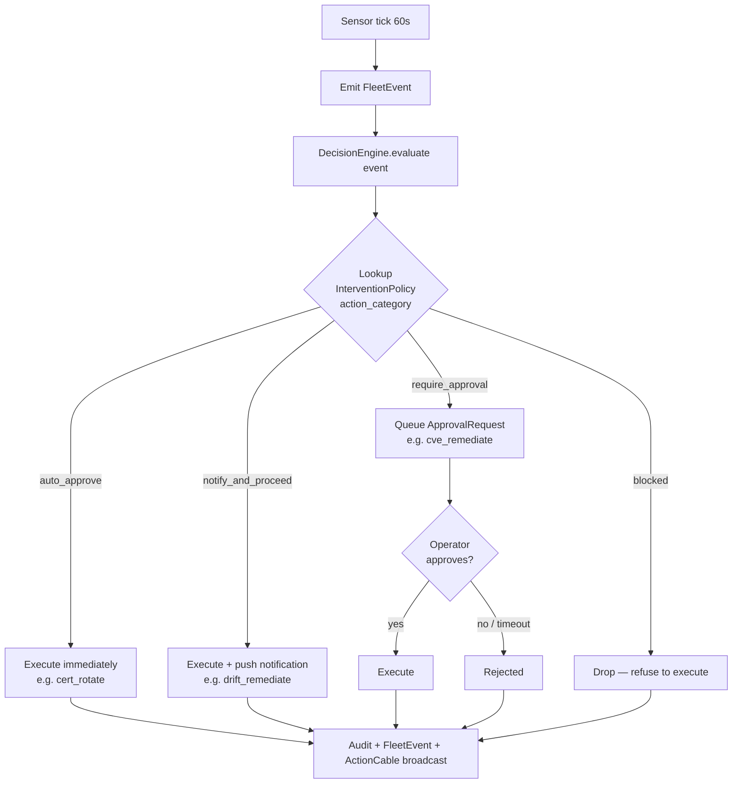

# Fleet Sensors — System Extension Reference

> Status: active

The `fleet/sensors/` directory at `extensions/system/server/app/services/system/fleet/sensors/` holds **32 files**: one `BaseSensor` abstract class and **31 sensors registered** for the live tick loop via `FleetAutonomyService::SENSORS`. (A further 2 CVE sensors live under `cve_ops/sensors/` and are owned by the CVE Responder agent — see [its section](#cve-responder-agent-5-policies) — not part of this directory's count.) Each sensor inspects a slice of fleet state on a recurring tick, emits typed `FleetEvent` signals when thresholds trip, and feeds the autonomy `DecisionEngine` which gates remediation actions per intervention policy.

The 31 registered sensors, in `SENSORS` order: `StuckTaskBacklogSensor`, `InstanceStatusSensor`, `InstanceStateDriftSensor`, `ModuleDriftSensor`, `TemplateClosureDriftSensor`, `BootImageDriftSensor`, `CertificateExpirySensor`, `CertExpirySensor`, `ModulePromotionSensor`, `CapabilityGapSensor`, `ConfigDriftSensor`, `SloViolationSensor`, `HoneypotAccessSensor`, `TradingPressureSensor`, `SdwanDriftSensor`, `SdwanReachabilitySensor`, `SdwanBgpSessionHealthSensor`, `SdwanVipReachabilitySensor`, `GitopsDriftSensor`, `ProjectSloSensor`, `FederationPeerLivenessSensor`, `PackageDriftSensor`, `SdwanCredentialExpirySensor`, `StorageAssignmentDriftSensor`, `DiskImagePublicationFailureStreakSensor`, `SdwanServiceHealthSensor`, `SdwanOvnDeploymentHealthSensor`, `SdwanApplyHealthSensor`, `SdwanUserDeviceConfigStalenessSensor`, `ModuleVerifyFailedSensor`, `BootLkgArmSensor`. (`PackageDriftSensor`, `SdwanCredentialExpirySensor`, and `StorageAssignmentDriftSensor` were dead code until audit F3-07 registered them — they previously appeared here as "running via separate invocation paths", which was never true. `TemplateClosureDriftSensor` (campaign 019f6084 §2.4.3), `CapabilityGapSensor` (IMP-4019664a524b), `DiskImagePublicationFailureStreakSensor` (disk-image-CI restoration DK3), `SdwanServiceHealthSensor` (IMP-c7d663f24a0b), `SdwanOvnDeploymentHealthSensor` (IMP-57e9a90598ee), `SdwanApplyHealthSensor` (IMP-da1b772c2596), `SdwanUserDeviceConfigStalenessSensor` (IMP-7034199a5a19), and `BootLkgArmSensor` (IMP-a8f9fa74284d) were registered later still — all are now in `SENSORS`, so no sensor in this directory currently runs outside it.)

Every sensor above except one reads **infrastructure** — is the node up, is the tunnel up, is the cert fresh. `SdwanServiceHealthSensor` is the first to read a **workload**: whether the thing at the end of a published service's overlay path is actually serving. That distinction is the platform-wide gap recorded in `docs/operations/autonomous-infrastructure-readiness-2026-08-12.md`, and this sensor closes it for `Sdwan::Service` only — deployed app code and containers remain unsensed.

## Architecture (one-paragraph summary)

The Fleet Autonomy reconciler runs every 60s (configurable via `autonomy_config.interval_seconds` on the Fleet Autonomy agent; with the 2026-05-10 7-agent split, CVE / SDWAN / Disk Image / Runtime Manager agents each carry their own `interval_seconds` for their respective scopes). Each tick:

1. The 30 sensors in `FleetAutonomyService::SENSORS` run in series (cheap; per-sensor work is bounded by the data it inspects).
2. Each sensor emits zero or more `FleetEvent` signals with `kind`, `severity`, `payload`, `correlation_id`
3. The DecisionEngine maps signals → action categories → intervention policy lookup
4. Policy = `auto_approve` → executor runs immediately
5. Policy = `notify_and_proceed` → executor runs + operator notified
6. Policy = `require_approval` → ApprovalRequest queued; executor blocked until operator clicks Approve


Every sensor in this directory is now registered in `FleetAutonomyService::SENSORS` — the asterisked "not yet registered" convention this diagram used to carry no longer applies to any node (see the F3-07 / campaign 019f6084 / IMP-4019664a524b / DK3 note above). `capability_gap`, `disk_image_publication_failure_streak`, `sdwan_service_health`, and `sdwan_ovn_deployment_health` are advisory/observational (no auto-remediation executor); `template_closure_apply` is Fleet Autonomy's remediation for `template_closure_drift`.

## Sensor Reference

### `stuck_task_backlog_sensor` — System task backlog staleness

**Source:** `stuck_task_backlog_sensor.rb`
**Watches:** `System::Task` rows older than the default 72-hour threshold, grouped by status (`pending`/`scheduled`/`running`), detecting stalled janitor work.
**Threshold:** Any non-terminal task older than 72 hours (configurable via `SYSTEM_TASK_BACKLOG_STUCK_SECONDS` env var or per-account) → `system.task_backlog_stuck` signal. Severity escalates from `:medium` to `:high` at 7 days, then to `:critical` at 14 days or 20+ stuck tasks.
**Signals:** `system.task_backlog_stuck` (severity `:medium` | `:high` | `:critical`)
**Recommended remediation:** None automated, deliberately. The sensor detects a broken janitor (scope issue, crashed worker, revoked permission, disabled cron) via **outcome** not self-report — a reaper that cannot see its subjects reports zero work, indistinguishable from genuine completion. Re-serving work never fixes the mechanism. Surfaces via the `system.observation` gate (Fleet Autonomy `auto_approve`, no operator notification). Listed in `RemediationValidator::NON_REMEDIATING_ACTION_CATEGORIES`.

### `instance_status_sensor` — Heartbeat liveness

**Source:** `instance_status_sensor.rb`
**Watches:** `System::NodeInstance.last_heartbeat_at`
**Threshold:** Configurable per-template; default 5 minutes silent → `instance_silent` signal
**Signals:** `instance.silent`, `instance.recovered`
**Recommended remediation:** `attribute_failure` (skill) for diagnostics, then operator-initiated reprovision.

### `module_drift_sensor` — Module config drift

**Source:** `module_drift_sensor.rb`
**Watches:** `NodeInstance.running_module_digests` vs assigned module digests
**Threshold:** Any digest mismatch → `module_drift` signal
**Signals:** `module.drift_detected`, `module.drift_resolved`
**Recommended remediation:** `drift_remediate` skill (Fleet Autonomy auto-runs with `notify_and_proceed`).

### `boot_image_drift_sensor` — Boot-image freshness drift

**Source:** `boot_image_drift_sensor.rb` (campaign 019f505f — Smooth Boot-Image Upgrades)
**Watches:** each running `NodeInstance`'s reported `booted_image_git_sha` (from the agent heartbeat) vs its platform's promoted `NodePlatform.disk_image_git_sha`
**Threshold:** both known and differing → one `system.boot_image_drift` signal per drifted instance, deduped by `boot_image_drift:<instance_id>:<promoted_sha>` (a new promotion re-notifies)
**Signals:** `system.boot_image_drift` (severity `:medium`), deduped per instance
**Recommended remediation:** none in increment 1 — bound **observation-only** in `DecisionEngine` (`skill: nil`, `action_category: "system.observation"`). That category is `auto_approve` and creates **no** `RemediationOutcome` (`RemediationValidator#record_proceeded!` skips `system.observation`), so a persistent drift fingerprint is surfaced (`system_drift_report` MCP action, `NodeInstanceSerializer#boot_image_drifted`, the signal stream) **without** a node action, an operator notification, or a false `fleet.remediation_stuck` escalation. Increment 4 rebinds it to the drift-driven rollout executor. Netboot / non-UKI (rpi4) nodes report no booted sha and are excluded (empty = unknown, never drift).

### `module_promotion_sensor` — Promotion-ready modules

**Source:** `module_promotion_sensor.rb`
**Watches:** `NodeModuleVersion.promotion_state` — each tick re-reads the rows *currently* at `staging` (`.where(promotion_state: "staging")`, account-scoped). It is level-triggered on present state and keeps no memory between ticks, so it cannot see an edge or measure how long a row has sat there.
**Threshold:** `System::Fleet::PromotionCriteria.evaluate` — at least `REQUIRED_COUNT` (default 3) `NodeInstance`s at `status: "running"` reporting this version's exact `oci_digest` in `running_module_digests`, plus a dwell of at least `DWELL_TIME` (default 30 minutes). Both are overridable per-module → per-account → per-site (`module_promotion_required_count`, `module_promotion_dwell_minutes`). There is no elapsed-time-in-`staging` gate: `PromotionCriteria` never reads `staging_baked_at`, the only column recording when a version entered `staging`.
**Signals:** `system.module_promotion_ready`, severity `:medium`, fingerprint `promotion_ready:<version_id>` — the only kind this sensor emits, and only for versions that already pass the criteria above. There is no counterpart signal for a version that is stuck.
**Inert by default — nothing automated puts a row in this sensor's scope.** One reason it has no input, and a second reason it would rarely fire even given one. (How long it has actually been inert is a question about your data, not about the code; the claims below are about the code.)
1. *No automated path leaves a version resting at `staging`.* Ingest lands versions at `built` — explicitly in `ManifestImportService` and `AgentModuleCommitService`, and by the `promotion_state` column default in the other publication paths (`ModulePublicationProcessor`, `ModuleVersionService`, `ModulePublicationsController`). The auto-generated-package path writes `blessed` outright (`PackageBuildWebhookService#create_version`), and account bootstrap writes `live`. The ladder itself moves only through `NodeModuleVersion#promote_to!`, whose four call sites are the module versions panel, `POST /api/v1/system/node_module_versions/:id/promote`, `system_promote_module_version`, and `DecisionEngine#apply_module_promotion` — and that last, the only automated one, targets `blessed`, so it *consumes* this sensor's output rather than producing its input. (One further writer exists and is worth knowing about: `db/seeds/example_custom_module.rb` walks a version `staging → blessed → live` in a single loop, but it is a hand-run example seed no orchestrator invokes, and it does not leave the row at `staging`.) Unless somebody hand-stages a version, the scope is empty and the sensor emits nothing. Whether the promotion ladder *should* be wired to an automated stager is an open question owned by **IMP-c7d618b0b72f**; do not read an answer into this block.
2. *The dwell anchor ages only while an instance is silent.* `PromotionCriteria` has no per-version "first seen running" timestamp yet — its own source calls `last_heartbeat_at` a stand-in until one exists — so it uses `min(last_heartbeat_at)` across the qualifying instances as a dwell proxy (instances with no heartbeat at all are skipped, not treated as infinitely stale). Clearing the 30-minute default therefore requires the *stalest* qualifying instance to have gone quiet for 30 minutes while still carrying `status: "running"` — ten times `InstanceStatusSensor::SILENT_THRESHOLD` (3 minutes), the age at which the platform already treats that instance as a fault and raises `system.instance_silent`. So a fleet that is heartbeating normally never clears the default bar, and one that does clear it does so on the strength of instances the platform is concurrently calling silent. Setting `module_promotion_dwell_minutes` to `0` removes the bar.

**Recommended remediation:** promotion to `blessed`, approval-gated — `system.module_promotion_ready` is bound in `DecisionEngine::SIGNAL_BINDINGS` to the `system.module_promote_to_live` category, applied by `DecisionEngine#apply_module_promotion` (which re-checks the version is still `staging`) via `ModulePromotionService.promote!`. An operator can do the same by hand in the UI or with `system_promote_module_version`. **Either way this advances `promotion_state` only — it does not change which version the fleet serves.** The node-facing download resolves `NodeModule#current_version_id` (`NodeApi::ModulesController#download` reads `@module.current_version&.artifact`), and nothing in the promotion path writes that pointer. To put this version on the fleet, repoint it as well: `system_rollback_module_version({ module_id, version_id })` moves `current_version_id` forward as well as back, and refuses a target with no mountable artifact. `system_list_module_versions` marks the served row `current: true`.

### `certificate_expiry_sensor` — TLS cert expiration

**Source:** `certificate_expiry_sensor.rb`
**Watches:** `NodeCertificate.not_after` (mTLS instance certs from `InternalCaService`)
**Threshold:** Cert expires within 14 days → `cert_expiring` signal; expired → `cert_expired` signal
**Signals:** `cert.expiring`, `cert.expired`, `cert.rotated`
**Recommended remediation:** Auto-rotate via `system.cert_rotate` action (Fleet Autonomy `auto_approve` policy). 90-day default lifetime.

### `config_drift_sensor` — On-node config drift

**Source:** `config_drift_sensor.rb`
**Watches:** Agent-reported config hash vs platform-computed config hash
**Threshold:** Hash mismatch → `config_drift` signal
**Signals:** `config.drift_detected`, `config.drift_resolved`
**Recommended remediation:** `drift_remediate` skill (same as module drift).

### `sdwan_reachability_sensor` — Hub reachability

**Source:** `sdwan_reachability_sensor.rb`
**Watches:** active `Sdwan::Network` rows — one signal per NETWORK, not per peer. Reads both the presence of publicly-reachable hub peers and `Sdwan::Peer.last_handshake_at` across **all** peers in the network, not just hubs.
**Threshold:** two independent arms, each with its own fingerprint:
- *no hub configured* (`sdwan_no_hub:<network_id>`, always `critical`) — the network has peers but none publicly reachable, so it cannot form tunnels at all.
- *no recent handshake* (`sdwan_hub_unreachable:<network_id>`) — at least one hub exists, but no peer has handshaken within `REACHABILITY_WINDOW` (**10 minutes**). `critical` with a single hub (nothing to fail over to), `high` with two or more.

**Exemptions — deliberate silence, not a broken sensor:**
- `topology_strategy: "full_mesh"` networks are legitimately hubless.
- A network with **zero peers** never signals: nothing is stranded on it, and the failover remediation would have no candidate hubs and no spokes to move.

**Signals:** `system.sdwan_hub_unreachable` (both arms). There is **no** `hub_recovered` signal — recovery is the fingerprint's absence on a later tick.
**Recommended remediation:** `system.sdwan_failover` — approval-gated. The executor's dry run returns the candidate-hub promotion plan; the operator promotes.

### `sdwan_drift_sensor` — Topology drift

**Source:** `sdwan_drift_sensor.rb`
**Watches:** Agent-reported wg interface state vs platform desired config
**Threshold:** Interface missing or wrong AllowedIPs → `sdwan.peer_drift` signal
**Signals:** `sdwan.peer_drift_detected`, `sdwan.peer_drift_resolved`
**Recommended remediation:** `sdwan_peer_remediate` skill — rotate keys + force tunnel re-establish.

### `sdwan_bgp_session_health_sensor` — iBGP session health

**Source:** `sdwan_bgp_session_health_sensor.rb`
**Watches:** `Sdwan::BgpSession.state` (Idle/Connect/Active/OpenSent/OpenConfirm/Established)
**Threshold:** Session non-Established for >10 minutes → `sdwan.bgp_unhealthy` signal
**Signals:** `sdwan.bgp_unhealthy`, `sdwan.bgp_recovered`
**Recommended remediation:** `sdwan_bgp_session_remediate` skill (planning-only; operator runs `vtysh` recommendation).

### `sdwan_vip_reachability_sensor` — VIP holder health

**Source:** `sdwan_vip_reachability_sensor.rb`
**Watches:** `Sdwan::VirtualIp.holder_peer_ids` against peer handshake health
**Threshold:** Single-holder VIP's holder is silent → `sdwan.vip_holder_silent` signal
**Signals:** `sdwan.vip_holder_silent`, `sdwan.vip_holder_recovered`
**Recommended remediation:** `sdwan_vip_failover` skill — promotes the next failover candidate.

### `honeypot_access_sensor` — Canary module access

**Source:** `honeypot_access_sensor.rb`
**Watches:** `CanaryModuleService` access logs on canary modules placed in the catalog
**Threshold:** Any access attempt → `honeypot.access` signal (high severity)
**Signals:** `honeypot.access_attempted`, `honeypot.access_blocked`
**Recommended remediation:** None automated — escalates to operator + governance pipeline.

### `slo_violation_sensor` — SLO breach detection

**Source:** `slo_violation_sensor.rb`
**Watches:** `Slo::Definition` rolling-window metrics
**Threshold:** SLO breach → `slo.violated` signal
**Signals:** `slo.violated`, `slo.recovered`
**Recommended remediation:** None automated — surfaces in operator dashboard for manual investigation.

### `trading_pressure_sensor` — Cross-domain coordination

**Source:** `trading_pressure_sensor.rb` (class `TradingPressureSensor`)
**Watches:** Stigmergic pressure signals emitted by sibling extensions on the platform-wide signal bus
**Threshold:** Aggregate external pressure ≥1.0 → one aggregated signal (severity scales with aggregate strength)
**Signals:** `system.trading_pressure_observed` (the `trading_` prefix predates the cross-domain generalization)
**Recommended remediation:** Internal — no executor; observe-only. The DecisionEngine binds it to `system.observation` (auto_approve): it is recorded in the FleetEvent audit trail but reaches no operator and triggers no action. (A consume-side `TradingAwareThrottle` that would have deferred non-critical fleet actions was planned but never wired into `gate_action!`, and was deleted as dead scaffolding after the trading integration was descoped — IMP-86be386ac485.)
**Naming:** The `Trading*` class + signal names predate the cross-domain generalization — the sensor already consumes any sibling extension's pressure feed. A rename to a neutral `ExternalPressureSensor` name is contemplated but not in scope today.

### `instance_state_drift_sensor` — DB↔provider truth divergence

**Source:** `instance_state_drift_sensor.rb`
**Watches:** `NodeInstance` rows whose model status disagrees with provider truth (e.g., DB says `running`, provider says `stopped`).
**Threshold:** Any mismatch outside the in-flight task window → `system.instance_state_drift` signal
**Signals:** `system.instance_state_drift`
**Recommended remediation:** Reconcile — operator-acknowledged correction or `notify_and_proceed` reassertion.

### `gitops_drift_sensor` — Fleet.yaml vs effective fleet divergence

**Source:** `gitops_drift_sensor.rb` (Phase 6c GitOps reconciler integration)
**Watches:** `fleet.yaml`-declared state vs effective fleet (assignments / templates / instances).
**Threshold:** Diff present → `gitops.drift_detected` signal with the proposal payload
**Signals:** `gitops.drift_detected`, `gitops.drift_resolved`
**Recommended remediation:** `Gitops::ApplyService` proposes a reconcile change via `Ai::AgentProposal` (operator approval required for apply).

### `package_drift_sensor` — Package repository freshness

**Source:** `package_drift_sensor.rb`
**Watches:** PackageRepository freshness windows + drift between manifests and registered NodeModules.
**Threshold:** Stale repository sync OR manifest divergence → `system.package_drift_pressure` signal
**Signals:** `system.package_drift_pressure`
**Recommended remediation:** `package_repository_sync` or `package_module_refresh` (Fleet Autonomy `auto_approve` for sync, `notify_and_proceed` for refresh).

### `project_slo_sensor` — Project-scoped SLO monitoring

**Source:** `project_slo_sensor.rb`
**Watches:** Project-scoped rolling-window metrics (latency, error rate, cost guardrail, SDWAN throughput), read from `System::ProjectMetric` rows written each tick by `System::ProjectMetricsCollector`.
**Threshold:** Per-project SLO breach OR cost guardrail trip → typed signal (`project.slo_violation`, `project.drift`, `project.cost_breach`).
**Signals:** `project.slo_violation`, `project.drift`, `project.cost_breach`
**Recommended remediation:** None automated — feeds the project dashboard for operator review.

**Operator-declared targets** live on the mission's `configuration["slo_targets"]`:

| Key | Metric | Default |
|---|---|---|
| `availability_pct` | `availability_pct` | 99.5 |
| `p99_latency_ms` | `p99_latency_ms` | 250 (or `brief.latency_targets_ms.p99`) |
| `cost_ceiling_usd` | `cost_usd_mtd` | none — declared-only (falls back to `brief.budget_cap_usd_monthly`) |
| `min_throughput_bytes_per_s` | `sdwan_throughput_bytes_per_s` | **none — declared-only** |

`min_throughput_bytes_per_s` (IMP-25e75f960dee) is a FLOOR on the mission's aggregate SDWAN fabric activity: the sum over the peers of the mission's provisioned instances of `(rx_bytes + tx_bytes)` divided by each peer's own observation interval (`counters_sampled_at`, stamped server-side at heartbeat receipt), from the per-peer WireGuard counters the node agent reports. Both directions of every endpoint are counted, so traffic between two of the mission's own instances contributes four times — it measures fabric activity, not distinct payload bytes. Declare it against that definition.

Two properties are deliberate and worth knowing before you rely on it:

- **It is declared-only.** With no `min_throughput_bytes_per_s` the check never runs, so adding the metric changed no existing mission's behaviour.
- **It goes dark rather than guess.** The counters are nullable, and NULL (never measured) is kept distinct from a measured 0 (tunnel up, idle) at every step. If any peer of the mission's instances fails to yield a measurable interval in a tick — never reported, stalled heartbeat, no baseline yet — the sample is published as `unavailable` (`observed: nil`) with `peer_count` / `rated_peer_count` recorded, rather than as a partial sum. A partial sum can only understate, and a floor fires on `observed < target`, so publishing one could only ever fabricate a breach.

### `sdwan_credential_expiry_sensor` — SDWAN material expiry watch

**Source:** `sdwan_credential_expiry_sensor.rb`
**Watches:** Live `Sdwan::MembershipCredential` rows approaching `not_after` (15-minute advisory / 5-minute urgent windows), plus MCs whose refresh window passed with no superseding revision.
**Threshold:** Per-MC advisory/urgent windows → `system.sdwan_credential_expiring`; stalled refresh → `system.sdwan_credential_refresh_stalled`
**Signals:** `system.sdwan_credential_expiring`, `system.sdwan_credential_refresh_stalled`
**Recommended remediation:** `sdwan_credential_refresh` (`system.sdwan_credential_refresh`, `notify_and_proceed`) — a server-side MC re-issue that never touches the WireGuard keypair (IMP-df40782d3f4d; the earlier `sdwan_key_rotate` binding revoked the active key and cut the working tunnel of the not-polling peer). Stalled refresh routes to `system.observation`.

### `storage_assignment_drift_sensor` — Storage assignment freshness

**Source:** `storage_assignment_drift_sensor.rb`
**Watches:** Volume / NFS export assignment freshness; 5-minute stale window.
**Threshold:** Stale assignment data → `system.storage_assignment_drift` signal
**Signals:** `system.storage_assignment_drift`
**Recommended remediation:** `attach_storage` / `detach_storage` (operator-approved).

### `capability_gap_sensor` — Unprovided capability requirements

**Source:** `capability_gap_sensor.rb`
**Watches:** Every account module's `manifest_yaml` `dependencies.requires` for `capability:<tag>[@<constraint>]` entries, resolved against the fleet's providers via `System::CapabilityResolver` (the same resolution `ManifestImportService` performs at import — a bare provider tag does **not** satisfy a versioned constraint). Recomputed from live state each tick, so a gap self-heals the moment a providing module publishes.
**Threshold:** Any requirement with no satisfying provider on the account → `system.capability_gap` signal (severity `medium`), fingerprinted per module-and-requirement.
**Signals:** `system.capability_gap`
**Recommended remediation:** None automated — bound **advisory** in `DecisionEngine` (`skill: nil`, `advisory: true`, `action_category: "system.capability_gap_review"`, no `REMEDIATION_APPLIERS` entry). That category is `require_approval`, so the gap lands in the operator approval queue and stops there: closing a gap means **authoring a module**, which must pass the R1/R2/R3 reuse gate in [`runbooks/module-authoring.md`](./runbooks/module-authoring.md) Phase 0. Approving the request is an acknowledgement, not an authorization to author — `execute_approved!` reports `applied: false` (`no applier`).

Three properties follow from the `advisory` flag, each of which was a real defect before it existed:

- **Out of the validate arc.** `require_approval` keeps `#decide` at `:pending`, which `RemediationValidator#record_proceeded!` never snapshots — so a gap standing until someone ships a module cannot accumulate ineffective outcomes or trip a false `fleet.remediation_stuck` escalation.
- **No consent-budget consumption.** `gate_action!` normally consumes a module's per-day consent budget before resolving policy, keyed off `module_id` — which this signal carries (the *requiring* module). An advisory decision is exempt; otherwise a standing gap re-deciding every dedup TTL would drain that module's operator-set ceiling with a no-op and force its real remediations (`module_drift`, `config_drift`, promotion) down the budget-exhausted branch.
- **One standing request until a human answers.** Advisory dedup (on the signal fingerprint, which the sensor scopes per module-and-requirement) matches **settled** requests at any age, not just pending ones — so an operator's approval is a durable acknowledgement and their rejection a durable dismissal, instead of the gap re-asking every dedup TTL. Ordinary categories keep re-mint-on-recurrence, and a changed requirement changes the fingerprint and legitimately mints a new request.
- **A clock is not an operator.** The fleet approval chain's `timeout_action` is `reject` at 4h, so an unattended overnight gap would otherwise be auto-rejected and — being settled — silently buried, which is the original "never reaches anyone" defect by another route. Two things prevent it: an advisory request is minted with **no `expires_at`**, which is invisible to both expiry sweeps (this extension's `expire_stale_approvals!` and core's account-wide `Ai::Autonomy::ApprovalWorkflowService#expire_overdue!`, driven by the `AiApprovalExpiryJob` cron) and to `check_expiration!` itself; and durable suppression additionally **requires a real `Ai::ApprovalDecision` row**, which only `record_decision!` writes. A timeout-settled request therefore falls back to the ordinary rejection cooldown and re-mints.

### `template_closure_drift_sensor` — Template closure drift

**Source:** `template_closure_drift_sensor.rb` (campaign 019f6084 §2.4.3)
**Watches:** Each provisioned `NodeInstance`'s template's CURRENT resolved module closure (`TemplateExpansionService`) vs what is actually assigned to the node (`NodeModuleAssignment`). Closes a gap `ModuleDriftSensor` can never see: that sensor only diffs a running instance's reported digests against its already-assigned modules — it never re-resolves the template, so a template mutation after provisioning (a new `TemplateModule`, or a new `requires` edge on an existing one) is otherwise invisible to the fleet forever.
**Threshold:** Any module in the resolved closure missing from the node's assignments → `system.template_closure_drift` signal, fingerprinted per instance
**Signals:** `system.template_closure_drift` (severity `:medium`)
**Recommended remediation:** `system.template_closure_apply` gate — `TemplateApplyService#apply!` + a `sync_modules` task, or a rolling-reprovision flag for pivot-booted instances whose composed union is boot-time-fixed. `TemplateApprovalPolicy` pins the disposition to `require_approval` regardless of the seeded default: the sensor only ever fires for an instance that already exists on the template, so this is always a manifest change about to propagate to live fleet.

### `federation_peer_liveness_sensor` — Federation peer liveness

**Source:** `federation_peer_liveness_sensor.rb` (Phase 3c — Decentralized Federation §C + P3.5/P3.6)
**Watches:** Platform-kind `System::FederationPeer` rows for stale heartbeats (the same `heartbeat_stale` scope `HeartbeatSweepService` uses) and for a bound federation `node_certificate` approaching or past `not_after` (queried directly, mirroring `CertificateExpirySensor`'s pattern, rather than running the full account-wide `FederationGovernance` scan every tick).
**Threshold:** No heartbeat within `HEARTBEAT_STALE_AFTER` (5 minutes) → heartbeat-stale signal; cert within `CERT_WARN_WINDOW` (30 days, matching `Sdwan::FederationGovernance::CERT_EXPIRY_WARN_DAYS`) of expiry, or already past it → expiring/expired signal
**Signals:** `system.federation_peer_liveness` — one signal kind carrying `payload.reason` (`heartbeat_stale` | `cert_expiring` | `cert_expired`). Severity: `:high` for `cert_expired` and heartbeat-stale on an `active` peer (was carrying live traffic); `:medium` for `cert_expiring` and heartbeat-stale on an `enrolled` peer (never fully came up).
**Recommended remediation:** `federation_peer_remediate` skill (Fleet Autonomy `notify_and_proceed`) — the executor branches on `payload.reason`.

### `disk_image_publication_failure_streak_sensor` — CI publication failure streak

**Source:** `disk_image_publication_failure_streak_sensor.rb` (DK3 of the disk-image-CI restoration)
**Watches:** Each account `NodePlatform`'s most recent `disk_image_publications` (excluding `retired`/`purged` rows) for a run of consecutive `failed` builds. A single success anywhere in the lookback window breaks the streak.
**Threshold:** The most recent `streak_threshold` publications (default 3; account-configurable via `Account#settings["disk_image_failure_streak_threshold"]`, clamped 1..20) are ALL `failed` → signal, fingerprinted per platform
**Signals:** `system.disk_image_publication_failure_streak` (severity `:high`)
**Recommended remediation:** None automated — a broken CI pipeline needs an operator to read the build logs, not a retry. Surfaces via the `system.disk_image_publication_investigate` gate (Fleet Autonomy `notify_and_proceed`) — seeded on Fleet Autonomy rather than Disk Image Manager because the sensor fires from `FleetAutonomyService::SENSORS`, the only sensor tick that runs today; a dedicated Disk Image Manager tick is a noted follow-up.

### `sdwan_service_health_sensor` — Published-service silence + orphaned DNAT

**Source:** `sdwan_service_health_sensor.rb` (IMP-c7d663f24a0b) — the only sensor here that reads a workload rather than infrastructure.
**Watches:** Two independent things, gated independently.

1. Each active `Sdwan::Service`, by correlating already-ingested `Sdwan::FlowSample` IPFIX rows (written by `Sdwan::IpfixIngestService`, which until now had **zero** consumers) against the service's `backend_address` + `backend_port`. Correlation is on the Postgres `inet` column, so a non-canonical operator-entered VIP still matches.
2. Each enabled `Sdwan::PortMapping`, for a `resolved_target_address` that no longer resolves — the compiler silently skips such a rule, so a DNAT can sit enabled and dead indefinitely.

**Threshold:** Flow window 15 min, holder-handshake freshness 5 min (matching `SdwanVipReachabilitySensor::UNREACHABLE_WINDOW`), new-service grace 15 min. All three are DB-driven — `Account#settings["sdwan_service_health_<name>"]` first, then the deployment-wide `SiteSetting` `system.sdwan.service_health.<name>`, then the constant. Names: `flow_window_seconds`, `handshake_fresh_seconds`, `service_grace_seconds`.
**Signals:** `system.sdwan_service_silent` (`:high` when the service is actually exposed and was previously observed serving, else `:medium`), `system.sdwan_portmap_orphaned` (`:medium`). Orphans are itemised up to `MAX_ORPHANS_PER_TICK` (50) with a single summarising tail signal for the remainder — draining one hub strands every DNAT rule behind it at once, and this half runs on every account.
**Read model:** Stamps `system_sdwan_services.health_state` (`unknown` | `serving` | `silent` | `unobservable`) and `last_observed_flow_at`. The sweep stamps on EVERY tick, including telemetry-dead ones, so a `serving` can never outlive the telemetry that justified it; a disabled service is swept back to `unknown` rather than sitting in `Service.silent` forever. Nothing serialises these columns to an API or UI yet — the operator-facing surface is the signal, not the column.

**Three guards that are the point of the sensor, not incidental:**

- **No double-alarming.** `sdwan_service_silent` fires only when traffic is absent **AND** the backend VIP's holder peer handshook recently. Absent traffic on its own is what an overlay outage looks like, and `SdwanVipReachabilitySensor` already owns that alarm; requiring a fresh handshake narrows this signal to the case no other sensor covers — **pipe up, app down**. A service backed by a static `backend_host` has no holder to interrogate and therefore never emits: it can be marked `serving`, never `silent`.
- **Absence of telemetry is not evidence of silence, and coverage is per-service.** The silence claim requires an active `Sdwan::IpfixCollector` **and** evidence that this service's own VIP holder appeared in the flow record inside the window. An account-wide "some sample arrived" test would defend only the all-collectors-down case: with two sites, site B's exporter dying while site A keeps delivering leaves an account-wide check true and alarms every site-B service. Coverage is scoped to the holders rather than the network prefix because `IpfixCollector` carries no site association and `VirtualIp#cidr` is validated for format only, never for containment in its network's `cidr_64` — a prefix test would rest on an invariant nothing enforces.
- **A backend that cannot be correlated is `unobservable`, not `unknown`.** `backend_host` is free text, so a hostname is an ordinary value; compared against the `inet`-typed `dst_ip` it raises `PG::InvalidTextRepresentation` rather than missing quietly. Since `FleetAutonomyService` rescues per sensor, that raise would mark this sensor failed and discard **all** its signals — orphans included — on every tick for the whole account. Every value reaching an address comparison is parsed first, and a permanently uncorrelatable backend gets its own state so it cannot hide inside the transient one.
- The orphan half is **not** subject to the telemetry gate: it reads only DNAT rows and their targets, and collectors are optional operator-run sidecars, so gating it would leave it inert on most accounts.

**Recommended remediation:** None automated, deliberately. This signal's precondition is that the overlay is healthy, so every existing `sdwan_*` executor (peer remediate, VIP failover, key rotate) would act on plumbing the signal has just proven fine. Surfaces via the `system.sdwan_service_health_investigate` gate (Fleet Autonomy `notify_and_proceed`) — seeded on Fleet Autonomy, not SDWAN Manager, for the mechanical reason `gate_action!` resolves policies with `where(ai_agent_id: agent.id)` against the agent running the tick. The category is also listed in `RemediationValidator::NON_REMEDIATING_ACTION_CATEGORIES`: a lane that never acts must stay out of the validate arc, or its pending outcome scores ineffective every settle window until F3-11 manufactures a false `fleet.remediation_stuck` escalation.

### `sdwan_ovn_deployment_health_sensor` — OVN deployment degraded / activation stalled

**Source:** `sdwan_ovn_deployment_health_sensor.rb` (IMP-57e9a90598ee).

**Watches:** the account's `Sdwan::OvnDeployment` lifecycle state plus its `nb_observed` observation record (the failing-source map written by `Sdwan::Ovn::DeploymentReconciler` at heartbeat ingest). The sensor is strictly read-side: the RECONCILER owns every transition, because transitions must trace to a heartbeat observation (a chassis NB replay report, or the control-plane `NbProbe`'s OVSDB `list_dbs` verdict) — a tick-driven transition would be a "timer elapsed" pseudo-oracle.

**Signals:**

- `system.sdwan_ovn_deployment_degraded` (high) — a measured negative stands unresolved. Payload carries the failing map: which chassis (or the probe) measured what, and when.
- `system.sdwan_ovn_activation_stalled` (medium) — the deployment has sat in `pending`/`bootstrapping` past the grace window. Payload `reason` names the missing precondition and therefore its owner: `endpoints_missing` (operator must assert NB/SB endpoints), `no_heavyweight_chassis` (operator must promote a host — see `system_update_instance` `network_profile`), `replay_failing` (the NB DB or the chassis path), `not_observed` (nothing measurable yet — e.g. an `ssl:` endpoint the probe cannot speak and no chassis replay yet).

**Threshold:** stall grace 30 min. DB-driven — `Account#settings["sdwan_ovn_stall_after_seconds"]`, then SiteSetting `system.sdwan.ovn.stall_after_seconds`, then the constant. The probe's knobs live in the same family (`sdwan_ovn_probe_timeout_seconds` / `sdwan_ovn_probe_interval_seconds`).

**"Degraded, but every chassis looks healthy" — read this before chasing the chassis.**
The control-plane `NbProbe` is a SECOND measurement source alongside chassis
replays, and its negative is real: it means *this Rails host* could not reach the
NB endpoint. That is not the same as the fabric being broken. On a control plane
with default-deny egress, or where the NB endpoint is an SDWAN overlay address
the control plane has no route to, the probe fails **by design** while every
consumer chassis applies its plan fine — and because a steady-state fleet
cache-hits (an unchanged plan replays from the agent's cache, executing nothing),
no fresh chassis positive arrives to supersede the probe's negative. The
deployment then sits `degraded` indefinitely.

The remedy is to stop probing an endpoint this host was never meant to reach:
add its range to SiteSetting `system.sdwan.ovn.probe_denied_cidrs`. A denied
target is reported as **not-measured**, never as failed — the platform records
that it refused to look rather than inventing a verdict. Do NOT instead widen the
control plane's egress just to satisfy the probe.

**Recommended remediation:** None automated, and none possible: the degraded component is the operator's own OVN control plane (ovn-northd and the NB/SB OVSDB servers), which the platform does not provision. Surfaces via the `system.sdwan_ovn_deployment_investigate` gate (Fleet Autonomy `notify_and_proceed`, same seeding rationale as `sdwan_service_health_investigate` above), and the category is listed in `RemediationValidator::NON_REMEDIATING_ACTION_CATEGORIES` for the same F3-11 reason.

### `sdwan_apply_health_sensor` — Agent-observed SDWAN apply failures

**Source:** `sdwan_apply_health_sensor.rb` (IMP-da1b772c2596). Ingest: `Sdwan::AgentApplyStateWriter`, called from the heartbeat (`node_api/status#heartbeat`).

**Watches:** the agent's own `sdwan_state` heartbeat block — one entry per WG interface, each carrying per-subsystem applier outcomes (`subsystem_states[]`: `subsystem`, `scope`, `state` `ok`/`error`, `message`, `observed_at`) plus `healthy_peers` and `last_reconcile_at`. Wire shape: `agent/internal/sdwan/state.go` (`HeartbeatStatus` / `SubsystemStatus`), produced by `Manager#HeartbeatStatuses`.

**Why it exists:** every other `sdwan_*` sensor scores the PLATFORM's work — the topology compiled, the config was served, the peer handshook. None can say whether the node's kernel ACCEPTED what it was handed. The agent has always reported that, and until this sensor nothing on the server read the key (a repo-wide grep for `sdwan_state` across both Rails trees returned zero hits), so a host whose nftables/vrf/bridge apply failed on every tick was indistinguishable from one that applied cleanly. "Served" was scored as "applied".

**Signals:**

- `system.sdwan_apply_failed` (high) — the agent reported a subsystem in state `error` that its own later success has not cleared. Fingerprint is per **(instance, subsystem, scope)**, which is the identity of one failing applier: a host-global subsystem is replayed under every network in the payload and must collapse to one signal (the network ids it was seen under ride the payload), while the same subsystem failing at two different scopes, or on two different hosts, stays two signals. Capped at 50 per tick with an honest "more than N" overflow signal — one bad agent build fails the same applier fleet-wide at once.
- `system.sdwan_apply_not_measured` (medium) — the platform expects this host to be applying SDWAN (it has a `Sdwan::Peer`, it is heartbeating) and there is NO usable apply observation for it. Payload `reasons` separates `never_reported`, `stale_report`, `no_networks`, `no_subsystem_observation` (an agent predating the per-subsystem reporting — a ROLLOUT fact, not a node fault), `stale_reconcile`, and `unrecognized_state`. ONE fingerprint per account, deliberately: the expected initial fleet state is "every node still runs an older agent", so a per-instance fingerprint would be a rollout-sized storm of one fact; the count and the named sample ride the payload, which changes without changing the fingerprint.

**ABSENCE IS NOT HEALTH — the oracle contract.** Three absences are kept distinguishable end to end, because collapsing any of them into a healthy-looking value is exactly the false green this lane exists to end: no `sdwan_state` key at all (nothing is written; the instance has no document), no `subsystem_states` (recorded as `subsystems_reported: false`, never "nothing failed"), and no `healthy_peers` (recorded as `healthy_peers_measured: false` with a nil value — NEVER defaulted to `0`, because the producer's pointer is nil precisely so a consumer can tell "we did not look" from a measured zero). A `state` string that is neither `ok` nor `error` becomes `unknown`, never `ok`. A host with zero desired networks emits no entries at all (the omitempty PAYLOAD-SHAPE LIMIT documented on `HeartbeatStatus`), so silence from such a host means "nothing observable here".

**FRESHNESS IS THE AGENT'S CLOCK, not the server's.** `Manager#HeartbeatStatuses` is a pure snapshot of stored state under a mutex — it neither runs a reconcile nor requires one to have run — and the heartbeat loop is a *different* loop from the `Reconcile` it invokes in `PostSend`. An agent whose reconcile has wedged therefore keeps shipping the SAME frozen block every 30s, which the server would re-stamp as freshly received on every tick. Staleness is keyed on the agent's own `last_reconcile_at` (written only at the END of a completed pass) — `stale_reconcile` — with the ingest stamp as a second, weaker bound (`stale_report`). Keying on the ingest clock alone would launder a six-hour-dead reconciler as current, and — if its last snapshot happened to be all-ok — as healthy. An `unrecognized_state` (a `state` string the platform does not know, which the writer records as `unknown` and never as `ok`) routes to the same not-measured lane rather than to silence: otherwise a producer that renames its error constant takes the whole fleet green on the next agent rollout.

**Threshold:** report freshness 15 min, live-heartbeat window 10 min (deliberately shorter, so `stale_reconcile` — not `stale_report` — is the staleness that bites). DB-driven — `Account#settings["sdwan_apply_health_report_fresh_seconds"]` / `..._live_heartbeat_seconds`, then SiteSetting `system.sdwan.apply_health.*`, then the constants. A node past the live-heartbeat window is SILENT, which is `instance_status_sensor`'s alarm; this sensor stays quiet rather than double-alarming on one cause.

**Recommended remediation:** None automated, and none possible. A failed apply is a kernel-side refusal (a missing module, an unsupported device type, an nft ruleset the host rejects) and the agent already retries it on every tick — re-serving the same config remediates nothing. Surfaces via the `system.sdwan_apply_investigate` gate (Fleet Autonomy `notify_and_proceed`, same seeding rationale as `sdwan_service_health_investigate` above), and the category is listed in `RemediationValidator::NON_REMEDIATING_ACTION_CATEGORIES` for the same F3-11 reason.

### `sdwan_user_device_config_staleness_sensor` — Issued user-device configs that predate a network change

**Source:** `sdwan_user_device_config_staleness_sensor.rb` (IMP-7034199a5a19).

**Watches:** for each SDWAN network, the newest change to the three surfaces `Sdwan::WgConfigRenderer#allowed_ips` folds into a user device's `AllowedIPs` — active/pending `Sdwan::VirtualIp`s, `Sdwan::Peer#lan_subnets` (via the peer row's `updated_at`), and the federated prefixes `Sdwan::FederationPrefixResolver` contributes — compared against each active device's `last_downloaded_at`.

**Why it exists:** `AllowedIPs` is a cryptographic routing filter, so a prefix absent from it is one the client OS never sends into the tunnel. IMP-94f3ec671b15 made the rendered filter complete **at issue time**. But a node peer re-pulls its view on every tick and converges, while a user device is **one-shot**: `BootstrapController#show` renders the config once and `UserDevice#mark_downloaded!` immediately makes the bootstrap URL `410 Gone`. Every VIP or federation prefix added afterwards is therefore missing from every config already in the field — unreachable, with no error on either end — and nothing compared the two clocks. The defect class the completeness fix repaired at issue time recurred continuously post-issue.

**Signals:**

- `system.sdwan_user_device_config_stale` (medium, high once the drift has stood past the escalation age) — one per **network**, not per device: a single VIP add makes every issued config on that network stale at the same instant, which is ONE fact, and the remediation (re-issue the network's devices) is naturally batched. The fingerprint is `(network_id, surface_changed_at)`, so a *later* mutation is a genuinely new fact and re-fires rather than being squelched by the dedup TTL. `changed_surfaces` names which of the three sources moved.

**THE THREE-STATE ORACLE.** `last_downloaded_at` carries three distinct facts and each gets its own payload field, because collapsing any two is the failure mode: `nil` is NEVER DOWNLOADED (`pending_download_count`) — no config was ever issued, so nothing can be stale, and it must read as neither infinitely stale (a SQL `<` on NULL, or a `.to_i` coercion to epoch 0) nor current; `>= surface_changed_at` is DOWNLOADED AND CURRENT (`current_device_count`); `< surface_changed_at` is DOWNLOADED AND STALE (`stale_devices`, capped at 25 with an explicit `stale_devices_truncated`). The three partitions are disjoint and total over the active set.

**"ACTIVE" IS NARROWER THAN THE COMPILED SET, ON PURPOSE.** `revoked_at IS NULL` **and** the `Sdwan::AccessGrant` is `active`. `UserDevice#downloadable?` gates re-issue on `access_grant.active?`, so notifying about a device under a suspended or revoked grant would propose an action the operator cannot take, on access they deliberately cut. `HubAndSpoke#hub_view` does not filter grant status; this sensor does. A reactivated grant re-enters the set on the next tick, so nothing is lost.

**WHY THE FEDERATION ARM IS ANCHORED ON `created_at`, AND WHY THE SETTLE WINDOW IS PER ARM.** `System::FederationPeer#record_heartbeat!` is a plain `update!`, so a live platform peer bumps `updated_at` every 60 seconds forever. Read the consequence carefully, because it is the opposite of the obvious one: **a perpetually-fresh stamp does not alarm, it MUTES.** Every stamp must clear the settle window to count, so an arm stuck at ~now never settles — and if the window were applied to the `max` rather than per arm, one churning arm would silence the other two and this sensor would go permanently dark on exactly the federated accounts it matters most for. Hence per-arm settling, and hence anchoring this arm on the `created_at` of the contributing peers, which covers the case the finding names (a federation peer added after download). The same trap is live on the peer arm: `SdwanPeerRemediateExecutor` deliberately writes `peer.update_columns(..., updated_at: Time.current)` on an autonomous lane, so a flapping peer moves that stamp every remediation — per-arm settling is what keeps it from silencing the rest. (On a *hub* that executor also calls `KeyDistributor.rotate!`, which genuinely does invalidate every issued config, so there the movement is correct rather than noise.)

**KNOWN OVER- AND UNDER-FIRES, all filed rather than guessed at.** *Over*: a `Sdwan::VirtualIp` failover writes `holder_peer_ids` and bumps `updated_at` without touching `cidr` — the only VIP field the renderer reads — so an automated failover can stale a network whose rendered surface did not move; and an edit to a contributing peer's `tags` or `capabilities` still counts (the peer arm is narrowed to *contributing* peers, which removes the routine case of enrolling a plain spoke, but not this one). *Under*: a federation prefix *value* edit, or a status transition *into* the contributing set, moves no `created_at`; and removals (a VIP leaving the rendered window, a peer deleted, a federation peer suspended) narrow the issued filter and move no `maximum()` at all, which is a posture drift rather than a reachability failure.

**HUB KEY ROTATION — closed by IMP-8ce5262ee9ec.** This was the worst of the under-fires: `Sdwan::KeyDistributor.rotate!` writes only `Sdwan::PeerKey` rows, so a re-keyed hub moved no `peer.updated_at` and this sensor saw nothing — while every previously-issued client kept a key the hub no longer had and its tunnel stopped handshaking **outright**, strictly worse than a narrowed filter. `Sdwan::PeerKey`'s `belongs_to :peer` now carries `touch: true`, so a rotation reaches the existing **peer** arm and is attributed to `peers` in `changed_surfaces` (read the rationale on the association, including why that touch adds no false staleness the peer row's own writes were not already producing). *Residual, filed not fixed:* `contributing_peers` admits a spoke for its `lan_subnets`, but the renderer emits a key only for a **publicly-reachable** peer, so a spoke re-key reached by a future non-executor caller would stale a network whose rendered surface did not move. Removing that wants a dedicated fourth arm over `Sdwan::PeerKey#created_at` scoped to `publicly_reachable` peers.

**Threshold:** settle window 15 min, applied **per arm** (a burst of related edits is one operator action; alarming mid-edit trains people to ignore the lane), escalation age 24 h. Scoped to `Sdwan::Network.compilable`'s window (`registered` / `active`) — nobody re-issues into a suspended or archived network. DB-driven — `Account#settings["sdwan_user_device_staleness_settle_after_seconds"]` / `..._escalate_after_seconds`, then SiteSetting `system.sdwan.user_device_staleness.*`, then the constants.

**Recommended remediation:** None automated, and none possible: the drifted artefact is a text file on a user's laptop that the platform cannot reach. The payload names a `recommended_action` (`reissue_user_device_config`) and a deliberately **nil** `remediation_action` — binding the nearest side-effectful `sdwan_*` executor would act on plumbing that is fine and be strictly worse than an unbound lane. Surfaces via the `system.sdwan_user_device_config_investigate` gate (Fleet Autonomy `notify_and_proceed`), and the category is listed in `RemediationValidator::NON_REMEDIATING_ACTION_CATEGORIES` for the same F3-11 reason.

### `module_verify_failed_sensor` — Agent-observed module self-proof failures

**Source:** `module_verify_failed_sensor.rb` (IMP-3855ff9908f2). Ingest: `System::ModuleVerifyStateWriter`, called from the heartbeat (`node_api/status#heartbeat`). Declaration: the manifest's `verify:` block (see `docs/MODULE_MANIFEST_COMPLETE_SCHEMA.md`), parsed by `System::ModuleVerify`. Producer: the agent's `internal/probe` package.

**Watches:** for every instance whose node carries a module declaring `verify:` probes, the per-shell resolution result the agent reported for each probe.

**Why it exists:** `module_drift_sensor` scores digests and `module_promotion_sensor` scores publication — the platform's own bookkeeping. Neither can say whether the capability a module exists to *provide* is reachable on the node afterwards. On 2026-08-07 the `gitleaks` module published an EMPTY artifact which auto-promoted and whose hot-prune whiteout-deleted `/usr/local/bin/gitleaks` off a live root; every digest matched end to end and the deploy read as clean. Separately, the VM-9000 incident had a binary *shadowed* — the name resolved, to the wrong file — so an existence check passed while the node was broken.

**Signals:**

- `system.module_verify_failed` (high) — a probe resolved to something other than its declared path, in at least one shell. Payload carries `expected_path`, the per-shell `resolved` value, and a `shadowed` boolean separating "resolved to the wrong file" from "did not resolve at all". Fingerprint is per **(instance, module, probe)**. Capped at 50 per tick with an honest "more than N" overflow signal — one bad publish fails the same probe on every node carrying the module at once.
- `system.module_verify_not_measured` (medium) — the platform assigned this node a probe-declaring module and has no usable verdict. `reasons` separates `never_reported`, `stale_report`, `no_module_report`, `stale_probe` (a wedged probe loop re-shipping a frozen snapshot while the heartbeat loop keeps running), `partial_report` (fewer probes ran than the module declared), `probe_error`, and **`shells_not_covered`** — a probe that ran only ONE shell. That last one is the point: the VM-9000 bug *was* the login/non-login divergence, so a one-shell report has not tested what broke, and is never scored as a pass. ONE fingerprint per account, since the expected initial fleet state is "every node runs an agent with no probe runner".

**Threshold:** report freshness 15 min, live-heartbeat window 10 min (deliberately shorter, so `stale_probe` — keyed on the agent's own clock — is the staleness that bites). DB-driven — `Account#settings["module_verify_report_fresh_seconds"]` / `..._live_heartbeat_seconds`, then SiteSetting `system.module_verify.*`, then the constants. A node past the live-heartbeat window is SILENT, which is `instance_status_sensor`'s alarm.

**Recommended remediation:** None automated, and none possible. A failed probe means the node's filesystem or `PATH` disagrees with the manifest — a wrong artifact, a shadowing package, a profile script reordering `PATH` — and re-serving the same module fixes none of them (in the gitleaks v4 incident the artifact the platform would re-serve was the empty one). Surfaces via the `system.module_verify_investigate` gate (Fleet Autonomy `notify_and_proceed`, same seeding rationale as `sdwan_apply_investigate` above), and the category is listed in `RemediationValidator::NON_REMEDIATING_ACTION_CATEGORIES` for the same F3-11 reason.

### `boot_lkg_arm_sensor` — Un-armed / stale last-known-good nodes

**Source:** `boot_lkg_arm_sensor.rb` (IMP-a8f9fa74284d). Ingest: `System::BootLkgStateWriter` (IMP-b8d5cfa33b79), called from the heartbeat (`node_api/status#heartbeat`), which writes a `boot_lkg` document — including a derived `arm_state` — onto `System::NodeInstance#config`. Producer: the agent's boot/LKG telemetry (`runtime.HeartbeatPayload`).

**Watches:** for every RUNNING instance still heartbeating, whether the platform can show it is armed with a valid last-known-good composition, and how recently that LKG was confirmed.

**Why it exists:** the writer and the MCP read surface (`SystemFleetTool#serialize_instance_full`) have exposed `arm_state` since the ingest landed, and *nothing consumed it*. The platform could answer "is this node armed?" while the question an operator actually faces — before pulling a node's control plane or decommissioning it — was still answered by the absence of an alarm.

**The absence rule is the whole feature.** Every boot/LKG field on the wire is Go `omitempty`, so a FALSE value is never transmitted: absence is the NORMAL shape of an un-armed node, and "not armed" is indistinguishable on the wire from "the agent never said". Anything that is not an explicit `arm_state: "armed"` therefore ALARMS. A consumer that read absence as "probably fine" would convert a decommission blocker into the green light this lane exists to prevent.

**Signals:**

- `system.node_lkg_unarmed` (high) — live nodes the platform cannot show are armed. `reasons` separates `never_reported` (no document at all — a fleet still running a pre-boot/LKG agent, or a node whose on-disk LKG was deleted, wiped by a re-provision, or corrupted), `unreported` (the document says so), `stale_report` (the document stopped being rewritten while heartbeats kept flowing, so it can no longer assert anything about *now*), and `arm_state_unrecognized`. ONE fingerprint per account, since the expected initial fleet state is "no node reports this block".
- `system.node_lkg_stale` (medium) — nodes that ARE armed but whose LKG confirmation has aged past the window (`confirmation_aged`) or which never stated one (`unconfirmed`). Same doctrine one level down: absence is not freshness. ONE fingerprint per account.

Both aggregates carry `instance_count`, a `count_is_floor` flag when the sweep hit its cap, and a named sample (20) — the payload moves freely while the fingerprint stays stable, so a standing condition dedups without hiding its current extent.

**Threshold:** document freshness 15 min, live-heartbeat window 10 min (deliberately shorter, so `stale_report` is reachable only when the agent keeps heartbeating while the boot/LKG document stops moving), LKG staleness 30 days. DB-driven — `Account#settings["boot_lkg_report_fresh_seconds"]` / `..._live_heartbeat_seconds` / `..._stale_seconds`, then SiteSetting `system.boot_lkg.*`, then the constants. A node past the live-heartbeat window is SILENT, which is `instance_status_sensor`'s alarm.

**Recommended remediation:** None automated, and none possible. The LKG is frozen on the node's own disk by the agent at boot; nothing the platform dispatches re-arms it, and the repair is a person restoring or re-capturing it. Surfaces via the `system.node_lkg_investigate` gate (Fleet Autonomy `notify_and_proceed`, same seeding rationale as `module_verify_investigate` above), and the category is listed in `RemediationValidator::NON_REMEDIATING_ACTION_CATEGORIES` for the same F3-11 reason.

## Decision Engine Flow



Action executors live at:

- `extensions/system/server/app/services/system/ai/skills/*_executor.rb`

## Configuring Sensor Thresholds

Sensors read thresholds from `Fleet::SensorConfig` records (account-scoped). Operator-tunable via:

```javascript
// ⚠️ Sensor config MCP actions are aspirational — edit Fleet::SensorConfig via Rails console or REST today
// platform.system_get_sensor_config({ sensor: "instance_status" })      // aspirational
// platform.system_update_sensor_config({                                // aspirational
//   sensor: "instance_status",
//   silent_threshold_minutes: 10  // default 5
// })
```

Until those MCP wrappers ship, configure via Rails console:

```ruby
Fleet::SensorConfig.upsert_for(account: Account.find("<id>"), sensor: "instance_status",
  config: { silent_threshold_minutes: 10 })
```

If no `Fleet::SensorConfig` exists for an account, sensor defaults from constants in each sensor class apply.

## Adding a New Sensor

1. Create `extensions/system/server/app/services/system/fleet/sensors/<name>_sensor.rb` extending `Fleet::Sensors::BaseSensor`.
2. Implement `tick(account:)` returning an array of `FleetEvent` rows (or empty).
3. Register the sensor in `Fleet::Reconciler` so it runs on each autonomy tick.
4. Add an intervention policy entry in `fleet_autonomy_agent.rb` for the action category your sensor's recommendation maps to.
5. Add a corresponding skill executor (if remediation is automatable) — see `SKILL_EXECUTORS.md`.

## Intervention Policy Reference

Seven AI agents seed intervention policies (action_category → policy mapping) since the 2026-05-10 domain split. Sourced from:

- `db/seeds/fleet_autonomy_agent.rb` — **36 policies** (non-CVE / non-SDWAN / non-disk-image fleet ops, including the 7 AUTONOMOUS `system.sdwan_*` remediations Fleet Autonomy owns)
- `db/seeds/system_runtime_manager_agent.rb` — **7 policies** (Phase 1 Docker + Phase 2 K3s runtime; the prior `system.runtime_docker_tls_rotate` was removed 2026-05-19 — no executor existed)
- `db/seeds/system_cve_responder_agent.rb` — **5 policies** (CVE feed → exposure → remediation; CVE policies historically lived on Fleet Autonomy)
- `db/seeds/system_sdwan_manager_agent.rb` — **41 policies** (operator-initiated `sdwan.*` CRUD — networks / peers / VIPs / firewall / route policies / federation; moved off Fleet Autonomy 2026-05-10)
- `db/seeds/system_disk_image_manager_agent.rb` — **6 policies** (disk image CI publication lifecycle)
- `db/seeds/system_concierge_agent.rb` — **0 action-category policies** — Concierge is a chat agent; intervention is via the `request_confirmation` skill, not policy gating
- `db/seeds/system_topology_designer_agent.rb` — **0 action-category policies** — Topology Designer is a skill-gated specialist invoked by Concierge via `execute_agent`; intervention rides on the parent agent's queue

**= 94 action-category policies across the seven system-extension agents.**
>
> Counts verified by direct count of the seed hashes (2026-08-20), after an
> off-by-one had been carried forward through several revisions: the
> Fleet Autonomy bullet and its own section header disagreed, and the SDWAN
> Manager bullet still read 25 after the Phase O6 gating and access-grant
> reactivate work took it to 41.

> **Prefix split (important):** autonomous remediations use the `system.sdwan_*` action prefix and are owned by **Fleet Autonomy**; operator-initiated CRUD uses the bare `sdwan.*` prefix and is owned by the **SDWAN Manager**. The two prefixes are distinct policy namespaces.

**Policy semantics:**

| Policy | Behavior |
|---|---|
| `auto_approve` | Skill executes immediately on the next reconciler tick. Reversible / routine work only. |
| `notify_and_proceed` | Skill executes + operator notification fires. Operator opted in by upstream config. |
| `require_approval` | `ApprovalRequest` queued; skill blocked until operator clicks Approve. Sensitive / destructive work. |
| `blocked` | Action is disabled entirely. Reserved for incident response. |

All policies decay to the agent's `trust_tier_minimum: monitored` condition — agents below trust threshold are auto-blocked regardless of policy.

### Fleet Autonomy agent (41 policies)

Source: `db/seeds/fleet_autonomy_agent.rb`. Approval chain: `Fleet Autonomy Actions` (4-hour timeout, `*` approver, sequential). **Note: as of 2026-05-10, CVE policies moved to `system_cve_responder_agent.rb`, the operator-initiated `sdwan.*` CRUD policies to `system_sdwan_manager_agent.rb`, and Disk Image policies to `system_disk_image_manager_agent.rb` — they no longer live here. Fleet Autonomy retains the 7 AUTONOMOUS `system.sdwan_*` remediation policies (peer remediate, key rotate, credential refresh, failover, user device revoke, BGP session remediate, VIP failover) plus later additions (`system.federation_peer_remediate`, `system.acme_cert_rotate`, `system.node_boot_image_drift`, `system.template_closure_apply`, `system.storage_assignment_reconcile`, `system.gitops_drift_remediate`, `system.disk_image_publication_investigate`, `system.sdwan_service_health_investigate`, `system.sdwan_ovn_deployment_investigate`, `system.sdwan_apply_investigate`, `system.sdwan_user_device_config_investigate`, `system.module_verify_investigate`, `system.sdwan_bgp_observation_investigate`, `system.task_backlog_investigate`, `system.node_lkg_investigate`) whose sensors also gate as this agent — which is why this count exceeds the categories tabulated below.**

| Action category | Default policy | Why |
|---|---|---|
| `system.cert_rotate` | `auto_approve` | Routine + reversible (90-day mTLS rotation) |
| `system.module_assign` | `notify_and_proceed` | Operator already opted-in by configuring template |
| `system.instance_reboot` | `notify_and_proceed` | Reversible — instance returns within ~60 s |
| `system.instance_reprovision` | `require_approval` | Destructive — wipes ephemeral state |
| `system.instance_terminate` | `require_approval` | Destructive — releases provider VM, cascade-FK deletes managed rows |
| `system.cert_revoke` | `require_approval` | Cuts active mTLS session |
| `system.module_promote_to_live` | `require_approval` | Advances `promotion_state` (to `blessed`); does **not** change which version the fleet serves |
| `system.fleet_rolling_upgrade` | `require_approval` | Touches every instance carrying the module — the upgrade is FLEET-ATOMIC, and the `rolling_module_upgrade` skill only sizes it (it executes nothing) |
| `system.region_expansion` | `require_approval` | Cost-bearing |
| `system.capacity_resize` | `require_approval` | Cost-bearing; `capacity_recommend` skill emits the proposal |
| `system.observation` | `auto_approve` | Pure observation — no remediation; collects events for dashboards |
| `system.sdwan_credential_refresh` | `notify_and_proceed` | Server-side MembershipCredential re-issue (never a key rotation — IMP-df40782d3f4d); benign + idempotent, but an expiring MC means the agent stopped pulling, which the operator should see |
| `system.sdwan_service_health_investigate` | `notify_and_proceed` | A published service stopped serving, or a DNAT rule lost its target. Notify-level first — no auto-remediation until the signal's quality is proven in the field, and the overlay is provably healthy so no `sdwan_*` executor applies |
| `system.sdwan_ovn_deployment_investigate` | `notify_and_proceed` | The account's OVN deployment is degraded or its activation stalled. No applier by design — the failing component is the operator's own OVN control plane (northd, NB/SB DBs), which the platform does not provision |
| `system.sdwan_apply_investigate` | `notify_and_proceed` | The agent reported an SDWAN applier failure, or reports no apply observation at all. No applier by design — the agent already retries the failing apply every tick, so re-serving the same config remediates nothing |
| `system.sdwan_user_device_config_investigate` | `notify_and_proceed` | An issued user-device WireGuard config predates a VIP / peer `lan_subnets` / federation prefix added since. No applier by design and none possible — the drifted artefact is a text file on a user's laptop; the repair is a person re-issuing the device |
| `system.capability_gap_review` | `require_approval` | Advisory — an unprovided `capability:<tag>`; remediation is authoring a module behind the R1/R2/R3 gate |
| `system.package_repository.sync` | `auto_approve` | Routine PackageRepository refresh |
| `system.package_module.create` | `notify_and_proceed` | Materialises a NodeModule from PackageRepository |
| `system.package_module.refresh` | `notify_and_proceed` | Re-resolves dependencies / re-validates manifest |
| `system.architecture.propose` | `notify_and_proceed` | `suggest_architectures_for_fleet` skill emits proposals |
| `system.architecture.create` | `require_approval` | Catalog change — affects future provisioning |
| `system.architecture.update` | `require_approval` | Catalog change |
| `system.architecture.delete` | `require_approval` | Catalog change |

### CVE Responder agent (5 policies)

Source: `db/seeds/system_cve_responder_agent.rb`. Approval chain: `CVE Response Actions` (8-hour timeout — security responses span business days).

| Action category | Default policy | Why |
|---|---|---|
| `system.cve_remediate` | `require_approval` | Composes `cve_response` + `rolling_module_upgrade`; touches fleet |
| `system.cve_sbom_ingest` | `auto_approve` | Routine SBOM refresh from NVD feed |
| `system.cve_exposure_scan` | `auto_approve` | Read-only scan for exposed modules |
| `system.cve_auto_remediate` | `require_approval` | Auto-remediation candidate (`CriticalUpgradeAvailableSensor`) |
| `system.module_critical_upgrade_ready` | `notify_and_proceed` | Patch already in catalog — fly it (gated by operator notify) |

### SDWAN Manager agent (25 policies)

Source: `db/seeds/system_sdwan_manager_agent.rb`. Approval chain: `SDWAN Manager Actions` (4-hour timeout). These are **operator-initiated `sdwan.*` CRUD** categories (network/peer/firewall/VIP/route-policy/port-mapping/access-grant/user-device/federation create/update/delete) — distinct from the AUTONOMOUS `system.sdwan_*` remediations that stay on Fleet Autonomy. Examples: `sdwan.network_create`, `sdwan.firewall_rule_create`, `sdwan.access_grant_revoke`, `sdwan.federation_peer_accept`. See [`SDWAN_MANAGER_AGENT.md`](./SDWAN_MANAGER_AGENT.md) for the full table.

### Disk Image Manager agent (6 policies)

Source: `db/seeds/system_disk_image_manager_agent.rb`. Approval chain: `Disk Image Manager Actions` (12-hour timeout — image promotions span release windows). See [`DISK_IMAGE_MANAGER_AGENT.md`](./DISK_IMAGE_MANAGER_AGENT.md) for the full table. Categories include `system.disk_image_publication_promote`, `system.disk_image_publication_rollback`, `system.disk_image_webhook_trigger`, `system.disk_image_retention_update`. **Note:** the 2026-05-19 accuracy audit found two seeded policies (`system.disk_image_webhook_revoke`, `system.disk_image_webhook_rotate_secret`) whose executors were still pending — confirm their current status before relying on autonomous handling.

### Runtime Manager agent (7 policies)

Source: `db/seeds/system_runtime_manager_agent.rb`. Approval chain: `Runtime Manager Actions` (4-hour timeout, `*` approver, sequential, separate from Fleet Autonomy chain).

| Action category | Default policy | Why |
|---|---|---|
| `system.runtime_docker_provision` | `notify_and_proceed` | Operator opted in by assigning `docker-engine` module; provisioning is the obvious follow-through |
| `system.runtime_docker_decommission` | `require_approval` | Destructive — destroys managed `Devops::DockerHost` row + Vault TLS material |
| `system.runtime_k8s_cluster_bootstrap` | `notify_and_proceed` | Operator opted in by assigning `k3s-server` module |
| `system.runtime_k8s_cluster_decommission` | `require_approval` | Destructive — cascade-deletes member node rows |
| `system.runtime_k8s_node_join` | `notify_and_proceed` | Operator opted in by assigning `k3s-agent` module |
| `system.runtime_k8s_node_drain` | `require_approval` | Affects running pods |
| `system.runtime_k8s_runtime_upgrade` | `require_approval` | Affects workloads |

### Override path

Operators can override any policy per-account via the AI Agents UI or by editing `Ai::InterventionPolicy` directly:

```javascript
// Tighten a default-auto policy
platform.update_intervention_policy({
  agent_id: "<fleet-autonomy-agent-id>",
  action_category: "system.cert_rotate",
  policy: "require_approval"
})
```

Policy changes take effect on the next reconciler tick (≤60 s).

### Consent budget (per-module ceiling)

In addition to per-policy gates, operators can set a per-module **consent budget** capping the daily count of autonomous decisions touching that module. Once exhausted, all autonomous actions on that module are forced to `require_approval` regardless of policy. See `app/services/system/fleet/consent_budget_service.rb`.

## Related Docs

- [`SKILL_EXECUTORS.md`](./SKILL_EXECUTORS.md) — remediation actions invoked by sensor signals ([`SKILL_EXECUTOR_CATALOG.md`](./SKILL_EXECUTOR_CATALOG.md) for the full auto-generated list)
- [`ARCHITECTURE.md`](./ARCHITECTURE.md) — autonomy + decision engine subsystem
- [`CONTAINER_RUNTIMES.md`](./CONTAINER_RUNTIMES.md) — runtime-specific monitoring (Runtime Manager agent has its own policies)
- [`runbooks/cve-response.md`](./runbooks/cve-response.md) — operator runbook using `cve_remediate` policy chain
- [`runbooks/sdwan-network-setup.md`](./runbooks/sdwan-network-setup.md) — operator runbook covering SDWAN policies

_Last verified: 2026-08-04_
