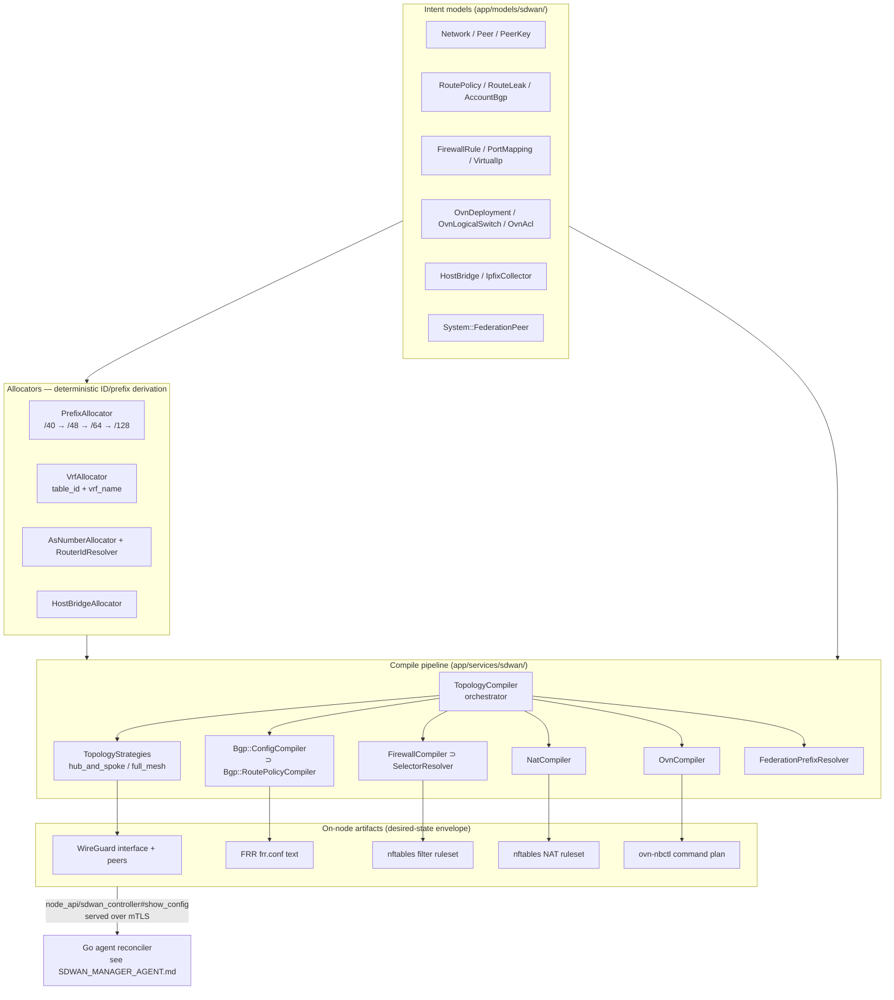

# SDWAN Compile Pipeline — Architecture

> Status: active

This document explains **how the SDWAN subsystem is built**: how the
operator's declarative intent (networks, peers, route policies, firewall
rules, VIPs, OVN switches, …) is **compiled** into the concrete on-node
artifacts (WireGuard interfaces, FRR `frr.conf`, nftables rulesets, and
`ovn-nbctl` plans) that the Go agent applies to the kernel.

It is the **compiler-internals** companion to two existing docs:

- To **use** SDWAN (create networks, attach peers, set up federation), see
  the operator runbook [`runbooks/sdwan-network-setup.md`](./runbooks/sdwan-network-setup.md).
- To understand **how the compiled artifacts reach and apply on the node**,
  see [`SDWAN_MANAGER_AGENT.md`](./SDWAN_MANAGER_AGENT.md) (operator-CRUD
  gating + drift remediation) and the Go agent README.

This doc fills the gap between them: the **server-side compile pipeline**.

Source of truth: everything below is derived from the code under
`app/services/sdwan/` and `app/models/sdwan/` in this extension. Symbols
and paths are code-checked by [`docs/.verify/`](./.verify/README.md).

---

## The big picture: intent → compile → artifact → apply

The pipeline is **pull-based and stateless-per-tick**. The server holds
*intent* (DB rows). On every node poll, the compiler reads the relevant
intent rows, derives stable IDs/prefixes through the allocators, and emits
a **desired-state envelope** — a pure data structure, no side effects on
the node. The agent fetches that envelope over mTLS and reconciles the
host (`wg`, `nft`, FRR `vtysh`, `ovn-nbctl`) to match. Re-compiling
unchanged intent yields a **byte-stable** envelope, so the agent's applies
are idempotent.



The serving seam is `app/controllers/api/v1/system/node_api/sdwan_controller.rb`
(`#show_config`): it calls `Sdwan::TopologyCompiler.compile_for_peer` for
each of the host's peers plus the per-host class methods
(`host_bridges_for`, `ovn_control_for`, `ovn_nb_plan_for`) and serializes
the combined `DesiredConfig` the agent polls.

---

## The orchestrator — `Sdwan::TopologyCompiler`

`app/services/sdwan/topology_compiler.rb` composes the **per-peer view**
that the agent applies. `compile_for_peer(peer)` returns one hash per peer:

| Envelope key | Produced by | Artifact |
|---|---|---|
| `interface` | `TopologyCompiler#interface_block` | WireGuard `[Interface]` (name, `/128` address, listen port, MTU, VRF binding, key ref) |
| `peers` | the topology **strategy** (`peers_for`) | WireGuard `[Peer]` list (public key, endpoint, AllowedIPs, keepalive) |
| `firewall` | `Sdwan::FirewallCompiler` | nftables filter ruleset |
| `nat` | `Sdwan::NatCompiler` | nftables NAT (DNAT) ruleset |
| `bgp` | `Sdwan::Bgp::ConfigCompiler` | FRR `frr.conf` text (when `routing_mode: ibgp`) |
| `vips_held` | `TopologyCompiler#vips_held_by` | per-peer VIP CIDRs for the agent's `vip_applier` |
| `federation` | `Sdwan::FederationPrefixResolver` | federated remote-prefix entries |
| `mc_envelope` | `Sdwan::MembershipCredentialSigner` | signed Ed25519 membership credential |

The orchestrator is **topology-pluggable**: it selects a strategy class
from `network.settings["topology_strategy"]` (default `hub_and_spoke`) and
delegates the `peers:` list to it. It also resolves federated prefixes
**once per compile** and threads them into both the strategy (WireGuard
AllowedIPs) and the BGP compiler (iBGP `network` announcements).

Three **per-host** (not per-peer) class methods produce the overlay
plumbing served alongside the peer views:

- `host_bridges_for(instance)` → the host's `Sdwan::HostBridge` rows
  (Linux/OVS bridges the agent's `BridgeApplier` materializes), each
  optionally carrying an IPFIX exporter payload.
- `ovn_control_for(instance)` → the `ovn-controller` connection intent
  (NB/SB endpoints, Geneve encap IP) for heavyweight hosts.
- `ovn_nb_plan_for(instance)` → the compiled OVN Northbound plan (see
  `Sdwan::OvnCompiler`), cached on a version stamp folded from the
  deployment + its switches/ports/ACLs.

`compile_for_network(network)` compiles every peer at once for the
operator UI and dry-run previews — it never includes private-key material.

---

## Per-stage compilers

Each stage is a small, single-responsibility service. Stated as
**input intent models → output artifact → file/class**:

### Topology strategies → WireGuard peer list

- **Input:** `Network`, its `Peer`s (the `publicly_reachable` flag splits
  hubs vs spokes), active `UserDevice`s, `VirtualIp` holders, and the
  resolved federation prefixes.
- **Output:** the per-`[Peer]` WireGuard entries (public key, endpoint +
  fallback, AllowedIPs, PersistentKeepalive).
- **Files:** `app/services/sdwan/topology_strategies/hub_and_spoke.rb`
  (default — spokes see only the hubs with `/64` AllowedIPs; hubs see
  every peer with `/128` AllowedIPs) and
  `app/services/sdwan/topology_strategies/full_mesh.rb` (every peer gets a
  direct `[Peer]` to every other, O(n²) tunnels, for small
  latency-sensitive sets). Both implement the same
  `initialize(network:, federation_prefixes:)` + `peers_for(peer)`
  contract; the interface block is strategy-agnostic.

### `Sdwan::Bgp::ConfigCompiler` → FRR config

- **Input:** the calling `Peer`, the account's `AccountBgp` (AS number),
  every `HostVrfAssignment` bound to the peer's host, applicable
  `RouteLeak`s, held `VirtualIp`s, advertised `lan_subnets` /
  `SubnetAdvertisement`s, and federation prefixes.
- **Output:** a host-wide `frr_text` (FRR is one daemon per host): one
  `router bgp <as> vrf <name>` block per `HostVrfAssignment`, VRF
  definitions, prefix-lists, route-maps, and cross-VRF `import vrf`
  directives for route leaks. The structured fields (neighbors, networks,
  vrf_blocks) feed the operator UI.
- **File:** `app/services/sdwan/bgp/config_compiler.rb`. Only emits when
  the network is iBGP-mode and `AccountBgp` is enabled; otherwise returns
  `{ enabled: false }` so the agent disables FRR for that network. The
  hub-spoke RR topology makes `publicly_reachable` hubs route reflectors
  and spokes RR-clients; cross-VRF prefixes move **only** via explicit
  route leaks.

### `Sdwan::Bgp::RoutePolicyCompiler` → FRR route-maps / prefix-lists

- **Input:** the `RoutePolicy` rows applicable to the peer (account /
  network / peer scope) plus the account's
  `AccountBgp#default_route_policy` (folded in as the broadest baseline
  filter — without this fold-in an operator-set default policy would be
  silently un-enforced).
- **Output:** FRR `route-map` + `prefix-list` + `as-path access-list` +
  `community-list` blocks and a per-neighbor `route-map … in/out`
  assignment map. Same-direction policies compose by AND via a combined
  `call`/`on-match next` route-map. The output is folded into
  `ConfigCompiler`'s `frr_text`.
- **File:** `app/services/sdwan/bgp/route_policy_compiler.rb`.

### `Sdwan::FirewallCompiler` + `Sdwan::SelectorResolver` → nftables filter

- **Input:** the `Network`'s enabled, ordered `FirewallRule` rows and
  `network.settings["firewall_default_policy"]` (`accept` | `drop`).
- **Output:** an `nft -f` script in `table inet powernode_sdwan`, one
  chain per network (`sdwan_<8-char-net-id>`) scoped by
  `iif "wg-sdwan-<8-char-net-id>"`, applied atomically
  (`add`/`flush chain`/`add rule`). The output is per-network even though
  the call signature accepts a peer (mirroring the other stages).
- **Files:** `app/services/sdwan/firewall_compiler.rb` and
  `app/services/sdwan/selector_resolver.rb`. The resolver turns the JSONB
  selector primitives (`peer_id` → `ip6 saddr/daddr <addr>/128`, `cidr` →
  the CIDR, `all` → wildcard) into nft match fragments. **Note:** `tag`
  selectors currently compile to `nil` (effective wildcard) — tag-set
  population is a not-yet-shipped slice, so tag rules should not be relied
  on as security boundaries today.

### `Sdwan::NatCompiler` → nftables NAT

- **Input:** enabled `PortMapping` rows where this peer is the hub, with
  their target `Peer` / `VirtualIp` resolved to an address.
- **Output:** a `type nat hook prerouting priority -100` DNAT chain
  (`sdwan_nat_<8-char-net-id>`) in the same `inet powernode_sdwan` table,
  one rule per resolvable mapping; unresolvable mappings are reported in a
  `skipped` list rather than dropped silently.
- **File:** `app/services/sdwan/nat_compiler.rb`.

### `Sdwan::OvnCompiler` → `ovn-nbctl` plan

- **Input:** an `OvnDeployment` and its active `OvnLogicalSwitch` →
  `OvnLogicalSwitchPort` + `OvnAcl` rows.
- **Output:** a structured `{ deployment_id, plan: [{cmd, args}, …],
  compiled_at }` command plan (`ls-add`, `lsp-add`, `lsp-set-addresses`,
  `lsp-set-type`, `acl-add`) emitted in dependency-respecting, name-sorted
  (byte-stable) order. The compiler **returns data, never executes** — an
  executor or operator replays it against the NB DB.
- **File:** `app/services/sdwan/ovn_compiler.rb`.

### `Sdwan::FederationPrefixResolver` → federated remote prefixes

- **Input:** `System::FederationPeer` rows contributing to the network's
  account (the model's `federation_prefix_contributing` liveness scope) and
  their `remote_prefix_advertisement` CIDRs.
- **Output:** stable-ordered, de-duplicated federation entries; the prefix
  list is folded into WireGuard AllowedIPs (so spokes route federated
  traffic out the hub egress) and, on iBGP networks, into the RR fabric's
  `network` announcements.
- **File:** `app/services/sdwan/federation_prefix_resolver.rb`. It is the
  default `federation_resolver` the `TopologyCompiler` injects.

---

## Allocators — deterministic ID / prefix derivation

The allocators turn opaque intent (a network row, a peer row, a host) into
**stable, collision-free** addresses and IDs. Determinism is the point:
the same input always yields the same address, so configs survive DB
rebuilds and operators can reverse a packet capture back to a row.

| Allocator | File | Derives | Strategy |
|---|---|---|---|
| `Sdwan::PrefixAllocator` | `app/services/sdwan/prefix_allocator.rb` | IPv6 ULA hierarchy: install `/40` → account `/48` → network `/64` → peer `/128` | Random `/40` persisted once on `Sdwan::Configuration`; `/48` & `/64` hashed with rejection sampling; `/128` deterministic from `peer.id` |
| `Sdwan::VrfAllocator` | `app/services/sdwan/vrf_allocator.rb` | per-`(host, network)` kernel `table_id` (100–65535), `short_id`, and `vrf_name` → `HostVrfAssignment` | Lowest-unused id under a `FOR UPDATE` per-host lock; idempotent; reserved tables 0/253/254/255 skipped |
| `Sdwan::Bgp::AsNumberAllocator` | `app/services/sdwan/bgp/as_number_allocator.rb` | the account's 4-byte private AS (RFC 6996) → `AccountBgp` | Deterministic-from-account-id hash with rejection sampling |
| `Sdwan::Bgp::RouterIdResolver` | `app/services/sdwan/bgp/router_id_resolver.rb` | a deterministic 32-bit BGP router-id (IPv4 dotted-quad) | SHA-256 of the peer's overlay `/128`; overridable via `Peer#bgp_router_id_override` |
| `Sdwan::HostBridgeAllocator` / `Sdwan::HostBridgeResolver` | `app/services/sdwan/host_bridge_allocator.rb`, `app/services/sdwan/host_bridge_resolver.rb` | per-host bridge `short_id` + kernel name (`linux` vs `ovs` by host profile) → `HostBridge` | Lowest-unused `short_id` under a `FOR UPDATE` per-host lock; resolver is the single source of truth for the bridge name |

`Sdwan::Configuration` is the per-account anchor row that pins the `/40`
and `/48` so every later allocation is reproducible.

---

## Topology strategies — hub-spoke RR vs full mesh

The strategy is the pluggable seam that decides **who tunnels to whom**.
Both live under `app/services/sdwan/topology_strategies/` and share the
`peers_for(peer)` contract; the orchestrator picks one by name.

- **Hub-and-spoke (default).** One or more `publicly_reachable: true`
  peers are **hubs**; spokes dial a hub outbound on UDP/51820 with
  PersistentKeepalive to hold the NAT mapping. Spokes see only hubs (full
  `/64` AllowedIPs → all overlay traffic egresses through a hub); hubs see
  every peer (`/128` AllowedIPs → the hub routes to the right spoke). On
  iBGP networks the hubs are the **route reflectors**.
- **Full mesh.** Every peer gets a direct `[Peer]` to every other peer —
  no relay hop, minimal latency, at the cost of O(n²) tunnels. Suited to
  small, latency-sensitive sets; hub-and-spoke remains the default for
  large fleets.

A network with **zero hubs** is isolated: the strategy emits an empty
`peers:` list and the agent keeps the interface up with no working tunnels.

---

## Artifact types and where each is generated

| Artifact | Generated by | Consumed on-node by |
|---|---|---|
| WireGuard `[Interface]` + `[Peer]` config | `TopologyCompiler#interface_block` + the topology strategy | the agent's `wg_applier` (wgctrl-go) |
| FRR `frr.conf` text (`router bgp` blocks, route-maps, prefix-lists, `import vrf`) | `Sdwan::Bgp::ConfigCompiler` ⊃ `Sdwan::Bgp::RoutePolicyCompiler` | the agent's `frr_applier` (FRR/`vtysh`) |
| nftables **filter** ruleset (`sdwan_<8>` chain) | `Sdwan::FirewallCompiler` ⊃ `Sdwan::SelectorResolver` | the agent's nft applier |
| nftables **NAT** ruleset (`sdwan_nat_<8>` DNAT chain) | `Sdwan::NatCompiler` | the agent's `nat_applier` |
| `ovn-nbctl` command plan (`ls-add` / `lsp-*` / `acl-add`) | `Sdwan::OvnCompiler` | the agent's `OvnNbApplier` (heavyweight hosts) |
| Signed membership credential (Ed25519 envelope) | `Sdwan::MembershipCredentialSigner` | the agent verifies every reconcile |
| WireGuard **client** config (user-VPN devices) | `Sdwan::WgConfigRenderer` | downloaded by the end user's WG client |

The nftables filter and NAT chains share one `table inet powernode_sdwan`
so they apply in a single atomic `nft -f` transaction. The Go agent that
applies all of these — and the drift sensors that keep them converged — is
documented in [`SDWAN_MANAGER_AGENT.md`](./SDWAN_MANAGER_AGENT.md).

---

## Intent model catalog

The models under `app/models/sdwan/` are the compiler's **inputs**. Roles:

| Model | Role as compile input |
|---|---|
| `Network` | The overlay container — a `/64` ULA prefix, routing mode (`static`/`ibgp`), topology strategy, and firewall default policy |
| `Peer` | A host's membership in a network; carries the deterministic `/128`, hub/spoke flag, endpoints, and `lan_subnets` |
| `PeerKey` | A peer's WireGuard keypair (public column-stored; private Vault-first) — feeds the `[Peer]` public key |
| `HostVrfAssignment` | Joins a host to a network with the kernel `table_id` + `vrf_name` — one `router bgp … vrf` block per row |
| `AccountBgp` | Per-account AS number + BGP globals + default route policy |
| `RoutePolicy` | Declarative iBGP route policy (JSONB `statements`) → FRR route-maps |
| `RouteLeak` | Explicit cross-VRF prefix import (the only way prefixes cross network isolation) |
| `FirewallRule` | A declarative nft rule with JSONB selectors (peer/cidr/tag/all) |
| `PortMapping` | Declarative DNAT on a hub (external port → internal `/128:port`) |
| `VirtualIp` / `VirtualIpAssignment` | First-class VIP with primary + failover (or anycast) holders |
| `SubnetAdvertisement` | A LAN subnet a peer announces over iBGP |
| `OvnDeployment` | The per-account OVN control plane (NB/SB endpoints) |
| `OvnLogicalSwitch` / `OvnLogicalSwitchPort` / `OvnAcl` | OVN L2 domains, ports, and match-language ACLs → the `ovn-nbctl` plan |
| `HostBridge` | A desired Linux/OVS bridge on a host |
| `IpfixCollector` | An operator-configured IPFIX exporter target folded into OVS bridge payloads |
| `Configuration` | Per-account anchor for the deterministic ULA derivation |
| `MembershipCredential` / `ConstellationSigningKey` | The signed membership envelope and its Ed25519 signing key |
| `UserDevice` / `AccessGrant` | User-VPN client endpoints and the entitlement that authorizes them |
| `BgpSession` / `FlowSample` | Observed iBGP session state and IPFIX flow records (telemetry, reported back) |

> Federation peers use the `System::FederationPeer` model (the `System::`
> namespace), **not** an `Sdwan::FederationPeer` class — there is none.

---

## MCP surface

The compiler is reachable from AI agents and Claude Code via the
`platform_system_sdwan_*` MCP actions (77 actions, dispatched by
`app/services/ai/tools/sdwan_tool.rb`). They group as:

| Group | Representative actions | Touches |
|---|---|---|
| **Network / peer CRUD** | `system_sdwan_create_network`, `system_sdwan_update_network_routing_mode`, `system_sdwan_attach_peer`, `system_sdwan_detach_peer`, `system_sdwan_update_peer_lan_subnets` | `Network`, `Peer` intent rows |
| **Routing intent** | `system_sdwan_create_route_policy`, `system_sdwan_get_account_bgp`, `system_sdwan_update_account_as_number`, `system_sdwan_list_subnet_advertisements` | `RoutePolicy`, `AccountBgp`, `SubnetAdvertisement` |
| **Firewall / NAT / VIP** | `system_sdwan_create_firewall_rule`, `system_sdwan_create_port_mapping`, `system_sdwan_create_virtual_ip`, `system_sdwan_failover_virtual_ip` | `FirewallRule`, `PortMapping`, `VirtualIp` |
| **OVN overlay** | `system_sdwan_create_ovn_deployment`, `system_sdwan_create_ovn_logical_switch`, `system_sdwan_create_ovn_acl` | `OvnDeployment`, `OvnLogicalSwitch`, `OvnAcl` |
| **Compile / inspect** | `system_sdwan_compile_ovn_plan`, `system_sdwan_compile_route_policy`, `system_sdwan_get_bgp_config_for_peer`, `system_sdwan_get_topology`, `system_sdwan_get_routing_summary`, `system_sdwan_get_bgp_sessions` | run the compilers in **preview** mode (no node apply) |
| **Federation** | `system_sdwan_propose_federation_peer`, `system_sdwan_accept_federation_peer`, `system_sdwan_revoke_federation_peer` | `System::FederationPeer` |

The **compile/inspect** group is the operator's window into this pipeline.
For example, to preview the structured OVN plan or the FRR route-maps
without touching a node:

```javascript
// Compile the ovn-nbctl plan for a deployment (Sdwan::OvnCompiler)
platform.system_sdwan_compile_ovn_plan({ deployment_id: "<uuid>" })

// Compile a peer's FRR route-maps (Sdwan::Bgp::RoutePolicyCompiler)
platform.system_sdwan_compile_route_policy({ peer_id: "<uuid>" })

// Read the compiled BGP config a peer would receive
platform.system_sdwan_get_bgp_config_for_peer({ peer_id: "<uuid>" })
```

For the full action catalog see [`MCP_API_REFERENCE.md`](./MCP_API_REFERENCE.md).

---

## Contributing a new compile stage / artifact

To add a stage that emits a new on-node artifact, mirror the existing
shape rather than inventing a new one:

1. **Write the model(s).** Add the intent under `app/models/sdwan/`. Keep
   it declarative — the model holds *what the operator wants*, never how
   the node achieves it.
2. **Write a compiler service** under `app/services/sdwan/` exposing a
   class method (`compile_for_peer(peer)` for per-peer artifacts, or
   `compile_for_<scope>(scope)` for per-network/per-host/per-deployment).
   Return a **plain Hash** — data only, no node side effects.
3. **Make it byte-stable.** Order by a stable key (name, not
   `id`/`created_at`), emit only `active`/compilable rows, and exclude
   removed rows — re-compiling unchanged intent MUST produce identical
   output so the agent's apply is idempotent (see `Sdwan::OvnCompiler`'s
   idempotency contract as the reference pattern).
4. **Derive IDs via an allocator**, never inline. If you need a stable
   address, table id, or short id, extend or reuse `Sdwan::PrefixAllocator`
   / `Sdwan::VrfAllocator` / `Sdwan::HostBridgeAllocator` so the value
   survives DB rebuilds.
5. **Wire it into the orchestrator.** Add the new key to
   `Sdwan::TopologyCompiler#compile_peer_view` (per-peer) or a per-host
   class method, then serialize it in
   `app/controllers/api/v1/system/node_api/sdwan_controller.rb`'s
   `#show_config` so the agent receives it.
6. **Add the agent applier** on the Go side and a `platform_system_sdwan_*`
   MCP preview action in `app/services/ai/tools/sdwan_tool.rb` (register +
   dispatch both — the `docs/.verify/check-mcp-actions.sh` dispatcher pass
   enforces parity).
7. **Cross-reference the apply path** in
   [`SDWAN_MANAGER_AGENT.md`](./SDWAN_MANAGER_AGENT.md) so the drift
   sensors know to reconcile your new artifact.

---

## Related Documents

- [`runbooks/sdwan-network-setup.md`](./runbooks/sdwan-network-setup.md) —
  end-to-end operator how-to (to **use** SDWAN; this doc is how it's
  **built**).
- [`SDWAN_MANAGER_AGENT.md`](./SDWAN_MANAGER_AGENT.md) — how the compiled
  artifacts **apply on-node**, plus operator-CRUD gating + drift
  remediation.
- [`ARCHITECTURE.md`](./ARCHITECTURE.md) — where SDWAN fits among the nine
  subsystems.
- [`FLEET_SENSORS.md`](./FLEET_SENSORS.md) — the sensors that detect
  SDWAN drift and trigger re-compile/reconcile.
- [`MCP_API_REFERENCE.md`](./MCP_API_REFERENCE.md) — operator-curated MCP
  action subset.

_Last verified: 2026-06-26_
