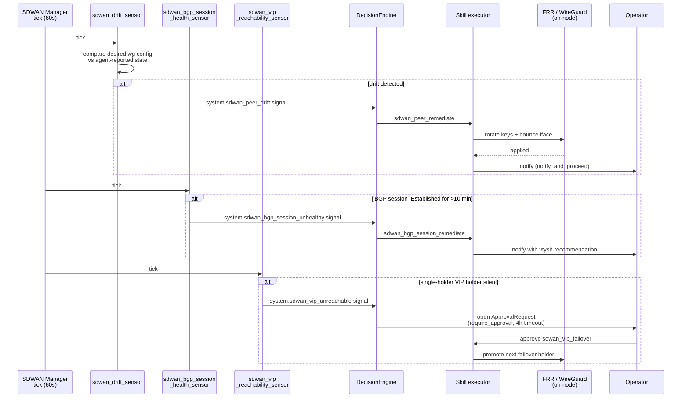

# SDWAN Manager Agent — Operator Guide

> Status: active

The **SDWAN Manager** is one of the autonomous agents seeded into every Powernode account. It owns **operator-initiated SDWAN CRUD** — the approval/notification gating on every change to networks, peers, firewall rules, VIPs, route policies, port mappings, access grants, user devices, and federation peers. Carved out of Fleet Autonomy on 2026-05-10 so SDWAN ops have an independent intervention queue — operators can pause SDWAN during a network maintenance window without halting fleet ops.

> **Prefix split (important).** Two distinct action prefixes govern SDWAN, and they live on **two different agents**:
> - **`sdwan.*`** — operator-initiated CRUD. These **43** policies live **here** on the SDWAN Manager, at both the operator (`action_type`) and agent shapes.
> - **`system.sdwan_*`** / **`system.federation_*`** — autonomous, sensor-triggered remediations (peer remediate, key rotate, failover, VIP failover, BGP session remediate, credential refresh, user-device revoke, the five `*_investigate` lanes) plus the gated `system.federation_acceptance` executor. These **14** policies also live **here** since HIER-P2A (`PolicyDeclarations::SDWAN_REMEDIATION_POLICIES`), at the agent shape only. The Fleet sensors that emit them still run on the Fleet Autonomy tick, but each `DecisionEngine::SIGNAL_BINDINGS` entry declares `owner: "sdwan-manager"`, so the policy row, approval chain and event attribution are this agent's. See [`FLEET_SENSORS.md`](./FLEET_SENSORS.md) §Intervention Policy Reference.
>
> Total: **57** policies — 43 operator CRUD + 14 autonomous remediations.
>
> This guide documents the SDWAN Manager's `sdwan.*` operator policies in full. The 14 autonomous remediations it also owns are summarized below in [Sensor → Action Map](#sensor--action-map); their declarations live in `PolicyDeclarations::SDWAN_REMEDIATION_POLICIES` rather than in the seed file.

Source of truth for this guide: `extensions/system/server/db/seeds/system_sdwan_manager_agent.rb`.

---

## Charter

The SDWAN Manager is a **monitor** agent (no chat surface). It ticks every **60 seconds** under autonomy scope `sdwan`. Its job is to **gate operator-initiated SDWAN mutations** through an approval/notification chain — every `sdwan.*` CRUD action runs through one of this agent's intervention policies.

What it owns:
- **Operator-initiated mutations** — every CRUD against networks, peers, firewall rules, VIPs, route policies, port mappings, access grants, user devices, and federation peers flows through this agent's `sdwan.*` policies + approval chain.

What it does **not** own:
- **Autonomous, sensor-triggered SDWAN remediation** (peer drift remediate, key rotate, hub/VIP failover, BGP session remediate, user-device revoke, credential refresh, the four `*_investigate` lanes, federation peer remediate/acceptance) — the 14 `system.sdwan_*` / `system.federation_*` policies in `PolicyDeclarations::SDWAN_REMEDIATION_POLICIES`, owned by **this agent since HIER-P2A**. The Fleet sensors still emit `system.sdwan_*` signals on the Fleet Autonomy tick, but each binding declares `owner: "sdwan-manager"` and the tick gates the decision under the SDWAN Manager's row, chain and attribution. The matching skill executors live under `app/services/system/ai/skills/` (their `binds_to` still names Fleet Autonomy — re-binding is a separate increment). See [Sensor → Action Map](#sensor--action-map).
- Container runtime provisioning (→ Runtime Manager)
- CVE response (→ CVE Responder)
- Cross-cutting topology composition like OVN logical networks + IPFIX collectors (→ System Topology Designer)
- Disk image CI publication (→ Disk Image Manager)

---

## Intervention Policies

The agent ships with **57 intervention policies** — **43** `sdwan.*` operator-initiated CRUD (source: `system_sdwan_manager_agent.rb`, which consumes `PolicyDeclarations::SDWAN_OPERATOR_POLICIES`) plus the **14** autonomous `system.sdwan_*` / `system.federation_*` remediations it gained at HIER-P2A (`PolicyDeclarations::SDWAN_REMEDIATION_POLICIES`). Each policy maps an `action_category` to one of four policy types:

| Policy type | Behavior |
|---|---|
| `auto_approve` | Execute immediately. Telemetry only — no operator interaction. |
| `notify_and_proceed` | Execute immediately, but emit a notification so operators see what was done. |
| `require_approval` | Block on operator approval via the approval chain. 4-hour timeout (see below) — past that, **reject** by default. |
| `blocked` | Refuse to execute. (Not used in the default seed; available for emergency lockdowns.) |

### Policy table

> The 14 autonomous `system.sdwan_*` / `system.federation_*` remediation policies are **not** in this table — this table is the operator (`sdwan.*`) set. They are owned by this agent too (since HIER-P2A) but declared in `PolicyDeclarations::SDWAN_REMEDIATION_POLICIES`; see [Sensor → Action Map](#sensor--action-map) and [`FLEET_SENSORS.md`](./FLEET_SENSORS.md) §Intervention Policy Reference.

#### Network CRUD (operator-initiated)
| Action | Policy |
|---|---|
| `sdwan.network_create` | `notify_and_proceed` |
| `sdwan.network_update` | `notify_and_proceed` |
| `sdwan.network_delete` | `require_approval` |

#### Peer CRUD
| Action | Policy |
|---|---|
| `sdwan.peer_create` | `notify_and_proceed` |
| `sdwan.peer_update` | `notify_and_proceed` |
| `sdwan.peer_delete` | `require_approval` |

#### Firewall rules
| Action | Policy |
|---|---|
| `sdwan.firewall_rule_create` | `notify_and_proceed` |
| `sdwan.firewall_rule_update` | `notify_and_proceed` |
| `sdwan.firewall_rule_delete` | `require_approval` |

#### Virtual IPs
| Action | Policy |
|---|---|
| `sdwan.virtual_ip_create` | `notify_and_proceed` |
| `sdwan.virtual_ip_update` | `notify_and_proceed` |
| `sdwan.virtual_ip_delete` | `require_approval` |

#### Route policies
| Action | Policy |
|---|---|
| `sdwan.route_policy_create` | `notify_and_proceed` |
| `sdwan.route_policy_update` | `notify_and_proceed` |
| `sdwan.route_policy_delete` | `require_approval` |

#### Port mappings (DNAT)
| Action | Policy |
|---|---|
| `sdwan.port_mapping_create` | `notify_and_proceed` |
| `sdwan.port_mapping_update` | `notify_and_proceed` |
| `sdwan.port_mapping_delete` | `notify_and_proceed` |

#### Access grants
| Action | Policy |
|---|---|
| `sdwan.access_grant_create` | `notify_and_proceed` |
| `sdwan.access_grant_revoke` | `require_approval` |
| `sdwan.access_grant_delete` | `require_approval` |

`revoke` flips the grant to `revoked` and soft-revokes its devices, keeping every
row for the 90-day audit window. `delete` cascades through
`dependent: :destroy` to every VPN device and removes each device's WireGuard key
from Vault, so it is gated at least as tightly and dispatches a separate
executor (`Sdwan::Executors::DeleteAccessGrant`) — approving one can never
produce the other.

#### User devices
| Action | Policy |
|---|---|
| `sdwan.user_device_create` | `notify_and_proceed` |

#### Federation peering
| Action | Policy |
|---|---|
| `sdwan.federation_peer_propose` | `require_approval` |
| `sdwan.federation_peer_accept` | `require_approval` |
| `sdwan.federation_peer_revoke` | `require_approval` |

Federation actions are all `require_approval` because cross-platform peering crosses an administrative trust boundary.

### Tuning a policy

To change a policy at runtime (e.g., relax `notify_and_proceed` to `auto_approve` for a low-risk action in your environment), update the `Ai::InterventionPolicy` row directly:

```ruby
# rails console
agent = Ai::Agent.find_by(name: "SDWAN Manager")
Ai::InterventionPolicy.find_by(
  ai_agent_id: agent.id, action_category: "sdwan.port_mapping_create"
).update!(policy: "auto_approve")
```

The change takes effect on the next tick (within 60s). To make the change durable across re-seeds, edit `system_sdwan_manager_agent.rb` and re-run `cd server && rails db:seed`.

---

## Approval Chain

Approval-required actions flow through the **SDWAN Manager Actions** approval chain:

- **Trigger type:** `autonomy_action`
- **Sequential:** yes (one step today)
- **Timeout:** **4 hours**, then auto-reject
- **Approvers:** any user with permission `system.infra_tasks.control`
- **Required approvals per step:** 1

To add additional approvers (e.g., a security review for `federation_peer_*` actions), edit the `steps` array in the seed file and re-seed.

---

## Skill Bindings

The four autonomous SDWAN remediation executors (`app/services/system/ai/skills/`) are surfaced via bound skills. Note these skills are still **bound to Fleet Autonomy** (`binds_to`), and are invoked with the SDWAN Manager as the acting agent when the corresponding `system.sdwan_*` policy — owned by the SDWAN Manager since HIER-P2A — fires; re-binding the skills is a separate increment:

- `sdwan_failover_executor` — hub failover planner
- `sdwan_peer_remediate_executor` — peer key rotation + re-enrollment
- `sdwan_bgp_session_remediate_executor` — iBGP session restart + reconfiguration
- `sdwan_vip_failover_executor` — VIP holder promotion

> **Removed (IMP-17bc5546009a, 2026-08-21): `system.sdwan_route_policy_audit`.** This autonomy policy was seeded (on Fleet Autonomy) for a lane that never existed end-to-end — no sensor emitted it, no DecisionEngine binding routed to it, and no executor under `app/services/system/ai/skills/` ever backed it (only the four above do). It was a permanently no-op `auto_approve` row and was deleted outright rather than built out. A compiled-policy-vs-FRR-observed route-policy drift sensor remains a real, undone capability — if you want it, file it as its own piece of work.

Cross-cutting composition skills (`system-sdwan-host-bridge-compose`, `system-sdwan-ovn-compose-topology`, `system-sdwan-ipfix-collector-compose`, `system-sdwan-compose-full-topology`, `system-sdwan-ovn-apply-acl`) are bound to **System Topology Designer**, not to SDWAN Manager. Use the topology designer (invoked via Concierge) when you need an end-to-end topology composition; SDWAN Manager gates the steady-state CRUD on the resulting topology.

For the full skill catalog with descriptor I/O, see [SKILL_EXECUTOR_CATALOG.md](./SKILL_EXECUTOR_CATALOG.md).

---

## Sensor → Action Map

These autonomous remediations are triggered by Fleet sensors emitting `system.sdwan_*` signals and gated by **Fleet Autonomy's** intervention policies (not the SDWAN Manager's). They are listed here for cross-reference; see [`FLEET_SENSORS.md`](./FLEET_SENSORS.md) for the sensor descriptors and the authoritative policy table:

| Sensor → Signal | Triggers action | Policy default |
|---|---|---|
| `sdwan.peer_reachability` → drift | `system.sdwan_peer_remediate` | `notify_and_proceed` |
| `sdwan.bgp_session` → down | `system.sdwan_bgp_session_remediate` | `notify_and_proceed` |
| `sdwan.vip_reachability` → primary unhealthy | `system.sdwan_vip_failover` | `require_approval` |
| `sdwan.hub_reachability` → hub unreachable | `system.sdwan_failover` | `require_approval` |
| Membership-credential expiry (`SdwanCredentialExpirySensor`) | `system.sdwan_credential_refresh` | `notify_and_proceed` |

> **Manual VIP failover** (operator-initiated, out of band of the sensor loop) works via `system_sdwan_failover_virtual_ip(virtual_ip_id)`. It delegates to `Sdwan::VirtualIp#failover!`; you can bias the promotion by passing an optional `target_peer_id` (a configured failover candidate), which reorders the failover queue before promotion.

### Tick + Drift Remediation Flow



<!-- signal-kind-corrections:start -->
> **Corrected 2026-08-31 (IMP-e491c01f5c01).** The three signal names in the
> sequence diagram above were fabricated — no sensor emits them. They sat in
> mermaid arrow labels rather than in backticked prose, which is why the
> file-scoped sweep that corrected `FLEET_SENSORS.md` never saw them.
>
> | Named here until 2026-08-31 | Actually emitted |
> |---|---|
> | `sdwan.peer_drift` | `system.sdwan_peer_drift` |
> | `sdwan.bgp_unhealthy` | `system.sdwan_bgp_session_unhealthy` (and `system.sdwan_bgp_session_stale`) |
> | `sdwan.vip_holder_silent` | `system.sdwan_vip_unreachable` |
>
> The left-hand names are **NOT IMPLEMENTED**. A `system_recent_signals`
> `kind` filter or intervention policy keyed on one returns empty with
> `success: true` — no error, no warning.
<!-- signal-kind-corrections:end -->

---

## Pause / Resume — Maintenance Window Runbook

When you need to pause SDWAN reconciliation (e.g., a maintenance window where you're manually changing BGP config and don't want the agent fighting you):

### Pause
```ruby
# rails console
agent = Ai::Agent.find_by(name: "SDWAN Manager")
agent.update!(status: "paused")
```

The agent will skip its next tick. Existing approvals already in the queue are unaffected (they stay pending; operators can still approve or reject them).

> **Maintenance gate (drain → verify → reattach → resume).** Pausing the SDWAN Manager stops *operator-initiated CRUD gating* and, since HIER-P2A, is also the agent the autonomous `system.sdwan_*` remediations gate under — but the SENSORS still run on the **Fleet Autonomy** tick (a paused SDWAN Manager still resolves as the owner; its policy rows decide). For a true maintenance window:
> 1. **Pause both** — pause the SDWAN Manager (above) **and** pause Fleet Autonomy (`Ai::Agent.find_by(name: "Fleet Autonomy").update!(status: "paused")`), so neither the CRUD gate nor the autonomous failover/remediation loop acts during the window.
> 2. **Drain / detach** the peer or VIP you're servicing (e.g. `system_sdwan_detach_peer`), so traffic is steered away before you touch it.
> 3. **Verify BGP is idle** — confirm the affected iBGP sessions have quiesced (`system_sdwan_get_bgp_sessions`) before applying manual `vtysh` changes; you don't want the compiler racing a half-applied route-map.
> 4. Apply your changes, then **reattach** (`system_sdwan_attach_peer`) and confirm the session re-Establishes.
> 5. **Resume both** agents (below).

### Verify paused
```bash
curl -s -H "Authorization: Bearer $JWT" http://localhost:3000/api/v1/ai/agents \
  | jq '.data[] | select(.name=="SDWAN Manager") | {name, status, last_tick_at}'
```

### Resume
```ruby
agent.update!(status: "active")
# If you also paused Fleet Autonomy for the maintenance gate, resume it too:
Ai::Agent.find_by(name: "Fleet Autonomy").update!(status: "active")
```

Resumption takes effect on the next tick (within 60s of the next scheduled run).

### Emergency halt (all autonomy)

For unscoped emergencies (e.g., suspected agent misbehavior across the platform), use the kill switch instead — it halts ALL autonomous agents, not just SDWAN Manager:

```
platform.emergency_halt
```

To resume:
```
platform.emergency_resume
```

---

## Observability

Every decision SDWAN Manager makes lands in three places:

1. **FleetEvent log** — `System::FleetEvent` rows with `source: "sdwan_manager"`, queryable via `system_recent_signals` (filter by exact `kind` or `correlation_id`; `source` is returned on each event but is not a filter) or the Fleet Dashboard. Not the introspection verb `recent_events`, which reads agent execution events and never returns a FleetEvent.
2. **ActionCable broadcast** — live UI updates on `SystemFleetChannel` (subscribers see decisions stream into the dashboard)
3. **Approval queue** — `Ai::ApprovalRequest` rows for `require_approval` actions, visible at `/ai/autonomy/approvals` in the operator UI

For audit-grade retention: critical events retain 365 days; routine reconciliations retain 90 days (per FleetEvent retention policy).

---

## Related Documents

- [`FLEET_SENSORS.md`](./FLEET_SENSORS.md) — the sensors that emit `sdwan.*` signals
- [`ARCHITECTURE.md`](./ARCHITECTURE.md) §5 — SDWAN subsystem reference (model + service layer)
- [`SDWAN_ARCHITECTURE.md`](./SDWAN_ARCHITECTURE.md) — the server-side **compile pipeline** that produces the artifacts this agent's drift sensors reconcile (intent → per-stage compilers → on-node WireGuard / FRR / nftables / OVN)
- [`runbooks/sdwan-network-setup.md`](./runbooks/sdwan-network-setup.md) — end-to-end SDWAN provisioning runbook
- [`SKILL_EXECUTOR_CATALOG.md`](./SKILL_EXECUTOR_CATALOG.md) — full skill executor catalog (auto-generated)
- [`CLAUDE.md`](../CLAUDE.md) — index of all extension agents, including this one

_Last verified: 2026-06-03_
