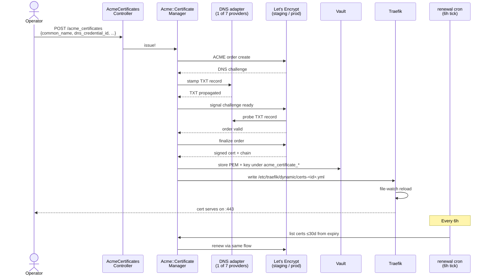
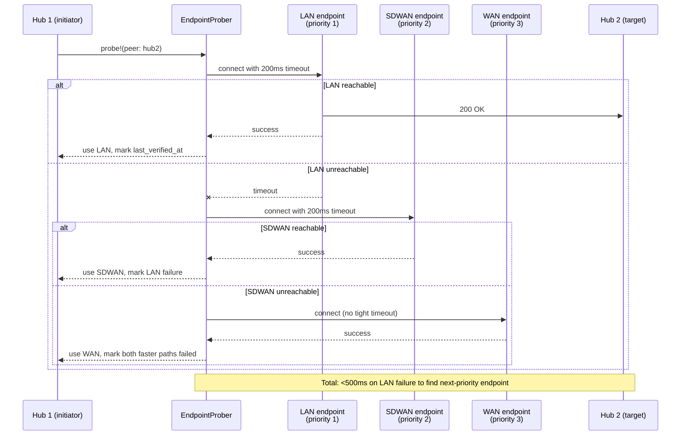

# ACME Certificate Issuance — Operator Runbook

> Status: active

Day-2 operator workflow for ACME DNS-01 cert lifecycle: provider setup,
Vault credential layout, single + multi-SAN issuance, renewal/revocation,
LAN-preference endpoint discovery, Traefik termination, failover.

**Audience:** SREs operating public-facing TLS, platform deployment
engineers, security operators.

**Companion docs:**
- [`acme-smoke.md`](./acme-smoke.md) — P2.5.7 acceptance smoke test (6 live scenarios)
- [`vault-credential-restoration.md`](./vault-credential-restoration.md) — Vault DR for ACME credential restoration

> **MCP coverage note:** the ACME lifecycle is fully MCP-addressable. Issue a
> cert (create + issue in one call) with
> `platform.system_acme_provision_certificate`; the finer-grained wrappers
> `system_acme_create_dns_credential`, `system_acme_get_certificate`,
> `system_acme_renew_certificate`, and `system_acme_revoke_certificate` are
> registered actions (see the auto-generated
> [MCP tool catalog](../../../../docs/reference/auto/mcp-tools.md)). The REST
> API (`/api/v1/system/acme_certificates`, `/api/v1/system/acme_dns_credentials`)
> and the operator UI remain available for the same operations.

## Architecture summary

Two layers cooperate on DNS-01 issuance:

- **Rails side** (`extensions/system/server/app/services/acme/`) — the
  control plane. `Acme::CertificateManager` orchestrates issue / renew /
  revoke; `Acme::DnsProviderRegistry` declares the **7 supported providers**
  (cloudflare, route53, gcloud, digitalocean, hetzner, porkbun, ovh) and
  validates each credential's required fields before issuance; per-provider
  Ruby adapters live at `app/services/acme/<provider>/dns_client.rb` and back
  the "Test Connectivity" probe. `Acme::LegoClient` shells out to the on-node
  Go binary and exports the provider credentials into its environment.
- **On-node Go binary** (`powernode-acme`, built from
  `extensions/system/agent/internal/acme/`) — embedded in the platform image,
  wraps the `go-acme/lego` library and runs the actual ACME ceremony. Its
  `buildDNSProvider` switch wires all **7** providers; Cloudflare reads its
  param-named token env var, the other six read lego's standard env vars
  (`DO_AUTH_TOKEN`, `AWS_*`, `GCE_*`, `PORKBUN_*`, `OVH_*`, `HETZNER_API_KEY`)
  that `LegoClient#build_provider_env` already exported.

Cert material persists to Vault under `acme_certificate_pem/<cert-id>` and
`acme_certificate_key/<cert-id>`. Traefik (the production reverse proxy)
file-watches `/etc/traefik/dynamic/` for changes and reloads without
dropping connections.



## Provider matrix

All seven providers in `Acme::DnsProviderRegistry::PROVIDERS` are wired both
Rails-side (credential validation) and in the on-node Go issuer. The
`required_fields` column is what the operator must supply when creating the
DNS credential (validated before issuance — missing fields are a hard
failure).

| Provider (slug) | Required credential fields | Notes |
|-----------------|----------------------------|-------|
| `cloudflare` | `api_token` | `Zone:Read` + `Zone:DNS:Edit`, scoped to the target zone |
| `route53` | `access_key_id`, `secret_access_key`, `region` | AWS IAM access key + secret |
| `gcloud` | `service_account_json`, `project_id` | Google Cloud DNS service-account JSON |
| `digitalocean` | `auth_token` | Personal access token with read+write to DNS |
| `hetzner` | `api_token` | Hetzner DNS Console API token |
| `porkbun` | `api_key`, `secret_api_key` | Porkbun API key + secret API key |
| `ovh` | `application_key`, `application_secret`, `consumer_key`, `endpoint` | `endpoint` is one of `ovh-eu` / `ovh-us` / `ovh-ca` |

To add an **eighth** provider, both layers need a touch:

1. **Rails side** — add an entry to `Acme::DnsProviderRegistry::PROVIDERS`
   (`lego_id`, `required_fields`, `description`), add the slug to
   `System::AcmeDnsCredential::SUPPORTED_PROVIDERS`, optionally wire a
   network-validation probe in `validate_credentials_via_api!`, and add a
   `app/services/acme/<provider>/dns_client.rb` adapter for "Test
   Connectivity".
2. **Go side** — add a `case "<slug>":` to `buildDNSProvider` in
   `agent/internal/acme/issuer.go` (one `import` of the matching
   `go-acme/lego/v4/providers/dns/<slug>` package + one switch case) and
   export its credential env var(s) in `Acme::LegoClient#build_provider_env`.

(lego's library carries adapters for ~50 providers, so the Go-side change is
usually just the import + switch case — there's no custom `Stamp`/`Cleanup`
adapter to write.)

## Vault credential layout

Each DNS provider credential lives in Vault KV v2 under
`acme_dns_credentials/<credential-id>` with this payload:

| Key | Example | Notes |
|-----|---------|-------|
| `provider` | `cloudflare` | matches adapter name in `powernode-acme` |
| `api_token` | `dnsv-1-cf-...` | bearer token; provider-specific format |
| `account_id` | (optional) | Cloudflare account scoping |
| `zone_id` | (optional) | preselect single zone for token-scoped credentials |

The credential is rotated via the same Vault rotation flow as everything
else (per `docs/credential-restoration.md`).

## Step 1 — Configure a DNS provider credential

Via UI: `/app/system/acme` → "DNS Credentials" tab → New → fill provider
+ token → "Test Connectivity" → save.

Via MCP:

```javascript
platform.system_acme_create_dns_credential({
  name: "cloudflare-prod",
  provider: "cloudflare",
  credentials: { api_token: "<cloudflare-api-token>" }   // provider secret — stored to Vault, never echoed back
})
// → { credential: { id, status: "ready", verified_at: "..." } }
```

**Expected outcome:** the controller invokes the adapter's `Verify` call
which lists zones the token can access. Verification failures surface in
the UI before the credential is usable.

## Step 2 — Issue a single-SAN cert

Via UI: "Certificates" tab → "Request Certificate" → fill common_name +
pick credential → submit. Watch the status pill cycle
`pending → validating → valid` (~30s on LE staging, ~60–180s on prod).

Via MCP:

```javascript
platform.system_acme_provision_certificate({
  common_name: "api.example.com",
  issuer: "letsencrypt-prod",        // or "letsencrypt-staging" for testing
  challenge_type: "dns-01",
  dns_credential_id: "<credential-id>"
})
// → { certificate: { id, status: "pending", ... } }

// Poll for completion
platform.system_acme_get_certificate({ certificate_id: "<cert-id>" })
// → { certificate: { status: "valid", expires_at: "...", ... } }
```

**Expected outcome:** cert + private key stored in Vault; Traefik dynamic
config updated; HTTPS endpoint serves the cert.

## Step 3 — Issue a multi-SAN cert

```javascript
platform.system_acme_provision_certificate({
  common_name: "api.example.com",
  issuer: "letsencrypt-prod",
  challenge_type: "dns-01",
  sans: [
    "api-staging.example.com",
    "metrics.example.com"
  ],
  dns_credential_id: "<credential-id>"
})
```

**Expected outcome:** one cert covering all SANs; the DNS challenge runs
once per SAN sequentially. Total duration scales linearly with SAN count.

## Step 4 — Renew (manual or automatic)

**Automatic:** the renewal worker (`acme_certificate_renewal`, Sidekiq cron
every 6h → `AcmeCertificateRenewalJob`) POSTs the worker_api renewal-sweep
endpoint, which drives `Acme::RenewalSweepService` to find certs `pending` or
within 30 days of expiry and re-run the issuance flow. No operator action
required.

**Manual:** UI cert detail → "Renew" button, or:

```javascript
platform.system_acme_renew_certificate({ certificate_id: "<cert-id>" })
```

Expected service disruption during reload: **<1 second** (Traefik file-watch
reload is non-disruptive). For ironclad zero-disruption renewals on Tier-1
services, pre-stage the new cert under a different filename, swap atomically
at a low-traffic window.

## Step 5 — Revoke

```javascript
platform.system_acme_revoke_certificate({
  certificate_id: "<cert-id>",
  reason: "key_compromise"     // or "superseded", "cessation_of_operation"
})
// → { certificate: { status: "revoked", revoked_at: "..." } }
```

**Expected outcome:**

- Cert marked `revoked` in DB with `revoked_at` timestamp
- On-disk PEM + key files removed from `/etc/traefik/certs/`
- Traefik dynamic config no longer references the cert
- LE's OCSP responder eventually marks the cert revoked (propagation delay)

Revocation is **irreversible** — to re-enable, issue a new cert. Don't
revoke for routine rotation; just renew.

## Step 6 — LAN-preference endpoint discovery

For federation peers reachable on both LAN and public WAN, prefer the LAN
endpoint to avoid NAT'd egress. The `EndpointProber` walks each peer's
`endpoints_jsonb` in priority order.



Operator workflow:

A peer's `endpoints` are a **`platform`**-peer attribute (`peer_kind: "platform"`),
managed on the **Platform Peers** REST surface — not via any `system_sdwan_*` MCP
action (the SDWAN federation-peer surface neither permits nor serializes
`endpoints`). They're stamped at invite time:

```bash
# Set the priority-ordered endpoints when inviting the platform peer
# (POST /api/v1/system/platform/peers, served by Platform::PeersController;
#  requires the system.peers.invite permission). endpoints[].scope is one of
#  lan|sdwan|wan; lower priority wins.
curl -s -X POST \
  -H "Authorization: Bearer $JWT" -H "Content-Type: application/json" \
  http://localhost:3000/api/v1/system/platform/peers \
  -d '{
    "remote_instance_url": "https://hub2.public.example.com",
    "endpoints": [
      { "scope": "lan",   "url": "https://hub2.lan.example.com",       "priority": 1 },
      { "scope": "sdwan", "url": "https://[fd00:abcd:2::100]:8443",    "priority": 2 },
      { "scope": "wan",   "url": "https://hub2.public.example.com",    "priority": 3 }
    ]
  }'
```

```text
# Endpoint probing is automatic — the EndpointProber re-walks each peer's
# endpoints every endpoint_probe_interval_seconds (default 300s). There is no
# manual probe trigger; observe current reachability via the Platform Peers
# detail (GET /api/v1/system/platform/peers/:id — its endpoints array carries
# last_verified_at / last_failure_at) or system_recent_signals filtered on an
# exact federation.peer.* kind — federation.peer.heartbeat_stale,
# federation.peer.unreachable, federation.peer.rehandshaked. The verb has no
# prefix filter, and the introspection verb recent_events (agent execution events) never
# returns a FleetEvent at all.
```

## Step 7 — Traefik termination + dynamic config

Traefik production config lives at `/etc/traefik/traefik.yml`. Dynamic
provider config lives at `/etc/traefik/dynamic/` (Powernode writes
per-cert YAML files here). The provider entry:

```yaml
providers:
  file:
    directory: /etc/traefik/dynamic
    watch: true
```

`watch: true` makes Traefik file-poll the directory; new cert files are
picked up without restart.

For mTLS termination at the proxy (per
`docs/federation/NETWORK_TRUST.md`), additional middleware is needed:

```yaml
http:
  middlewares:
    require-mtls:
      passTLSClientCert:
        info:
          subject:
            sans: true
    inject-instance-header:
      # custom Lua plugin parses subject SAN → X-Calling-Instance
      plugin: powernode-instance-header
```

Production rollout of mTLS termination is partially shipped — see
`project_reverse_proxy_state` memory for current state.

## Step 8 — Endpoint failover scenarios

When a federation peer's LAN endpoint becomes unreachable mid-session:

1. EndpointProber's next scheduled probe detects the failure
   (`last_failure_at` stamped)
2. Subsequent connection attempts use the next-priority endpoint
3. Operator dashboard shows the degraded state via
   `system_sdwan_get_federation_peer`'s `endpoints` array (each endpoint
   has `last_verified_at` + `last_failure_at`)

For sub-500ms failover during active sessions, set
`endpoint_probe_interval_seconds` lower on the peer (default 300s).

## Common failure modes

**Cert stuck at `pending`** — ACME order created but DNS challenge never
satisfied. Three sub-cases:

- DNS provider token scope insufficient — re-test connectivity (Step 1)
- DNS propagation slow (especially Cloudflare with proxied records) — wait 60s and retry, or disable proxying for the challenge subdomain
- LE rate limit hit (50 certs / week / domain on prod) — switch to
  staging for testing or wait for the rate window

**Cert stuck at `validating`** — challenge created, LE can't verify TXT
record. Verify the TXT is in DNS:

```bash
dig +short TXT _acme-challenge.api.example.com
```

If empty, the adapter's `Stamp` failed silently. Check Sidekiq logs:

```bash
journalctl -u 'powernode-*-sidekiq.service' | grep -i acme
```

**Renewal worker isn't running** — check Sidekiq cron registration:

```bash
curl -s http://localhost:4567/api/v1/sidekiq/cron | jq '.[] | select(.name | contains("acme"))'
# → should show acme_certificate_renewal with next_run_at populated
```

If missing, restart `powernode-*-sidekiq.service` (it registers cron entries on boot).

**Traefik doesn't reload after issue/renew** — file-watcher is broken or
the file wasn't written to the right path. Verify:

```bash
ls -la /etc/traefik/dynamic/  # files should appear here
sudo systemctl reload traefik  # forces reload
journalctl -u traefik | grep -i "loaded configuration"
```

**Multi-SAN issuance succeeds for some SANs but fails for others** —
mixed-zone certs. The current adapter is per-credential, so all SANs
must be in zones the same token can edit. Either:

- Split into per-zone certs
- Use a Cloudflare account-level token that covers all zones

**`endpoints_jsonb` ignored / wrong endpoint used** — probe interval
not yet expired. There is no manual probe trigger; wait for the next
scheduled probe (`endpoint_probe_interval_seconds`, default 300s) or lower
that interval on the peer so the prober re-walks the endpoints sooner.

**OCSP staple stale after revoke** — OCSP propagation is hours, not
minutes. Verify the cert is revoked in DB; OCSP responders eventually
catch up. For immediate enforcement, rely on the platform's removal of
the cert from Traefik (which is instant), not OCSP.

## DR scenarios

**Vault lost, certs in DB intact** — restore Vault (per
`vault-credential-restoration.md`); if the Vault snapshot is older than
some cert's issuance, that cert's PEM+key are gone. Either restore newer
Vault snapshot or **re-issue affected certs** (ACME is cheap).

**DB lost, Vault intact** — restore DB. `AcmeCertificate` rows reference
Vault paths; the next renewal cycle will populate `expires_at`. For
emergency certs not in DB, query Vault directly and re-create the DB
row.

**Both lost** — re-issue everything. ACME certs are designed to be
disposable; only the private keys are sensitive (and ACME keys themselves
auto-rotate on every issue).

## Cross-references

- [`acme-smoke.md`](./acme-smoke.md) — P2.5.7 acceptance smoke (6 scenarios)
- [`vault-credential-restoration.md`](./vault-credential-restoration.md) — Vault DR procedure
- [`../credential-restoration.md`](../credential-restoration.md) — design-level credential lifecycle
- [`../federation/NETWORK_TRUST.md`](../federation/NETWORK_TRUST.md) — sovereign auth handshake; cert is the mTLS material
- `extensions/system/server/app/services/acme/certificate_manager.rb` — issuance + renewal + revocation entry point
- `extensions/system/server/app/services/acme/renewal_sweep_service.rb` — 6h renewal-sweep driver (`AcmeCertificateRenewalJob` worker_api target)
- `extensions/system/server/app/services/acme/dns_provider_registry.rb` — the 7-provider registry + required-fields validation
- `extensions/system/agent/internal/acme/issuer.go` — on-node Go ACME ceremony (`buildDNSProvider` wires all 7 providers)
- `extensions/system/server/app/services/federation/endpoint_prober.rb` — LAN-preference probe logic

_Last verified: 2026-06-03 (rev 2)_
