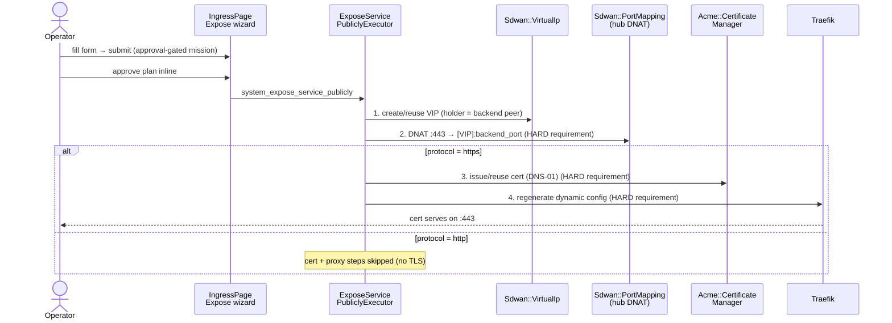

# Expose a Service Publicly with TLS — Operator Runbook

End-to-end operator procedure for publishing an internal backend service to
the public internet with a Let's Encrypt TLS certificate, fronted by the
platform's reverse proxy. One approval-gated skill chains the four primitives
you'd otherwise wire by hand: an **SDWAN Virtual IP** → a **hub DNAT port
mapping** → an **ACME certificate** (DNS-01) → a **reverse-proxy regen**.

**Audience:** SREs publishing public-facing services, platform deployment
engineers, network operators.

**Companion docs:**
- [`sdwan-network-setup.md`](./sdwan-network-setup.md) — create the overlay
  network + attach the hub peer this runbook depends on (Phases 1–4).
- [`acme-issuance.md`](./acme-issuance.md) — day-2 ACME cert lifecycle
  (provider setup, renewal, revocation) the cert step here builds on.
- [`acme-smoke.md`](./acme-smoke.md) — release-gate smoke for the ACME path.

## What the expose flow does

`System::Ai::Skills::ExposeServicePubliclyExecutor` (MCP action
`system_expose_service_publicly`, also reachable through the IngressPage
**Expose Service** wizard) runs four steps in order:

1. **Virtual IP** — creates (or reuses, by name `expose-<hostname>`) an SDWAN
   VIP that fronts the backend peer/instance
   (`system_sdwan_create_virtual_ip`).
2. **Hub port mapping** — a DNAT rule on the public hub peer forwarding `:443`
   (https) / `:80` (http) to the VIP + backend port
   (`system_sdwan_create_port_mapping`).
3. **ACME certificate** — a TLS cert for the hostname via DNS-01
   (`AcmeCertificateProvisionExecutor`). **https only.**
4. **Reverse-proxy regen** — folds the new cert into the Traefik dynamic
   config (`ReverseProxyComposeExecutor`). **https only.**



> **Hard-requirement semantics:** the port-mapping step always aborts the
> expose on failure. For **https**, the cert step *and* the reverse-proxy
> regen are **also** hard requirements — if either fails, the whole expose
> fails (no silent partial success; you never get a public endpoint without
> TLS). For **http**, the cert + proxy steps are skipped entirely.

## Prerequisites

Before exposing anything, confirm all of the following:

- [ ] **An SDWAN overlay network** (`Sdwan::Network`, a `/64`) exists. See
      [`sdwan-network-setup.md`](./sdwan-network-setup.md) Phase 1.
- [ ] **A hub peer** attached to that network
      ([`sdwan-network-setup.md`](./sdwan-network-setup.md) Phase 2) that will
      terminate the public port.
- [ ] **For internet reachability** (beyond a local `--resolve` test): the hub
      peer is `publicly_reachable: true` and has a **routable public IP** — it
      is the DNAT hub for `:443`. A public **A/AAAA record** for the hostname
      must point at that public IP. (DNS-01 cert validation itself does **not**
      need the A record — lego writes a TXT record via the provider API.)
- [ ] **A free host CIDR** for the VIP — an operator-supplied `/128` within the
      network's `/64` (or `/32` for IPv4). There is **no allocator**; you pick a
      free address. Confirm it's not already assigned with
      `system_sdwan_list_virtual_ips` / `system_sdwan_list_vip_assignments`.
- [ ] **The backend target attached to the network** — exactly one of a
      `target_peer_id` (`Sdwan::Peer`) or a `target_instance_id`
      (`System::NodeInstance`). An instance must already have an SDWAN peer in
      this network (the executor resolves the instance → its holder peer and
      refuses to create a holderless VIP).
- [ ] **For https: a stored Cloudflare DNS credential** —
      `System::AcmeDnsCredential` with `provider: cloudflare`, whose API token
      lives in Vault. Create it under `/app/system/acme` → **DNS Credentials**
      and run **Test Connectivity** until it reads `valid`. See
      [`acme-issuance.md`](./acme-issuance.md) Step 1.

> **DNS provider support — Cloudflare only in v1.** The bundled
> `powernode-acme` binary is compiled with the Cloudflare DNS-01 provider only.
> `System::AcmeDnsCredential::SUPPORTED_PROVIDERS` lists other slugs and the UI
> will let you save them, but issuance with any non-Cloudflare provider **errors
> at the ACME step**. Use `provider: cloudflare` for the expose flow today.
> Let's Encrypt **staging** and **prod** are both supported.

## Required inputs

The same input set applies whether you go through the wizard or call the MCP
action directly:

| Input | Required | Notes |
|---|---|---|
| `service_hostname` | yes | Public FQDN the service answers on (becomes the cert CN), e.g. `metrics.example.com` |
| `service_protocol` | yes | `http` or `https` |
| `sdwan_network_id` | yes | The `Sdwan::Network` hosting the VIP + port mapping |
| `sdwan_hub_peer_id` | yes | The publicly-reachable hub peer terminating the public port |
| `vip_cidr` | yes | Operator-supplied host CIDR — a `/128` within the network's `/64` (or `/32` v4). No allocator |
| `backend_port` | yes | Port the backend service listens on (the DNAT target port) |
| `target_peer_id` *or* `target_instance_id` | yes | Exactly one (XOR) — the backend to front |
| `dns_credential_id` | https + dns-01 | The Cloudflare `System::AcmeDnsCredential` id. Required and validated up front for https |
| `tls_issuer` | no | `letsencrypt-staging` \| `letsencrypt-prod`. **Default `letsencrypt-prod` — use staging first** |
| `challenge_type` | no | Default `dns-01` (the only mode wired for the public flow) |

## STAGING first — always

A real ACME transaction reaches out to Let's Encrypt and publishes DNS
validation records. **LE production enforces rate limits** (e.g. ~50 certs /
week / registered domain). Burning a prod issuance on a misconfigured VIP, hub,
or credential is a slow, rate-limited mistake.

Run the **first** expose for any hostname with `tls_issuer: letsencrypt-staging`.
The staging chain is functionally identical (it just isn't publicly trusted —
browsers/`curl` will warn or need `-k`). Once the staging cert serves and you've
verified routing end-to-end, re-run with `tls_issuer: letsencrypt-prod`.

> **Re-running is safe** — see [Idempotent re-provision](#idempotent-re-provision-after-a-failed-attempt).
> The VIP is reused by name and a valid unexpired cert is reused, so the
> staging → prod re-run does not pile up VIPs or port mappings.

## Procedure A — via the IngressPage Expose-Service wizard

The wizard at **`/app/system/ingress`** → **Expose Service** tab submits an
**approval-gated mission** through the System Concierge — nothing is exposed
until you approve the plan inline. Requires the `system.ingress.manage`
permission.

1. Navigate to `/app/system/ingress` and select the **Expose Service** tab.
2. Fill the form:
   - **Public hostname** — `metrics.example.com`
   - **Protocol** — `https`
   - **Backend port** — e.g. `8080`
   - **SDWAN network** — pick from the list
   - **SDWAN hub peer** — pick the publicly-reachable hub (list populates after
     network selection)
   - **VIP CIDR** — your chosen free host CIDR, e.g. `fd00:abcd:1::100/128`
   - **TLS issuer** — for the first run, type `letsencrypt-staging`
   - **DNS credential** — the Cloudflare credential
3. Click **Submit expose request**. The Concierge classifies the brief,
   composes the mission, and emits an **inline Approve/Reject card** in the
   Mission approval panel.
4. **Review the plan, then approve.** Execution begins only on approval.
5. Watch the conversation for the step results (`create_virtual_ip` /
   `reuse_virtual_ip` → `create_port_mapping` → `provision_certificate` /
   `reuse_certificate` → `reverse_proxy_regen`).

> The **Routes** tab on the same page (`/app/system/ingress` → Routes, permission
> `system.ingress.read`) is a read-only monitor of the derived Traefik routers
> (`GET /api/v1/system/ingress_routes`). After a successful expose, the new
> hostname's router appears here.

## Procedure B — via the MCP `system_expose_service_publicly` action

Equivalent to the wizard, callable from any MCP client (Claude Code, the
Concierge tool surface, scripts). The action is approval-gated when run as a
mission; the inline Approve card still governs execution.

**Staging first:**

```javascript
platform.system_expose_service_publicly({
  service_hostname:  "metrics.example.com",
  service_protocol:  "https",
  sdwan_network_id:  "<network-id>",
  sdwan_hub_peer_id: "<hub-peer-id>",        // publicly_reachable hub
  vip_cidr:          "fd00:abcd:1::100/128", // free /128 in the network's /64
  backend_port:      8080,
  target_instance_id: "<backend-instance-id>", // XOR target_peer_id
  dns_credential_id: "<cloudflare-credential-id>",
  tls_issuer:        "letsencrypt-staging",  // STAGING first
  challenge_type:    "dns-01"                // default
})
// → { service_hostname, vip_id, vip_cidr, port_mapping_id,
//     certificate_id, certificate_status,
//     public_endpoints: ["https://metrics.example.com"],
//     steps_completed: ["create_virtual_ip","create_port_mapping",
//                       "provision_certificate","reverse_proxy_regen"],
//     warnings: [] }
```

**Then promote to prod** (re-run is idempotent — reuses the VIP + port mapping,
re-issues the cert under prod):

```javascript
platform.system_expose_service_publicly({
  // ...same inputs...
  tls_issuer: "letsencrypt-prod"
})
```

**Backend by peer instead of instance** — pass exactly one:

```javascript
  target_peer_id: "<backend-peer-id>"   // mutually exclusive with target_instance_id
```

**http exposure (no TLS)** — the cert + proxy steps are skipped; `:80` is
DNAT'd straight to the VIP:

```javascript
platform.system_expose_service_publicly({
  service_hostname:  "status.example.com",
  service_protocol:  "http",
  sdwan_network_id:  "<network-id>",
  sdwan_hub_peer_id: "<hub-peer-id>",
  vip_cidr:          "fd00:abcd:1::101/128",
  backend_port:      8080,
  target_peer_id:    "<backend-peer-id>"
  // no dns_credential_id / tls_issuer needed for http
})
```

### Lower-level actions (manual / re-run a single step)

If a step failed and you want to re-drive just one piece, the same
`SystemIngressTool` exposes the building blocks (the expose flow composes
these):

- `system_acme_provision_certificate` — issue a cert for a hostname (perm
  `system.acme.manage`). Inputs: `common_name`, `issuer`, `challenge_type`,
  `dns_credential_id` (dns-01), optional `sans` / `acme_email`.
- `system_reverse_proxy_compose` — regenerate the Traefik dynamic config for an
  already-valid `certificate_id` (perm `system.ingress.manage`).

## Verification

### 1. Served certificate (SNI)

Confirm Traefik serves the right leaf for the hostname (not its built-in
self-signed default):

```bash
echo | openssl s_client -connect <traefik-host>:443 -servername metrics.example.com 2>/dev/null \
  | openssl x509 -noout -subject -issuer -dates
```

Expect:
- **Subject** `CN = metrics.example.com`
- **Issuer** a Let's Encrypt issuer — for staging the issuer string contains
  `(STAGING)` (e.g. `(STAGING) Let's Encrypt`); for prod it's the production LE
  intermediate.
- A **NotAfter** ~90 days out.

If the issuer reads like a Traefik default self-signed cert (a `TRAEFIK DEFAULT
CERT` / Traefik default subject) instead of an LE leaf, the reverse-proxy regen
didn't pick up the cert — see [Troubleshooting](#troubleshooting).

### 2. Routing (curl with `--resolve`)

Verify the hub DNAT + VIP + backend path serves the app, bypassing public DNS
by pinning the hostname to the Traefik IP:

```bash
curl -k --resolve metrics.example.com:443:<traefik-ip> \
  https://metrics.example.com/healthz
```

(`-k` because a staging cert isn't publicly trusted; drop it once on a prod cert
and trusting the LE root.) A `200` (or whatever your backend returns on that
path) confirms the chain end-to-end.

### 3. Public reachability (real internet)

The `--resolve` check above proves the local hub → VIP → backend path. For
**actual** public reachability you additionally need:

- the hub peer `publicly_reachable: true` with a routable public IP, and
- a public **A/AAAA** record for `metrics.example.com` pointing at that IP.

Then the same `curl https://metrics.example.com/...` works without `--resolve`
from anywhere.

### 4. Routes monitor

`/app/system/ingress` → **Routes** (or `GET /api/v1/system/ingress_routes`)
should now list a router for `metrics.example.com`.

## Troubleshooting

### SERVFAIL / split-brain DNS during cert issuance

**Symptom:** the cert step fails with a lego error like
`could not find zone for domain "metrics.example.com." ... SERVFAIL`, or a
propagation/zone-detection timeout.

**Cause:** on hosts whose **system resolver** can't resolve the public zone
(e.g. a split-horizon / internal resolver that returns `SERVFAIL` on the zone's
SOA), lego's zone-detection step fails before it can write the TXT record. This
is a resolver problem, not a credential problem.

**Fix:** point lego at a public recursive resolver via the environment (systemd
unit env for `powernode-backend`, or the Rails process env):

```bash
POWERNODE_ACME_DNS_RESOLVERS="1.1.1.1:53,1.0.0.1:53"
```

`powernode-acme` reads this (comma-separated `host:port`) and uses those
resolvers for propagation polling instead of the host's split-brain resolver.
Set it, restart the backend, and re-run the expose.

**Last resort:** if propagation polling still stalls (and only then), set:

```bash
POWERNODE_ACME_DISABLE_PROPAGATION_CHECK=true
```

This skips lego's "all authoritative NS agree" pre-check. LE's own external
validation still has to succeed, so use it sparingly — it masks symptoms rather
than fixing the resolver.

### Idempotent re-provision after a failed attempt

A failed expose (bad credential, SERVFAIL, wrong port) is **safe to re-run** —
the flow is idempotent, so you don't have to clean up first:

- **VIP** — reused when a VIP named `expose-<hostname>` already exists in the
  network (re-runs don't pile up VIPs).
- **Certificate** — a valid, unexpired cert for the hostname is reused; no
  needless ACME round-trip. If the previous attempt left the cert row in
  `failed`, the certificate manager re-drives the **same row** (`failed →
  issuing → valid` is a permitted state-machine edge — it re-issues, it does not
  spawn a duplicate row).

So the correct recovery after a failed attempt is simply to fix the root cause
(resolver, credential, port) and **call `system_expose_service_publicly` again
with the same inputs**.

### Port-mapping uniqueness on the hub

**Symptom:** the port-mapping step fails a uniqueness validation.

**Cause:** `Sdwan::PortMapping` enforces uniqueness on
`(hub_peer, listen_port, protocol)` — a hub peer can have only **one** `:443/tcp`
(https) or `:80/tcp` (http) mapping. If that hub already terminates `:443` for a
different service, the new mapping collides.

**Fix:** terminate the new hostname on a **different hub peer**, or consolidate —
a single Traefik behind one `:443` mapping can host **many** hostnames (each
expose adds a router, all sharing the one hub `:443` DNAT). The usual pattern is
**one** `:443` hub mapping into the proxy VIP, then expose additional services as
**http** to the proxy (or front them all through the one Traefik), rather than a
second public `:443` mapping on the same hub.

### Host-allowlist 403s

**Symptom:** the cert serves correctly (openssl shows the right leaf) but
requests return **403** before reaching the app.

**Cause:** in production the served hostname must be allowlisted by the upstream
it routes to:
- **Frontend (Vite)** — the hostname must be in `allowedHosts`
  (`frontend/vite.config.ts`).
- **Rails API** — the hostname must pass `HostAuthorization`
  (`config.hosts`, set per environment).

A hostname Traefik routes to an upstream that doesn't allowlist it is rejected
with 403 by that upstream.

**Fix:** add `metrics.example.com` to the relevant allowlist (Vite
`allowedHosts` and/or Rails `config.hosts`) and reload that service. If the
expose fronts the platform's own proxy hosts, the `POWERNODE_PROXY_EXTRA_HOSTS`
env (consumed by the Traefik config writer / ingress route presenter) is the
matching knob for the router host rule.

### Cloudflare-only DNS provider (v1)

**Symptom:** issuance fails at the ACME step with a "DNS provider not yet wired"
/ provider error for a non-Cloudflare credential.

**Cause:** the bundled `powernode-acme` binary is compiled with the **Cloudflare
DNS-01 provider only** in v1. Other slugs validate in the UI but error at
issuance.

**Fix:** use a `provider: cloudflare` credential for the expose flow. (Both LE
staging and prod issuers work with Cloudflare.)

### Other common failures

| Symptom | Cause | Fix |
|---|---|---|
| `provide exactly one of target_peer_id or target_instance_id` | Passed both or neither | Pass exactly one (XOR) |
| `target_instance_id ... has no SDWAN peer in network ...` | Instance not attached to this network | Attach it first ([`sdwan-network-setup.md`](./sdwan-network-setup.md) Phase 2) or pass `target_peer_id` |
| `dns_credential_id is required for https exposures using the dns-01 challenge` | https + dns-01 without a credential | Pass the Cloudflare `dns_credential_id` (validated up front, before any VIP/port mapping is created) |
| Cert stuck / never validates (TXT missing) | Credential token scope insufficient, or propagation slow | Re-test connectivity (DNS Credentials tab); for Cloudflare disable proxying on the challenge subdomain; see [`acme-issuance.md`](./acme-issuance.md) failure modes |
| LE rate limit hit | Repeated **prod** issuance for the same domain | Switch to `letsencrypt-staging` for iteration; wait out the prod rate window |
| Served cert is the Traefik default, not the LE leaf | Reverse-proxy regen didn't run / cert not valid yet | Confirm `certificate_status: valid`; re-run `system_reverse_proxy_compose` with the `certificate_id`; check Traefik file-watch (see [`acme-issuance.md`](./acme-issuance.md) Step 7) |

## Cross-references

- [`sdwan-network-setup.md`](./sdwan-network-setup.md) — network + hub peer +
  VIP + port-mapping primitives this flow composes (Phases 1–4).
- [`acme-issuance.md`](./acme-issuance.md) — ACME DNS-01 cert lifecycle (provider
  setup, renewal, revocation, Traefik termination).
- [`acme-smoke.md`](./acme-smoke.md) — release-gate ACME smoke test.
- [`../tutorials/INDEX.md`](../tutorials/INDEX.md) — learning-oriented operator
  tutorials.
- `extensions/system/server/app/services/system/ai/skills/expose_service_publicly_executor.rb`
  — the four-step orchestrator.
- `extensions/system/server/app/services/ai/tools/system_ingress_tool.rb` — the
  MCP action surface (`system_expose_service_publicly`,
  `system_acme_provision_certificate`, `system_reverse_proxy_compose`).
- `extensions/system/agent/internal/acme/issuer.go` — `POWERNODE_ACME_DNS_RESOLVERS`
  / `POWERNODE_ACME_DISABLE_PROPAGATION_CHECK` handling.
</content>
</invoke>
