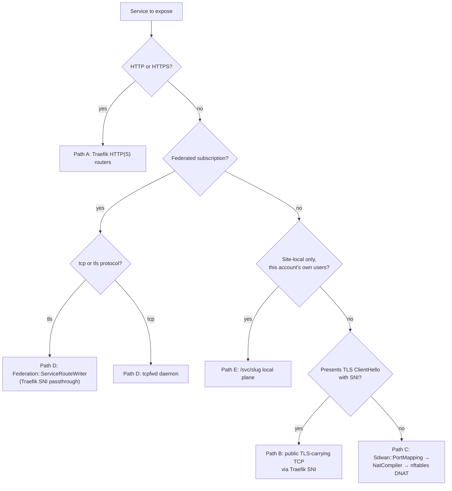

# Traefik TCP Exposure vs. DNAT — Operator Decision Guide

> Status: active (mixed — see the "planned" markers per path below)

You have a service to expose — public, federated, or site-local — and need to pick the right
underlying mechanism. Powernode uses a **capability-tiered hybrid**: the bundled Traefik handles
HTTP(S) and **TLS-carrying** TCP (traffic that presents a TLS ClientHello with SNI); everything
else — UDP, plaintext (non-SNI) TCP, and anything source-IP-sensitive — stays on nftables DNAT
permanently. This runbook is the decision guide for which path a given service belongs on, and
what to configure for each. It reflects the decisions ratified by campaign
`019f3458-e607-7528-937d-3c159f097901` (2026-07-05) — see
[`../../../docs/operations/reverse-proxy.md`](../../../docs/operations/reverse-proxy.md#ratified-decisions--campaign-019f3458-2026-07-05)
for the full ratification.

**Audience:** SREs and network operators deciding how to expose a new service; anyone debugging
"why doesn't my TCP service route through Traefik."

**Companion docs:**
- [`expose-service.md`](./expose-service.md) — the public HTTP(S) expose flow (VIP + DNAT + ACME).
- [`publish-service.md`](./publish-service.md) — the site-local `/svc/<slug>` plane.
- [`sdwan-network-setup.md`](./sdwan-network-setup.md) — overlay network + hub peer + VIP primitives.
- [`federation-setup.md`](./federation-setup.md) — federation peering + subscriptions.
- [`../../../docs/operations/reverse-proxy.md`](../../../docs/operations/reverse-proxy.md) — bundled
  Traefik architecture, the ratified decisions, and the (unbuilt) core/extension ingress seam.

## The decision rule, in one paragraph

**Does the traffic present a TLS ClientHello with SNI before Traefik has to make a routing
decision?** If yes, and the destination is either (1) this platform's own public/federated
services or (2) a service you've explicitly published behind a public hostname, it can ride
Traefik's `tcp.routers` on the existing `websecure` (`:443`) entrypoint. If no — UDP, plaintext
TCP, or anything where the true client source IP must survive to the backend — it goes on
nftables DNAT via `Sdwan::PortMapping`, **permanently**. Powernode does **not** add new Traefik
entrypoints for non-HTTP traffic, ever; there is exactly one TCP-capable entrypoint
(`websecure`) and it is reserved for SNI-routable traffic.

## Path A — HTTP(S) via existing Traefik routers

**Status: built and live.** Use this for the platform's own API/frontend/worker-web traffic, or
for any HTTP(S) backend you publish under a hostname.

- **Config surface:** `System::AcmeCertificate` (one per hostname) drives
  `Acme::TraefikConfigWriter`'s 10 fixed per-cert routers (`ROUTER_SPECS`,
  `extensions/system/server/app/services/acme/traefik_config_writer.rb:414-425`), all on
  `websecure`. For a custom backend rather than the platform's own, use the **Path E** local
  plane or the **Path A public** expose flow below.
- **Public HTTP(S) expose flow:** `system_expose_service_publicly` (approval-gated) — see
  [`expose-service.md`](./expose-service.md). Chains VIP → hub DNAT on `:443`/`:80` → ACME cert →
  Traefik regen.
- **Verification:** `openssl s_client -connect <host>:443 -servername <host>` for the served
  leaf; `GET /api/v1/system/ingress_routes` for the derived router list.

## Path B — Public TLS-carrying TCP via Traefik SNI (built)

**Status: built (increment 5 substrate + the increment 10 prerequisite owning executor,
campaign 019f3458): `Sdwan::Service` carries `public_enabled`/`edge_mode`/`client_auth`
with the validations below, `Sdwan::ServiceExposureWriter` renders the HostSNI
`tcp.routers`, and `System::Ai::Skills::ExposeServicePublicTcpExecutor` (MCP actions
`system_expose_service_public_tcp` / `system_unexpose_service_public_tcp`) is the sole
owner of flipping `public_enabled`, in either direction — `system_update_service`'s inline
CRUD still refuses to touch it. EXPOSE validates protocol `tls`, a resolvable HostSNI
host, and — under `edge_mode: terminate` — a matching valid `System::AcmeCertificate`,
before enabling; UNEXPOSE has no preconditions (improvement `019f34f9`, the increment 10
edge-smoke prerequisite).**

Use this path for a **non-HTTP TCP service you want to publish under a public hostname**, where
the protocol itself negotiates TLS with SNI (e.g. a raw TLS-wrapped protocol, not bare HTTP/2 or
HTTP/1.1 — those are Path A). Examples: a custom TLS-wrapped RPC service, a database protocol
tunneled over TLS with SNI.

- **`edge_mode` (column on `Sdwan::Service`, default `passthrough`):**
  - `passthrough` (**default**) — Traefik forwards the encrypted stream untouched; your backend
    terminates TLS itself. Lowest operational risk; Traefik never sees plaintext.
  - `terminate` (**opt-in**) — Traefik terminates TLS via its own ACME-issued cert, then forwards
    plaintext to the backend over the overlay. Choose this only when the backend can't do its own
    TLS termination.
  - **Proxy-terminated mTLS ships in v1** of this feature — client-certificate enforcement at the
    Traefik edge is not deferred to a later increment.
- **Entrypoint:** the **existing** `websecure` (`:443`) entrypoint only — SNI-routed `tcp.routers`
  share the port with HTTP(S) traffic; Traefik demuxes by inspecting the ClientHello's SNI before
  deciding HTTP vs. raw TCP passthrough. No new entrypoint is created.
- **Enable/disable:** `system_expose_service_public_tcp` (approval-gated) flips `public_enabled`
  on after validating protocol/host/cert as above; `system_unexpose_service_public_tcp`
  (also approval-gated — unlike Path E's fail-safe unexpose) turns it off. Both regenerate the
  reverse proxy.
- **Verification:** `openssl s_client -connect <host>:443 -servername <host>` should
  complete a TLS handshake (passthrough: your backend's cert; terminate: Traefik's cert), then
  carry your protocol's own bytes.

## Path C — UDP / non-SNI TCP / source-IP-sensitive via nftables DNAT

**Status: built and live.** This is the **permanent** home for:
- Any **UDP** service (DNS, QUIC-as-UDP, custom UDP protocols) — Traefik's TCP routers cannot
  carry UDP, and none will ever be added for it.
- **Plaintext (non-SNI) TCP** — nothing to inspect for routing, so Traefik has no way to
  multiplex it onto a shared entrypoint. (Federated `tcp`-protocol *subscriptions* are the
  exception: they ride the `tcpfwd` daemon — see Path D — not DNAT; this path is for
  publishing your own plaintext-TCP services.)
- **Source-IP-sensitive services** — anything where the real client IP must reach the backend
  unmodified. Traefik (like any L7/L4 proxy terminating or passing through a shared entrypoint)
  can obscure or rewrite the apparent source; DNAT preserves it because the kernel rewrites only
  the destination, never touches the source address.

- **Config surface:** `Sdwan::PortMapping` (`extensions/system/server/app/models/sdwan/port_mapping.rb`)
  — one row per `(hub_peer, listen_port, protocol)`, `protocol` is `tcp` or `udp`, target is
  either a `target_peer` or a `target_virtual_ip`. `Sdwan::NatCompiler`
  (`extensions/system/server/app/services/sdwan/nat_compiler.rb`) compiles each hub's enabled,
  resolvable mappings into an `nft` DNAT chain (`type nat hook prerouting priority -100`), applied
  atomically by the on-node agent's `nat_applier.go`.
- **MCP surface:** `system_sdwan_create_port_mapping` (used standalone, or composed by
  `system_expose_service_publicly` for the HTTP(S) public-expose flow's own `:443`/`:80` DNAT
  hop — see [`expose-service.md`](./expose-service.md)).
- **Hardening (built — increment 6):** `Sdwan::PortMapping` carries three optional, independent
  enforcement axes, compiled by `Sdwan::NatCompiler` into guard rules that precede the mapping's
  DNAT line in the nft chain (a dropped packet never reaches `dnat to ...`):
  - `rate_limit` — integer **new connections per second** (conntrack flows/second — NOT
    requests or packets: the DNAT chain is `nat prerouting`, which only each connection's
    FIRST packet traverses, so the budget throttles connection-establishment rate; a single
    keep-alive connection can carry any number of requests unthrottled). Compiles to nft's
    negated rate-limit idiom, `limit rate over <n>/second drop` (only traffic exceeding the
    budget matches and drops; traffic within budget falls through). Stored as a plain integer
    rather than a free-form rate string (e.g. `"10/second"`) because nft's rate grammar
    supports multiple units and byte-rate forms that would need a real parser to validate
    strictly — an integer/second is unambiguous and substitutes directly into the fixed
    `<n>/second` form.
  - `max_connections` — integer concurrent-connection cap. Compiles to the standard nftables
    connlimit idiom, `ct count over <n> drop`.
  - `source_cidrs` — allow-list of source CIDR strings (v4 and/or v6; same jsonb-array shape as
    `System::FederationGrant#source_cidrs`). Because a single nft match clause can't mix `ip`
    and `ip6` literals, a mapping compiles to **one guard per address family**: the family with
    entries gets a negated-membership drop (`ip[6] saddr != { ... } drop` — only listed sources
    survive), and the family with *no* entries gets a full `meta nfproto ipv4|ipv6 drop` — an
    allow-list naming only v4 CIDRs means v6 traffic is not allowed at all, not silently
    unrestricted.
  - **All three are `NULL`/empty by default — absence means unrestricted**, and compiling a
    mapping with none of them set produces byte-identical output to a mapping with the columns
    absent (no hardcoded platform-wide default; a future default, if any, belongs in
    `SiteSetting`, not a bare constant).
  - **nft version note:** `ct count over` and the negated `limit rate over` form are standard
    nftables statements with no unusual version floor beyond what the platform already requires
    for the base DNAT chain (`type nat hook prerouting`); no additional minimum was identified
    during increment 6. `meta nfproto` is likewise a baseline nftables match.
  - **MCP surface:** `system_sdwan_create_port_mapping` / `system_sdwan_update_port_mapping`
    accept `rate_limit`, `max_connections`, `source_cidrs`; pass `rate_limit`/`max_connections`
    as `null` or `source_cidrs` as `[]` on update to clear a mapping back to unrestricted.
- **Verification:** inspect the compiled ruleset for the hub peer (`Sdwan::NatCompiler.compile_for_peer`)
  or `nft list table inet powernode_sdwan` on the hub host; confirm the DNAT rule's
  `dnat to [<target>]:<port>` matches the mapping's `resolved_target_address`/`effective_target_port`.

## Path D — Federated subscriptions: `tcpfwd` vs. Traefik passthrough

**Status: built — `tls`-protocol subscriptions ride Traefik SNI passthrough (bugs fixed in
increment 4); `tcp`-protocol subscriptions ride the `tcpfwd` daemon (increment 3's writer +
increment 4's cutover + agent wiring).**

A subscriber consuming a remote operator's `System::Federation::ServiceOffering` gets a
`System::Federation::ServiceSubscription` with a `protocol` of `https`, `http`, `tcp`, or `tls`.
`Federation::ServiceRouteWriter`
(`extensions/system/server/app/services/federation/service_route_writer.rb`) renders the
subscriber-side Traefik dynamic config for the non-HTTP protocols:

- **`tls` protocol (SNI-carrying)** → Traefik `tcp.routers` with `HostSNI`. Three bugs were
  confirmed as of 2026-07-05 and **fixed in increment 4**:
  - The `tls` branch never set `passthrough: true` (`add_tcp_route!` only set
    `router["tls"] = {}`) — silent mis-termination. **Fixed:** the branch now sets
    `"tls" => { "passthrough" => true }`.
  - The `tls` branch never set `entryPoints` — the router bound every TCP-capable entrypoint,
    including the plaintext `web` (`:80`) entrypoint, not just `websecure`. **Fixed:** the router
    now sets `entryPoints: ["websecure"]` explicitly.
  - `add_tcp_route!` was invoked for both `"tcp"` and `"tls"` protocols. **Fixed:** the dispatch
    (`render_yaml`'s case statement) is narrowed to `"tls"` only — see next bullet.
- **`tcp` protocol (plaintext, no SNI)** → previously, `add_tcp_route!` emitted a `HostSNI` rule
  for it, which **could never match** — there is no TLS ClientHello to read SNI from. **Fixed:**
  `ServiceRouteWriter` no longer emits a Traefik router for `tcp`-protocol subscriptions at all
  (`active_traefik_subs` excludes them alongside site-local subs); they route via the `tcpfwd`
  daemon below instead.
- **Site-local subscriptions** (`ServiceSubscription#site_local?` — `local_hostname` starting
  `localhost:` or `127.0.0.1:`) are excluded from `ServiceRouteWriter`'s output
  (`active_traefik_subs` rejects them) — they were always meant for the forwarder daemon, not
  Traefik.
- **`powernode-tcp-forwarder` (`tcpfwd`)** — the Go agent's TCP forwarder
  (`extensions/system/agent/internal/tcpfwd/`) reads a JSON `Config`
  (`{"forwards": [{"listen", "backend", "protocol", "subscription_id"}]}`, `protocol` must be
  `"tcp"` in v1) and proxies each `(listen, backend)` pair. The `powernode-agent service` loop
  (`extensions/system/agent/internal/runtime/service.go`) loads this config at startup from
  `tcpfwd.DefaultConfigPath` (`/etc/powernode/tcpfwd/forwards.json`) — load-at-start only; reload
  on a changed file is not yet supported and requires an agent restart. The server-side writer —
  `Federation::TcpForwarderConfigWriter`
  (`extensions/system/server/app/services/federation/tcp_forwarder_config_writer.rb`, built in
  increment 3) — as of increment 4 selects both site-local subscriptions and any `tcp`-protocol
  subscription (site-local or not), matching `ServiceRouteWriter`'s narrowed exclusion so exactly
  one writer runs per subscription. It remains the target for any future UDP forwarding needs
  (`tcpfwd` v2, explicitly deferred).
  - **Listen-address note for non-site-local `tcp` subscriptions:** unlike site-local
    `local_hostname` (which already embeds a port, e.g. `localhost:5432`), a non-site-local
    subscription's `local_hostname` is a bare hostname with no port (it was written for
    `Host()`/`HostSNI()` rules). `TcpForwarderConfigWriter` pairs it verbatim with the
    subscription's own `backend_port` to form the bind address — a conservative choice with no
    plan/runbook precedent (flagged for follow-up; see the increment 4 report).

**Rule of thumb:** a federation subscription with `protocol: "tls"` rides Traefik SNI passthrough;
a subscription with `protocol: "tcp"` (or a site-local one, either protocol) rides `tcpfwd`. Never
the reverse.

## Path E — Site-local `/svc/<slug>` plane

**Status: built and live.** Use this for HTTP(S) services meant only for **this account's own
authenticated users**, not the public internet and not federated peers. See
[`publish-service.md`](./publish-service.md) for the full procedure — it's the local facet of the
same `Sdwan::Service` model whose public facet Path B uses for TLS-carrying TCP. `local_enabled`
local exposure is HTTP-only by model validation (`local_exposure_requires_http` in
`sdwan/service.rb`) — you cannot locally expose a raw TCP/TLS service at a `/svc/<slug>` path,
because `PathPrefix` routing requires HTTP semantics; publish it via Path B
(`system_expose_service_public_tcp`) or federate it via Path D instead.

## Quick-reference table

| Traffic shape | Path | Mechanism | Status |
|---|---|---|---|
| HTTP(S), platform's own routes | A | `Acme::TraefikConfigWriter` fixed routers | Built |
| HTTP(S), publish under a public hostname | A | `system_expose_service_publicly` (VIP+DNAT+ACME) | Built |
| HTTP(S), site-local only, own users | E | `Sdwan::Service` local facet + ForwardAuth | Built |
| TLS-carrying TCP, publish under a public hostname | B | `Sdwan::Service.edge_mode` + Traefik SNI router + `system_expose_service_public_tcp` | Built |
| Federated subscription, `protocol: tls` | D | `Federation::ServiceRouteWriter` (Traefik SNI passthrough) | Built |
| Federated subscription, `protocol: tcp` | D | `Federation::TcpForwarderConfigWriter` → `tcpfwd` | Built |
| Site-local subscription (any protocol) | D | `tcpfwd` (already excluded from Traefik) | Built |
| UDP (any use case) | C | `Sdwan::PortMapping` → `NatCompiler` → nftables DNAT | Built |
| Plaintext (non-SNI) TCP | C | Same as UDP | Built |
| Source-IP-sensitive TCP/UDP | C | Same as UDP | Built |

## Verification steps by path

- **Path A / B:** `openssl s_client -connect <host>:443 -servername <host>` — check the served
  leaf's subject/issuer; `GET /api/v1/system/ingress_routes` for the router list.
- **Path C:** `nft list table inet powernode_sdwan` on the hub peer; confirm the DNAT rule for
  the mapping's `listen_port`/`protocol` targets the expected overlay address.
- **Path D:** for `tls` subscriptions, `openssl s_client -connect <subscriber-host>:443 -servername
  <local_hostname>` should reach the remote offering's backend via SNI passthrough; for
  `tcp`/site-local, confirm the forwarder process has the expected `(listen, backend)` pairs
  loaded (agent logs / `tcpfwd` config file at `tcpfwd.DefaultConfigPath`) — note the daemon only
  loads at agent-service startup (no reload-on-change yet), so a config change needs an agent
  restart to take effect.
- **Path E:** see [`publish-service.md`](./publish-service.md#verify) — unauthenticated request
  should 401 via ForwardAuth, authenticated should reach the backend.

## Cross-references

- [`../../../docs/operations/reverse-proxy.md`](../../../docs/operations/reverse-proxy.md) — full
  Traefik architecture + the campaign's ratified decisions section.
- [`expose-service.md`](./expose-service.md) — public HTTP(S) expose flow (Path A).
- [`publish-service.md`](./publish-service.md) — site-local `/svc/<slug>` plane (Path E).
- [`federation-setup.md`](./federation-setup.md) /
  [`federation-troubleshooting.md`](./federation-troubleshooting.md) — federation peering +
  subscription lifecycle (Path D).
- [`sdwan-network-setup.md`](./sdwan-network-setup.md) — overlay network, hub peer, VIP, and
  port-mapping primitives (Path C).
- `extensions/system/server/app/services/federation/service_route_writer.rb` — the subscriber-side
  Traefik config writer discussed in Path D.
- `extensions/system/server/app/services/sdwan/nat_compiler.rb` — the DNAT ruleset compiler
  discussed in Path C.
- `extensions/system/agent/internal/tcpfwd/` — the Go agent's site-local TCP forwarder daemon.

_Last verified: 2026-07-05._
