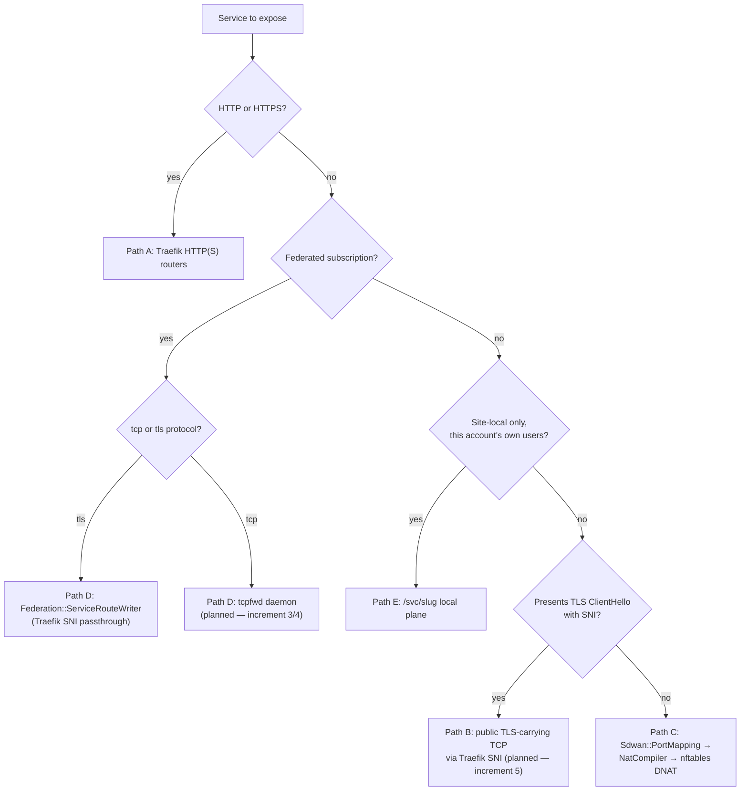

# Traefik TCP Exposure vs. DNAT — Operator Decision Guide

> Status: active (mixed — see the "planned" markers per path below)

You have a service to expose — public, federated, or site-local — and need to pick the right
underlying mechanism. Powernode uses a **capability-tiered hybrid**: the bundled Traefik handles
HTTP(S) and **TLS-carrying** TCP (traffic that presents a TLS ClientHello with SNI); everything
else — UDP, plaintext (non-SNI) TCP, and anything source-IP-sensitive — stays on nftables DNAT
permanently. This runbook is the decision guide for which path a given service belongs on, and
what to configure for each. It reflects the decisions ratified by campaign
`019f3458-e607-7528-937d-3c159f097901` (2026-07-05) — see
[`../../../docs/operations/reverse-proxy.md`](../../../docs/operations/reverse-proxy.md#ratified-decisions--campaign-019f3458-2026-07-05)
for the full ratification.

**Audience:** SREs and network operators deciding how to expose a new service; anyone debugging
"why doesn't my TCP service route through Traefik."

**Companion docs:**
- [`expose-service.md`](./expose-service.md) — the public HTTP(S) expose flow (VIP + DNAT + ACME).
- [`publish-service.md`](./publish-service.md) — the site-local `/svc/<slug>` plane.
- [`sdwan-network-setup.md`](./sdwan-network-setup.md) — overlay network + hub peer + VIP primitives.
- [`federation-setup.md`](./federation-setup.md) — federation peering + subscriptions.
- [`../../../docs/operations/reverse-proxy.md`](../../../docs/operations/reverse-proxy.md) — bundled
  Traefik architecture, the ratified decisions, and the (unbuilt) core/extension ingress seam.

## The decision rule, in one paragraph

**Does the traffic present a TLS ClientHello with SNI before Traefik has to make a routing
decision?** If yes, and the destination is either (1) this platform's own public/federated
services or (2) a service you've explicitly published behind a public hostname, it can ride
Traefik's `tcp.routers` on the existing `websecure` (`:443`) entrypoint. If no — UDP, plaintext
TCP, or anything where the true client source IP must survive to the backend — it goes on
nftables DNAT via `Sdwan::PortMapping`, **permanently**. Powernode does **not** add new Traefik
entrypoints for non-HTTP traffic, ever; there is exactly one TCP-capable entrypoint
(`websecure`) and it is reserved for SNI-routable traffic.

## Path A — HTTP(S) via existing Traefik routers

**Status: built and live.** Use this for the platform's own API/frontend/worker-web traffic, or
for any HTTP(S) backend you publish under a hostname.

- **Config surface:** `System::AcmeCertificate` (one per hostname) drives
  `Acme::TraefikConfigWriter`'s 10 fixed per-cert routers (`ROUTER_SPECS`,
  `extensions/system/server/app/services/acme/traefik_config_writer.rb:414-425`), all on
  `websecure`. For a custom backend rather than the platform's own, use the **Path E** local
  plane or the **Path A public** expose flow below.
- **Public HTTP(S) expose flow:** `system_expose_service_publicly` (approval-gated) — see
  [`expose-service.md`](./expose-service.md). Chains VIP → hub DNAT on `:443`/`:80` → ACME cert →
  Traefik regen.
- **Verification:** `openssl s_client -connect <host>:443 -servername <host>` for the served
  leaf; `GET /api/v1/system/ingress_routes` for the derived router list.

## Path B — Public TLS-carrying TCP via Traefik SNI (planned — increment 5)

**Status: planned — increment 5 of campaign 019f3458. `Sdwan::Service` has no `edge_mode`,
`public_enabled`, or `client_auth` column today** (verified: `extensions/system/server/app/models/sdwan/service.rb`
has no such fields as of 2026-07-05) — none of this is usable yet. This section documents the
ratified design so operators know what's coming and don't try to hand-roll it.

Use this path for a **non-HTTP TCP service you want to publish under a public hostname**, where
the protocol itself negotiates TLS with SNI (e.g. a raw TLS-wrapped protocol, not bare HTTP/2 or
HTTP/1.1 — those are Path A). Examples: a custom TLS-wrapped RPC service, a database protocol
tunneled over TLS with SNI.

- **`edge_mode` (planned column on `Sdwan::Service`):**
  - `passthrough` (**default**) — Traefik forwards the encrypted stream untouched; your backend
    terminates TLS itself. Lowest operational risk; Traefik never sees plaintext.
  - `terminate` (**opt-in**) — Traefik terminates TLS via its own ACME-issued cert, then forwards
    plaintext to the backend over the overlay. Choose this only when the backend can't do its own
    TLS termination.
  - **Proxy-terminated mTLS ships in v1** of this feature — client-certificate enforcement at the
    Traefik edge is not deferred to a later increment.
- **Entrypoint:** the **existing** `websecure` (`:443`) entrypoint only — SNI-routed `tcp.routers`
  share the port with HTTP(S) traffic; Traefik demuxes by inspecting the ClientHello's SNI before
  deciding HTTP vs. raw TCP passthrough. No new entrypoint is created.
- **Verification (once built):** `openssl s_client -connect <host>:443 -servername <host>` should
  complete a TLS handshake (passthrough: your backend's cert; terminate: Traefik's cert), then
  carry your protocol's own bytes.

## Path C — UDP / non-SNI TCP / source-IP-sensitive via nftables DNAT

**Status: built and live.** This is the **permanent** home for:
- Any **UDP** service (DNS, QUIC-as-UDP, custom UDP protocols) — Traefik's TCP routers cannot
  carry UDP, and none will ever be added for it.
- **Plaintext (non-SNI) TCP** — nothing to inspect for routing, so Traefik has no way to
  multiplex it onto a shared entrypoint. This is also where today's buggy `tcp`-protocol
  federation subscriptions belong once increment 4 lands (see the drift note below).
- **Source-IP-sensitive services** — anything where the real client IP must reach the backend
  unmodified. Traefik (like any L7/L4 proxy terminating or passing through a shared entrypoint)
  can obscure or rewrite the apparent source; DNAT preserves it because the kernel rewrites only
  the destination, never touches the source address.

- **Config surface:** `Sdwan::PortMapping` (`extensions/system/server/app/models/sdwan/port_mapping.rb`)
  — one row per `(hub_peer, listen_port, protocol)`, `protocol` is `tcp` or `udp`, target is
  either a `target_peer` or a `target_virtual_ip`. `Sdwan::NatCompiler`
  (`extensions/system/server/app/services/sdwan/nat_compiler.rb`) compiles each hub's enabled,
  resolvable mappings into an `nft` DNAT chain (`type nat hook prerouting priority -100`), applied
  atomically by the on-node agent's `nat_applier.go`.
- **MCP surface:** `system_sdwan_create_port_mapping` (used standalone, or composed by
  `system_expose_service_publicly` for the HTTP(S) public-expose flow's own `:443`/`:80` DNAT
  hop — see [`expose-service.md`](./expose-service.md)).
- **Planned hardening (increment 6):** `rate_limit` / `max_connections` / `source_cidrs` columns
  on `Sdwan::PortMapping` — not present today; this is the permanent home for that hardening, not
  a stepping stone toward moving these services onto Traefik later.
- **Verification:** inspect the compiled ruleset for the hub peer (`Sdwan::NatCompiler.compile_for_peer`)
  or `nft list table inet powernode_sdwan` on the hub host; confirm the DNAT rule's
  `dnat to [<target>]:<port>` matches the mapping's `resolved_target_address`/`effective_target_port`.

## Path D — Federated subscriptions: `tcpfwd` vs. Traefik passthrough

**Status: mixed — `tls`-protocol subscriptions are built (with known bugs, fixed in increment 4);
`tcp`-protocol subscriptions have no working path yet (increment 3).**

A subscriber consuming a remote operator's `System::Federation::ServiceOffering` gets a
`System::Federation::ServiceSubscription` with a `protocol` of `https`, `http`, `tcp`, or `tls`.
`Federation::ServiceRouteWriter`
(`extensions/system/server/app/services/federation/service_route_writer.rb`) renders the
subscriber-side Traefik dynamic config for the non-HTTP protocols:

- **`tls` protocol (SNI-carrying)** → Traefik `tcp.routers` with `HostSNI`. **Confirmed bugs as
  of 2026-07-05** (re-verified against the file for this campaign):
  - The `tls` branch never sets `passthrough: true` (`service_route_writer.rb:155` only sets
    `router["tls"] = {}`) — silent mis-termination. **Fix: increment 4.**
  - The `tls` branch never sets `entryPoints` (`service_route_writer.rb:151-156`) — the router
    binds every TCP-capable entrypoint, including the plaintext `web` (`:80`) entrypoint, not just
    `websecure`. **Fix: increment 4** (`entryPoints: [websecure]`).
- **`tcp` protocol (plaintext, no SNI)** → today, `add_tcp_route!` still emits a `HostSNI` rule
  for it (`service_route_writer.rb:90-91, 152`), which **can never match** — there is no TLS
  ClientHello to read SNI from. This is a dead path today. **Fix: increment 4** stops emitting
  `tcp`-protocol subscriptions to Traefik entirely and routes them via the daemon below instead.
  **Increment 3** must land first to give it somewhere to go.
- **Site-local subscriptions** (`ServiceSubscription#site_local?` — `local_hostname` starting
  `localhost:` or `127.0.0.1:`) are already excluded from `ServiceRouteWriter`'s output
  (`active_traefik_subs` rejects them) — they were always meant for the forwarder daemon, not
  Traefik.
- **`powernode-tcp-forwarder` (`tcpfwd`)** — the Go agent's site-local TCP forwarder
  (`extensions/system/agent/internal/tcpfwd/`) is implemented and tested on the agent side: it
  reads a JSON `Config` (`{"forwards": [{"listen", "backend", "protocol", "subscription_id"}]}`,
  `protocol` must be `"tcp"` in v1) and proxies each `(listen, backend)` pair. **The server-side
  writer that produces this config — `Federation::TcpForwarderConfigWriter` — does not exist
  anywhere in the tree** (confirmed: zero grep hits, full worktree, 2026-07-05). Building it is
  campaign increment **3** (in-repo plan reference P4.6.7); it is the target for both `tcp`-protocol
  federated subscriptions and any future UDP forwarding needs (`tcpfwd` v2, explicitly deferred).

**Rule of thumb once increments 3-4 land:** a federation subscription with `protocol: "tls"` rides
Traefik SNI passthrough; a subscription with `protocol: "tcp"` (or a site-local one, either
protocol) rides `tcpfwd`. Never the reverse.

## Path E — Site-local `/svc/<slug>` plane

**Status: built and live.** Use this for HTTP(S) services meant only for **this account's own
authenticated users**, not the public internet and not federated peers. See
[`publish-service.md`](./publish-service.md) for the full procedure — it's the local facet of the
same `Sdwan::Service` model that Path B will extend for public TLS-carrying TCP. `local_enabled`
local exposure is HTTP-only by model validation (`local_exposure_requires_http` in
`sdwan/service.rb`) — you cannot locally expose a raw TCP/TLS service at a `/svc/<slug>` path,
because `PathPrefix` routing requires HTTP semantics; publish it via Path B (once built) or
federate it via Path D instead.

## Quick-reference table

| Traffic shape | Path | Mechanism | Status |
|---|---|---|---|
| HTTP(S), platform's own routes | A | `Acme::TraefikConfigWriter` fixed routers | Built |
| HTTP(S), publish under a public hostname | A | `system_expose_service_publicly` (VIP+DNAT+ACME) | Built |
| HTTP(S), site-local only, own users | E | `Sdwan::Service` local facet + ForwardAuth | Built |
| TLS-carrying TCP, publish under a public hostname | B | `Sdwan::Service.edge_mode` + Traefik SNI router | Planned — increment 5 |
| Federated subscription, `protocol: tls` | D | `Federation::ServiceRouteWriter` (Traefik SNI passthrough) | Built, buggy — fixed in increment 4 |
| Federated subscription, `protocol: tcp` | D | `Federation::TcpForwarderConfigWriter` → `tcpfwd` | Not built — increment 3 (writer), 4 (cutover) |
| Site-local subscription (any protocol) | D | `tcpfwd` (already excluded from Traefik) | Built |
| UDP (any use case) | C | `Sdwan::PortMapping` → `NatCompiler` → nftables DNAT | Built |
| Plaintext (non-SNI) TCP | C | Same as UDP | Built |
| Source-IP-sensitive TCP/UDP | C | Same as UDP | Built |

## Verification steps by path

- **Path A / B:** `openssl s_client -connect <host>:443 -servername <host>` — check the served
  leaf's subject/issuer; `GET /api/v1/system/ingress_routes` for the router list.
- **Path C:** `nft list table inet powernode_sdwan` on the hub peer; confirm the DNAT rule for
  the mapping's `listen_port`/`protocol` targets the expected overlay address.
- **Path D:** for `tls` subscriptions, `openssl s_client -connect <subscriber-host>:443 -servername
  <local_hostname>` should reach the remote offering's backend once passthrough is fixed
  (increment 4); for `tcp`/site-local, once `tcpfwd` is wired (increment 3), confirm the forwarder
  process has the expected `(listen, backend)` pairs loaded (agent logs / `tcpfwd` config file).
- **Path E:** see [`publish-service.md`](./publish-service.md#verify) — unauthenticated request
  should 401 via ForwardAuth, authenticated should reach the backend.

## Cross-references

- [`../../../docs/operations/reverse-proxy.md`](../../../docs/operations/reverse-proxy.md) — full
  Traefik architecture + the campaign's ratified decisions section.
- [`expose-service.md`](./expose-service.md) — public HTTP(S) expose flow (Path A).
- [`publish-service.md`](./publish-service.md) — site-local `/svc/<slug>` plane (Path E).
- [`federation-setup.md`](./federation-setup.md) /
  [`federation-troubleshooting.md`](./federation-troubleshooting.md) — federation peering +
  subscription lifecycle (Path D).
- [`sdwan-network-setup.md`](./sdwan-network-setup.md) — overlay network, hub peer, VIP, and
  port-mapping primitives (Path C).
- `extensions/system/server/app/services/federation/service_route_writer.rb` — the subscriber-side
  Traefik config writer discussed in Path D.
- `extensions/system/server/app/services/sdwan/nat_compiler.rb` — the DNAT ruleset compiler
  discussed in Path C.
- `extensions/system/agent/internal/tcpfwd/` — the Go agent's site-local TCP forwarder daemon.

_Last verified: 2026-07-05._
