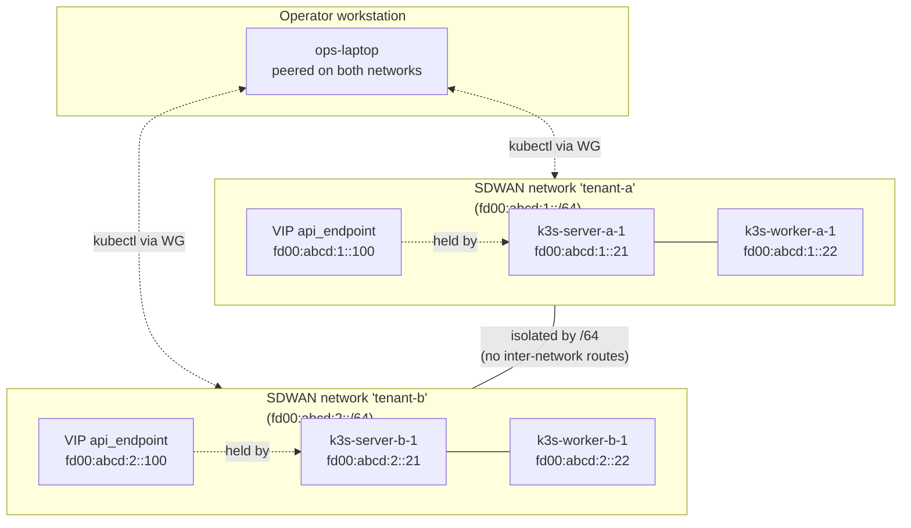

# Tutorial 05 — Multi-cluster K3s with SDWAN isolation

> Status: active

> ## ⚠️ Steps 3–4 are NOT SUPPORTED — this tutorial cannot be completed as written
>
> Steps 1–2 work. Steps 3–4 rest on three things that do not exist, so a second
> cluster cannot be brought up by following this page, and Steps 5–6 and
> Verification all presuppose cluster B. **Read this before you start
> provisioning**, not forty minutes in.
>
> **1. No MCP verb re-templates a provisioned instance.**
> `system_update_instance` accepts exactly `instance_id`, `name`,
> `description`, `config`, `private_ip_address`, `public_ip_address`,
> `vpn_ip_address`, `network_profile` — there is no template field, and an
> undeclared key is silently dropped (`BaseTool#validate_params!` only checks
> for *missing required* params), so the call returns success and nothing
> changes. `system_update_node` **does** declare `node_template_id` and does
> write it, but see (2): moving the pointer does not move the modules.
>
> **2. Nothing an operator can call through MCP materializes the new
> template's modules.** A node's modules are `NodeModuleAssignment` rows, and
> the only thing that creates them from a template's closure is
> `System::TemplateApplyService`. Its callers are
> `ProvisioningService#apply_node_template` (the provisioning path),
> `FulfillmentAdvanceOrchestrator`, the autonomous
> `Fleet::DecisionEngine#apply_template_closure_drift` arm, and
> `POST /api/v1/system/nodes/:id/apply_template`. Exactly one of those is
> MCP-reachable — `system_provision_instance`, through
> `ProvisioningService#provision_instance` (`provisioning_service.rb:191`) —
> and it only runs while a node is being provisioned. **No MCP verb applies a
> template to an already-provisioned node**, and `System::Node` has no callback
> on a `node_template_id` change.
> `system_refresh_instance_modules` does not close the gap: it queues a
> `sync_modules` task, and `System::Runtime::SyncModules` reads
> `node.node_module_assignments` — not the template — so it reconciles the
> *old* module set. (Apply is also additive by default: `purge_stale` is
> `false`, so the outgoing template's modules stay assigned.)
>
> **3. `target_cluster_id` has no producer on the agent.** See the corrected
> [Concept refresher](#concept-refresher) — the field the worker would use to
> pick cluster B is declared, read, and never written.
>
> **What IS supported today**, and the reason (1)+(2) are a gap rather than a
> dead end — bind the template **at node-creation time, before provisioning**:
> `system_create_template` → `system_assign_module_to_template` →
> `system_create_node({ template_id })` → `system_provision_instance`.
> Provisioning runs `TemplateApplyService`, so the assignments materialize.
> Outside MCP, `POST /api/v1/system/nodes/:id/apply_template` applies a
> template to an already-created node. Neither is written up as a walkthrough
> here, because gap (3) still blocks the worker half regardless.

> **What you'll learn:** Run multiple K3s clusters in the same account with
> per-tenant SDWAN networks providing the trust boundary. Tenant clusters
> can't see or reach each other's apiservers; the operator can manage both
> from a workstation peered into both networks.
>
> **Time:** ~40 min (provisioning two clusters)
>
> **Builds on:** [Tutorial 04](./04-k3s-cluster.md) — you have one working K3s
> cluster. This tutorial provisions a second one in a parallel network
> and verifies isolation.
>
> **Sets you up for:** [Tutorial 06 — Fleet-atomic module upgrade](./06-rolling-upgrade.md) —
> and the first thing it will tell you is that multiple clusters do *not* give
> you a way to stage a module upgrade across them.

## What you're building



Two parallel clusters, mutual isolation enforced at the SDWAN layer
(different `/64` prefixes with no inter-network routes).

## Concept refresher

**The trust boundary is SDWAN network membership.** Even if both clusters
have publicly-routable management addresses (the apiserver `/128`),
routing is contained within each SDWAN network — no cross-network
reachability without an explicit federation peer or operator-granted
access.

**`target_cluster_id` is mandatory when more than one cluster exists — and
today nothing supplies it.** Two corrections to what this page used to say:

- **Omitting it does not silently pick a cluster.** `resolve_membership_cluster!`
  refuses to auto-select among several: with more than one active cluster and no
  `target_cluster_id` the join raises `AmbiguousClusterError` and the platform
  emits `system.k3s_ambiguous_cluster_join_refused` at severity `high`
  (`kubernetes_cluster_provisioner_service.rb:329`). The single-cluster fallback
  applies only when there is exactly one candidate — and "candidate" is
  `where.not(status: "error")`, so a cluster in `pending`, `bootstrapping`,
  `degraded` or `disconnected` counts toward the ambiguity, not just an
  `active` one.
- **The agent has no way to send it on `phase=join_request`.** Scope matters
  here: on `phase=ready` the agent *does* send `target_cluster_id`, from
  `ReportReady(..., m.state.joinedClusterID)` (`agent_manager.go:198`, read at
  `runtime_handshake_handlers.rb:195`) — but that names the cluster it has
  already joined, it does not choose one. For the join itself there is no
  producer. The server reads it from the handshake
  (`runtime_handshake_handlers.rb:164`); the agent would source it from
  `k3sd.AgentManager.TargetClusterID`, and nothing ever assigns that field.
  It is declared (`agent_manager.go:53`) and consumed
  (`agent_manager.go:158`), but the only non-test writer in the tree is the
  handshake struct literal it feeds — there is no writer at all, in production
  or in tests. `NewAgentManager` never sets it (`runtime/service.go:265` passes
  five arguments, none of them a cluster), and
  `k3sd.ModulesAPI` is `AssignedModules(ctx) ([]string, error)` — module names
  only — so assignment metadata never reaches the K3s reconcilers at all.

So a second cluster in the same account is currently a state a worker **cannot
join**, whatever you put in the template's module config.

**Multi-account vs multi-tenant within account:** for true SaaS-style
multi-tenancy where tenants must not see each other's resources at all
(billing, audit, etc.), give each tenant their own Powernode account. The
pattern in this tutorial — multiple SDWAN networks within one account — is
right for **internal tenant isolation** (dev / staging / prod, or
team-vs-team within one org). For cross-org isolation use federation
peers (Tutorial 11).

## Prerequisites

| Requirement | How |
|---|---|
| Tutorial 04 completed | You have one running K3s cluster (we'll call it `tenant-a`) |
| 2 more NodeInstances available (or reuse cluster A's for testing) | `platform.system_provision_instance` |
| Operator account is on both SDWAN networks (or you accept needing to peer in) | `system_sdwan_create_access_grant` |

## Step 1 — Create the second SDWAN network

```javascript
platform.system_sdwan_create_network({
  name: "tenant-b",
  description: "Tenant B's isolated cluster"
  // No prefix input — the /64 is server-allocated from the account's /48.
})
// → { network: { id: "net-tenant-b", cidr_64: "fd00:abcd:2::/64", ... } }
```

**Expected outcome:** the server allocates a `/64` (returned as `cidr_64`) that
differs from tenant-a's network — you don't supply it. The two `/64`s have no
overlapping address space and no inter-network routes (verify with
`system_sdwan_get_routing_summary` once peers are attached). The default routing
mode is `static`; switch a network to iBGP after creation with
`system_sdwan_update_network_routing_mode({ network_id, routing_protocol: "ibgp" })`.

## Step 2 — Provision tenant B's nodes + attach to network

```javascript
// Bootstrap server for tenant B
platform.system_create_node({
  name: "k3s-server-b-1",
  template_id: "<base-template>",
  config: { tenant: "b" }
})
platform.system_provision_instance({
  node_id: "<k3s-server-b-1-node>",
  provider_region_id: "<provider-region-id>",          // required
  provider_instance_type_id: "<provider-sku-id>"       // required
})
platform.system_sdwan_attach_peer({
  network_id: "net-tenant-b",
  node_instance_id: "<k3s-server-b-1-instance>"
})

// Worker
platform.system_create_node({
  name: "k3s-worker-b-1",
  template_id: "<base-template>",
  config: { tenant: "b" }
})
platform.system_provision_instance({
  node_id: "<k3s-worker-b-1-node>",
  provider_region_id: "<provider-region-id>",
  provider_instance_type_id: "<provider-sku-id>"
})
platform.system_sdwan_attach_peer({
  network_id: "net-tenant-b",
  node_instance_id: "<k3s-worker-b-1-instance>"
})
```

`system_create_node` declares `name` and `template_id` (both required),
`description`, `enabled`, `worker_id`, `public_address`, `allocate_public_ip`
and `config`. Earlier revisions of this page passed `hostname`,
`node_template_id` and `metadata`; none of the three is declared, and an
undeclared key is dropped without error — so that call supplied *neither*
required parameter and always failed outright with
`Missing required parameters: name, template_id`. It never created a node.
`config` is the declared free-form hash, which is where the `tenant` tag
belongs.

`system_provision_instance` requires `provider_region_id` and
`provider_instance_type_id` alongside `node_id`; it is synchronous, creates no
`System::Task`, and the machine is still booting when it returns — poll
`system_get_instance` for readiness.

**Expected outcome:** both instances have `/128`s from tenant-b's `/64`.
This is the last step of this tutorial that works — see the banner at the top.

## Step 3 — Assign `k3s-server` to tenant B's bootstrap — NOT SUPPORTED

The first two calls work and are worth keeping: authoring the template and
binding the module to it are both supported.

```javascript
// Create the bootstrap template and assign the k3s-server module.
platform.system_create_template({
  name: "tenant-b-k3s-server",
  node_platform_id: "<node-platform-id>"    // required — NodeTemplate.node_platform_id is NOT NULL
})

platform.system_assign_module_to_template({
  template_id: "<tenant-b-k3s-server-template-id>",
  // The template-assignment verbs take the NodeModule UUID, not its name — system_list_modules returns { id, name }.
  module_id: "<k3s-server-module-id>"
})
```

The third call is where the tutorial stops. It is listed rather than deleted,
because an operator who planned around it needs to see it withdrawn:

| Withdrawn call | What is actually true |
|---|---|
| `system_update_instance({ instance_id, node_template_id })` | `node_template_id` is **not declared** by `system_update_instance` and is silently dropped. The declared parameters are `instance_id` (required), `name`, `description`, `config`, `private_ip_address`, `public_ip_address`, `vpn_ip_address`, `network_profile`. The call returns success and the instance keeps its old template. |
| "within ~60s the agent picks up the new template" | Nothing observes a template change. `System::Node` has no callback on `node_template_id`, and the module set an instance syncs comes from its node's `NodeModuleAssignment` rows, which only `System::TemplateApplyService` creates — see gap (2) in the banner. There is no 60s, and no eventual convergence through any MCP verb. |
| `recent_events({ kind_prefix: "system.k3s" })` → `cluster.bootstrapped` | Doubly wrong. `recent_events` declares only `source_type`, `status` and `limit` — there is no `kind_prefix`. And no `cluster.bootstrapped` event kind is emitted anywhere in the platform; the only `system.k3s*` kind that exists is `system.k3s_ambiguous_cluster_join_refused`. |

`system_update_node({ node_id, node_template_id })` **does** move a node's
template pointer — that half of the capability is real. It is not written up
as the fix here because on its own it changes nothing observable: the
assignments do not follow.

The direct observable for "did a cluster come up" is
`platform.kubernetes_list_clusters()`, used in Step 4 and
[Verification](#verification) below — not an event poll.

## Step 4 — Join tenant B's worker — NOT SUPPORTED

This step presupposes a bootstrapped cluster B, which Step 3 cannot produce.
The template authoring below is correct and does work; the binding and the
join do not.

```javascript
// Get tenant B's cluster_id (once a cluster B exists)
platform.kubernetes_list_clusters()
// → 2 clusters: cluster-a-id, cluster-b-id

// Templates carry modules through a SEPARATE call — there is no inline
// module list at create time.
platform.system_create_template({
  name: "tenant-b-k3s-worker",
  node_platform_id: "<node-platform-id>"                  // required
})

platform.system_assign_module_to_template({
  template_id: "<tenant-b-k3s-worker-template-id>",
  module_id: "<k3s-agent-module-id>",                     // UUID, not the name
  config: { target_cluster_id: "<cluster-b-id>" }         // stored; see below — not delivered
})
```

| Withdrawn call | What is actually true |
|---|---|
| `system_create_template({ module_assignments: [{ module_name, config }] })` | `module_assignments` is **not declared** and is dropped, and the call also omitted the required `node_platform_id`, so it failed validation outright. There is no inline form; the two-verb sequence above is the supported way, and it is the same one Step 3 and [Troubleshooting](#troubleshooting) already use. The nested `module_name` was wrong for a second reason: `system_assign_module_to_template` takes the NodeModule **UUID**. |
| `system_update_instance({ instance_id, node_template_id })` | Same withdrawal as Step 3 — `node_template_id` is not declared by this verb and is dropped. |
| "worker joins **cluster B**, not cluster A" | Not reachable. `config.target_cluster_id` is stored on the join, but nothing carries it to the node: `k3sd.ModulesAPI` hands the K3s reconcilers module **names** only, and `AgentManager.TargetClusterID` has no writer. The worker's `JoinRequest` therefore always sends an empty target, and with two active clusters the platform **refuses** the join. |

**Corrected — omitting `target_cluster_id` refuses, it does not guess.**
Earlier revisions said the worker "joins whichever cluster the platform's first
lookup returns" and that the agent posts a warning event
`system.k3s.handshake.join_target_ambiguous`. Neither is true. With more than
one active cluster and no target, `resolve_membership_cluster!` raises
`AmbiguousClusterError` — the join fails — and the emitted kind is
`system.k3s_ambiguous_cluster_join_refused` (severity `high`), not a handshake
warning. That behaviour is strictly safer than what was documented, but it does
mean the worker does not join at all.

Once a worker has joined, cluster membership is read with:

```javascript
platform.kubernetes_list_nodes({ cluster_id: "<cluster-b-id>" })
platform.kubernetes_list_nodes({ cluster_id: "<cluster-a-id>" })
```

## Step 5 — Verify isolation

> Steps 5–6 and [Verification](#verification) all assume a running cluster B,
> which Steps 3–4 cannot produce today. They are kept because the SDWAN
> isolation they demonstrate is real and the calls below are correct — the
> `/64`-per-network trust boundary works independently of what runs on the
> nodes. Read them as reference, not as steps you can execute in sequence
> from Step 4.

From an operator workstation peered into **both** networks (set up via
`system_sdwan_create_access_grant` for each), both clusters are reachable:

```bash
platform.kubernetes_get_kubeconfig({ cluster_id: "<cluster-a-id>" }) | jq -r '.data.kubeconfig' > ~/.kube/cluster-a.yaml
platform.kubernetes_get_kubeconfig({ cluster_id: "<cluster-b-id>" }) | jq -r '.data.kubeconfig' > ~/.kube/cluster-b.yaml

kubectl --kubeconfig ~/.kube/cluster-a.yaml get nodes
# Works — apiserver at fd00:abcd:1::100:6443

kubectl --kubeconfig ~/.kube/cluster-b.yaml get nodes
# Works — apiserver at fd00:abcd:2::100:6443
```

But from tenant-a's k3s-server, tenant-b's apiserver is unreachable:

```bash
# SSH to k3s-server-a-1:
nc -zv fd00:abcd:2::100 6443
# → connection timed out / network unreachable
```

The two `/64`s have no inter-network routes — the platform's routing
compiler intentionally omits them.

## Step 6 — Layer firewall rules within each network

Even within a tenant, you may want intra-tenant isolation (e.g., only the
operator workstation can reach the apiserver — not the worker):

```javascript
// Within tenant-b: default-deny ingress to the apiserver VIP
platform.system_sdwan_create_firewall_rule({
  network_id: "net-tenant-b",
  name: "tenant-b-apiserver-default-deny",     // required
  direction: "ingress",
  firewall_action: "drop",
  dst_selector: { cidr: "fd00:abcd:2::100/128" },   // the VIP's /128
  protocol: "tcp",
  port_from: 6443,
  port_to: 6443,
  priority: 100
})

// Explicit allow for the workstation (lower priority runs first)
platform.system_sdwan_create_firewall_rule({
  network_id: "net-tenant-b",
  name: "tenant-b-apiserver-allow-operator-ws",
  direction: "ingress",
  firewall_action: "accept",
  src_selector: { tag: "operator-ws" },
  dst_selector: { cidr: "fd00:abcd:2::100/128" },
  protocol: "tcp",
  port_from: 6443,
  port_to: 6443,
  priority: 10
})
```

Now only the workstation's `/128` can reach the apiserver; workers can
join (because they have a different code path through the kubelet) but
arbitrary peers can't `kubectl` directly.

**Parameter names corrected.** Earlier revisions of this page used `action`,
`selector` and `port_range`, and omitted the required `name`. The verb declares
`network_id` + `name` (both required), `firewall_action`, `direction`,
`protocol`, `priority`, `src_selector`, `dst_selector`, `port_from`, `port_to`.
The selector values were wrong too: `Sdwan::FirewallRule::SELECTOR_KINDS` is
`%w[peer_id tag cidr all]` — there is **no VIP selector kind**, so match the
VIP by its `/128` under `cidr`, as above. `priority`, `port_from` and `port_to`
are declared `integer` — pass them unquoted.

The call routes through the autonomy gate for `sdwan.firewall_rule_create`,
whose **seeded default is `notify_and_proceed`**
(`governance/policy_declarations.rb:587`) — so out of the box it writes the rule
and notifies. Only if your account has raised that action to `require_approval`
does it instead return `pending: true` with a `deferred_operation_id` and write
nothing until an operator approves.

## Verification

**Cluster count:**

```javascript
platform.kubernetes_list_clusters()
// → 2 clusters, each status=active
```

**Isolation between clusters:**

```bash
# From k3s-server-a-1 (over SSH):
ping6 fd00:abcd:2::100   # apiserver B — should fail with "Destination unreachable"
ping6 fd00:abcd:2::21    # k3s-server-b-1 — also unreachable
```

**Routing compiler agrees:**

```javascript
platform.system_sdwan_get_routing_summary({ network_id: "net-tenant-a" })
// → { static_routes: [/* tenant-a internal only */], bgp_routes: [], ... }
// No routes mention fd00:abcd:2::/64
```

## Cleanup

```javascript
platform.kubernetes_decommission_cluster({ cluster_id: "<cluster-b-id>" })
platform.system_terminate_instance({ instance_id: "<k3s-server-b-1-instance>" })
platform.system_terminate_instance({ instance_id: "<k3s-worker-b-1-instance>" })
platform.system_sdwan_delete_network({ network_id: "net-tenant-b" })

// Optionally remove the tenant-b templates
platform.system_delete_template({ template_id: "<tenant-b-k3s-server-template-id>" })
platform.system_delete_template({ template_id: "<tenant-b-k3s-worker-template-id>" })
```

## Troubleshooting

**Worker did not join at all, `system.k3s_ambiguous_cluster_join_refused` in
the event stream** — this is the expected outcome with two active clusters, not
a misconfiguration you can correct. See Step 4: the join carries no
`target_cluster_id` because nothing on the agent supplies one, and the platform
refuses rather than guessing. Setting `config.target_cluster_id` on the
template join does not change that. There is no operator-side workaround today.

To edit an **existing** template↔module join (priority, enabled, config), use
`system_update_template_module`. `system_assign_module_to_template` calls
`TemplateModule.create!`, and `System::TemplateModule` validates
`node_template_id` unique scoped to `node_module_id` — so a re-assign does not
overwrite, it raises `RecordInvalid`, which that verb does not rescue and which
surfaces as a raw protocol error rather than a readable refusal:

```javascript
platform.system_update_template_module({
  template_id: "<tenant-b-k3s-worker-template-id>",
  module_id: "<k3s-agent-module-id>",
  config: { target_cluster_id: "<correct-cluster-id>" }     // REPLACES the stored hash
})
```

**Cross-tenant traffic accidentally works** — check both networks aren't
sharing a federation peer or a route policy that imports `/64`s across.
Inspect with:

```javascript
platform.system_sdwan_get_routing_summary({ network_id: "net-tenant-a" })
// If you see fd00:abcd:2::/64 listed under bgp_routes, you have a federation peer importing tenant-b's prefix
```

**Operator workstation works on one network but not the other** — your
WireGuard config has only one `[Peer]` section. Re-import both access
grants; the resulting config should have one peer block per network.

**Pod-to-pod traffic leaks across clusters via host primary NIC** — flannel
CNI uses the host NIC, not SDWAN. For SDWAN-isolated pod traffic between
tenants, bootstrap each tenant's cluster with `cni_plugin: ovn_kubernetes`
(Phase O4 — auto-defaulted for `network_profile: heavyweight` nodes,
explicit override on lightweight nodes raises `CniProfileMismatchError`).
See [`CONTAINER_RUNTIMES.md` §"CNI selection (Phase O4)"](../CONTAINER_RUNTIMES.md#cni-selection-phase-o4--shipped)
for the full decision table. Mixing CNI plugins across clusters in the same
SDWAN network is supported — each cluster's pod CIDR is independent.

## What's next

- **[Tutorial 06 — Fleet-atomic module upgrade](./06-rolling-upgrade.md)** —
  multiple clusters do **not** by themselves let you stage an upgrade. A
  module's version is a per-module pointer, so if both clusters carry the same
  `NodeModule` row they converge together and there is no cluster to hold back.
  Staging requires separating the *scope* — see
  [§ If you need a real blast-radius bound](./06-rolling-upgrade.md#if-you-need-a-real-blast-radius-bound).
- **[`runbooks/sdwan-network-setup.md`](../runbooks/sdwan-network-setup.md)** —
  full SDWAN reference: route policies, virtual IPs, firewall rules,
  multi-VRF.
- **[`USE_CASE_MATRIX.md`](../USE_CASE_MATRIX.md)** — use case 6
  (multi-tenant container farm) for the SaaS variant where tenants are
  separate accounts entirely.
- **[`SMOKE_TEST.md`](../SMOKE_TEST.md) Pass 3** — `smoke_test_ovn_models.rb`,
  `smoke_test_multi_vrf.rb`, `smoke_test_ovn_k8s_cni.rb` validate the
  SDWAN topology compiler that's doing the isolation work.

_Last verified: 2026-08-31 (rev 3) — every `platform.<verb>({ ... })` example on
this page is pinned against the verb's own `action_definitions` by
`spec/docs/module_docs_mcp_call_signatures_spec.rb`._
