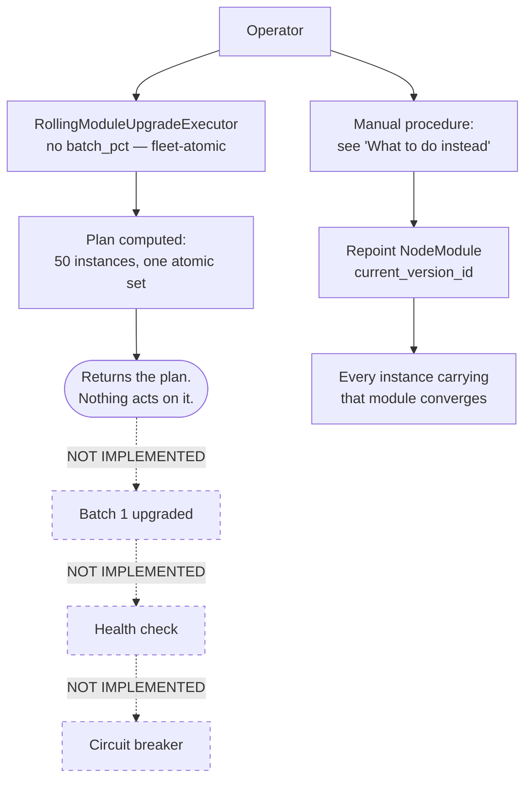

# Tutorial 06 — Fleet-atomic module upgrade (`rolling_module_upgrade`)

> Status: active

> ## ⚠️ Module upgrades are FLEET-ATOMIC, and the batched runtime this tutorial described is NOT IMPLEMENTED
>
> Two separate facts, and the first one is permanent:
>
> **1. A module upgrade cannot be batched or staged.** The version an instance
> receives resolves from `NodeModule#current_version_id` — a per-**module**
> pointer read at download time — and `system_node_module_assignments`, the
> only per-node row for a module, carries **no version column of any kind**.
> There is nothing to batch *over*. Every instance carrying the module
> converges together. `batch_pct` was accordingly **removed** from the
> executor's contract (IMP-b948ea7fa382); it is not accepted and ignored, it
> is gone. If you need a real blast-radius bound, you must separate the
> *scope* — see [If you need a real blast-radius bound](#if-you-need-a-real-blast-radius-bound).
>
> **2. Nothing executes the plan.** `RollingModuleUpgradeExecutor` computes a
> **plan and stops**. There is no advancer, no health check and no circuit
> breaker for module upgrades — approving a plan rolls nothing out. Earlier
> revisions of this page described all three as working. They never were.
>
> The plan-mode walkthrough (Steps 1–2) is still accurate and useful for
> sizing an upgrade. Everything that claimed to *execute* a plan is marked
> NOT IMPLEMENTED below. For the procedure that actually moves a fleet
> today, jump to [What to do instead](#what-to-do-instead).

> **What you'll learn:** How to size an upgrade with the
> `rolling_module_upgrade` plan, what the platform does and does not do with
> it, and the manual procedure that actually moves a module version across a
> fleet — including why neither the plan nor that procedure can be staged.
>
> **Time:** ~10 min
>
> **Builds on:** [Tutorial 02](./02-first-module.md) (you understand module
> versions + promotion) and [Tutorial 03](./03-docker-runtime.md) (you have a
> running fleet of instances with modules assigned).
>
> **Sets you up for:** [Tutorial 07 — CVE response](./07-cve-response.md) —
> CVE remediation orchestrates the same `rolling_module_upgrade` skill
> across affected modules.

## What you're building



The dashed path is what earlier revisions of this tutorial described. It does
not exist. The solid paths are what the platform does today.

## Concept refresher

**`rolling_module_upgrade`** is a skill executor (see
[`SKILL_EXECUTORS.md`](../SKILL_EXECUTORS.md)). What it does, in full:

1. Looks up the module and confirms `target_version_id` appears in its
   version list
2. Lists the template's `running`/`starting` instances and reports them as one
   atomic set (`affected_instance_ids`) — there is no slicing step
3. Returns the plan, with `executed: false`

Then it returns. That is the whole executor
([`rolling_module_upgrade_executor.rb`](../../server/app/services/system/ai/skills/rolling_module_upgrade_executor.rb)).

**NOT IMPLEMENTED — no code in the platform does any of the following:**

| Promised | Reality |
|---|---|
| Walks batches one at a time after approval | There are no batches to walk — the plan is a single atomic set. Nor does anything read the plan: there is no reconciler behind the approval; the plan is returned to the caller and discarded |
| Per-batch health checks against `running_module_digests` | The executor never reads `running_module_digests`. No health check exists |
| Circuit breaker trips at `max_consecutive_failures` | No breaker exists. The argument is echoed into the returned `circuit_breaker` hash (now `status: "not_implemented"`) and read by nothing |
| `health_timeout_sec` bounds a health window | Echoed into the same hash. Read by nothing |
| Emits `module.upgrade.*` events | Nothing in the platform emits these events |
| Continuation ApprovalRequest with `continue_anyway` / `rollback_completed_batches` / `abort` | No such ApprovalRequest type, and no handler for any of the three options |

**Why is there no `batch_pct` any more?** Because it could never have been a
safety control, for a reason that survives building the advancer:

The version an instance receives is resolved from
`NodeModule#current_version_id` — a **per-module** pointer, read at download
time by the node-facing endpoint. The only per-node row for a module,
`system_node_module_assignments`, has **no version column** (its columns are
`auto_resolved`, `config`, `node_id`, `node_module_id`, `priority`,
`source_template_module_id`, `enabled`, and timestamps). So there is no
per-instance version selection, and nothing to batch *over*. Moving that
pointer moves it for **every instance carrying that module** simultaneously.

An input that cannot affect the outcome is worse than a missing one — it reads
as pacing — so `batch_pct` was removed from the contract outright rather than
accepted and ignored. A stale caller that still passes it is not rejected; the
value is simply dropped, and the resulting plan is identical.

**What about the approval?** `system.fleet_rolling_upgrade` really is
`require_approval` ([`FLEET_SENSORS.md`](../FLEET_SENSORS.md)), and the plan
really does carry `requires_approval: true`. The approval gate is real. What
is missing is anything that acts on the approval.

**Where this shape *is* implemented:** `boot_image_drift_rollout` does the
equivalent for **boot images** — it dispatches each batch through
`UpgradeDispatcher` and converges tick-by-tick by re-planning off its own
drift sensor, canary-first and halting on the first failed batch
([`boot_image_drift_rollout_executor.rb`](../../server/app/services/system/ai/skills/boot_image_drift_rollout_executor.rb):21
`DEFAULT_MAX_CONSECUTIVE_FAILS = 1`, :87 tags the first batch `status:
"canary"`, :78 halts on a recent failed upgrade). It needs no batch advancer
because convergence is tick-driven.

**Why batching is possible there and not here** — and the reason is *not* that
a boot image is chosen per instance; it is not. A boot image's target is
`NodePlatform#disk_image_git_sha`, read through
`NodeInstance#promoted_image_git_sha`
([`node_instance.rb`](../../server/app/models/system/node_instance.rb):807-808),
which is a pointer on a shared parent exactly as `NodeModule#current_version_id`
is. The difference is the **actuation**: a drifted instance converges only when
an explicit per-instance `upgrade_boot_image` `System::Task` is dispatched to it
([`boot_image/upgrade_dispatcher.rb`](../../server/app/services/system/boot_image/upgrade_dispatcher.rb):190-192),
and — decisively — that task **pins the target it must reach** in its own
options (`"target_git_sha" => target_sha`, same file :190-196). The rollout
therefore decides both *who* moves and *what* they move to.

Modules have a per-instance task too — `system_refresh_instance_modules` queues
a `sync_modules` task
([`system_fleet_tool.rb`](../../server/app/services/ai/tools/system_fleet_tool.rb):2641-2646)
— but it carries **no version**. It can only hasten an instance toward the
single global pointer, never hold it at a different one, which is why
[§4 below](#4-understand-what-you-just-did) says it changes *when* an instance
converges and never *what* it converges to. That missing target field is the
whole difference. No equivalent lane exists for modules.

## Prerequisites

| Requirement | How |
|---|---|
| Existing fleet ≥10 NodeInstances assigned a common module (e.g., `nginx 1.24.0`) | Provision via Tutorial 01 + assign via Tutorial 02 pattern |
| New version (`nginx 1.26.0`) published, plus the version id you will target | Tutorial 02 step 6–8. `promotion_state` is not checked by `RollingModuleUpgradeExecutor` — it accepts any version id present in the module's version list, so a `built` version is a valid target. It does not check `oci_digest` either — it only copies that into the plan as `target_oci_digest` — so verify the target carries one yourself before moving the pointer |
| Operator permission `system.fleet_rolling_upgrade` (often paired with approval rights) | Default for admin users |

## Step 1 — Identify the upgrade target

```javascript
platform.system_list_module_versions({ module_id: "<nginx-module-id>" })
// → { versions: [
//      { id: "v-1.24.0", promotion_state: "live", ... },
//      { id: "v-1.26.0", promotion_state: "blessed", ... }
//    ] }

platform.system_list_instances({ template_id: "<edge-template>" })
// → { instances: [{ id, status: "running", running_module_digests: { nginx: "sha256:..." } }, ...50] }
```

**Expected outcome:** confirm 50 instances running v1.24.0, and v1.26.0
present in this list — being in the list is what makes it a valid target,
not its `promotion_state`. Check it carries an `oci_digest`.

## Step 2 — Plan the upgrade (dry-run via the executor)

The `rolling_module_upgrade` skill is a `monitor`-agent executor. It only ever
computes a plan — nothing runs it in production either (Step 3) — and you
invoke it directly to size an upgrade. (There is no `execute_skill` MCP action
— the executor is a Ruby class; run it via `rails runner` or a seed, exactly as
[`db/seeds/example_rolling_upgrade.rb`](../../server/db/seeds/example_rolling_upgrade.rb)
does.)

```ruby
result = ::System::Ai::Skills::RollingModuleUpgradeExecutor.new(
  account: account, agent: fleet_autonomy_agent
).execute(
  template_id:               "<edge-template>",
  module_id:                 "<nginx-module-id>",
  target_version_id:         "v-1.26.0",
  max_consecutive_failures:  2,
  health_timeout_sec:        300
)
# → {
#      total_instances: 50,
#      affected_instance_ids: [...all 50 — they move together],
#      estimated_total_seconds: 6000,
#      circuit_breaker: { trips_after_consecutive_failures: 2,
#                         health_timeout_sec: 300,
#                         status: "not_implemented" },
#      executed: false,
#      note: "PLAN ONLY — nothing moves the fleet from this plan, and the
#             upgrade is FLEET-ATOMIC when you do move it ..."
#    }
```

(Defaults if you omit them: `max_consecutive_failures: 2`,
`health_timeout_sec: 600`. There is no `batch_pct` — see above.)

**Expected outcome:** a plan naming all 50 instances in one set. That set is
the blast radius of the pointer flip in
[What to do instead](#what-to-do-instead); it is not a first batch.

Read the returned fields carefully:

- `status: "not_implemented"` — the `circuit_breaker` hash is your two
  arguments echoed back. It is not evidence of a live gate.
- `executed: false` — the plan was computed and nothing was done with it.
- `estimated_total_seconds: 6000` is an ETA hint only (a flat
  `ETA_PER_INSTANCE_SEC = 120` × instance count). It is not a measured
  health window, and nothing is timed against it.
- `affected_instance_ids` is the **whole** population that converges, not a
  first batch. There is no second set.

**The plan is still useful** — it tells you how many instances carry the
module and confirms the target version resolves. Treat it as a sizing
document, then perform the upgrade with the manual procedure in
[What to do instead](#what-to-do-instead).

## Step 3 — Approve the plan — NOT IMPLEMENTED

An `ApprovalRequest` is genuinely created and genuinely gates
(`system.fleet_rolling_upgrade` is `require_approval`), and you can approve it
in `/app/approvals`. **Approving it has no effect on the fleet.** No reconciler
reads the plan; nothing starts executing on the next tick or any tick.

There is also no "Edit plan" affordance that changes a rollout, because there
is no rollout — and there is no batch size to edit even in principle. Editing
`max_consecutive_failures` only changes numbers in a document.

## Step 4 — Watch progress — NOT IMPLEMENTED

There is nothing to watch, and no call to make. Nothing in the platform
emits `module.upgrade.*` events, so there is no `kind` to hand the fleet
event reader `system_recent_signals` (which filters by one exact `kind` or a
`correlation_id`; it has no prefix filter). An earlier revision of this step
polled `recent_events({ kind_prefix: "module.upgrade" })` — wrong twice: that
introspection verb reads agent execution events and never returns a
FleetEvent, and no verb takes a `kind_prefix`.

There is no "Active rolling upgrades" panel at `/app/system/operations`.

To observe a module upgrade you performed manually, poll the instances
directly — see [Verification](#verification) below.

## Step 5 — Circuit breaker scenario (drill) — NOT IMPLEMENTED

**Do not attempt this drill.** It reads as a safe rehearsal and is the
opposite: it instructs you to publish a deliberately broken version, on the
promise that a circuit breaker stops the rollout after two failures. No
circuit breaker exists. If you separately repoint the module at the broken
version (the manual procedure below), **every instance carrying that module
converges on it** with nothing to stop the spread.

None of the following exists:

- the `module.upgrade.circuit_breaker_tripped` event
- the `rolling_upgrade_continuation` ApprovalRequest type
- the `continue_anyway` option — no handler
- the `rollback_completed_batches` option — no handler, and no record of which
  batches "completed" to roll back
- the `abort` option — no handler

Your only real stop button is repointing `current_version_id` back to the
previous version yourself, which is the same one-call operation as rolling
forward. Confirm it is available **before** you move the pointer — see the
next section.

## What to do instead

There is **no automated bound** on a module upgrade today: no batching, no
health gate, no automatic stop. The procedure below is what actually moves a
fleet, and it is deliberately written to make its own limits visible rather
than to look like a supervised rollout.

**The pointer, not the promotion state, is what the fleet serves.** A node
downloading a module resolves `NodeModule#current_version_id`
(`NodeApi::ModulesController#download` reads `@module.current_version&.artifact`).
Promoting a version through `staging → blessed → live` advances a label and
changes nothing about what the fleet receives — see
[Tutorial 02](./02-first-module.md) and
[`module-authoring.md`](../runbooks/module-authoring.md).

### 1. Verify the target before you move anything

```javascript
platform.system_list_module_versions({ module_id: "<nginx-module-id>" })
```

The target version must carry an `oci_digest` — without one it has no
mountable artifact and instances will fail to mount the module.

### 2. Confirm you have a way back — BEFORE the flip

This is the step that replaces the circuit breaker, and it is the only
pre-flight check that materially bounds your risk.

A rollback target must be a version of the same module that is
`rollback_usable?`: it has an `oci_digest`, and its recorded artifact size is
above the non-empty floor (`system.module_publish.min_artifact_bytes`) — a
version with an *unknown* size is accepted, since old rows predate size
recording. If the version you are leaving is the only usable one, moving the
pointer forward is a one-way door until you republish a good build.

### 3. Move the pointer

```javascript
platform.system_rollback_module_version({
  module_id:  "<nginx-module-id>",
  version_id: "<target-version-uuid>",   // a NodeModuleVersion UUID
  reason:     "nginx 1.24.0 → 1.26.0"
})
```

Despite the name, this is the **sanctioned writer of `current_version_id`**
(it calls `NodeModule#promote_to_version!`) and it imposes no direction — it
moves the pointer forward as readily as backward, subject only to the
`rollback_usable?` check above. `system_promote_module_version` will **not**
do this; it advances `promotion_state` only.

Note that `promote_to_version!` also arms `RestartAfterUpdate`, so services
provided by that module restart as instances converge.

### 4. Understand what you just did

The pointer is per-module. **Every instance carrying that module** now
converges on the new version at its own next reconcile — not just the ones you
are watching, and not in any order you control. There is no batch.

`system_refresh_instance_modules` pulls a *single* instance forward
immediately by queueing a `sync_modules` task:

```javascript
platform.system_refresh_instance_modules({ instance_id: "<instance-id>" })
```

Use it to inspect one instance on the new version sooner than the others.
**It does not hold the other instances back** — it changes *when* an instance
converges, never *what* it converges to. Calling it in groups looks like a
batched rollout and is not one; the rest of the fleet is already moving.

### 5. Watch, and be ready to reverse

```javascript
platform.system_get_instance({ instance_id: "<sample-instance>" })
// → { instance: { running_module_digests: { "<nginx-node-module-id>": "sha256:..." } } }
```

If the new version is bad, reverse it with the same verb from step 3, naming
the previous version. That is a manual decision by a watching operator — there
is nothing automatic behind you.

### If you need a real blast-radius bound

Since a module's pointer cannot be scoped to part of a fleet, genuine
staging requires separating the *scope*, not the rollout:

- **[Instance pools](./08-instance-pool.md)** — for stateless workloads,
  replace instances rather than upgrading in place: claim a fresh instance on
  the new version, drain the old one. Blast radius is one instance at a time
  and rollback is "stop claiming".
- **A separate module row for the canary template** — two `NodeModule` rows
  have two independent `current_version_id` pointers, so you can move one
  without moving the other. This is a real cost (two modules to publish and
  keep in step) and is the honest price of staging today.

## Verification

Once the fleet has converged (each instance at its own next reconcile —
there are no batches to complete):

```javascript
platform.system_get_instance({ instance_id: "<sample-instance>" })
// → { instance: { running_module_digests: { "<nginx-node-module-id>": "sha256:<v1.26-digest>", ... } } }
//    (keyed by node_module_id, not by module name)
```

Compare that digest against the target version's `oci_digest`. This is a
per-instance check and you will need to repeat it across the instances you
care about — poll until they converge, or until one does not.

`system_drift_report` answers the same question for **one instance**
(`{ instance_id }`); it has no template-wide form. To sweep a deployment's
template in one call, use `drift_check`:

```javascript
platform.system_platform_maintenance({
  op: "drift_check",
  deployment_id: "<deployment-id>"   // omit to scan every deployment
})
// → { data: { deployments: [ { deployment_id, deployment_name, template,
//                              instance_count,
//                              drift_count,
//                              drifted_instances: [ { id, status, name, drift } ],
//                              not_reporting_count,
//                              not_reporting_instances: [ { id, status, name } ],
//                              not_assessed_count,
//                              not_assessed_instances: [ { id, status, name } ] } ] },
//     recommendations: [ "..." ] }
```

Read `recommendations`, `not_reporting_count` and `not_assessed_count` as
carefully as `drift_count`:

- `not_reporting_count` is instances that have **never heartbeated**. Drift
  is **unknown** for them, not clear — they are excluded from the "nothing
  to remediate" recommendation for that reason. An instance that HAS
  heartbeated and reports nothing mounted is counted as drift, not here.
- `not_assessed_count` is instances in `starting`, `stopping`, `rebooting`
  or `error` — the states outside `NodeInstance.active`. Drift is **not
  asked** for them at all: a mid-reboot digest map is not evidence of
  anything. They are named in `not_assessed_instances` (with their status)
  and they also suppress the all-clear, so re-run once they settle. Two of
  those states are what the platform's own remediation produces, so expect
  this bucket during a repair.
- The three buckets name only the instances that need attention: a
  **converged, reporting** instance is in none of them. Read them against
  `instance_count`, which is every non-terminated instance of the template —
  so `drift_count + not_reporting_count + not_assessed_count + the converged
  remainder = instance_count`. Zero across all three with a non-zero
  `instance_count` means every instance was assessed and none needs
  remediation; it never means a subset was filtered out of the question.

`drift_check` compares each instance against the modules its **node** is
assigned. That is the layer a `sync_modules` reconcile (queued by
`system_refresh_instance_modules`) acts on, so what it reports is the
remediable kind. Whether a node's assignments still match the template it
was built from is a separate question neither verb answers.

> Until IMP-0d106a152c47 (2026-08-31) `drift_check`'s detector was a
> hardcoded `false`: it reported every deployment healthy without looking.
> If you are reading an older run's output, it proves nothing. A run from
> before IMP-351be1c674e0 has no `not_assessed_count`: it scoped the sweep
> with `NodeInstance.active` and dropped the four states above from both
> counts silently, so "0 drifted, 0 unknown" there does not mean every
> instance was looked at.

## Extract a learning

If you ran a real upgrade, record what you learned about **the manual
procedure** — not about batch sizing, which had no effect:

```javascript
platform.create_learning({
  title: "nginx 1.24 → 1.26 module upgrade — pointer flip converged the edge fleet in ~N min",
  category: "best_practice",
  content: "Repointed current_version_id via system_rollback_module_version. All 50 instances converged within N minutes with no batching (the pointer is per-module, so the fleet moves together). Confirmed a usable rollback target existed first. Watch: RestartAfterUpdate armed, so nginx restarted as each instance converged.",
  tags: ["module-upgrade", "nginx", "current-version-pointer"]
})
```

## Cleanup

**Do not re-run the executor to roll back — it does nothing.** Reverse a bad
upgrade the same way you applied it, by moving the pointer:

```javascript
platform.system_rollback_module_version({
  module_id:  "<nginx-module-id>",
  version_id: "<previous-version-uuid>",   // a NodeModuleVersion UUID, not "v-<semver>"
  reason:     "reverting 1.26.0"
})
```

Omitting `version_id` picks the newest other version that is
`rollback_usable?`, which is usually what you want for an emergency revert.

## Troubleshooting

**Approval never appears** — check that `system.fleet_rolling_upgrade` is
in the agent's intervention policies and not blocked. Inspect:

```javascript
// agent_introspect resolves agent_id by UUID only — a slug like
// "fleet_autonomy_agent" silently resolves to nothing. Look up the UUID first:
platform.list_agents()
// → { agents: [{ id: "<fleet-autonomy-uuid>", name: "Fleet Autonomy", ... }, ...] }

platform.agent_introspect({ agent_id: "<fleet-autonomy-uuid>" })
// Look for "intervention_policies" containing system.fleet_rolling_upgrade
```

**The upgrade never starts after approval** — **this is expected and is not a
fault.** There are no batches, and nothing reads the plan: no reconciler to be
paused, no tick to be broken. Do not debug sidekiq for this. Use the manual
procedure in [What to do instead](#what-to-do-instead).

**Nothing happened after I approved the plan** — same cause as above. The
approval gate is real; the thing it gates was never built.

**Instances don't pick up the new version after the pointer flip** — the
pointer move is the platform's whole side of the operation; convergence is the
agent's. Check the instance is heartbeating at all (Tutorial 03
troubleshooting), then force one forward with
`system_refresh_instance_modules({ instance_id })` and re-read its
`running_module_digests`. If a `sync_modules` task is queued but the digest
never changes, the module likely has no mountable artifact — confirm the
target version carries an `oci_digest`.

**Rollback target refused** — `system_rollback_module_version` returns "has no
mountable artifact" when the version you named is missing an `oci_digest`, or
its recorded artifact size is below `system.module_publish.min_artifact_bytes`.
A version with an *unknown* size is accepted (old rows predate size recording),
so this is a real artifact problem, not a metadata gap. Republish a good build.

**Rollback doesn't fully restore previous version** — a `retired` version is
still kept for rollback/audit, so retiring the old version doesn't break
rollback by itself — but if the version **row was deleted** outright, rollback
fails because the version no longer resolves. Keep the prior version row (even
`retired`) until you're certain you'll never roll back.

## What's next

- **[Tutorial 07 — CVE response](./07-cve-response.md)** — CVE remediation
  routes to `rolling_module_upgrade` as its remediation step, so it inherits
  this gap: the CVE lane plans and does not roll out. See
  [`cve-response.md`](../runbooks/cve-response.md) Phase 6.
- **[Tutorial 08 — Instance pools](./08-instance-pool.md)** — for
  stateless workloads, **pool replacement** is the one blast-radius bound that
  actually works today: terminate old instance, claim a fresh new-version one
  from the pool.
- **[`SKILL_EXECUTORS.md`](../SKILL_EXECUTORS.md)** §`rolling_module_upgrade` —
  full skill input/output reference.
- **[`FLEET_SENSORS.md`](../FLEET_SENSORS.md)** — `system.fleet_rolling_upgrade`
  intervention policy.

_Last verified: 2026-06-03_
