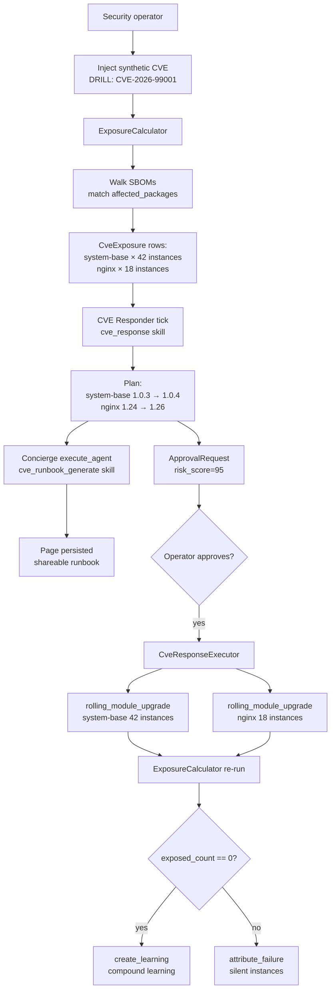

# Tutorial 07 — CVE response end-to-end

> Status: active

> **What you'll learn:** Drive the full CVE response pipeline on a synthetic
> CVE — exposure calculation, AI-generated runbook, operator approval, and
> then the manual remediation the platform does not perform for you;
> verification and learning capture.
>
> **Time:** ~75 min (mostly the manual pointer flips in Step 6)
>
> **Builds on:** [Tutorial 06](./06-rolling-upgrade.md) — CVE remediation
> routes to the same `rolling_module_upgrade` skill, and inherits its gap:
> that skill returns a plan and nothing executes it. Read Tutorial 06 first,
> especially [§ What to do instead](./06-rolling-upgrade.md#what-to-do-instead),
> which is the procedure you will run in Step 6.
>
> **Sets you up for:** [Tutorial 09 — Honeypot canary](./09-honeypot-canary.md) —
> different defensive posture (detection of unauthorized access vs. patching
> of known vulnerabilities); both use the same autonomy + approval rails.

## What you're building



By the end you'll have rehearsed the CVE response flow against a
synthetic CVE and produced a learning that compounds for the team.

## Concept refresher

**The CVE response pipeline** has 4 stages:

1. **Ingest** — CVE records come from NVD (hourly `SystemCveFeedJob`) or
   are injected manually for drills. Match keys are `affected_packages`
   (name + version range). The feed ingester (`CveOps::FeedIngestService`)
   **paginates** the NVD 2.0 API (`resultsPerPage`/`startIndex`), pulling up
   to `POWERNODE_NVD_MAX_PAGES` × `POWERNODE_NVD_PAGE_SIZE` results per run
   (default 25 × 2000 = up to 50k CVEs), so a large window is fully pulled
   across the loop rather than capped at one page.
2. **Expose** — `ExposureCalculator` walks each `NodeModule`'s SBOM
   (ingested per Tutorial 02 from cosign attestations) and computes
   per-instance exposure. Output is one `CveExposure` row per
   (CVE, NodeInstance) pair.
3. **Triage** — `cve_response` skill builds a remediation plan: which
   modules must be rebuilt, and then a single fleet-atomic rollout step. It
   carries no batch size and no time estimate.
4. **Remediate** — NOT IMPLEMENTED. `build_plan` emits **one**
   `rolling_upgrade` step carrying **all** affected `module_ids`, with
   `ordering: "sequential"` unconditionally — no `dependency_spec` is
   consulted and there is no parallel path
   ([`cve_response_executor.rb`](../../server/app/services/system/ai/skills/cve_response_executor.rb):180-204).
   Nothing executes that step; see Step 6.

**`requires_approval` always fires for risk_score ≥ 50.** Lower-risk CVEs
can have auto-remediation policies, but production deployments typically
gate everything.

**Why drills matter:** the muscle memory of CVE response is what saves
time during a real incident. Quarterly drills produce learnings that
compound.

## Prerequisites

| Requirement | How |
|---|---|
| Tutorial 06 completed | You understand rolling upgrade + circuit breaker behavior |
| Fleet using `system-base` and/or `nginx` modules with SBOMs ingested | Tutorial 02 covers SBOM ingestion via Stage 2 CI |
| Operator with `system.cve_remediate` approval rights | Default for admin users |
| (Optional) `Ai::Concierge` configured for runbook generation | See AI agents in CLAUDE.md |

## Step 1 — Inject a synthetic CVE

For drills, inject directly (real CVEs come from NVD feed automatically):

```javascript
platform.system_create_cve({
  cve_id: "DRILL-CVE-2026-99001",
  severity: "critical",
  cvss_score: 9.8,
  affected_packages: [{ name: "openssl", version: "<3.1.4" }],
  summary: "DRILL: Synthetic OpenSSL TLS handshake RCE",
  published_at: "2026-05-17T00:00:00Z"
})
// → { cve: { id, ... } }
```

**Expected outcome:** CVE row created in `severity: critical`.

> **Drill naming convention:** always prefix synthetic CVE IDs with `DRILL-`
> so they're never confused with real NVD records in audit logs and
> learnings.

## Step 2 — Calculate exposure

The platform runs `ExposureCalculator` automatically on new CVE rows
(via the `system_cve_feed` worker), but for a fresh drill you can
trigger it directly:

```javascript
platform.system_get_cve_exposure({ cve_id: "DRILL-CVE-2026-99001" })
// → {
//      exposed_modules: [
//        { id: "mod-system-base", name: "system-base", version: "1.0.3", assignment_count: 42 },
//        { id: "mod-nginx",       name: "nginx",       version: "1.24.0", assignment_count: 18 }
//      ],
//      exposed_instance_count: 60,
//      total_fleet_size: 150,
//      exposure_pct: 40.0
//    }
```

**Expected outcome:** 40% fleet exposure — needs a coordinated response.

## Step 3 — Triage with the `cve_response` skill

There is no `execute_skill` MCP action — the `system-cve-response` triage
skill is an executor bound to the **CVE Responder** agent, which runs it
automatically on its 60-second reconcile tick when a `CvePublishedSensor`
signal fires for the new CVE. To inspect the triage result, read the
exposure (Step 2) and the agent's recent events; the reconciler supplies the
skill inputs from the `CveExposure` rows. The triage produces:

```jsonc
// system-cve-response output (computed by the CVE Responder reconcile tick —
// not a direct operator call):
{
  "cve_id": "DRILL-CVE-2026-99001",
  "risk_score": 95,
  "exposed_modules": [],
  "exposed_instance_count": 60,
  "remediation_plan": {
    "steps": [
      { "step": "rebuild_modules",
        "module_ids": ["<system-base-id>", "<nginx-id>"],
        "description": "Trigger module CI for each exposed module to produce a patched OCI artifact" },
      { "step": "rolling_upgrade",
        "module_ids": ["<system-base-id>", "<nginx-id>"],
        "fleet_atomic": true,
        "description": "Once new versions are published+blessed, roll out across affected templates. FLEET-ATOMIC: every instance carrying the module converges together — there is no batching. For a staged rollout, separate the scope (instance pool, or a second NodeModule row)." }
    ],
    "ordering": "sequential"
  },
  "requires_approval": true
}
```

**Expected outcome:** a two-step plan — rebuild, then roll out — with
`ordering: "sequential"`.

The plan carries **no batch size, no per-module time estimate, and no
parallelism**, because the executor emits none
([`cve_response_executor.rb`](../../server/app/services/system/ai/skills/cve_response_executor.rb)
`#build_plan`, :180-204 — two `steps` and `ordering: "sequential"`). Earlier
revisions of this page showed an `actions` array with a per-module batch
size; that parameter was removed from `rolling_module_upgrade` with the
2026-08-30 fleet-atomic decision, and the CVE plan never carried it again. See
[Tutorial 06](./06-rolling-upgrade.md) for why a percentage could not have
bounded blast radius in the first place.

## Step 4 — Generate operator runbook

The `system-cve-runbook-generate` skill is a read-shape executor bound to the
**System Concierge**, so you trigger it by asking the Concierge in chat — or
programmatically via `execute_agent` (resolve the Concierge's UUID with
`list_agents` first; there is no `execute_skill` action):

```javascript
platform.list_agents()
// → { agents: [{ id: "<concierge-uuid>", name: "System Concierge", ... }, ...] }

platform.execute_agent({
  agent_id: "<concierge-uuid>",   // execute_agent also accepts a slug or exact name
  input: { input: "Generate a CVE remediation runbook for DRILL-CVE-2026-99001 and persist it as a page." }
})
// The Concierge calls the system-cve-runbook-generate executor internally and returns:
// → { runbook_markdown: "# DRILL-CVE-2026-99001 — Remediation Runbook\n\n...",
//     persisted_page_id: "page-..." }
```

**Expected outcome:** runbook surfaces:

- Exposed module list + version-bump targets
- Step-by-step remediation actions (with command snippets)
- Verification procedures (post-fix exposure recompute)
- Communication template for stakeholders

Page is shareable with the security team via `/app/wiki` or Slack.

## Step 5 — Approval

Operator opens `/app/approvals` → sees the proposed plan + risk_score (95)
+ generated runbook from Step 4 → clicks Approve or Reject.

**There is nothing to tune at this gate.** The plan carries no batch size, and
the upgrade is FLEET-ATOMIC — every instance carrying an exposed module
converges together — so there is no per-module pacing to set. The only
decision here is approve or reject.

**Approving executes nothing** — see Step 6.

## Step 6 — Watch the remediation — NOT IMPLEMENTED

**The remediation does not execute.** Phases 1-5 above (detection, exposure,
triage, runbook, approval) are real. The remediation step routes to
`rolling_module_upgrade`, which computes a plan and returns it — nothing acts
on it, and there is no batch advancer, health check or circuit breaker for
module upgrades anywhere in the platform. This is the CVE half of the same
gap Tutorial 06 documents; the runbook states it as
[`cve-response.md` Phase 6](../runbooks/cve-response.md).

```javascript
// NOT IMPLEMENTED — none of these events exist. Nothing in the platform emits
// cve.remediation_* or module.upgrade.* events.
//
// These two calls are wrong twice over. There is no `recent_events` MCP
// action at all: the fleet event reader is `system_recent_signals`
// (system_fleet_tool.rb:1228-1235), and it declares only `limit`, `kind` and
// `correlation_id` — no prefix filter of any kind (:4811-4824 reads those
// three and nothing else). So even against real events these would neither
// resolve nor filter.
platform.recent_events({ kind_prefix: "cve", limit: 50 })
platform.recent_events({ kind_prefix: "module.upgrade", limit: 100 })
```

There **is** a CVE panel at `/app/system/operations/cve`
(`OperationsHubPage.tsx`:30,:136 → `operations/CveTab.tsx`), and it is worth
opening — it lists the `CveExposure` rows per module with an open /
remediating / resolved badge (`CveTab.tsx`:37,:49,:191-208). What it does not
and cannot show is **upgrade progress**, because no upgrade runs. A row sitting
at `remediating` reflects the exposure record's state, not a rollout in
flight — and the orchestrator no longer puts a row there on the strength of a
rolling-upgrade *plan* (IMP-79a808789805). On that path an exposure leaves
`open` only on a dispatch the executor itself evidences (a package refresh
reporting `enqueued: true`, or a rolling upgrade reporting `executed: true`,
which no shipped executor does), so `CvePublishedSensor` keeps seeing it for
the whole detection window while nothing acts. The orchestrator is the only
caller that transitions exposures today; if a future resolver lands, this
paragraph is about that path only.

**Treat the Step 5 approval as the point at which you take the upgrade over by
hand**, and perform it with
[Tutorial 06 § What to do instead](./06-rolling-upgrade.md#what-to-do-instead)
for each exposed module.

## Verification

After the upgrades you performed manually in Step 6 have converged — each
instance at its own next reconcile, since there are no batches to complete:

```javascript
platform.system_get_cve_exposure({ cve_id: "DRILL-CVE-2026-99001" })
// → { exposed_instance_count: 0, exposed_modules: [], ... }
```

**Expected outcome:** zero exposure. If non-zero, some instances were
silent during the upgrade window:

```javascript
// system-attribute-failure is a read-shape skill bound to the Concierge —
// invoke it by asking the Concierge (no execute_skill action exists):
platform.execute_agent({
  agent_id: "<concierge-uuid>",   // from list_agents (see Step 4); slug/name also accepted
  input: { input: "Attribute the reconcile failure on instance <silent-instance> looking back 24 hours." }
})
// → the Concierge runs the system-attribute-failure executor and returns the
//   diagnosis of why this instance didn't reconcile
```

## Extract a learning

```javascript
platform.create_learning({
  title: "DRILL: DRILL-CVE-2026-99001 OpenSSL response — 60-instance scope",
  category: "discovery",
  content: "Synthetic critical CVE drill. Exposure correctly identified 60 instances across system-base + nginx, and the triage/runbook/approval phases all worked. Remediation was performed BY HAND: the approved plan is not executed by anything, so each module's current_version_id was repointed with system_rollback_module_version. Both upgrades were fleet-atomic — every instance carrying a module converged together, with no batching and no automatic stop. Lesson: budget the drill for a watching operator per module, and confirm a rollback-usable prior version before each pointer flip.",
  tags: ["cve-drill", "openssl", "incident-response", "rolling-upgrade"],
  related_entities: [
    { type: "cve", id: "DRILL-CVE-2026-99001" },
    { type: "module", name: "system-base" },
    { type: "module", name: "nginx" }
  ]
})
```

## Cleanup (drill only)

```javascript
platform.system_delete_cve({ cve_id: "DRILL-CVE-2026-99001" })
```

For a real CVE, **do not delete** — keep the record for audit. The
CveExposure rows transition to `remediated` and stay queryable.

## Troubleshooting

**CVE MCP actions unreachable** — `system_create_cve`, `system_get_cve`,
`system_get_cve_exposure`, and `system_delete_cve` are all registered actions.
If a call fails it's an auth/permission issue, not a missing action; confirm
your token carries the CVE permissions. Direct-model fallbacks if you ever
need them from a console (`cd server && bundle exec rails console`):

- Insert: `System::Cve.create!(cve_id: "DRILL-...", severity: "critical", ...)`
- Query exposure: `System::CveExposure.where(cve_id: ...)`
- Delete: `System::Cve.find_by(cve_id: ...).destroy`

**Triage skill returns `risk_score: 0`** — SBOM ingestion isn't seeing the
affected packages. Verify:

- Module CI has the syft step (Tutorial 02 step 7)
- The webhook landed (`platform.recent_events({ kind_prefix: "system.sbom.ingested" })`)
- Package names in your `affected_packages` match exactly what syft emitted

**Operator approval queue empty after triage** — `cve_response` skill ran
but didn't create the ApprovalRequest. Check the agent's intervention
policy for `system.cve_remediate`:

```javascript
// agent_introspect resolves by UUID only — look up "CVE Responder" first:
platform.list_agents()
// → { agents: [{ id: "<cve-responder-uuid>", name: "CVE Responder", ... }, ...] }
platform.agent_introspect({ agent_id: "<cve-responder-uuid>" })
```

If the policy says `auto_approve` for low-severity CVEs and your
synthetic is `critical`, it should always require approval — file an
issue if not.

**Remediation completes but exposure recompute still shows non-zero** —
race condition or silent instances. Cross-check:

```javascript
platform.system_list_instances({
  template_id: "<affected-template>",
  exclude_running_module_digest: "<new-digest>"
})
// → instances that still report the old digest
```

For each one, run `attribute_failure` to find out why it didn't reconcile.

**Container image CVEs aren't detected** — `cve_response` matches against
`NodeModule.package_spec` (i.e., OS packages), not container image
contents. For images, use external scanners (Trivy, Grype) per Use Case
10 in `USE_CASE_MATRIX.md`.

## What's next

- **[Tutorial 08 — Instance pools](./08-instance-pool.md)** — for stateless
  workloads, the pool-replacement remediation strategy (terminate old,
  claim new-version from pool) is faster and safer than in-place upgrade.
- **[`runbooks/cve-response.md`](../runbooks/cve-response.md)** — full
  operator CVE runbook with SBOM-aware matching details.
- **[`SKILL_EXECUTORS.md`](../SKILL_EXECUTORS.md)** — `cve_response`,
  `cve_runbook_generate`, `cve_remediation_orchestration` reference.
- **CVE Responder agent** — autonomous remediation agent that runs this
  pipeline on every CVE feed update; see CLAUDE.md AI agents section.
- **Run drills quarterly** — every drill produces a learning that
  compounds. Real incidents reuse the muscle memory.

_Last verified: 2026-06-03_
