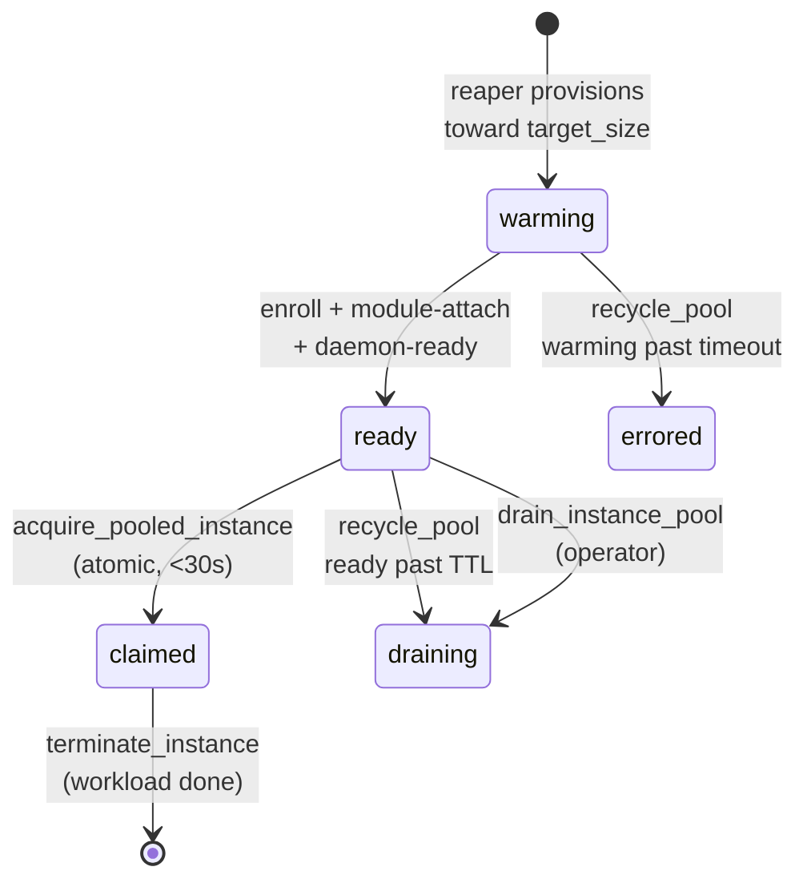

# Tutorial 08 — Instance pools for bursty batch workloads

> Status: active

> **What you'll learn:** Set up a pre-warmed `System::InstancePool` that
> cuts ephemeral provisioning latency from 5–10 min cold-boot to <30 s
> claim — critical for ML training bursts, CI runner fleets, or any
> bursty batch pattern.
>
> **Time:** ~30 min (pool warm-up dominates)
>
> **Builds on:** [Tutorial 03](./03-docker-runtime.md) — pool members are usually
> Docker hosts (or other runtime-bearing instances), so you need the
> runtime handshake working first.
>
> **Sets you up for:** Production ML training, CI runner pools, scheduled
> burst workloads.

## What you're building

The diagram below tracks a single **member's** `pool_state` (the pool row
itself carries a separate `status`: `active` normally, `draining` after a
drain, then `archived`). Members move `warming → ready → claimed`; the
reaper recycles stragglers to `errored`/`draining`.



By the end you'll have a 5-member ML training pool ready for sub-30-second
GPU instance claims.

## Concept refresher

**`System::InstancePool`** is a registry that keeps `target_size` warm
NodeInstances ready for atomic claim. The reaper job (Sidekiq cron, every
60s) monitors deficits and provisions replacements.

**Atomic acquisition** uses Postgres `SELECT FOR UPDATE SKIP LOCKED` —
multiple operators can claim concurrently without race conditions, and a
claim either succeeds or raises `NoReadyMembersError` immediately when no
member is in `pool_state: ready`.

**Why pools cut latency:** the W (warmup latency) dominates ephemeral
provisioning — kernel boot + initramfs + agent enroll + first heartbeat.
Pre-warming amortizes that cost across the pool's lifetime instead of
paying it per-claim.

**Cost trade-off:** warm members cost the same as active members. Higher
`target_size` = lower latency + higher idle cost. Tune based on whether
latency or cost matters more.

## Prerequisites

| Requirement | How |
|---|---|
| A NodeTemplate for the instances the pool will create (`lifecycle_class` is NOT a NodeTemplate field — it lives on the pool, and only on the pool: the member-Node copy it used to stamp was retired with `system_nodes.lifecycle_class`) with a runtime module assigned (e.g. `docker-engine`) | Tutorial 02 + Tutorial 03 |
| Provider quota for ≥10 instances of the chosen instance type | Check provider quota dashboard |
| Operator permission `system.instance_pool_manage` | Default for admins |

## Step 1 — Create the pool

```javascript
platform.system_create_instance_pool({
  name: "ml-training-pool",
  template_id: "<ml-docker-template-id>",
  provider_region_id: "region-aws-us-east-1",
  provider_instance_type_id: "type-g4dn-xlarge",      // GPU instance type
  target_size: 5,
  min_size: 2,
  max_size: 10,
  lifecycle_class: "ephemeral"                          // ephemeral|spot (default ephemeral)
})
// → { pool: { id: "pool-ml-1", name, status: "active", lifecycle_class,
//             target_size: 5, min_size, max_size, ready_count: 0,
//             warming_count: 0, claimed_count: 0, errored_count: 0,
//             deficit, last_replenished_at } }
```

**Expected outcome:** pool row created in `status: active` with zero ready
members. The reaper job sees `ready_count + warming_count < target_size`
on its next tick and begins provisioning 5 members in parallel (each gets
`pool_state: warming`).

## Step 2 — Wait for warm-up

```javascript
platform.system_get_instance_pool({ id: "pool-ml-1" })
// → {
//      pool: { ..., status: "active", warming_count: 5, ready_count: 0,
//              members: [
//                { id, name, pool_state: "warming", status,
//                  pool_warming_started_at, pool_acquired_at },
//                ... 4 more
//              ] }
//    }
```

After ~5 min (parallel bootstrap of 5 instances):

```javascript
// → {
//      pool: { ..., status: "active", warming_count: 0, ready_count: 5,
//              members: [
//                { id, name, pool_state: "ready", status,
//                  pool_warming_started_at, pool_acquired_at },
//                ... 4 more
//              ] }
//    }
```

`members` is nested **inside** `pool`, not beside it, and a member's own key is
`id` — the `System::NodeInstance` id you pass to
`system_get_instance({ instance_id: })`. The roster is capped at 50 members and
ordered by `(pool_state, pool_warming_started_at)`; the counts beside it are
not capped.

**Expected outcome:** all 5 members `ready` and idle. Inspect any one
member via `system_get_instance` — you'll see it's a fully bootstrapped
NodeInstance with the runtime handshake complete.

## Step 3 — Claim instances for a burst

```javascript
// Atomic claim — uses SELECT FOR UPDATE SKIP LOCKED.
// Identify the pool by pool_id (or pool_name); to claim from any matching
// pool, pass lifecycle_class instead (e.g. "ephemeral").
const job1 = platform.system_acquire_pooled_instance({ pool_id: "pool-ml-1" })
// → { instance: { id, status: "running", pool_state: "claimed", ... } }
// elapsed: <30s (because instance was already warm)

const job2 = platform.system_acquire_pooled_instance({ pool_id: "pool-ml-1" })
const job3 = platform.system_acquire_pooled_instance({ pool_id: "pool-ml-1" })

// Pool now has ready_count: 2 (3 of 5 flipped to pool_state: claimed); reaper sees deficit
```

**Expected outcome:** each claim returns in <30s; the pool stays
`status: active` while the reaper provisions 3 fresh `warming` members in
the background on its next tick (impatient? call
`system_replenish_instance_pool({ id: "pool-ml-1" })`).

## Step 4 — Use the claimed instances

Claimed instances are standard NodeInstances — drive them via MCP or SSH:

```javascript
// Run a workload via Docker MCP (the runtime module is already attached)
platform.docker_pull_image({
  host_id: "<host-id-on-claimed-instance>",
  image: "tensorflow:latest-gpu"
})
platform.docker_create_container({
  host_id: "<host-id>",
  image: "tensorflow:latest-gpu",
  command: ["python", "/training-script.py"],
  env: ["DATASET_S3=s3://..."],
  detach: true
})
```

Or SSH for break-glass:

```bash
ssh ops@<instance-host-address>      # SDWAN /128 from system_get_instance
```

## Step 5 — Watch replenishment

Pool membership changes surface both through the member counts on the pool row
and through `system.pool.*` FleetEvents — a member flipping to `ready` emits
`system.pool.member_ready`, and the drain/recycle failure paths emit
high-severity kinds worth alerting on. See the
[pool tuning runbook](../runbooks/instance-pool-tuning.md) for the full event
table. Poll the pool to watch the deficit close:

```javascript
platform.system_get_instance_pool({ id: "pool-ml-1" })
// right after the 3 claims:
// → { pool: { status: "active", claimed_count: 3, ready_count: 2, warming_count: 0, ... } }
// then on the next reaper tick the 3 replacements appear as warming:
// → { pool: { status: "active", claimed_count: 3, ready_count: 2, warming_count: 3, ... } }
```

**Expected outcome:** within ~5 min of claim, the replacements warm up and
the pool is back to `ready_count: 5`, all members `ready`.

## Step 6 — Terminate when workload done

After the training job completes:

```javascript
platform.system_terminate_instance({ instance_id: "<claimed-instance-id>" })
// → cleanly destroys the cloud resource + transitions to :terminated;
//   pool reaper detects the deficit and provisions a replacement
```

For ephemeral / stateless workloads, **prefer terminate over return** —
the instance is single-use; the pool keeps replenishing fresh members.

## Verification

```javascript
platform.system_get_instance_pool({ id: "pool-ml-1" })
// → { pool: { status: "active", ready_count: 5, warming_count: 0, claimed_count: 0,
//             members: [...] } }
//   pool.members[] shows each NodeInstance's id + pool_state
```

## Cleanup

Drain the pool when no longer needed:

```javascript
// Drain sets pool status="draining", halts replenishment, and terminates
// ready members. Claimed members keep running until their workload ends.
// "Halts replenishment" is enforced: replenish! refuses any pool that is not
// active, and the 60s reaper skips its replenish phase for a draining pool
// (it keeps RECYCLING one — that is what empties it). target_size is left
// standing, so status: "active" warms the pool back to the size it had.
platform.system_drain_instance_pool({ id: "pool-ml-1" })
// → { pool: { ..., status: "draining" },
//     drain_result: { drained: 5, terminate_failed: 0, claimed_remaining: 0 } }

// Read `terminate_failed`: a non-zero count means the provider terminate did
// NOT land for that many members. They park at pool_state "errored" (not
// "draining"), a high-severity system.pool.terminate_failed event fires, and
// their VMs may still be running and billing. `drained` alone does not tell
// you the pool is gone.

// Delete only succeeds once the pool has no members — drain first, then:
platform.system_delete_instance_pool({ id: "pool-ml-1" })
```

## Sizing for your workload

| Pattern | Recommended sizing |
|---------|--------------------|
| 1 claim / hour (low burst) | `min_size: 1, target_size: 2, max_size: 5` |
| 5 claims / minute (CI runner) | `min_size: 5, target_size: 10–15, max_size: 25` |
| Burst-then-quiet (ML training, scheduled) | Use **scheduled scale-up**: increase `target_size` via cron/MCP before the burst window; decrease after. Cost optimization beats idle warm members. |

## Troubleshooting

**`NoReadyMembersError` during burst** — claim rate exceeded replenishment
(no member in `pool_state: ready`). Two fixes:

- Increase `target_size` (immediate, costs more)
- Pre-bake a NodePlatform disk image (Tutorial 12) to cut W (warmup latency)
  per-instance, so the reaper replenishes faster

**Members stuck `warming` >10 min** — bootstrap failed. The reaper will
recycle warming members past their `warming_timeout_seconds` to
`pool_state: errored` on its next tick (or force it now with
`system_recycle_pool({ id: "pool-ml-1" })`). To root-cause the failure,
ask the **System Concierge** in chat to attribute it — the
`system-attribute-failure` read-shape skill is bound to the Concierge:

> "Why did instance `<stuck-warming-instance>` fail to warm up?"

**Reaper not replenishing** — Sidekiq queue backed up or worker
unhealthy. Check:

```bash
sudo systemctl status 'powernode-*-sidekiq.service'
sudo systemctl restart 'powernode-*-sidekiq.service'       # safe; ~30s drain
```

(Wait 30s before checking status — see `feedback_service_restarts` memory.)

**Members drift in version** — pool members are provisioned from the
pool's Template. If the template gets a new module assignment, only NEW
members get the change. Existing warm members keep the prior version
until claimed-and-replaced. For consistent fleet versioning, drain the
pool after each template change.

**`max_size` reached but more claims pending** — by design — pool refuses
to grow past max. Either raise `max_size` or use a separate pool for the
overflow. Don't bypass the limit; it's the cost-protection.

## What's next

- **[Tutorial 09 — Honeypot canary](./09-honeypot-canary.md)** — different
  defensive surface; canary modules detect lateral movement / credential
  abuse via decoy assets that should never be accessed.
- **[`runbooks/instance-pool-tuning.md`](../runbooks/instance-pool-tuning.md)** —
  full reference: sizing patterns, reaping behavior, drain procedures.
- **[`USE_CASE_MATRIX.md`](../USE_CASE_MATRIX.md)** — use cases 4 (bursty
  batch) + 5 (CI runner pool).
- **[Tutorial 06 — Fleet-atomic module upgrade](./06-rolling-upgrade.md)** —
  for the stateful counterpart. Note that pool replacement is the blast-radius
  bound an in-place module upgrade cannot give you.

_Last verified: 2026-06-03_
