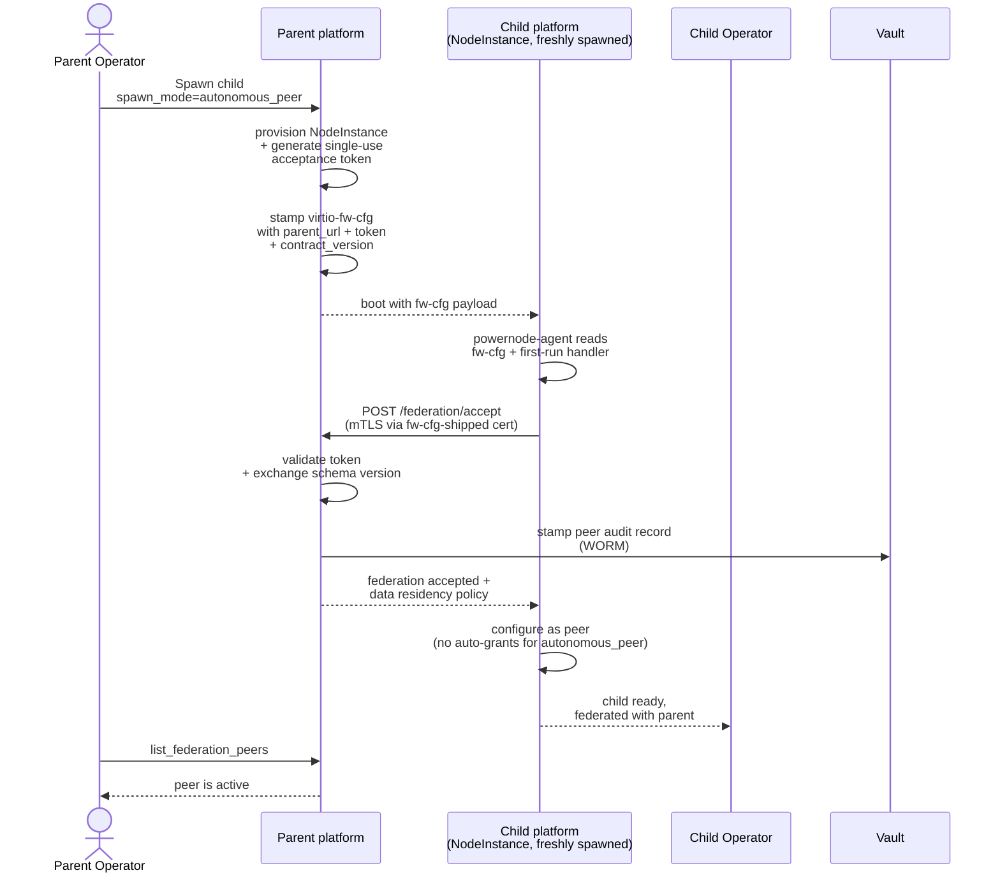

# Tutorial 11 — Multi-region federation

> Status: active

> **What you'll learn:** Federate two Powernode platforms across accounts /
> regions / organizations — three spawn modes (managed_child,
> autonomous_peer, cluster_member), the propose → accept → activate
> handshake, and the P9.x guarantees layered on top (data residency,
> WORM audit, schema-version negotiation, multi-hop migration chains).
>
> **Time:** ~60 min (spawning a child + handshake completion)
>
> **Builds on:** [Tutorial 04](./04-k3s-cluster.md) (single-cluster baseline) and
> [Tutorial 10](./10-gitops-fleet.md) (declarative management — you can codify
> federation peer declarations alongside the rest of fleet.yaml).
>
> **Sets you up for:** Production multi-region deployments, HA via
> cluster_member peers, partner integrations via autonomous_peer mode.

## What you're building



By the end you'll have a child platform federated with the parent, with
the audit trail + schema negotiation in place.

## Concept refresher

**Spawning** is when a parent platform provisions a brand-new child as a
NodeInstance and completes federation handshake at boot — child comes
online already federated. Contrasts with out-of-band peering where two
pre-existing platforms exchange tokens manually.

**Three spawn modes** (per `docs/federation/SPAWN_MODES.md`):

| Mode | Relationship | Auto-grant to parent | Shared infrastructure | Use case |
|------|--------------|----------------------|------------------------|----------|
| `managed_child` | Parent-administered | Yes — operator scope (read/write/admin), 365-day TTL | None | Dev/test sandbox, branch deployments, fleet of similar platforms |
| `autonomous_peer` | Equal peers | No — parent has only the peering | None | Partner platform you'll federate with but not administer |
| `cluster_member` | HA cluster member | No auto-grant | PG streaming replication slot + Redis VIP from parent's primary | Horizontal scale + HA |

**P9.x guarantees** that ship on top:

- **P9.1 — Auto-policy capability sweep:** sensible defaults issued at
  accept-time based on spawn_mode; operators can tighten further.
- **P9.2 — Schema-version negotiation:** parent + child exchange
  `contract_version`; mismatches block peering with a clear error,
  preventing silent protocol drift.
- **P9.3 — Per-peer WORM audit shipping:** every cross-account action
  flows through a per-peer write-once audit log. Tamper-evident.
- **P9.4 — Data residency enforcement:** declare per-peer constraints
  (e.g., "EU-residency: traffic for these resources must not cross
  outside EU"); platform enforces at federation-aware MCP boundaries.
- **P9.5 — Multi-hop migration chains:** when peers federate across
  multiple hops (A → B → C), migrations applied at A propagate down the
  chain with explicit operator gates at each hop.

> **MCP coverage note:** the `platform.system_sdwan_set_data_residency` and
> `platform.system_sdwan_get_audit_log` MCP wrappers shown in this tutorial are
> registered actions backing the P9.x logic. The equivalent REST endpoints
> (`/api/v1/system/sdwan/federation_peers/:id/data_residency` and
> `/api/v1/system/sdwan/federation_peers/:id/audit_log`) remain available.

**Emancipation** (managed_child → autonomous_peer): the child operator
can revoke the parent's grant at any time, downgrading the relationship
without breaking federation.

## Prerequisites

| Requirement | How |
|---|---|
| Tutorial 04 worked (parent has a working K3s + SDWAN setup) | Implies platform + node + SDWAN |
| Sufficient capacity to provision a second NodeInstance (the child platform itself) | Provider quota |
| Operator with `system.federation.spawn` permission | Default for admins |
| Both networks publicly-reachable (or both behind same NAT with port forward) | For cross-account spawns; intra-account works on local SDWAN |

## Step 1 — Spawn the child platform

This tutorial uses `autonomous_peer` mode (simplest + most general; see [`docs/federation/SPAWN_MODES.md`](../federation/SPAWN_MODES.md) for the full mode comparison).

**Important: spawning a child platform is distinct from proposing an out-of-band federation peer.** The `system_sdwan_propose_federation_peer` MCP action proposes a *peer record* (no spawn, no platform provisioning — used when both platforms already exist and just need to peer). To spawn a *new* child platform, hit the children-spawn REST endpoint (`POST /api/v1/system/federation/children/spawn`), which routes into `System::SpawnPlatformService.spawn!` to provision the child NodeInstance, stamp its fw-cfg with parent identity + acceptance token, and create the parent-side `System::FederationPeer` row.

```bash
# Parent platform — spawn the child
curl -X POST https://parent.example.org/api/v1/system/federation/children/spawn \
  -H "Authorization: Bearer $PARENT_JWT" \
  -H "Content-Type: application/json" \
  -d '{
    "spawn_mode": "autonomous_peer",
    "child_template_id": "<powernode-hub-template-id>",
    "child_provider_region_id": "region-...",
    "child_provider_instance_type_id": "type-...",
    "child_hostname": "child-platform-1"
  }'

# → {
#     "federation_peer": { "id": "...", "status": "proposed", "spawn_role": "parent",
#                          "spawn_mode": "autonomous_peer", ... },
#     "child_instance_id": "...",
#     "acceptance_token": "<one-time-displayed>"
#   }
```

**Note on `proposed_routes` / `proposed_capabilities`:** these are not part of the spawn-time payload today. Cross-peer route announcements + capability grants are configured *after* the child boots + completes its handshake (see Step 4 for route grants, [`federation/NETWORK_TRUST.md`](../federation/NETWORK_TRUST.md) for capability grants).

**No MCP wrapper for spawn (yet):** the spawn endpoint is REST-only today. The closely-named `system_sdwan_propose_federation_peer` MCP is for the *propose-existing-peer* path, not spawn.

**Expected outcome:** parent-side row created in `status: "proposed"`; child NodeInstance provisioning starts; acceptance token displayed once.

> **Token handling:** the `acceptance_token` is shown once — never logged,
> never persisted in plaintext. If you lose it before the handshake
> completes, revoke the peer (`system_sdwan_revoke_federation_peer`) and
> propose again.

## Step 2 — Watch the child boot + handshake

```javascript
platform.recent_events({ kind_prefix: "federation.", limit: 20 })
// → events: [
//      // Emitted on the parent side when the child completes its
//      // acceptance handshake against the AcceptController:
//      { kind: "federation.peer.accepted", payload: { peer_id, peer_kind: "platform",
//        spawn_role: "parent", spawn_mode: "autonomous_peer", contract_version, ... } },
//
//      // Future on-tick events (heartbeat_stale, grant.archived, etc.) will
//      // appear here as the federation governance loop runs.
//    ]
```

**Note (2026-05-19 doc audit):** earlier revisions of this step listed a richer event stream (`system.federation.spawn.fwcfg_stamped`, `system.federation.schema_negotiated`, `system.federation.peer.active`, etc.) — those events are not currently emitted. The actual federation event surface today uses the `federation.` prefix (not `system.federation.`) and includes:

- `federation.peer.accepted` / `federation.peer.revoked` — emitted by `Api::V1::System::FederationApi::AcceptController#emit_event!` when a peer transitions
- `federation.peer.heartbeat_stale` — emitted by `System::Federation::HeartbeatSweepService` when a peer's last_heartbeat_at exceeds the stale threshold
- `federation.grant.archived` — emitted by `System::Federation::GrantArchivalService`
- `federation.review.<key>` — emitted by `System::Federation::GrantReviewService`
- `federation.manager.review_completed` — emitted by `FederationManagerExecutor`

Spawn-side events (the child NodeInstance's provisioning + fw-cfg stamping + handshake) are NOT currently surfaced as `FleetEvent` rows; operators monitor spawn progress via `system_get_instance` polling on the child NodeInstance instead. A future change may add structured spawn events; until then, the stream above is the authoritative one.

**Expected outcome:** ~5–10 min wall clock for full sequence on a warm instance + reachable parent. The `federation.peer.accepted` event lands when the child's acceptance handshake completes, and the peer settles at `status: "enrolled"` (status column on `System::FederationPeer`).

> **Heartbeat caveat — `enrolled` vs `active`:** the `enrolled → active`
> transition fires only when an **inbound** `/federation_api/heartbeat` call
> hits the parent and runs `peer.record_heartbeat!`. The timer-driven
> `HeartbeatSweepService` deliberately does **not** advance `enrolled` peers
> (it only degrades already-`active` ones). If the peer's agent-side heartbeat
> isn't emitting yet, the peer stays `enrolled` — that's healthy, not stuck.
> To advance it manually, POST a heartbeat from the peer side (or re-run the
> peer's heartbeat job). See
> [`../runbooks/federation-troubleshooting.md`](../runbooks/federation-troubleshooting.md)
> "Peer stuck in `accepted`" for the same heartbeat-job diagnosis applied to
> the `enrolled → active` step.

## Step 3 — Verify the peering

```javascript
platform.system_sdwan_list_federation_peers()
// → { peers: [{
//      id: "...",
//      spawn_role: "parent",
//      spawn_mode: "autonomous_peer",
//      status: "active",
//      remote_platform_url: "https://child-platform-1.fd00:abcd:2::21",
//      contract_version: "1.0",
//      ...
//    }] }
```

From the child platform side (login to its operator UI):

```javascript
platform.system_sdwan_list_federation_peers()
// → { peers: [{
//      spawn_role: "child",
//      spawn_mode: "autonomous_peer",
//      status: "active",
//      remote_platform_url: "https://parent.fd00:abcd:1::21",
//      ...
//    }] }
```

**Expected outcome:** symmetric view of the peering on both sides. The
`status` reads `active` once heartbeats are flowing in both directions; until
the first inbound heartbeat lands it shows `enrolled` (see the heartbeat
caveat in Step 2).

## Step 4 — Apply data residency (P9.4)

`system_sdwan_set_data_residency` takes a scalar `data_residency` value — a
region / residency tag stamped on the peer:

```javascript
platform.system_sdwan_set_data_residency({
  federation_peer_id: "...",
  data_residency: "eu-west-1"
})
```

**Expected outcome:** the peer is tagged with the residency region; future
federated MCP calls scoped to that peer are blocked if they'd cause data to
leave the tagged region. Enforcement happens at federation-aware controllers,
audit-logged via the WORM log (P9.3).

## Step 5 — Verify WORM audit (P9.3)

```javascript
platform.system_sdwan_get_audit_log({ federation_peer_id: "..." })
// → { entries: [
//      { sequence: 1, action: "federation.proposed",  at: "...", actor: "parent_op", ... },
//      { sequence: 2, action: "federation.accepted",  at: "...", actor: "child_handshake", ... },
//      { sequence: 3, action: "data_residency.set",   at: "...", actor: "parent_op", payload: {...} },
//      ...
//    ] }
```

**Expected outcome:** monotonically-increasing sequence, immutable
entries (any attempt to update a row is rejected at the DB level).

## Step 6 — Apply firewall rules at the federation boundary

Federation traffic should be tightly controlled:

```javascript
// Default deny all ingress from federation peers
platform.system_sdwan_create_firewall_rule({
  network_id: "<parent-network>",
  direction: "ingress",
  action: "drop",
  selector: { kind: "federation_peer", federation_peer_id: "..." },
  protocol: "any"
})

// Explicit allow only the agreed services
platform.system_sdwan_create_firewall_rule({
  network_id: "<parent-network>",
  direction: "ingress",
  action: "accept",
  selector: { kind: "federation_peer", federation_peer_id: "..." },
  protocol: "tcp",
  port_range: "443"
})
```

## Step 7 — Use the federation

```bash
# From a parent peer, reach a child peer
curl -k https://[fd00:abcd:2::42]/healthz
# → response from child's service (over federated SDWAN)
```

Or via MCP:

```javascript
platform.system_sdwan_get_routing_summary({ network_id: "<parent-network>" })
// → bgp_routes includes "fd00:abcd:2::/64 source=federation:<peer-id>"
```

## Step 8 — Complete an accept as an approval-gated skill (acceptance orchestration)

The spawn flow above completes its handshake automatically against the
parent's `AcceptController`. But the **same** accept chain
(`System::Federation::FederationAcceptanceService`) is also exposed as an
**approval-gated skill** — `federation_acceptance` — so an operator (via the
System Concierge) or the SDWAN Manager autonomy loop can finish a peering
whose acceptance token the platform holds. This is the path you use to
re-accept after a transient failure, or to complete an out-of-band peer's
handshake through the approval queue.

Ask the Concierge in chat ("accept the federation peer using token `<X>`,
contract version 1"), or run the skill directly:

```javascript
platform.execute_agent({
  agent: "SDWAN Manager",
  skill: "federation_acceptance",
  inputs: {
    acceptance_token: "<token from the proposing side>",
    contract_version: 1,
    capabilities: {},        // optional forward-compat advertisement
    extension_slugs: [],     // optional — extensions the peer carries
    endpoints: []            // optional — [{ url, scope, priority, cidr_hint? }]
  }
})
// → lands in the approval queue (requires_approval: true)
```

The chain it runs on approval (hard steps abort; soft steps warn):

```
verify contract_version (HARD) → locate peer by token (HARD)
  → accept! (HARD) → enroll! (HARD, platform peers)
  → ensure managed_child operator grant (idempotent)
  → issue node_api bootstrap token (HARD, managed_child spawns)
  → SDWAN attach (SOFT) → governance scan (SOFT)
```

**Expected outcome:** after you approve at `/ai/autonomy/approvals` (needs
`system.infra_tasks.control`), the peer transitions
`proposed → accepted → enrolled` and the result returns `peer_id`,
`contract_version_agreed`, the `node_enrollment` block (for managed-child
spawns), the `sdwan_attach` result, the `governance` result, and any
`warnings`. The soft-step warnings (SDWAN attach / governance) do **not**
fail the accept — see the troubleshooting section.

## Step 9 — Compose the federation overlay topology

To carry workload traffic between sites over the encrypted overlay, compose
a federation **topology** with the `sdwan_federation_compose` skill (bound to
**System Topology Designer**). Two shapes:

```javascript
platform.execute_agent({
  agent: "System Topology Designer",
  skill: "sdwan_federation_compose",
  inputs: {
    network_name: "fed-overlay-parent-child",
    topology: "hub_and_spoke",      // or "full_mesh"
    routing_protocol: "ibgp",        // or "static"
    peers: [
      { node_instance_id: "<parent-hub-instance>", role: "hub",
        endpoint_host_v6: "fd00:abcd:1::21", endpoint_port: 51820 },
      { node_instance_id: "<child-instance>", role: "spoke" }
    ],
    dry_run: true                    // preview the fan-out first; then re-run with false
  }
})
```

- **`hub_and_spoke`** — spokes funnel through publicly-reachable hubs. At
  least one `role: "hub"` is required, and **every hub must carry an
  endpoint** (`endpoint_host_v6`/`v4` + `endpoint_port`) — the skill fails
  fast otherwise.
- **`full_mesh`** — any-to-any direct connectivity; no hub/spoke distinction.

`routing_protocol: "ibgp"` enables FRR route-policy distribution between
peers. Run with `dry_run: true` first to review the projected peer/hub
counts and step list.

**Expected outcome:** one `Sdwan::Network` is created with the chosen
topology strategy, each member is enrolled as a peer (hubs publicly
reachable), and the per-peer WireGuard + FRR route-policy envelope is
compiled. Rollback (on failure) detaches peers in reverse order, then deletes
the network.

## Step 10 — Isolate a tenant on the overlay (SDWAN-native)

Give one tenant a fully-segregated network slice — its own VRF, /64,
firewall, and OVN ACLs — entirely over the SDWAN overlay. **No k8s
NetworkPolicy, no CoreDNS, no VLAN.** Use the `multi_tenant_isolation` skill
(bound to **System Topology Designer**, approval-gated):

```javascript
platform.execute_agent({
  agent: "System Topology Designer",
  skill: "multi_tenant_isolation",
  inputs: {
    tenant_key: "tenant-alpha",      // slug-safe; names network, rules, switch, ACLs
    // tenant_cidr omitted ⇒ the auto-allocated /64 is used (recommended)
    nb_db_endpoint: "tcp:127.0.0.1:6641",  // required only if no OvnDeployment yet
    sb_db_endpoint: "tcp:127.0.0.1:6642",
    dry_run: false
  }
})
```

The five composed layers (IDs threaded inline):

1. A dedicated `Sdwan::Network` (`routing_protocol: "ibgp"`) → its own VRF +
   isolated RIB (no shared forwarding table with other tenants).
2. A non-overlapping `/64` via `Sdwan::PrefixAllocator` (the blast-radius
   boundary).
3. nftables firewall rules — allow the tenant's own `/64` (high priority) +
   default-deny wildcard.
4. An OVN logical switch scoped to the tenant CIDR (intra-host L2 domain).
5. OVN ACLs — allow intra-tenant, drop cross-tenant.

**Expected outcome:** a tenant cannot reach another tenant's prefix because
the VRF's routing table doesn't contain the route and the nftables/OVN
default-deny blocks any leak. Rollback (reverse order: OVN ACLs → switch →
firewall → network) is available if a step fails (the skill returns
`partial: true` with a `failures` array). Architecture:
[`../FEDERATION_MULTI_SITE_GUIDE.md`](../FEDERATION_MULTI_SITE_GUIDE.md) §4a.

## Step 11 — Watch the liveness autonomy loop

You don't have to poll peer health by hand. The **liveness autonomy loop**
keeps platform peers healthy:

`FederationPeerLivenessSensor` (read-only, runs each fleet tick) emits a
`system.federation_peer_liveness` signal when a peer's heartbeat goes stale
(>5 min) or its bound cert is expiring/expired. The DecisionEngine routes the
signal to `FederationPeerRemediateExecutor` (`federation_peer_remediate`,
bound to **SDWAN Manager**), which branches on the reason:

- **`heartbeat_stale`** → probe the peer over mTLS. Reachable ⇒
  `rehandshaked` (awaits inbound heartbeat recovery); unreachable + active ⇒
  `degraded`; unreachable + not degradable ⇒ `alerted`.
- **`cert_expiring` / `cert_expired`** → `alerted` only. Federation cert
  rotation is operator-driven (cross-CA handshake with the remote operator);
  the loop never silently rotates a trust cert.

Watch it run:

```javascript
platform.recent_events({
  source: "federation_peer_remediate_executor",
  limit: 20
})
// → federation.peer.rehandshaked / .degraded / .unreachable / .cert_rotation_required
```

**Expected outcome:** a peer that briefly goes quiet self-recovers
`degraded → active` on its next inbound heartbeat; a genuinely-offline peer
is degraded and alerted; cert expiry surfaces as an operator alert. Full
detail: [`../FEDERATION_MULTI_SITE_GUIDE.md`](../FEDERATION_MULTI_SITE_GUIDE.md) §5.

## Verification

**Peering active:**

```javascript
platform.system_sdwan_list_federation_peers()   // both sides report active
```

**Routes propagated:**

```javascript
platform.system_sdwan_get_routing_summary({ network_id })
// → bgp_routes includes the remote /64
```

**Audit log shipping:**

```javascript
platform.system_sdwan_get_audit_log({ federation_peer_id })
// → entries growing per cross-account action
```

## Cleanup

```javascript
platform.system_sdwan_revoke_federation_peer({ id: "..." })
// → status: revoked; routes withdrawn from BGP; firewall rules unaffected (operator cleanup)

// Terminate the child platform instance if no longer needed
platform.system_terminate_instance({ id: "<child-instance>" })
```

## Troubleshooting

**Child boots but handshake never completes** — the child can't reach the
parent's `/federation/accept` endpoint. Three common causes:

- Parent's federation listener isn't reachable from the child's overlay
  (check `system_sdwan_get_routing_summary` on both sides)
- Acceptance token expired (default 7 days, per `System::SpawnPlatformService::DEFAULT_TOKEN_TTL`); revoke + re-propose
- mTLS chain mismatch (child's spawn fw-cfg carries the parent's CA;
  check it matches what InternalCaService currently issues)

**Schema negotiation fails** — parent + child are on incompatible
`contract_version`. Upgrade one side (or both) to a compatible version
before re-spawning. Mismatch is intentional protection against silent
protocol drift.

**`managed_child` spawn but operator can't see child resources** — the
parent-side auto-grant lands at accept; the symmetric child-side grant
lands on child's first-run completion. If the child first-run errored,
the child-side grant doesn't exist. Verify via child's grants list;
manually issue if needed.

**`cluster_member` replica lag growing** — PG physical replication
streaming has fallen behind. Check the parent primary's `pg_stat_replication`:

```sql
SELECT slot_name, state, sent_lsn, replay_lsn, replay_lag FROM pg_stat_replication;
```

Common causes: network saturation between parent + child, WAL retention
too low, slot in `inactive` state because child is down.

**Data residency policy violation surfaced as 403** — operator
attempted a cross-region action prohibited by the policy. Either:

- Tighten scope so the action stays in-region
- Relax the policy (operator-side change)
- Use an explicit override (audit-logged) for a one-off

**`federation_acceptance` skill ran but nothing happened** — the skill is
`requires_approval: true`. It sits in the approval queue until you approve it
at `/ai/autonomy/approvals` (needs `system.infra_tasks.control`); the accept
chain runs only on approval. For a plain out-of-band peer you can skip the
gate by using the `system_sdwan_accept_federation_peer` MCP action directly —
same `FederationAcceptanceService` chain, no skill approval.

**Accept succeeded but returned `sdwan_attach` / `governance` warnings** —
those are **soft** steps. A warning there (e.g. `skipped` with reason
`no_overlay_network` for an out-of-band peer, or a governance cert finding)
does not fail the accept; the peer is enrolled and you can re-run the
overlay attach / scan independently. See
[`../runbooks/federation-troubleshooting.md`](../runbooks/federation-troubleshooting.md).

**`multi_tenant_isolation` returned `partial: true`** — some isolation
layers landed but a later step failed (read the `failures` array). The most
common cause is an unreachable OVN NB/SB DB endpoint. Roll back the partial
slice (reverse order: ACLs → switch → firewall → network), fix the endpoint,
and re-run — try `dry_run: true` first. If it refuses with
"nb_db_endpoint/sb_db_endpoint required," the account has no `OvnDeployment`
yet; supply both endpoints so the first slice creates it.

**Liveness loop degraded a peer you expected to be fine** — the
`federation_peer_remediate` executor probed the peer over mTLS and it was
unreachable, so it degraded an `active` peer. If the remote is genuinely
back, its next inbound heartbeat self-recovers it `degraded → active`. Check
`recent_events({ source: "federation_peer_remediate_executor" })` for the
probe error.

## What's next

- **[`docs/FEDERATION_MULTI_SITE_GUIDE.md`](../FEDERATION_MULTI_SITE_GUIDE.md)** —
  the full multi-site architecture: acceptance orchestration, hub/full-mesh
  SDWAN topology, SDWAN-native tenant isolation + service discovery, the
  liveness autonomy loop, and security.

- **[Tutorial 12 — Disk image CI](./12-disk-image-ci.md)** — for fleets of
  spawned children, you want a custom NodePlatform with pre-baked
  modules; disk image CI is how you build it.
- **[`docs/federation/SPAWN_MODES.md`](../federation/SPAWN_MODES.md)** —
  full spawn-mode reference (cluster_member PG replication slot
  internals, managed_child intervention policy cascade, emancipation).
- **[`docs/federation/NETWORK_TRUST.md`](../federation/NETWORK_TRUST.md)** —
  sovereign auth handshake details.
- **[`docs/federation/MIGRATION_DEVELOPER_GUIDE.md`](../federation/MIGRATION_DEVELOPER_GUIDE.md)** —
  multi-hop migration chains (P9.5) for federation-scoped schema changes.
- **[`docs/runbooks/federation-setup.md`](../runbooks/federation-setup.md)** —
  production-grade setup with HA + cross-org agreements.
- **[`docs/runbooks/federation-troubleshooting.md`](../runbooks/federation-troubleshooting.md)** —
  diagnostic procedures.
- **[`SMOKE_TEST.md`](../SMOKE_TEST.md) Pass 4** — `smoke_test_powernode_hub.rb`
  and `smoke_test_cluster_member_ha.rb` exercise the federation control
  plane at the platform layer.

_Last verified: 2026-06-03 (rev 2)_
