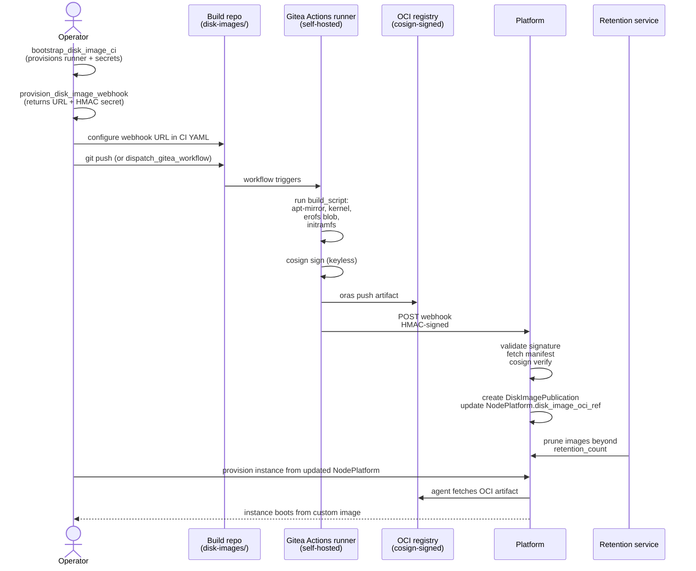

# Tutorial 12 — Disk image CI publication

> Status: active

> **What you'll learn:** Set up a continuous build pipeline that produces
> kernel + initramfs + erofs disk images for your custom NodePlatform,
> signs them with cosign, publishes as OCI artifacts, and propagates
> through retention. The same pattern Powernode uses to build its own
> shipped initramfs.
>
> **Time:** ~60 min (most of which is the first CI run)
>
> **Builds on:** [Tutorial 01](./01-first-boot.md) (you understand
> NodePlatform + initramfs build) and [Tutorial 02](./02-first-module.md)
> (module CI pattern — disk image CI is the same shape, different artifact
> type).
>
> **Sets you up for:** Building your own derived NodePlatforms for
> air-gapped environments, hardware variants, regulatory profiles.

## What you're building



By the end you'll have a working CI pipeline that publishes signed disk
images and a NodePlatform pointing at your custom artifact.

## Concept refresher

**Why disk image CI separate from module CI?**

- **Module CI** (Tutorial 02) produces erofs blobs assembled into
  layered rootfs at boot time. Per-module, lifecycle-tracked.
- **Disk image CI** produces the kernel + initramfs + base erofs
  blob — the unchangeable foundation a NodeInstance boots into.
  Per-platform, retention-managed.

A custom disk image is useful when:

- You need a different kernel (e.g., realtime patchset, custom drivers)
- You need a hardened base (e.g., FIPS-validated cryptographic library)
- You need air-gapped offline images
- You need hardware-specific firmware blobs in initramfs

**The CI architecture mirrors module CI:**

- Self-hosted Gitea Actions runner (provisioned via
  `bootstrap_disk_image_ci`)
- Cosign keyless signing via Sigstore Fulcio
- Webhook-back to the platform's `disk_image_built` controller
- HMAC-authenticated post-build callback
- Auto-prune via retention service

**Disk Image Manager agent** (per `docs/DISK_IMAGE_MANAGER_AGENT.md`)
runs every 5 minutes and operates on the publication backlog — promoting
images, applying retention, alerting on stuck builds.

## Prerequisites

| Requirement | How |
|---|---|
| Tutorial 01 + 02 worked | You understand initramfs build + cosign + module CI |
| Gitea account with admin to create repos under your account | Permission to create runners |
| `docker`, `oras`, `cosign` CLIs (already from Tutorial 02) | — |
| A Linux host with Docker available where you'll install + register the Gitea Actions runner | The runner is NOT a managed NodeInstance; operator-owned (see Step 1) |
| Operator permission `system.disk_image_ci.bootstrap` | Default for admins |

## Step 1 — Bootstrap the CI worker + webhook (one-shot setup)

```javascript
platform.bootstrap_disk_image_ci({
  owner: "<your-account-name>",          // Gitea owner
  repo: "disk-images",                    // build repo (will be created if missing)
  label: "ubuntu-2404-amd64-builder",    // operator-chosen identifier
  platform_api_base: "https://platform.example.org",  // optional; defaults to POWERNODE_PUBLIC_URL
  create_platform_read_token: true       // mints a read-scoped JWT for the runner
})
// → {
//     success: true,
//     webhook:   { id, label, action, url: "https://platform.example.org/api/v1/system/webhooks/disk_image/built/<webhook_id>" },
//     ci_worker: { id, name, action },
//     gitea_secrets_set: { "POWERNODE_DISK_IMAGE_WEBHOOK_SECRET": "ok", "POWERNODE_CI_WORKER_TOKEN": "ok", ... },
//     note: "..."
//   }
```

**No plaintext comes back.** An MCP tool result is truncated into
`ai_messages.processing_metadata` and forwarded in full to the model provider, so it is
not a private channel (IMP-fa6cf8ee1eb6 / IMP-27cc7dceb97b). The webhook secret and the CI
worker token are delivered **out of band** into the repo's Gitea Actions secret store —
`gitea_secrets_set` is the receipt — and the workflow reads them from `${{ secrets.* }}`.

**Expected outcome:** the action is **synchronous + idempotent on `label`** (re-running rotates secrets without creating duplicates). It creates a `System::DiskImageWebhook` row, a `Worker` row with role `ci_worker`, and sets repo Actions secrets. It does **not** create a `System::Task` and does **not** provision a NodeInstance — the runner is operator-installed on a host of their choosing.

**Install + register the Gitea Actions runner** on a Docker-capable Linux host. `act_runner register --token` takes Gitea's own *runner registration* token (Gitea → Settings → Actions → Runners), not the platform CI worker token; the platform's worker token is already in the repo secret `POWERNODE_CI_WORKER_TOKEN` for the workflow to use when calling back:

```bash
mkdir -p /opt/gitea-runner && cd /opt/gitea-runner
curl -LO https://gitea.com/gitea/act_runner/.../act_runner   # or use your distro's package
./act_runner register \
  --instance https://gitea.example.org \
  --token "<gitea-runner-registration-token>" \
  --labels "disk-image-builder,amd64"
systemctl --user enable --now act_runner.service             # or run ./act_runner daemon
```

**Verify the runner registered:**

```javascript
platform.system_list_ci_workers()
// → { workers: [{ id, name, role: "ci_worker", status: "online", ... }] }
```

You do not need to copy the webhook secret anywhere: bootstrap already set it in the repo's Actions secrets as `POWERNODE_DISK_IMAGE_WEBHOOK_SECRET`, and it is deliberately never returned on the MCP surface.

If you need a separate webhook for another build pipeline, use Step 2's standalone `provision_disk_image_webhook` action. Otherwise this single bootstrap call covered both.

## Step 2 — (Optional) Provision an additional webhook

Step 1 already provisioned a webhook + set the repo secrets. Skip this step unless you need a second webhook for an additional pipeline (different arch, different platform image variant, etc.).

```javascript
platform.provision_disk_image_webhook({
  label: "ubuntu-2404-arm64-builder"   // operator-chosen identifier
  // platform_api_base optional; defaults to POWERNODE_PUBLIC_URL
})
// → {
//     success: true,
//     webhook_id: "<uuid>",
//     webhook_url: "https://platform.example.org/api/v1/system/webhooks/disk_image/built/<webhook_id>",
//     secret_delivery: "not disclosed here — ...",
//     note: "..."
//   }
```

Webhooks are **per-pipeline** (the URL embeds the webhook UUID), not per-NodePlatform. The
action does not accept `node_platform_id`. **The secret is not returned** — this webhook is
inert until you fetch one over the operator API
(`POST /api/v1/system/disk_image_webhooks/<id>/rotate_secret`, separate permission,
approval-gated). If you want the secret delivered without a reveal at all, use
`bootstrap_disk_image_ci` instead, which writes it straight into the repo's Actions secrets.

## Step 3 — Author the build repo

The runner's repo (`<account>/disk-images` from Step 1) needs a
`.gitea/workflows/build-disk-image.yml` that:

1. Runs your `build_script` (apt-mirror + kernel pull + erofs encode + initramfs build)
2. Cosign signs the OCI manifest
3. POSTs the webhook with the OCI digest + SBOM

A minimal template:

```yaml
name: Build disk image
on:
  workflow_dispatch:
    inputs:
      platform_slug:
        type: string
  push:
    tags: ['v*']

jobs:
  build:
    runs-on: [self-hosted, disk-image-builder]
    permissions:
      id-token: write           # for cosign keyless
    steps:
      - uses: actions/checkout@v4

      - name: Run build script
        run: |
          bash build.sh \
            --arch amd64 \
            --variants kernel-initrd,oci

      - name: Cosign sign + push OCI
        env:
          OCI_REGISTRY: ${{ vars.POWERNODE_OCI_REGISTRY }}
        run: |
          oras push "$OCI_REGISTRY/<account>/disk-images/${{ inputs.platform_slug }}:$GITHUB_REF_NAME" \
            ./build/oci/manifest.json:application/vnd.powernode.disk_image.v1+manifest
          cosign sign --yes "$OCI_REGISTRY/<account>/disk-images/${{ inputs.platform_slug }}:$GITHUB_REF_NAME"

      - name: Notify platform
        env:
          WEBHOOK_URL: ${{ vars.POWERNODE_DISK_IMAGE_WEBHOOK_URL }}
          WEBHOOK_SECRET: ${{ secrets.POWERNODE_DISK_IMAGE_WEBHOOK_SECRET }}
        run: |
          # Compute HMAC + POST
          PAYLOAD=$(cat <<EOF
          { "platform_slug": "${{ inputs.platform_slug }}",
            "oci_ref": "$OCI_REGISTRY/<account>/disk-images/${{ inputs.platform_slug }}:$GITHUB_REF_NAME",
            "sbom_path": "build/sbom.spdx.json" }
          EOF
          )
          SIG=$(echo -n "$PAYLOAD" | openssl dgst -sha256 -hmac "$WEBHOOK_SECRET" -binary | base64)
          curl -X POST "$WEBHOOK_URL" \
            -H "X-Powernode-Signature: $SIG" \
            -H "Content-Type: application/json" \
            -d "$PAYLOAD"
```

**Configure secrets** in Gitea repo settings:

- `POWERNODE_DISK_IMAGE_WEBHOOK_SECRET` = the secret from Step 2
- Var `POWERNODE_DISK_IMAGE_WEBHOOK_URL` = the URL from Step 2
- Var `POWERNODE_OCI_REGISTRY` = e.g. `registry.example.com`

## Step 4 — Trigger a build

```javascript
platform.dispatch_gitea_workflow({
  owner: "<account>",                       // Gitea owner
  repo: "disk-images",                      // repo name (not "<owner>/<repo>")
  workflow_file: "build-disk-image.yaml",   // workflow filename (the param is `workflow_file`, not `workflow`)
  ref: "master",                            // branch/tag ref (required)
  inputs: { platform_slug: "ubuntu-2404-custom" }
})
// → { run_id: "..." }
```

**Expected outcome:** workflow starts. Tail logs:

```javascript
platform.list_gitea_workflow_runs({
  owner: "<account>",
  repo: "disk-images",
  workflow_file: "build-disk-image.yaml"    // optional filter
})
// → { runs: [{ id, status: "in_progress", ... }] }

// job_id comes from get_gitea_workflow_run(...).jobs[].id
platform.get_gitea_job_logs({ owner: "<account>", repo: "disk-images", job_id: "<job-id>" })
```

Total runtime: ~30–60 min on cold cache (apt-mirror + kernel build
dominate). Subsequent builds are much faster with cached layers.

## Step 5 — Watch ingestion

After the workflow's webhook step succeeds:

```javascript
// One exact kind per call — system_recent_signals has no prefix filter.
platform.system_recent_signals({ kind: "system.disk_image_published", limit: 20 })
// → events: [
//      { kind: "system.disk_image_published",
//        payload: { publication_id, node_platform_id, oci_ref, sha256, ... } }
//    ]
// Nothing listed? Ask for the failure kind:
platform.system_recent_signals({ kind: "system.disk_image_publish_failed", limit: 20 })
// (retention emits: system.disk_image_retention_swept)
```

**Expected outcome:** `DiskImagePublication` row exists with `status: "published"`; `NodePlatform`'s `disk_image_publication_status` is `published` and `disk_image_oci_ref` points at the new OCI artifact. The actual emitted events are `system.disk_image_published` (success) and `system.disk_image_publish_failed` (failure); earlier doc revisions referenced finer-grained `webhook_received` / `cosign_verified` / `publication_created` / `platform_updated` events — those don't exist.

## Step 6 — Set retention policy

```javascript
platform.system_set_disk_image_retention({
  node_platform_id: "<your-platform-id>",
  retention_count: 5            // keep last 5 publications
})
```

The action accepts only `retention_count` — there is no `retention_days` parameter. Pruning grace is fixed at 7 days (the OCI blob is removed from the registry 7 days after the publication transitions to `retired`).

**Expected outcome:** `DiskImageRetentionService` (daily Sidekiq cron) will prune publications beyond the count on its next pass; emits `system.disk_image_retention_swept` per-pruned row. The Disk Image Manager agent's tick interval (5 min) is for its other concerns (publication promote/rollback approvals); retention runs on its own cron.

## Step 7 — Promote a publication to default

```javascript
platform.system_set_default_disk_image_publication({
  publication_id: "<new-publication-id>"
})
```

**Expected outcome:** future provisions from this NodePlatform fetch the
new artifact at boot. Existing instances keep their boot image (immutable
at runtime).

## Verification

**Publication exists:**

```javascript
platform.system_list_disk_image_publications({ node_platform_id })
// → { publications: [{ id, status: "published", oci_ref, sha256, arch,
//      active: true, attestation_present: true, verified_at, published_at, ... }] }
// (the row exposes `active` for the current default and `attestation_present`/`verified_at`
//  for the cosign result — there is no `oci_digest`, `cosign_verified`, or `is_default` field)
```

**New provision uses it:**

```javascript
platform.system_provision_instance({
  node_template_id: "<template-using-custom-platform>",
  node_id: ...
})
// → instance provisions; agent fetches OCI artifact at boot
```

```javascript
platform.system_get_instance({ instance_id: "<new-instance>" })
// → { instance: { status: "running", node_platform_id, ... } }

// Verify the booted artifact by inspecting the NodePlatform's current default publication:
platform.system_list_disk_image_publications({
  node_platform_id: "<your-platform-id>",
  status: "published"
})
// (NodeInstance does not have a booted_from_oci_ref column; trace through node_platform_id
// to the platform's current default publication for the boot image identity.)
```

## Cleanup

```javascript
// Prune publications you no longer want
platform.system_set_disk_image_retention({
  node_platform_id,
  retention_count: 1            // keep only the current default
})

// Decommission the CI worker if no longer needed (flips the Worker row to
// "revoked" + invalidates its token; then stop/deregister act_runner on the host)
platform.system_terminate_ci_worker({ worker_id: "<worker-id>" })
```

## Troubleshooting

**Workflow fails at cosign step with OIDC token error** — Gitea Actions
OIDC isn't enabled. Same fix as Tutorial 02 — Admin Panel → Settings →
enable Actions OIDC; ensure `id-token: write` permission on the workflow.

**Webhook returns 401 / signature mismatch** — `WEBHOOK_SECRET` in Gitea
repo doesn't match what was returned from `provision_disk_image_webhook`.
Regenerate (re-call provision_disk_image_webhook — it rotates the secret)
and re-paste in Gitea.

**Publication shows `status: "failed"`** with a cosign error in
`error_message` — same as module CI: identity / issuer regex mismatch on
the NodePlatform record (`cosign_identity_regexp` / `cosign_issuer_regexp`).
Edit those fields to match the Gitea Actions OIDC subject, then re-trigger
the build (a re-delivered webhook re-verifies the row in place).

**Build runs but webhook never fires** — workflow last step (the curl)
failed silently. Add `set -e` to the bash script and check job logs.
Common cause: webhook URL has a typo (parent platform vs child).

**Disk Image Manager doesn't prune** — agent's intervention policy
requires approval for retention prunes (default in some setups). Check:

```javascript
// agent_introspect takes a UUID, not a string slug. First find the agent:
platform.list_agents({ name_contains: "Disk Image Manager" })
// → { agents: [{ id: "<uuid>", name: "Disk Image Manager", ... }] }

platform.agent_introspect({ agent_id: "<uuid>" })
// → look for the disk_image_* intervention policies + their default settings
```

If `require_approval`, an `ApprovalRequest` per prune awaits in
`/app/approvals`. For non-prod, switch the policy to `auto_approve`.

**New instances still boot the old image** — the publication's `active`
flag wasn't flipped (the NodePlatform default pointer still references the
prior image). Verify via `system_list_disk_image_publications` (look for
`active: true` on the intended row) and re-call
`system_set_default_disk_image_publication` if needed. Existing
instances **do not auto-reboot** to the new image — that's an
operator-driven roll (see Tutorial 06 rolling upgrade pattern with
`disk_image` as the upgrade target).

## What's next

- **[`DISK_IMAGE_CI.md`](../DISK_IMAGE_CI.md)** — full reference for
  the build pipeline + webhook + retention semantics.
- **[`DISK_IMAGE_MANAGER_AGENT.md`](../DISK_IMAGE_MANAGER_AGENT.md)** —
  the autonomous agent that manages publication lifecycle.
- **[`docs/runbooks/disk-image-ci.md`](../runbooks/disk-image-ci.md)** —
  operator workflow for production CI.
- **[`initramfs/README.md`](../../initramfs/README.md)** — the in-tree
  multi-arch initramfs builder this tutorial's CI script invokes.
- **[`SMOKE_TEST.md`](../SMOKE_TEST.md)** — Pass 1 boots an instance from
  a known initramfs build; once you have your own published images,
  smoke seeds work the same way against them.

_Last verified: 2026-06-03_
