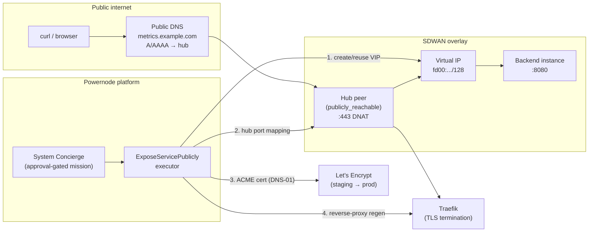

# Tutorial 13 — Expose a service publicly with TLS

> **What you'll learn:** Publish an internal backend service to the public
> internet end-to-end — a stable SDWAN Virtual IP, a hub DNAT port mapping,
> a Let's Encrypt certificate (DNS-01), and a regenerated reverse proxy —
> all from one approval-gated **Expose Service** flow in the System
> Concierge. You'll issue against **LE staging** first, verify the served
> cert locally, then learn what changes for production + real public
> reachability.
>
> **Time:** ~40 min (first run, including DNS credential setup + staging
> cert issuance)
>
> **Builds on:** [Tutorial 04 — K3s cluster](./04-k3s-cluster.md) (you have a
> running NodeInstance, an SDWAN network, and at least one publicly-reachable
> hub peer) and the day-2 [`../runbooks/acme-issuance.md`](../runbooks/acme-issuance.md)
> runbook (DNS provider + Vault credential layout). If you only need a bare
> certificate without the VIP + port-map + proxy plumbing, that runbook is
> the lighter path; this tutorial wires the whole public endpoint.
>
> **Sets you up for:** Production ingress — serving operator dashboards,
> metrics endpoints, and app frontends behind one TLS-terminating proxy.

## What you're building



By the end you'll have:

- An SDWAN Virtual IP fronting your backend instance
- A DNAT port mapping on the hub forwarding `:443` to the VIP + backend port
- A valid **LE staging** certificate for `metrics.example.com` stored in Vault
- A Traefik reverse-proxy config serving that cert (you'll see the staging
  leaf, not the Traefik default cert)
- A clear path to switch the same flow to LE prod for real public traffic

## Concept refresher

The **Expose Service** flow (`System::Ai::Skills::ExposeServicePubliclyExecutor`)
is a single orchestrator that chains the four primitives an operator would
otherwise wire by hand:

| Step | What it creates | Underlying action |
|------|-----------------|-------------------|
| 1 | SDWAN **Virtual IP** fronting the backend | `system_sdwan_create_virtual_ip` |
| 2 | Hub **DNAT port mapping** (`:443` for https, `:80` for http) → VIP + backend port | `system_sdwan_create_port_mapping` |
| 3 | **ACME certificate** for the hostname (DNS-01) | `AcmeCertificateProvisionExecutor` |
| 4 | **Reverse-proxy regen** folding the cert into Traefik | `ReverseProxyComposeExecutor` |

IDs thread between steps: the VIP id becomes the port mapping's
`target_virtual_ip_id`; the issued `certificate_id` drives the proxy regen.

Two behaviors worth internalizing before you start:

- **For `https`, steps 1–4 are hard requirements.** If the cert step or the
  proxy regen fails, the whole expose fails — there is no silent "VIP got
  created but TLS is broken" success. (`http` exposures skip the cert + proxy
  steps entirely — port `80`, no TLS.)
- **The flow is approval-gated.** When run as a Concierge mission
  (`requires_approval: true`), nothing is provisioned until you approve the
  composed plan inline in chat. Same pattern as
  [`../CONCIERGE_PROVISIONING_GUIDE.md`](../CONCIERGE_PROVISIONING_GUIDE.md).

**Reuse semantics** make re-runs idempotent: a VIP named `expose-<hostname>`
is reused if it already exists in the network, and a valid unexpired cert for
the hostname is reused instead of triggering a fresh ACME round-trip.

### Why staging first

Let's Encrypt **production** has tight rate limits (e.g. duplicate-certificate
and failed-validation limits per registered domain per week). While you're
shaking out DNS credentials, hub reachability, and proxy regen, issue against
**`letsencrypt-staging`** — staging has far looser limits and its leaf
certificate is signed by a clearly-labeled `(STAGING)` issuer so you can tell
the two apart at a glance. Staging certs are **not** trusted by browsers; you
verify them with `curl -k` / `openssl ... -connect` and switch to prod once the
flow is green.

## Prerequisites

| Requirement | How |
|---|---|
| Tutorial 04 worked — a running backend NodeInstance attached to an SDWAN network | Implies platform + node + SDWAN |
| At least one SDWAN **hub peer** with `publicly_reachable: true` | See [`../runbooks/sdwan-network-setup.md`](../runbooks/sdwan-network-setup.md) |
| The backend instance is a **peer** in the same SDWAN network (or you have its `target_peer_id`) | The flow refuses to create a holderless VIP |
| A **public DNS zone** you control (e.g. `example.com`), hosted on **Cloudflare** | DNS-01 publishes a TXT record via the provider API |
| A Cloudflare API token scoped `Zone:Zone:Read` + `Zone:DNS:Edit` for that zone | Cloudflare dashboard → API Tokens |
| Operator with `system.ingress.manage` + `system.acme.manage` permissions | Default for admins |
| The bundled `powernode-acme` binary built | `cd extensions/system/agent && make build-acme` |

> **DNS provider scope (v1):** the bundled `powernode-acme` binary is
> **Cloudflare-only** at issuance time. The credential model and provider
> registry list other providers, but only the Cloudflare path is wired into
> issuance today — other providers error at issuance. Use a Cloudflare-hosted
> zone for this tutorial. See [`../runbooks/acme-issuance.md`](../runbooks/acme-issuance.md)
> for the provider matrix.

## Step 1 — Store a DNS provider credential

DNS-01 needs the platform to write a `_acme-challenge.<hostname>` TXT record
via the provider API. Store the Cloudflare token as a `System::AcmeDnsCredential`
— its secret lands in Vault, never in the database in plaintext.

Via UI: `/app/system/acme` → **DNS Credentials** tab → **New** → name it,
pick provider `cloudflare`, paste the API token → **Test Connectivity**
(expect a green check, which lists the zones the token can edit) → save.

**Expected outcome:** a credential row in `ready` / `verified` state. Note its
id — you'll select it in Step 3. (Verification failures surface here *before*
the credential is usable, so you don't discover a bad token mid-issuance.)

## Step 2 — Gather the SDWAN inputs

The Expose flow needs you to identify the network, the public hub, the backend,
and a host CIDR for the VIP. Collect these now so the wizard is one pass.

```javascript
// The SDWAN network that hosts the VIP + port mapping
platform.system_sdwan_list_networks()
// → { networks: [{ id: "net-...", name: "edge-fabric", cidr: "fd00:abcd:1::/64", ... }] }

// Pick a publicly-reachable hub peer in that network (terminates :443)
platform.system_sdwan_list_peers({ network_id: "net-..." })
// → { peers: [{ id: "peer-hub-...", publicly_reachable: true, assigned_address: "fd00:abcd:1::1", ... },
//             { id: "peer-backend-...", assigned_address: "fd00:abcd:1::20", ... }] }
```

Now choose a **`vip_cidr`** — an operator-supplied **host** CIDR for the VIP.
There is no allocator: you pick a free address inside the network's `/64`.

- IPv6 network (`fd00:abcd:1::/64`) → a single-host `/128`, e.g.
  `fd00:abcd:1::443/128`
- IPv4 network → a `/32`, e.g. `198.51.100.43/32` (TEST-NET-2, illustrative)

Pick something that isn't already a peer's `assigned_address` or another VIP.

**Inputs you now have:**

| Field | Example value |
|-------|---------------|
| `service_hostname` | `metrics.example.com` |
| `service_protocol` | `https` |
| `sdwan_network_id` | `net-...` (edge-fabric) |
| `sdwan_hub_peer_id` | `peer-hub-...` (publicly_reachable) |
| `vip_cidr` | `fd00:abcd:1::443/128` |
| `target_peer_id` *(or `target_instance_id`)* | `peer-backend-...` |
| `backend_port` | `8080` |
| `dns_credential_id` | from Step 1 |
| `tls_issuer` | **`letsencrypt-staging`** (for this run) |

> Provide **exactly one** of `target_peer_id` / `target_instance_id`. If you
> pass `target_instance_id`, the instance must already be a peer in the network
> (the flow resolves it to the holder peer and refuses to seat a holderless
> VIP).

## Step 3 — Run the Expose Service flow (LE staging)

Open the System extension's **Ingress** page → `/app/system/ingress` →
**Expose Service** tab (requires `system.ingress.manage`). Fill in the fields
from Step 2, set **TLS issuer** to `letsencrypt-staging`, and submit.

The wizard does **not** call the executor directly. It composes a
natural-language brief embedding your structured fields and sends it to your
**System Concierge** conversation. The Concierge classifies the intent,
composes an **approval-gated mission**, and renders an inline Approve / Reject
card in the conversation panel beside the form.

If you prefer to script it, the same flow is the `system_expose_service_publicly`
MCP action (it routes through the Concierge mission + approval gate the same
way — there is no unapproved fast path):

```javascript
platform.system_expose_service_publicly({
  service_hostname:  "metrics.example.com",
  service_protocol:  "https",
  sdwan_network_id:  "net-...",
  sdwan_hub_peer_id: "peer-hub-...",
  vip_cidr:          "fd00:abcd:1::443/128",
  target_peer_id:    "peer-backend-...",
  backend_port:      8080,
  tls_issuer:        "letsencrypt-staging",   // staging first
  challenge_type:    "dns-01",                 // default
  dns_credential_id: "<from Step 1>"
})
```

**Expected outcome:** a composed plan appears in chat. **Nothing is
provisioned yet** — the mission is paused at the approval gate.

## Step 4 — Approve the plan

Click **Approve** on the inline card (or reject + adjust the brief). Approval
is the only path to execution — there is intentionally no separate "execute"
action.

On approve, the executor runs the four steps in order and streams progress
into the conversation:

```
Step 1 (create_virtual_ip)    → completed   vip_id=vip-...
Step 2 (create_port_mapping)  → completed   port_mapping_id=pm-...
Step 3 (provision_certificate)→ completed   certificate_id=cert-...  status=valid
Step 4 (reverse_proxy_regen)  → completed
```

**Expected outcome:** `~30s` for the DNS-01 round-trip on staging once the TXT
propagates, then the proxy reload. The flow returns the created ids plus
`public_endpoints: ["https://metrics.example.com"]`. If the cert or proxy step
fails, the whole expose fails (https is all-or-nothing) — see Troubleshooting.

## Step 5 — Confirm the ingress route landed

The Routes monitor projects the Traefik routers derived from your issued
certs.

```bash
# Needs a JWT and the system.ingress.read permission
curl -s http://localhost:3000/api/v1/system/ingress_routes \
  -H "Authorization: Bearer $JWT" | jq '.data.routes[] | {host, status, router}'
# → { "host": "metrics.example.com", "status": "valid", "router": "..." }
```

Or in the UI: `/app/system/ingress` → **Routes** tab.

**Expected outcome:** a route row for `metrics.example.com` with a `valid`
cert status.

## Verification

Verify the **served** certificate locally — you don't need public DNS for this,
because you point the TLS connection straight at the hub's address and pass the
hostname via SNI.

**1. Inspect the served leaf with openssl** (replace `<traefik-host>` with the
hub's reachable address):

```bash
echo | openssl s_client -connect <traefik-host>:443 -servername metrics.example.com 2>/dev/null \
  | openssl x509 -noout -subject -issuer -dates
# → subject= CN=metrics.example.com
# → issuer=  C=US, O=(STAGING) Let's Encrypt, CN=(STAGING) ...   ← staging leaf, not the Traefik default
# → notBefore=... notAfter=...
```

You want to see the `metrics.example.com` subject and a `(STAGING) Let's
Encrypt` issuer. If you see `CN=TRAEFIK DEFAULT CERT`, the proxy isn't serving
your cert yet (see Troubleshooting).

**2. Exercise the route with curl** (the `--resolve` flag pins the hostname to
the hub IP without touching public DNS; `-k` because staging certs aren't
browser-trusted):

```bash
curl -k --resolve metrics.example.com:443:<traefik-ip> \
  https://metrics.example.com/healthz
# → response from the backend service, served over the staging cert
```

**Expected outcome:** openssl shows the staging leaf for your hostname; curl
reaches the backend through the hub → VIP → backend path.

## Step 6 — Going to production + real public reachability

Once the staging run is green, two things change for production.

**A. Re-run with the prod issuer.** Set `tls_issuer: "letsencrypt-prod"` (the
default if you omit it) and run the flow again. Reuse semantics will keep the
same VIP + port mapping; only a new prod cert is issued and folded into the
proxy. Verify the same way — the issuer line should now read plain
`Let's Encrypt` (no `(STAGING)`), and the cert is browser-trusted.

**B. Make it reachable from the open internet.** A local `--resolve` check
proves the proxy + cert; public reachability needs two more things:

- **A public DNS record** for the hostname. Add an `A` (IPv4) or `AAAA` (IPv6)
  record for `metrics.example.com` pointing at the hub's **routable public IP**
  — the same hub peer you used as `sdwan_hub_peer_id`, which must have
  `publicly_reachable: true` and a real public address for the `:443` DNAT.
  (Note: the DNS-01 cert validation itself does **not** need this A/AAAA record
  — lego writes the `_acme-challenge` TXT via the provider API. The A/AAAA
  record is only for clients to find the service.)
- **Host allowlisting.** In production, the served hostname must be allowlisted
  or requests get a `403` before they reach your backend. Add it to the
  frontend's Vite `allowedHosts` and Rails `HostAuthorization` (config lives in
  the parent platform). A `403` on an otherwise-correct setup is almost always
  a missing allowlist entry.

## Cleanup

To tear down the public endpoint while leaving Tutorial 04's cluster intact:

```javascript
// Remove the DNAT port mapping (stops public :443 from forwarding)
platform.system_sdwan_delete_port_mapping({ id: "pm-..." })

// Remove the Virtual IP
platform.system_sdwan_delete_virtual_ip({ id: "vip-..." })
```

Revoke the cert only if it's compromised — for staging certs you can simply let
them expire (they're disposable). For a deliberate revoke, follow the revoke
step in [`../runbooks/acme-issuance.md`](../runbooks/acme-issuance.md). Don't
forget to remove the public DNS record if you added one in Step 6.

## Troubleshooting

**Cert step fails with "could not find zone for domain … SERVFAIL"** —
split-horizon / split-brain DNS. The host running issuance uses an internal
resolver that can't resolve your public zone's `SOA`, so lego's zone-detection
fails. Point lego at a public resolver via the environment (systemd unit /
Rails env):

```bash
POWERNODE_ACME_DNS_RESOLVERS="1.1.1.1:53,1.0.0.1:53"
```

As a last resort (skips lego's "all authoritative nameservers see the TXT"
propagation wait):

```bash
POWERNODE_ACME_DISABLE_PROPAGATION_CHECK=true
```

**Cert step fails with "DNS provider … not yet wired in powernode-acme v1"** —
you selected a non-Cloudflare provider. v1 issuance is Cloudflare-only; use a
Cloudflare-hosted zone + credential.

**`dns_credential_id is required for https exposures using the dns-01
challenge`** — you left the DNS credential empty (or picked `http` validation,
which isn't the default path here). Select the credential from Step 1.

**`provide exactly one of target_peer_id or target_instance_id`** — you passed
both, or neither. Pass exactly one. If you pass `target_instance_id`, the
instance must already be a peer in the SDWAN network.

**openssl shows `CN=TRAEFIK DEFAULT CERT`** — the proxy regen didn't take, or
the request didn't carry the right SNI. Confirm the cert is `valid`
(Step 5), then confirm you passed `-servername metrics.example.com`. If the
cert is valid but the proxy still serves the default, re-run the proxy regen
alone via `system_reverse_proxy_compose({ certificate_id: "cert-..." })`.

**curl works locally but the service is unreachable from the internet** — you
verified with `--resolve`, which bypasses public DNS. For real reachability you
need the public A/AAAA record + a `publicly_reachable` hub with a routable
public IP (Step 6B).

**`403` from the hostname in production** — host allowlist. Add the hostname to
the frontend Vite `allowedHosts` and Rails `HostAuthorization` (Step 6B).

## What's next

- **[`../runbooks/acme-issuance.md`](../runbooks/acme-issuance.md)** — day-2
  cert lifecycle: multi-SAN certs, renewal (auto + manual), revocation, and
  the LAN-preference endpoint discovery that fronts federated services.
- **[`../runbooks/sdwan-network-setup.md`](../runbooks/sdwan-network-setup.md)** —
  the full SDWAN surface: networks, peers, VIPs, firewall rules, BGP, and how
  hub peers become publicly reachable.
- **[`../runbooks/acme-smoke.md`](../runbooks/acme-smoke.md)** — the acceptance
  smoke that exercises the cert issue → renew → revoke lifecycle end-to-end.
- **[`../CONCIERGE_PROVISIONING_GUIDE.md`](../CONCIERGE_PROVISIONING_GUIDE.md)** —
  deeper read on the mission phase pipeline + the inline Approve/Reject card
  that gates this flow.
- **[`../SMOKE_TEST.md`](../SMOKE_TEST.md) Pass 5 (ACME)** — the platform-level
  smoke that validates ACME issuance + Traefik termination.
